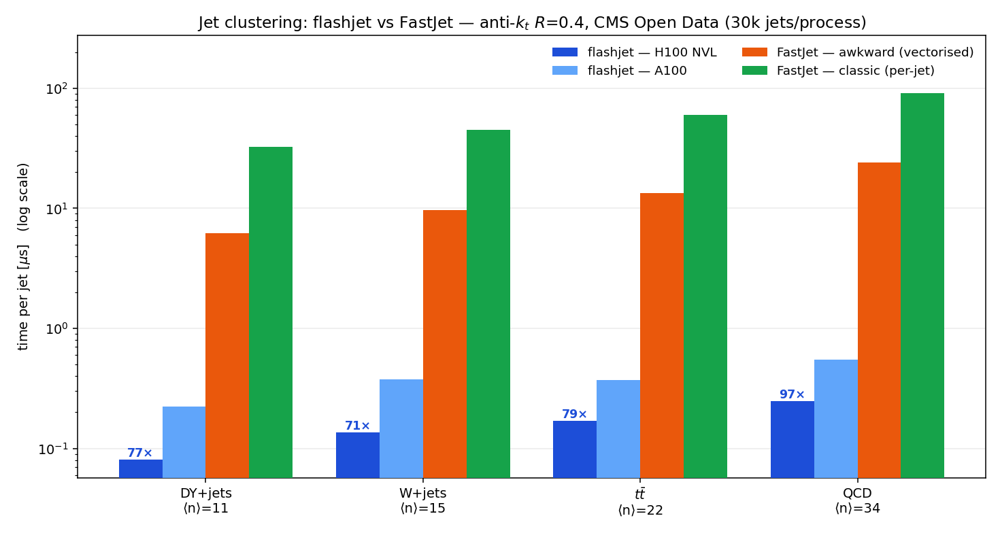
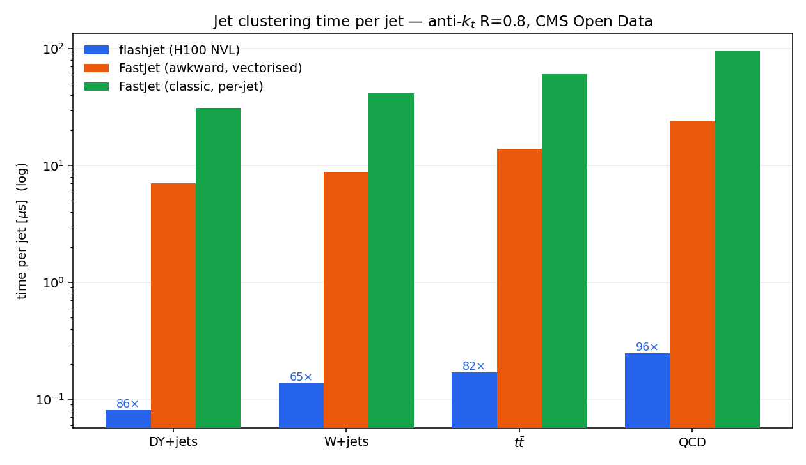
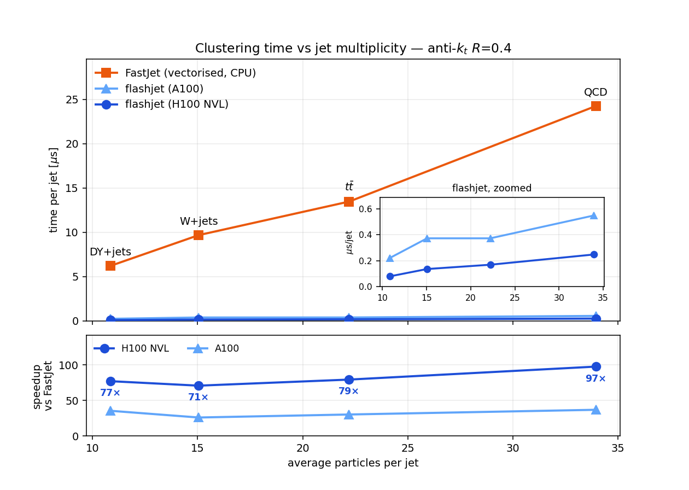
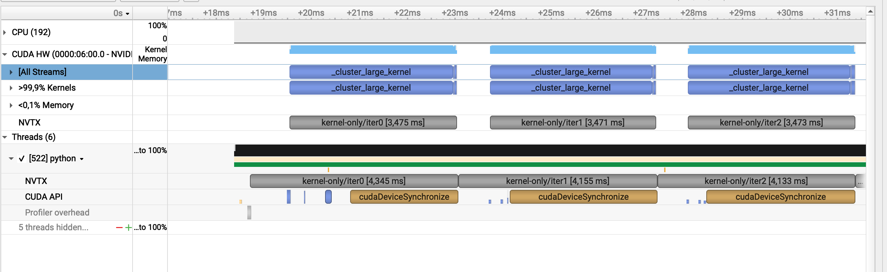
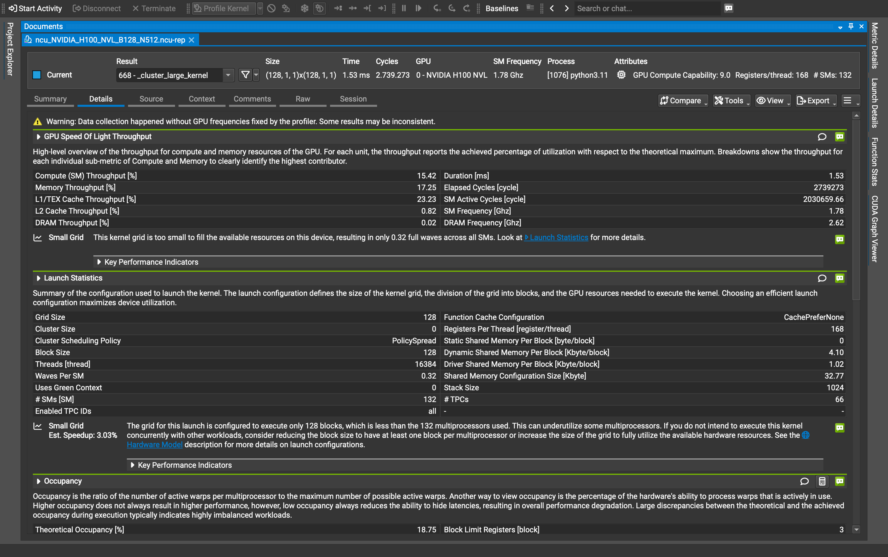
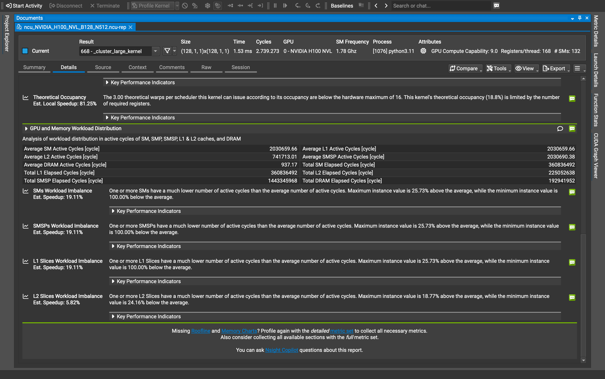

<!-- _class: lead -->

# **flashjet**

### GPU jet clustering — benchmarking against FastJet

<span class="small">C. Gupta · 2026-08-17</span>

---

## What flashjet is

**A GPU implementation of the standard sequential-recombination jet algorithms**
— anti-$k_t$, $k_t$, Cambridge–Aachen — written in Triton/PyTorch.

- Clusters a **batch of jets or events at once**, directly in GPU memory.
- The data **never moves back to the CPU** during clustering.
- Returns the particle→jet assignment **and the complete merge history**
  (the full binary tree of which pair merged, and at what distance).

**Why the merge history matters:** substructure observables — groomed mass,
$z_g$, $R_g$, Lund coordinates, exclusive subjets — are then just **cheap reads
of that tree**, with no second clustering pass.

<div class="box">

**The goal of this study:** is flashjet a viable **substitute for FastJet**?
That needs two things — it must give the **same jets**, and it must be **faster**.

</div>

---

## What was established before this study

**The physics was validated; the speed was not.**

| what | how it was checked | outcome |
|---|---|---|
| the algorithms are correct | independent NumPy tree-walks; **129 unit tests** | pass |
| clustering matches FastJet | jet-by-jet kinematics tests | exact |
| works on real detector data | reclustered CMS jets vs the values CMS stored | $p_T$ ratio **1.000000** |
| grooming is correct | our soft-drop mass vs CMS's | median Δ **−0.004 GeV** |
| substructure is correct | $R_g$, $z_g$ vs CMS | Δ ≤ 2×10⁻⁴ |
| the physics is right | soft-drop $z_g$, Lund plane, jet areas vs analytic predictions | reproduced |

<span class="small">Small disagreements were traced and explained rather than ignored: they come from how the input file **stores** numbers (dropped soft particles, float rounding), not from the algorithm.</span>

<div class="box">

**⇒ Correctness was settled. What was missing was a proper answer to
"how much faster is it, on real physics data?"** — that is this study.

</div>

---

<!-- _class: lead -->

# The benchmark

### what · on what · how

---

## What is being compared

Two clusterers, given **exactly the same jets**, asked to do **exactly the same job**
(anti-$k_t$, same radius $R$):

| | runs on | what it is |
|---|---|---|
| **flashjet** | **GPU** | this library |
| **FastJet — "vectorised"** | CPU | the standard tool, called through its efficient batched interface |
| **FastJet — "per-jet"** | CPU | the standard tool, called one jet at a time |

<div class="box">

**All speedups quoted here are against the vectorised (faster) FastJet.**

</div>

---

## What data

**CMS Open Data** — publicly released simulation, so every number here can be
shown freely, with no approval needed.

| process | jets used | average particles per jet |
|---|---|---|
| **DY+jets** | 30 000 | 10.8 |
| **W+jets** | 30 000 | 15.1 |
| **$t\bar t$** (all-hadronic) | 30 000 | 22.2 |
| **QCD** (high-$p_T$ dijets) | 28 250 | 34.0 |

Format: **MINIAOD**.

---

## How the measurement is done

**1. Take the jets.** Extract the particles belonging to each jet from the Open Data
files, once, and save them.

**2. Cluster with flashjet on the GPU.** Time it, then **save the exact same input
events to a file**.

**3. Cluster those same saved events with FastJet on the CPU.** Time it.

**4. Check they agree.** Compare the **number of jets found**, event by event.
If the two disagree, the timing is meaningless.

Repeated for **4 processes × 2 jet radii ($R$ = 0.4 and 0.8) × 2 GPUs**.

<div class="box">

**The key discipline:** both clusterers read the **same saved file**. Nothing is
regenerated in between, so this is a like-for-like comparison and not two
separate measurements that happen to use the same dataset name.

</div>

<span class="small">Hardware: NVIDIA **A100** and **H100 NVL**, one full GPU each (no shared or partitioned cards). CPU baseline runs on the same machine.</span>

---

<!-- _class: lead -->

# Results

---

## Time to cluster one jet



<span class="small">Anti-$k_t$, $R$=0.4. **Log scale** — each gridline is 10×. Blue = flashjet on GPU, orange/green = FastJet on CPU. Labels give the speedup over vectorised FastJet.</span>

---

## The numbers

Microseconds to cluster **one jet** (anti-$k_t$, $R$=0.4):

| process | particles/jet | **flashjet H100** | **flashjet A100** | FastJet (vectorised) | FastJet (per-jet) | **speedup** |
|---|---|---|---|---|---|---|
| DY+jets | 10.8 | **0.081** | 0.223 | 6.20 | 32.43 | **77×** |
| W+jets | 15.1 | **0.137** | 0.373 | 9.67 | 44.84 | **71×** |
| $t\bar t$ | 22.2 | **0.170** | 0.373 | 13.46 | 59.95 | **79×** |
| QCD | 34.0 | **0.249** | 0.549 | 24.24 | 91.64 | **97×** |

- **Same jets:** number of jets found agrees with FastJet in **~100 %** of cases
  (7 of 8 runs exactly 100 %, one at 99.997 %).
- **Not a fluke of the jet radius:** $R$=0.8 gives the same picture (H100 65–96×).
- **Newer GPU helps:** A100 → H100 is a further ~2.2× on identical input.

---

## The same holds at a larger jet radius ($R$ = 0.8)



<span class="small">Anti-$k_t$ with $R$=0.8 instead of 0.4: **65–96×** over vectorised FastJet on H100 (A100: 25–41×), again with ~100 % agreement on the number of jets found. **The conclusion does not depend on the choice of jet radius.**</span>

---

## The trend that matters



<span class="small">Linear scale. **Top:** time per jet — FastJet's cost climbs steeply with jet multiplicity while both flashjet curves stay nearly flat (inset zooms in on them). **Bottom:** the resulting speedup. The four processes sit on **one common trend**, so this is a property of the algorithm rather than of any particular sample.</span>

---

## What the GPU is actually doing



<span class="small">Nsight Systems timeline, H100, three consecutive iterations. Each blue block is **one clustering call**; the rows are labelled by the tool itself as **">99.9 % Kernels"** and **"<0.1 % Memory"**.</span>

<div class="box">

**The kernels run back to back with nothing in between.** The memory row is
**empty** — no data is shuffled between CPU and GPU while clustering runs.
That is the property that makes the speedup real rather than an artefact of
where the timer was started.

</div>

---

## Profiling — where the time goes, and what limits it

<div class="cols">
<div>

**Nsight Systems** — share of GPU time (A100)

| kernel | % GPU | avg / call |
|---|---|---|
| `_cluster_large_kernel` | **97.6 %** | 5.47 ms |
| `_decode_kernel` | 1.5 % | 82 µs |
| torch glue | < 1 % | — |

CPU↔GPU transfer negligible once running.

**⇒ No hidden overhead** — essentially all the
time is the real clustering work.

</div>
<div>

**Nsight Compute** — hardware counters (H100)

| metric | value |
|---|---|
| DRAM throughput | **0.02 %** |
| Compute (SM) throughput | 15.4 % |
| Registers / thread | 168 |
| Theoretical occupancy | 18.75 % |
| **Achieved occupancy** | **6.25 %** |
| **Waves per SM** | **0.32** |

**⇒ Not memory- or compute-bound** — the GPU
is simply **not filled** (0.32 waves/SM).

</div>
</div>

<div class="box">

**flashjet is already ~80× faster while leaving most of a modern GPU idle** — the
work-distribution settings were tuned on an older, smaller card. **Headroom, not a limit.**

</div>

---

## The profiler names the bottleneck



<div class="cols">
<div>

<span class="small">**"Small Grid"** — *"This kernel grid is **too small to fill the available resources** on this device, resulting in only **0.32 full waves** across all SMs."*</span>

</div>
<div>

<span class="small">**Grid size = 128 blocks** but **# SMs = 132** — the kernel launches **fewer blocks than the GPU has processors**, so some are guaranteed to sit idle.</span>

</div>
</div>

<span class="small">Nsight Compute, Speed-of-Light + Launch Statistics — the tool's own words and numbers.</span>

---

## …and prices the fix

<div class="cols">
<div>



</div>
<div>

**The tool's own speedup estimates:**

| finding | est. speedup |
|---|---|
| Theoretical occupancy (registers) | **81 %** |
| Achieved occupancy | **67 %** |
| SM workload imbalance | 19 % |
| SMSP / L1 imbalance | 19 % |

*"…theoretical occupancy (18.8 %) is **limited by
the number of required registers**."*

*"One or more SMs have a much lower number of
active cycles… **minimum instance value is
100 % below the average**."* → **some SMs do
no work at all.**

</div>
</div>

<div class="box">

**⇒ ~1.7–1.8× more is available**, by NVIDIA's own estimate — from launch
configuration and register budget, not from the algorithm.

</div>

---

<!-- _class: lead -->

# Conclusions

---

## Conclusions

1. **flashjet gives the same jets as FastJet.**
   ~100 % agreement on jet counts across every process and radius tested,
   on top of the earlier jet-by-jet agreement with real detector data.

2. **flashjet is 65–97× faster** than the standard vectorised FastJet on a
   modern GPU — **0.08–0.25 µs per jet**.

3. **The advantage grows with jet complexity.** Busier jets → bigger speedup.
   This is the regime that matters most for boosted-object physics.

4. **The result is robust**, not tuned: four unrelated physics processes,
   two jet radii, two GPU generations, all consistent.

5. **There is still significant headroom.** The GPU is largely idle, and the
   profiler attributes this to register pressure — it estimates a further
   **~1.7–1.8×** is available from that alone.

<div class="box">

**Bottom line: as a drop-in replacement for CPU jet clustering, flashjet is
both correct and roughly two orders of magnitude faster.**

</div>

---

<!-- _class: lead -->

# What is done, what is next

---

## Checklist

**Correctness** — <span class="done">complete</span>
<span class="done">✓</span> 129 unit tests pass, including GPU-only tests
<span class="done">✓</span> matches FastJet exactly in kinematics tests
<span class="done">✓</span> matches real detector-stored values jet-by-jet ($p_T$, groomed mass, $R_g$, $z_g$)
<span class="done">✓</span> reproduces analytic physics predictions
<span class="done">✓</span> same number of jets as FastJet in every timing run

**Performance** — <span class="done">complete</span>
<span class="done">✓</span> 4 physics processes × 2 radii × 2 GPU generations, on public data
<span class="done">✓</span> profiled: no hidden overhead; bottleneck identified

**Infrastructure** — <span class="done">complete</span>
<span class="done">✓</span> reproducible pipeline from public data to final plots
<span class="done">✓</span> results are freely presentable (no approval needed)

---

## To do — in priority order

| | item | why |
|---|---|---|
| **1** | <span class="todo">Compare against **C++ FastJet**</span> | every number here uses FastJet's **Python** interface. The production tool is C++. Until we measure it, the honest caveat is *"some of this could be Python overhead"* |
| **2** | <span class="part">Improve GPU utilisation</span> | the profile says most of the GPU is idle; retuning how work is spread should give more speed for free |
| **3** | <span class="part">Other algorithms & conditions</span> | only anti-$k_t$ is timed ($k_t$, C/A untested for speed); no scan over jet radius; no test vs **pile-up** |
| **4** | <span class="todo">Use it inside the experiment's software</span> | the real production test. Needs the GPU code rewritten in C++ — a separate project |

---

<!-- _class: lead -->

# Backup

---

## Reproducing this

```bash
# 1. public data -> per-jet particle lists
python3 dump_opendata_constituents.py {ttbar|qcd|wjets|dyjets} 30000 ak4

# 2. timing + profiling on a GPU (batch job)
condor_submit bench_a100.sub      # or bench_h100.sub

# 3. plots
python3 make_bench_plots.py 0.4 H100_NVL
```

**Datasets** (CMS Open Data, RunIISummer20UL16 MINIAOD):

| process | dataset |
|---|---|
| $t\bar t$ | `TTToHadronic_TuneCP5_13TeV-powheg-pythia8` |
| QCD | `QCD_Pt_470to600_TuneCP5_13TeV_pythia8` |
| W+jets | `WJetsToLNu_1J_TuneCP5_13TeV-amcatnloFXFX-pythia8` |
| DY+jets | `DYJetsToLL_M-50_TuneCP5_13TeV-madgraphMLM-pythia8` |

<span class="small">Read directly over the network from public CERN storage — no grid certificate required.</span>

---

## $R$ = 0.8 — multiplicity trend


<span class="small">Same construction as the $R$=0.4 trend slide, for the larger jet radius.</span>

---

## Reading the profiling numbers

| counter | meaning | flashjet on H100 |
|---|---|---|
| DRAM throughput | how hard memory is being pushed | 0.02 % → memory idle |
| Compute (SM) throughput | how hard the arithmetic units work | 15.4 % → not compute-bound |
| Registers per thread | resources each thread reserves | 168 → **high** |
| Theoretical occupancy | how many threads *could* run, given the above | 18.75 % → capped by registers |
| Achieved occupancy | how many actually did | 6.25 % |
| Waves per SM | how many times the GPU was filled | 0.32 → **not filled once** |

**The limitation is parallelism, not memory or arithmetic.** Two concrete levers:

1. **Launch geometry** — the kernel launches **128 blocks on a 132-SM device**, so
   it cannot fill the GPU by construction, regardless of anything else.
2. **Register budget** — 168 registers/thread caps how many warps can be resident,
   which is what the profiler flags as limiting theoretical occupancy.

Both are configuration inherited from smaller GPUs, not properties of the algorithm.

<span class="small">Profiled with Nsight Systems (timeline / kernel share) and Nsight Compute (hardware counters).</span>
