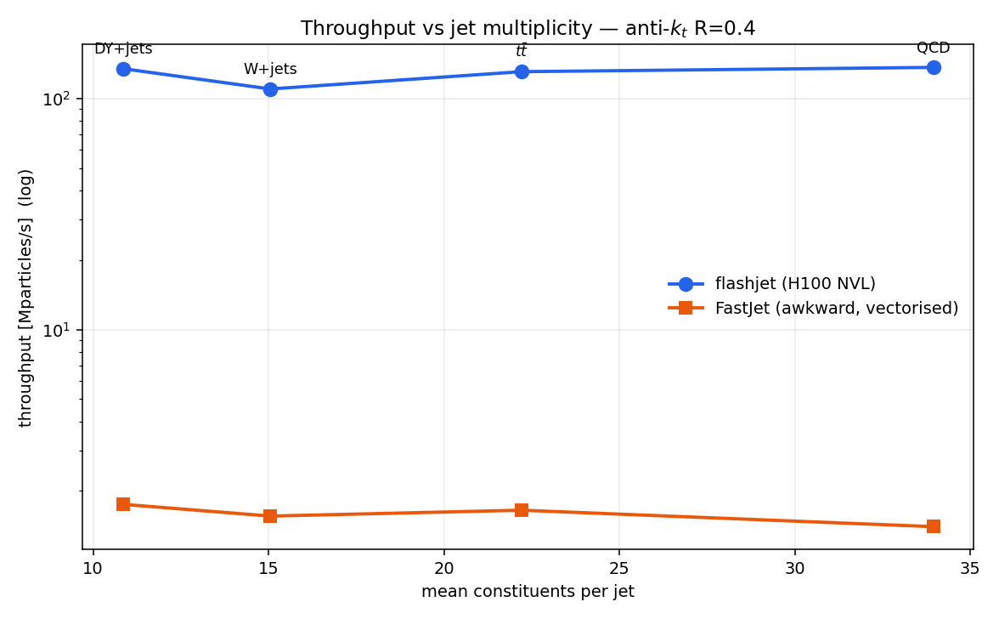

<!-- _class: lead -->

# flashjet — **benchmarking & status**

### GPU jet clustering vs FastJet, on CMS Open Data

<span class="small">C. Gupta · 2026-08-17 · for A. De Moor & Sitian</span>

<span class="small">Timing on A100 / H100 · profiling refresh · what is done and what is left</span>

---

## Summary — where we are

**flashjet clusters jets on the GPU and returns the full merge history**, from which
substructure observables follow as cheap array reads.

| | status |
|---|---|
| **Correctness** | <span class="done">done</span> — matches FastJet and CMS stored branches jet-by-jet |
| **Timing vs FastJet** | <span class="done">done</span> — 4 processes, 2 radii, A100 + H100, CMS Open Data |
| **Profiling (nsys)** | <span class="done">done</span> — kernel-bound picture confirmed on current hardware |
| **Profiling (ncu)** | <span class="done">new</span> — first ever on H100; **changes** the previous conclusion |
| **C++ FastJet baseline** | <span class="todo">missing</span> — the main remaining gap |
| **CMSSW integration** | <span class="part">started</span> — IB set up, insertion point identified |

**Headline:** on a full H100, flashjet clusters a jet in **0.08–0.25 µs**, i.e.
**65–97× faster** than vectorised FastJet, with **~100 % identical jet counts**.

---

<!-- _class: lead -->

# Part 1 — what was already established

*(summary of the previous deck: 54 slides of physics validation)*

---

## Previously: the library and its three features

**flashjet** — GPU (Triton/PyTorch) generalised-$k_t$ clustering (anti-$k_t$, $k_t$, C/A)
on padded `(B,N,4)` tensors that never leave the device. Returns particle→jet assignment
**plus the complete merge history**.

| | feature | reads | implements |
|---|---|---|---|
| **F1** | exclusive-$k_t$ jets | $k_t$ history | $k_t$ algorithm |
| **F2** | soft-drop / mMDT grooming | C/A history | Soft Drop |
| **F3** | Lund-plane coordinates | C/A history | primary Lund plane |

All three are **pure-torch reads of the existing history** — no extra clustering,
no kernel changes, CPU/CUDA identical.

<span class="small">Because the full tree is kept, substructure is a *decode*, not a second clustering pass — this is the structural reason the features are nearly free.</span>

---

## Previously: correctness was closed three ways

| validation | reference | headline |
|---|---|---|
| **unit tests** | independent NumPy tree-walks | **129 passed** (13 CUDA tests ran for the first time on a GPU) |
| **paper closures** (toys) | analytic LL predictions | $z_g$ on the $1/z$ curve; jet areas; $\beta$-ordering |
| **real CMS data** (raw-to-raw) | CMS stored FastJet branches | $p_T$ **1.000000**, $m_{SD}$ **−0.004 GeV**, $R_g$ Δ≤2e-4 |

**The residual $m_{SD}$ tail (4.4 % of jets) was fully explained**, not waved away:
~50 % soft candidates missing from the stored constituent table, ~23 % storage
rounding, ~20 % rounding-sensitive C/A trees, ~7 % $z\approx z_{cut}$ prong flips.
Input-level effects, not an algorithm error.

<span class="small">Also shown previously: gen-verified merge trees (QCD / top / boosted top / b-jet), Lund planes across three samples, and that the history variables separate **boosted decays** but not AK4 flavour — flavour is a lifetime question.</span>

---

<!-- _class: lead -->

# Part 2 — new: timing vs FastJet

*on CMS **Open Data** — presentable with no approval*

---

## The benchmark setup

**Four physics processes**, CMS Open Data (RunIISummer20UL16 **MINIAOD**, so
constituents exist and nothing needs CMS approval to show):

| dataset | jets | ⟨constituents⟩/jet |
|---|---|---|
| DY+jets | 30 000 | 10.8 |
| W+jets | 30 000 | 15.1 |
| $t\bar t$ (hadronic) | 30 000 | 22.2 |
| QCD (470–600) | 28 250 | 34.0 |

A **3× span in multiplicity** — the physics-independent axis the timing scales along.

**Method.** flashjet clusters on GPU and *saves the events*; FastJet then clusters the
**identical saved events** on CPU. Both interfaces timed: `classic` (per-jet loop) and
`awkward` (vectorised). **The vectorised one is quoted as the fair baseline.**
Every run also checks `n_jets` agreement.

---

## Result — flashjet vs FastJet, anti-$k_t$ R=0.4


<span class="small">Log scale. Speedup annotated against the **vectorised** FastJet baseline (orange), not the per-jet loop (green) — the per-jet loop would flatter us by another ~5×.</span>

---

## The numbers

µs per jet, anti-$k_t$ R=0.4:

| dataset | ⟨n⟩ | **H100 NVL** | **A100** | FastJet awk | FastJet classic | **speedup (H100)** |
|---|---|---|---|---|---|---|
| DY+jets | 10.8 | **0.081** | 0.223 | 6.20 | 32.43 | **77×** |
| W+jets | 15.1 | **0.137** | 0.373 | 9.67 | 44.84 | **71×** |
| $t\bar t$ | 22.2 | **0.170** | 0.373 | 13.46 | 59.95 | **79×** |
| QCD | 34.0 | **0.249** | 0.549 | 24.24 | 91.64 | **97×** |

- **R=0.8 gives the same picture** (H100 65–96×, A100 25–41×) → not an $R$ artifact.
- **`n_jets` agreement ~100 %** everywhere (7 of 8 runs exactly 100 %; one 99.997 %).
- A100 → H100 is a **~2.2× hardware gain** on identical inputs.

**⇒ The speedup *grows* with multiplicity**: flashjet's per-jet cost rises far more
slowly than FastJet's. That is the statement that does not depend on the process.

---

## Throughput vs jet multiplicity



<span class="small">The four datasets are points on one trend, not four separate results — busier jets are where the GPU wins hardest, which is the regime that matters for boosted-object tagging.</span>

---

<!-- _class: lead -->

# Part 3 — new: profiling on current hardware

---

## nsys — one kernel is the whole cost

| kernel | share of GPU time (A100) |
|---|---|
| `_cluster_large_kernel` | **97.6 %** |
| `_decode_kernel` | 1.5 % |
| torch glue | <1 % |

Negligible host↔device traffic in steady state.

**⇒ Any further speedup must come from that one kernel** — the decode and the
substructure reads are effectively free. This confirms on modern hardware what was
previously only measured on a T4.

<span class="small">Captured with a `cudaProfilerApi` range so warm-up/JIT is excluded from the timeline.</span>

---

## ncu on H100 — and it **changes** the previous conclusion

Previously only ever collected on a **T4** (and the June report noted it "does not
transfer to the A100"). Now measured on a full **H100 NVL**:

| metric | **H100 NVL** | T4 (June) |
|---|---|---|
| Registers / thread | **168** | 168 |
| Theoretical occupancy | **18.75 %** | 37.5 % |
| **Achieved occupancy** | **6.25 %** | 33.2 % |
| **Waves per SM** | **0.32** | 1.07 |
| DRAM throughput | **0.02 %** | 0.36 % |
| Compute (SM) throughput | 15.4 % | 39.4 % |

**At 0.32 waves/SM the kernel does not fill the GPU even once.** DRAM is untouched
(0.02 %) — this is **not** a bandwidth problem, it is **occupancy / parallelism
starvation**, and it is *worse* on H100 than on the T4 the tuning was derived from.

---

## What the profile tells us to do

1. **Register pressure is now the top lever.** 168 registers/thread caps theoretical
   occupancy at 18.75 % on H100. Reducing it should translate directly into throughput.
2. **The auto-dispatch thresholds are mistuned for modern GPUs.** They were derived on
   smaller devices; grid 128 × block 128 leaves an H100 nearly idle. They should be
   **re-measured per device**, not carried over.
3. **Untested regime:** large $N$, where scratch may spill past cache and DRAM could
   start to matter. Flagged in the original report, still never checked.

<span class="small">**Tooling note, resolves a long-standing blocker.** ncu previously failed because DCGM held the GPU performance counters. On lxplus GPU workers **DCGM is absent** (`RmProfilingAdminOnly=0`), so that is not an issue. A *different* constraint applies: **ncu cannot lock clocks on a MIG slice**, so profiling must target a full card (`--clock-control none` otherwise). Absolute values here are therefore indicative; the occupancy and register figures are structural.</span>

---

<!-- _class: lead -->

# Part 4 — status: done vs remaining

---

## What is done

**Correctness**
<span class="done">✓</span> 129 unit tests (incl. 13 CUDA, first run on GPU) · <span class="done">✓</span> exact vs FastJet in kinematics tests
<span class="done">✓</span> $p_T$ 1.000000, $m_{SD}$ −0.004 GeV, $R_g$ Δ≤2e-4, $z_g$ 6.9e-5 vs CMS
<span class="done">✓</span> residual $m_{SD}$ tail fully attributed to input-level effects
<span class="done">✓</span> `n_jets` agreement ~100 % on every timing run
<span class="done">✓</span> analytic closures on toys (Soft Drop, Lund, jet areas)

**Performance**
<span class="done">✓</span> 4 Open Data processes × R∈{0.4, 0.8} × {H100 NVL, A100}
<span class="done">✓</span> GPU backend sweep; throughput/latency characterisation
<span class="done">✓</span> nsys kernel breakdown on A100 + H100
<span class="done">✓</span> **ncu on H100 NVL** — previously blocked, now collected

**Infrastructure**
<span class="done">✓</span> Open Data → FWLite → npz pipeline (no CMS approval needed to show results)
<span class="done">✓</span> reproducible condor GPU workflow, GPU-stamped results

---

## What is remaining — ranked

| # | item | why it matters | cost |
|---|---|---|---|
| **1** | **C++ FastJet baseline** | *Every* number above is vs the **Python** binding. CMSSW ships FastJet 3.4.1 C++. Until measured, every speedup carries a "is this just Python overhead?" asterisk | **low** — needs *no* flashjet code, just time standard AK4 reco in CMSSW |
| **2** | Fold new numbers into the **abstract** | it still quotes the June report, which predates the substructure features | low |
| **3** | **ncu on A100** | gives 3 devices → an occupancy *trend*, not an assertion | low |
| **4** | Act on the profile: **register pressure** + **re-tune dispatch** | the profile says this is where the headroom is | medium |
| **5** | **Large-$N$ / event regime** | $O(N^2)$, 10–100× lower throughput, never re-checked | medium |
| **6** | Physics axes: **$k_t$ / C-A timing**, **pileup dependence**, **$R$-scan** | only anti-$k_t$ is timed; no PU study | medium |
| **7** | **CMSSW integration** (Alpaka port) | production answer | **high** — a real project |

---

## On CMSSW integration

**Set up:** IB `CMSSW_20_1_X_2026-08-16-0000` (alpaka 2.1.1, CUDA 13.3.1, fastjet 3.4.1).

**Insertion point found** (not guessed): `VirtualJetProducer` fills
`std::vector<fastjet::PseudoJet> fjInputs_` then calls a **pure virtual**
`runAlgorithm()`; `FastjetJetProducer` implements it in one line. A sibling class
overriding only `runAlgorithm` inherits all input handling and product writing —
a genuinely like-for-like swap.

**But:** flashjet is Triton/**Python**. There is no C++ entry point, so a real
integration means **porting the kernel to Alpaka/C++**. Scope is contained —
*one* kernel is 97 % of the time, and F1/F2/F3 become plain loops over the history —
but it is a project, not a patch.

**Open question worth deciding early:** CMSSW is **one event at a time**, while
flashjet's advantage comes from large batches. How much of the speedup survives at
batch 1 should be **measured, not assumed** — it decides whether GPU clustering
belongs in reco at all.

<span class="small">**Recommendation:** treat item 1 (time C++ FastJet, zero flashjet code) as the conference deliverable; treat the Alpaka port as a separate, post-conference project.</span>

---

## Questions for Alex & Sitian

1. Is the **C++ FastJet baseline** the right next priority, or is the vectorised-Python
   comparison acceptable for the conference?
2. For CMSSW: **minimal EDProducer** first, or go straight for the **Alpaka** path?
3. Which physics axis is most worth adding for the talk — **pileup dependence**,
   an **$R$-scan**, or **$k_t$ / C-A** timing?
4. Should the **event regime** (full-event clustering) feature at all, or keep the
   talk to the jet/tagging regime where flashjet is strongest?

---

<!-- _class: lead -->

# Backup

---

## Reproducing the benchmark

```bash
# 1. Open Data -> npz  (CMSSW python, FWLite)
cd ~/CMSSW_14_1_0_pre4/src && cmsenv
python3 dump_opendata_constituents.py {ttbar|qcd|wjets|dyjets} 30000 ak4

# 2. timing + profiling on a GPU node (condor)
cd ~/flashjet_condor && condor_submit bench_a100.sub   # or bench_h100.sub

# 3. plots
micromamba run -n b_hive python3 make_bench_plots.py 0.4 H100_NVL
```

<span class="small">**Two environments, deliberately separate:** `b_hive` (torch + triton + flashjet) and `fjbench` (fastjet 3.5.1.3). Installing fastjet into `b_hive` breaks its awkward pin.</span>

<span class="small">**Condor gotchas worth knowing:** `regexp("A100", GPUs_DeviceName)` silently evaluates *false* without `TARGET.` scoping — the job just sits idle. And matching `"H100"` also matches the **MIG** partitions; pin exact device names for full cards.</span>

---

## R=0.8 — same picture


<span class="small">H100 NVL, anti-$k_t$ R=0.8: 65–96× vs vectorised FastJet. The result does not depend on the jet radius.</span>

---

## Open Data provenance

| process | dataset (RunIISummer20UL16MiniAODv2) |
|---|---|
| $t\bar t$ | `TTToHadronic_TuneCP5_13TeV-powheg-pythia8` |
| QCD | `QCD_Pt_470to600_TuneCP5_13TeV_pythia8` |
| W+jets | `WJetsToLNu_1J_TuneCP5_13TeV-amcatnloFXFX-pythia8` |
| DY+jets | `DYJetsToLL_M-50_TuneCP5_13TeV-madgraphMLM-pythia8` |

Read via **xrootd from `eospublic.cern.ch`** — open, no grid proxy, no approval.
Constituents taken from `slimmedJets` daughters through **FWLite** (uproot cannot
resolve MINIAOD's packed candidates / `edm::Ref`), dumped to npz, then benchmarked.

<span class="small">Caveat found the hard way: the `TTJets_DiLept` open-data dataset is only **partially staged** — its record lists 494 files but essentially one is retrievable, and paths under `50000/` fail `TFile::Open`. `TTToHadronic` was used instead (2434 files, verified), which also gives busier jets — better suited to a clustering benchmark.</span>
