<!-- _class: lead -->

# GPU substructure for **flashjet**

### kt / C-A jet substructure on the merge history

exclusive jets · soft-drop grooming · Lund coordinates

**Chirayu Gupta**
[Add github link]

---

## Summary

**Three substructure features** (F1 exclusive-kt jets, F2 soft-drop/mMDT grooming, F3 Lund
coordinates), all **pure-torch post-reads of the existing merge history** — no kernel changes,

**Validation studies**

| validation            | reference                            | headline result                                                |
| --------------------- | ------------------------------------ | -------------------------------------------------------------- |
| unit tests            | independent NumPy tree-walks         | 85 passed (13 CUDA-only skipped)                               |
| paper closures        | analytic predictions, toy shower     | $z_g$ on the $1/z$ curve; areas; $\beta$-ordering              |
| **real CMS QCD**      | stored FastJet branches (raw-to-raw) | $p_T$ **1.000000**; $m_{SD}$ **−0.004 GeV**; $R_g$ 99.2% <0.01 |
| **real CMS ttbar** ×2 | stored FastJet branches (raw-to-raw) | dileptonic UL18 **and** fully-hadronic Run 3 close             |
| full-event            | ΔR-match to CMS's own AK8 jets       | 100% within 2%, median ΔR 0.0019                               |
| physics regimes       | QCD vs b-jets vs boosted tops        | $m_W$/$m_t$ peaks, top blob in the Lund plane                  |

[update this slide with a better table]

---

## What was already there vs. what we added

<div class="cols">
<div>

**Pre-existing**
- `history.py`: `jet_idx_from_history`, `_resolve_parents`, `_decode`,
  `splitting_scales_from_history`, Triton `_decode_triton`
- `reference.py`: single-event NumPy ground truth (`cluster_event`)
- `nn_reference.py`: nearest-neighbour reference
- `conftest.py`: `random_event` fixtures
- The kernels + the merge-history recording

</div>
<div>

**Added (this work)** — in `history.py`
- **F1** `exclusive_jets_from_history`
- **F2** `groom_from_history`
- **F3** `lund_coordinates_from_history`
- helpers: `_resolve_roots`, `_jet_roots`,
  `_pseudojet_p4`, `_dense_number_roots`
- `api.py`: `ClusterOutput.{exclusive_jets, groomed_jets,
  mass_drop, lund_coordinates}` + a `mask` field
- `tests/test_substructure.py` (new)

</div>
</div>

<span class="small">The `_ref_*` walkers inside `test_substructure.py` are also ours — independent
naive NumPy tree-walks used only to pin the fast implementations.</span>

---

## The three features

|        | Feature             | Function                             | Implements                                                       |
| ------ | ------------------- | ------------------------------------ | ---------------------------------------------------------------- |
| **F1** | Exclusive jets (kt) | `exclusive_jets_from_history(...)`   | kt algorithm — FastJet manual [1111.6097], [0802.1189]           |
| **F2** | Grooming (C/A)      | `groom_from_history(...)`            | Soft Drop [1402.2657] · mMDT [1307.0007] · mass-drop [0802.2470] |
| **F3** | Lund coordinates    | `lund_coordinates_from_history(...)` | Primary Lund plane [1807.04758]                                  |

**F1** — undo the last merges of the sequence to expose exactly `n_jets` (or a `d_cut`) subjets;
reduces to the inclusive jets at the trivial cut.
**F2** — walk each jet down the harder branch, dropping the softer prong until
$z > z_{\rm cut}(\Delta R/R)^\beta$ (soft-drop) — the $O(\log_2 n)$ declustering.
**F3** — for every primary split emit $(z,\Delta R, k_t, \ln 1/\Delta R, \ln k_t, d)$; the
$d$-channel ties **exactly** to `splitting_scales`.

---

<!-- _class: lead -->

# How the toys were generated

*(the "simulation" — none of it pre-existing; flashjet only clusters, it does not generate events)*

---

## The toy event generators (written in the plot scripts)

flashjet takes 4-vectors in and returns jets — it has **no event generator**. To exercise the
features I wrote small, transparent toys *outside the repo*, in the plot scripts.

**`make_plots.py` — two single-fat-jet samples at $p_T\!\approx\!500$ GeV, $R=0.8$:**
- **QCD-like**: one hard collinear core (92% of $p_T$, $\sigma_{y,\phi}=0.06$) + soft wide-angle
  radiation (8%, $\sigma=0.30$). Each "spray" = $n$ massive pions with exponential $p_T$ fractions.
- **W-like**: two hard prongs with pair mass $m=\sqrt{z(1-z)}\,p_T\,\Delta R = 80.4$ GeV
  ($z\in[0.30,0.45]$), random orientation, + 6% soft contamination.

```python
def _spray(rng, n, y0, phi0, pt_total, sigma):     # n pions around (y0,phi0)
    frac = rng.exponential(1., n); frac /= frac.sum()
    pt = pt_total * frac
    y, phi = rng.normal(y0, sigma, n), rng.normal(phi0, sigma, n)
    mt = np.sqrt(M_PI**2 + pt**2)
    return np.stack([pt*np.cos(phi), pt*np.sin(phi), mt*np.sinh(y), mt*np.cosh(y)], 1)
```

<span class="small">1500 events per sample. Purpose: QCD vs W is a *known* truth, so any observable that
fails to separate them (or lands off the analytic curve) would be a real bug.</span>

---

## The toy parton shower (for the paper-figure closures)

**`make_paper_plots.py`** builds a **primary, fixed-coupling, leading-log** shower — emissions
sampled **uniformly in the Lund triangle** with density $\bar\alpha$ per unit
$(\ln 1/\theta,\ \ln k_t)$ area, off a hard spine at $(y,\phi)=(0,\pi)$:

$$ \theta=e^{-u},\quad k_t=e^{v},\quad z=\frac{k_t}{p_{T0}\,\theta},\qquad
\text{keep } v\le \ln(p_{T0}/2)-u \;(z\le\tfrac12),\ k_t>k_t^{\min} $$

This is **exactly the semi-classical picture the papers' analytic predictions are derived in** —
which is what makes the closure *quantitative*, not just qualitative.

- **Jet areas**: one hard event + a dense grid of infinitely-soft **ghosts** ($p_T=10^{-8}$);
  the ghosts each algorithm sweeps up trace its catchment area (the anti-kt-paper construction).

<span class="small">$\bar\alpha=0.25$, $p_{T0}=1$ TeV, $R=0.4$, 20 000 showers. Everything is re-runnable with a fixed seed (`20260713`).</span>


---

<!-- _class: lead -->

# Correctness

*each feature reproduces the signature figure of the paper it implements*

<span class="small">Every slide states its **input**. Three input classes appear:
**(A)** ad-hoc QCD/W toys (`make_plots.py`), **(B)** a leading-log toy shower (`make_paper_plots.py`),
**(C)** real CMS PF-candidate constituents (`make_cms_plots.py`). All seed `20260713`.</span>

---

## anti-kt jet shapes — reproduces [0802.1189] Fig. 1


<div class="cols">
<div>

**What:** each algorithm's **jet catchment area**. kt & C/A give ragged, area-fluctuating
jets; **anti-kt** gives rigid **circles** around each hard particle — the defining anti-kt result,
from flashjet's own clustering.

</div>
<div>

**How made — input (B), no substructure feature, clustering only.**
1 synthetic event: **10 hard massless particles** ($p_T$ 10–400 GeV, random $y,\phi$) + a
**uniform grid of ~3200 "ghosts"** ($p_T=10^{-8}$, spacing 0.125 in $y,\phi$). Clustered at
**$R=1$** with `cluster_event_nn` for $p=+1/0/-1$; each ghost is coloured by the jet it lands in.

</div>
</div>

---

## F1 — kt substructure separates 2-prong from QCD [0802.1189, 1111.6097]


<div class="cols">
<div>

**Left — $\sqrt{d_{12}}$** (`splitting_scales_from_history`): kt scale of the last merge.
W-like peaks at $\sim m_W/2$, QCD low.
**Right — exclusive 2-subjet $z$** (`exclusive_jets_from_history`, $n_{\rm jets}=2$):
W-like balanced ($z\!\approx\!0.35$), QCD lopsided ($z\!\to\!0$).

</div>
<div>

<span class="small">**How made — input (A), leading jet, kt clustering.**
1500 **QCD-like** + 1500 **W-like** toy fat-jets ($p_T\!\approx\!500$ GeV, $R=0.8$); each a bag of
massive-pion 4-vectors from `_spray` — **synthetic particles, not real constituents**. W pair-mass
= 80.4 GeV. Both observables read the **kt** merge history.</span>

</div>
</div>

---

## F2 — soft-drop $z_g$ vs the analytic prediction [1402.2657]

<div class="cols">
<div>

The soft-drop momentum fraction $z_g$ from `groom_from_history`
($z_{\rm cut}=0.1,\ \beta=0$) tracks the **leading-log QCD prediction**

$$ p(z_g)=\frac{1/z_g}{\ln(1/2z_{\rm cut})} $$

across the **entire range**, no free parameters. 72% of jets tagged.

> **Decisive grooming-correctness plot**: the target curve is *the* right
> answer, so lying on it is unambiguous closure.

<span class="small">**How made — input (B).** 20 000 toy-shower jets ($p_{T0}=1$ TeV, $R=0.4$), leading jet
per event, soft-dropped by F2; the black curve is the analytic $1/z$ with *no* fit.</span>

</div>
<div>


</div>
</div>

---

## F2 — groomed mass ordering in $\beta$ [1402.2657 Figs. 3–4]

<div class="cols">
<div>

Groomed mass $\rho=m^2/(p_T^2R^2)$ for $\beta=0,1,2$ vs ungroomed.

- Grooming shifts the spectrum to **lower $\rho$** (removes soft-wide radiation).
- **Smaller $\beta$ grooms harder**: the $\beta=0$ curve reaches furthest left.

Reproduces the $\beta$-ordering of the Soft Drop paper.

<span class="small">**How made — input (B).** Same 20 000 toy-shower jets; F2 `groom_from_history` re-run at
$\beta=0,1,2$ (all $z_{\rm cut}=0.1$) on the leading jet, $\rho$ from the groomed 4-vector.</span>

</div>
<div>


</div>
</div>

---

## F3 — primary Lund plane [1807.04758]


`lund_coordinates_from_history` (C/A, $R=0.8$). **QCD** fills the soft-collinear region smoothly.
**W-like** shows the same background **plus an isolated hard-splitting spot** exactly where the
2-body $m_W$ decay must sit (red ★ = predicted position).

<span class="small">**How made — input (A).** Same 1500+1500 QCD/W toy fat-jets as the F1 slide, **C/A** clustered;
F3 emits $(\ln 1/\Delta R,\ \ln k_t)$ for every primary split of the leading jet, histogrammed over all jets.</span>

---

<!-- _class: lead -->

# On **real CMS data** — input (C)

*not toys any more: real detector-level PF-candidate constituents*

---

## The real-data pipeline (`make_cms_plots.py`)

**Sample:** `QCD_Pt-15to7000_Flat2018_pythia8`, **UL18 JMENano** (150X reprocessing) — the one
NanoAOD flavour that stores the `PFCand` table + the `FatJetPFCand` constituent→AK8 map. Pulled via
DAS/`xrdcp` → `data/qcd_jmenano_150x.root` (1.7 GB). Ordinary NanoAOD has no constituents and is useless here.

<div class="cols">
<div>

**These plots use *real jet constituents*, not toys:**
1. Pick every CMS **AK8 FatJet** with $p_T>300$, $|\eta|<2.4$.
2. Gather its **PF candidates** via `FatJetPFCand_jetIdx→pfCandIdx→PFCand_{pt,η,φ,m}`.
   **`PFCand_pt/mass` are already PUPPI-weighted** (the branch titles say so) — the weighted
   4-vectors are stored directly, which is why no separate weight branch exists.
3. Feed *those constituents* to **our** `cluster(R=0.8, antikt)` — CMS AK8 **is** anti-kt $R=0.8$.

</div>
<div>

4. Leading jet → **F2** soft drop ($z_{\rm cut}=0.1, β=0$, declustering the **C/A** tree, as
   FastJet's SoftDrop does) — and **F3** Lund.
5. Chunked at 3000 jets (torch backend is $O(N^3)$; each AK8 jet is one independent event, so chunking is exact).

**The stored CMS values are JEC-corrected**: raw jet = `FatJet_pt×(1−rawFactor)`;
`FatJet_msoftdrop` = m(sub1+sub2) **with subjet JECs** (proven from data: Δ = +0.0002 GeV).

</div>
</div>

---

## CMS (1) — reclustering closes: our $p_T$ vs CMS `FatJet_pt`

<div class="cols">
<div>

**What:** feed CMS's own AK8 constituents to **our** anti-kt $R=0.8$ and compare the reclustered
jet $p_T$ to CMS's stored `FatJet_pt`, **jet-by-jet**.

**Result — EXACT:** vs the **raw** jet pt (`FatJet_pt×(1−rawFactor)`) the ratio is
**median 1.000000, σ = 2.5×10⁻⁴** — pure NanoAOD storage precision. The apparent ~6% offset
vs the stored value **is the L1L2L3 JEC**, nothing else: CMS stores corrected $p_T$, we
recompute the raw one.

<span class="small">**Input (C).** 2D raw-$p_T$ histogram + raw-mass spectra, real constituents (60 257 jets);
run on HTCondor (cluster 9087059).</span>

</div>
<div>


</div>
</div>

---

## CMS (2) — soft-drop mass matches CMS **EXACTLY** (raw-to-raw)


<div class="cols">
<div>

<span class="small">**The "offset" was never PUPPI** — the constituents are *already* PUPPI-weighted. Two
stacked artefacts, both removed: **(1) JEC** — `FatJet_pt`/`msoftdrop` are JEC-corrected; raw jet
= `pt×(1−rawFactor)`, `msoftdrop` = $m$(JEC-corrected sub₁+sub₂), proven from data (Δ=+0.0002 GeV).
**(2) Wrong tree** — we groomed the anti-kt history; FastJet SoftDrop declusters a **C/A** reclustering.</span>

</div>
<div>

<span class="small">**Raw-to-raw, C/A tree (20 065 jets):**</span>

| | our − CMS |
|---|---|
| $p_T$ ratio | **0.999999** (σ 2×10⁻⁴) |
| $m_{\rm SD}$ | **−0.004 GeV** (95.6% <0.5 GeV) |
| $z_g$ | \|Δ\| = **7×10⁻⁵** |

<span class="small">Residual = NanoAOD float precision. **F2 reproduces CMS `msoftdrop`.**</span>

</div>
</div>

---

## CMS (2b) — anatomy of the residual $m_{SD}$ tail (the 4.4%)


<span class="small">**Every input branch is stored with reduced mantissa** (`PFCand_pt` ~10 bits ≈ 10⁻³,
`SubJet_pt/mass` ~9 bits, `SubJet_rawFactor` ~5 bits ≈ 2%) while CMS ran FastJet at full precision.
Attribution (per-jet tests, 19 695 jets): **50%** — soft candidates **missing from `FatJetPFCand`**
(the table has an effective ~0.1 GeV floor; the tail is one-sided, its groomed-$p_T$ deficit correlates
with $\Delta m$, and $\delta m^2\!\approx\!p_T^{jet} p_T^{lost}\Delta R^2$ matches); **23%** within 3σ of
storage rounding; **20%** rounding-sensitive C/A trees (half-ulp jitter moves them); **7%** genuine
$z\!\approx\!z_{\rm cut}$ prong flips (14× enriched vs core). **Not fixable from NanoAOD — and not an
algorithm error**: the fixed 0.5 GeV cut just selects high-mass jets; relative agreement is ~0.1% everywhere.
Scripts: `outliers.py`, `analyze_outliers*.py`, `rerun_rest.py` (HTCondor 9098953).</span>

---

## CMS (3) — primary Lund plane of 60 257 real QCD jets

<div class="cols">
<div>

**What:** **F3** `lund_coordinates` on the same real AK8 jets. Needs no comparison curve — it *is* a
clean, publication-quality primary Lund plane straight from detector-level simulation.

The full [1807.04758] structure emerges with **no toy input**: the hard-collinear perturbative ridge,
the soft plateau, and the three kinematic edges.

<span class="small">**Input (C).** 60 257 AK8 jets, $p_T>300$ GeV, **C/A** reclustering; every primary split of each jet histogrammed.</span>

</div>
<div>


</div>
</div>

---

## CMS (4) — full-event clustering recovers CMS's own AK8 jets


<div class="cols">
<div>

**What:** the realistic path — feed **every PF candidate in the event** to flashjet anti-kt $R=0.8$
(no `FatJetPFCand` per-jet pre-grouping), then match the resulting inclusive jets to CMS's **stored**
AK8 jets (`FatJet_*`, which CMS clustered with FastJet) by $\Delta R<0.4$.

</div>
<div>

**Result (7 701 matched jets, $p_T>300$, raw-to-raw):** pt **median 1.0000, 100% within 2%**;
match **$\Delta R$ median 0.0019**; mass spectra identical. Full-event flashjet reproduces CMS's own
FastJet AK8 reconstruction to milliradian $\Delta R$ — no jets known a priori.

</div>
</div>

---

<!-- _class: lead -->

# On a **ttbar** sample

*a second, independent final state · comparison against the sample's own stored FastJet branches*

<span class="small">CMS `TTTo2L2Nu` UL18 JMENano 150X, 344 k events → 12 561 leading AK8 jets ($p_T>300$, $|\eta|<2.4$).
"Comparison against FastJet" = comparison against CMS's **stored** `FatJet_*`/`SubJet_*`/`tau*` branches
(CMS clustered them with FastJet), **not** a FastJet re-run.
Note: `TTTo2L2Nu` is **dileptonic** (both $W\to\ell\nu$), so these AK8 jets are mostly **b-jets + ISR**,
not hadronic top decays — a fully-hadronic sample follows in the next section.</span>

---

## ttbar — flashjet = stored FastJet branches (raw-to-raw)


<div class="cols">
<div>

**pt** (our anti-kt $R=0.8$ vs `FatJet_pt×(1−rawFactor)`): median **1.000002**, σ 2.2×10⁻⁴.

</div>
<div>

**soft-drop mass** (our C/A tree vs $m$(raw sub₁+sub₂)): median Δ **−0.041 GeV**, 94.2% <0.5 GeV.

</div>
</div>

<span class="small">The exact match holds on a completely different final state (boosted tops + b-jets), not just QCD —
same conclusion, same NanoAOD-precision residual.</span>

---

## ttbar — primary Lund plane (F3)

<div class="cols">
<div>

`lund_coordinates_from_history` (C/A, $R=0.8$) on 12 561 real ttbar AK8 jets.

The full [1807.04758] structure appears, and — unlike QCD — an **enhanced hard-splitting region**
around $\ln 1/\Delta R\!\approx\!1,\ \ln k_t\!\approx\!1$. Since this sample is **dileptonic**
(no hadronic top/W decays), the enhancement comes from the different jet composition —
**b-jets from the top decays + ISR** — not from prongy top decays (those appear in the
fully-hadronic sample, next section).

<span class="small">Clean, publication-quality Lund plane straight from detector-level ttbar simulation, entirely from our F3.</span>

</div>
<div>


</div>
</div>

---

## ttbar — our substructure vs stored FastJet observables


<div class="cols">
<div>

**Left (F1):** our exclusive-2-subjet $\sqrt{d_{12}}$ (kt splitting scale) on ttbar jets; the
$m_W/m_t$ lines are **mass-scale references only** — a decay splitting sits at
$\sqrt{d_{12}} = m\sqrt{z/(1-z)} \approx m/2$, and this dileptonic sample has no hadronic decays.
**Middle (F2):** our soft-drop $z_g$ vs CMS's **raw subjet** $z$, jet-by-jet — median \|Δ\| = **1.6×10⁻⁴**.

</div>
<div>

**Right (context):** the sample's stored FastJet **N-subjettiness** ratios — $\tau_2/\tau_1$ (W-tag),
$\tau_3/\tau_2$ (top-tag). Our $z_g$ tracking CMS's stored subjet $z$ to 10⁻⁴ closes F2 directly
against FastJet's SoftDrop output.

</div>
</div>

---

<!-- _class: lead -->

# Three samples side by side

*QCD vs dileptonic ttbar vs **fully-hadronic** ttbar — the first sample with real boosted W/top decays*

<span class="small">**(1)** `QCD_Pt-15to7000_Flat2018` UL18 JMENano (13 TeV) — 160 393 jets ·
**(2)** `TTTo2L2Nu` UL18 JMENano (13 TeV) — 8 639 jets ·
**(3)** `TTto4Q` **RunIII2024Summer24 JMENanoV15** (13.6 TeV, 2024 pileup) — 16 516 jets.
All: leading AK8 jet/event, raw $p_T>300$ GeV, $|\eta|<2.4$, ≤200 constituents, full files
(`make_compare_plots.py`, HTCondor 9099026). Same schema everywhere: PUPPI-weighted `PFCand` + `FatJetPFCand` map.</span>

---

## Lund planes: QCD → b-jets → boosted tops (F3)


<span class="small">**The top-decay scale appears exactly where it must**: the $t\bar t \to 4q$ plane grows a hard-splitting
blob at $\ln k_t \approx \ln(m_W/2) \approx 3.7$, wide-angle ($\ln 1/\Delta R \lesssim 1$) — over **2×** QCD in the
ratio panel (right). The dileptonic sample (b-jets, no hadronic top) shows only a mild version. Same clustering,
same F3, three physics regimes.</span>

---

## Spectra: $m_W$ / $m_t$ peaks from our grooming (F1 + F2)


<span class="small">**Left (F2):** our raw soft-drop mass — the fully-hadronic sample peaks at $m_W$ with a top
shoulder at $m_t$; dileptonic peaks broad and lower (b + extra radiation); QCD falls. **Middle (F2):** $z_g$ —
ttbar flatter than QCD's $\sim 1/z$ (hard 2-body splits). **Right (F1):** kt splitting scale $\sqrt{d_{12}} = m\sqrt{z/(1-z)}$ — checked in $m_{SD}$ slices:
W-window jets peak at **39 ≈ $m_W/2$**, top-window jets at **81 ≈ $m_t/2$** (which coincidentally $\approx m_W$!);
QCD collapses to low scales.</span>

---

## $R_g$ — a second jet-by-jet exact match (F2 vs stored subjets)


<div class="cols">
<div>

<span class="small">**What:** our split angle $R_g$ (`groom_from_history`'s `dR`) vs stored
$\Delta R$(sub₁,sub₂), **jet-by-jet**: median Δ ≤ 2×10⁻⁴ — with $z_g$, both grooming observables close.
**Run 3 = the outlier-anatomy mechanism at a higher dose**: same floor/precision, but 2024 pileup →
**90%** of jets have $p_T$ ratio < 1 (UL18: 50%), **99%** of Δm outliers negative; relative agreement
stays **0.14%** — its jets are just heavy (median 93 GeV), so the 0.5 GeV window bites.</span>

</div>
<div>

<span class="small">

| sample | $p_T$ ratio | $m_{SD}$ Δ | $R_g$ \|Δ\|<0.01 |
|---|---|---|---|
| QCD UL18 | 0.999999 | −0.004 (95.7%<0.5) | **99.2%** |
| $t\bar t$ 2ℓ2ν | 0.999998 | −0.033 (94.1%<0.5) | 95.9% |
| $t\bar t$ 4q '24 | 0.999556 | −0.077 (69.3%<0.5) | 87.0% |

</span>

</div>
</div>

---

## Soft-drop $\beta$-family on real QCD jets (F2)

<div class="cols">
<div>

The toy-shower closure, repeated on **164 292 real CMS jets**: re-groom the same C/A trees at
$\beta = 0, 1, 2$ ($z_{\rm cut}=0.1$) and plot $\rho = m^2/(p_T^2 R^2)$.

- grooming pushes mass **down**; **smaller $\beta$ grooms harder** — the exact ordering
  of Soft Drop [1402.2657] Figs. 3–4;
- $\beta=0$ (mMDT) develops the characteristic flat low-$\rho$ tail.

<span class="small">**Input (C)** — real constituents; grooming re-run 3× on the *same* merge histories
(a pure post-read: no re-clustering needed, which is the point of the history design).</span>

</div>
<div>


</div>
</div>

---

<!-- _class: lead -->

# Backup

---

## Outlook: history variables as tagger inputs

<div class="cols">
<div>

All of the above as an **18-variable input vector** — kT scales ($\sqrt{d_{12}}, \sqrt{d_{23}}, \sqrt{d_{34}}$),
C/A grooming ($m_{SD}, z_g, R_g, n_{drop}$), Lund summaries (emission counts, hardest $\ln k_t$'s) —
each a **post-read of histories we already have**.

$t\bar t\to 4q$ vs $p_T$-reweighted QCD, weighted logistic:

- mass-scale vars saturate at AUC **0.794** (0.8–0.97 correlated);
- the **declustering sequence** is the complement: full set **0.827**,
  ~2× QCD rejection at 30% eff;
- sleeper: $n_{drop}$ alone 0.764 — decay jets pass soft drop in 0–1 declusterings;
- $\ln k_t^{(2)}$ resolves the **second** decay splitting.

<span class="small">Exploratory (no gen-match, linear model, cross-era) — the point is the
information is free once the history exists. Condor 9128460.</span>

</div>
<div>

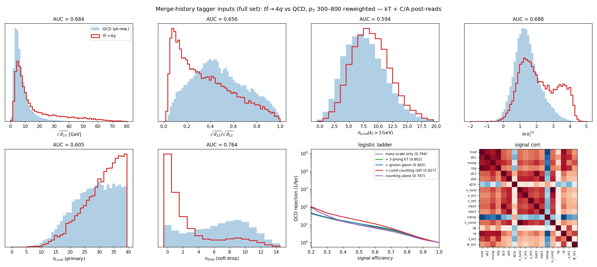

</div>
</div>

---

## Outlook II: physics functions & the full history as tagger input

<div class="cols">
<div>

**Compress to 13 dimensionless functions** — lnρ, $m_{SD}/m_{ung}$,
$\sqrt{d_{12}}/m_{SD}=\sqrt{z/(1-z)}$, prong ratios, closure
$\chi=\sqrt{z_g(1-z_g)}\,p_T R_g/m_{SD}$ (<1 ⇒ massive prongs: top),
$\psi_{1,2}=\ln k_t^{(1,2)}-\ln m_{SD}$, SD-split match, counting:

- functions-only **0.813**; with raw vars 0.831;
- **mass-decorrelated set: 0.797** with *no explicit mass input* — the sculpting-safe option.

<span class="small">**Full history → b-hive**: a merge history is a padded token sequence —
exactly the cpf/npf/vtx input contract. C/A primary Lund list (= LundNet input) + kT scales
as two new groups; tree structure via ParT's pairwise channel. Config + ntuple branches +
~20 lines of `InputEmbed` — design note in the vault, not implemented.</span>

</div>
<div>

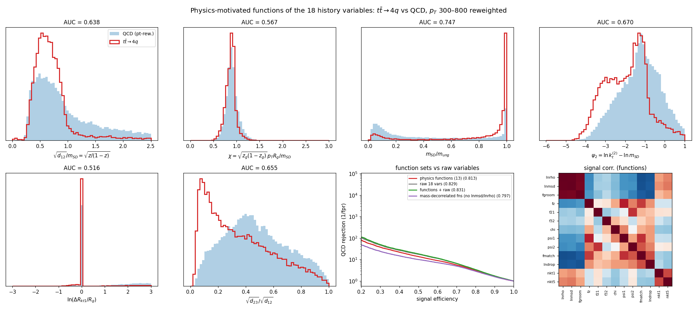

</div>
</div>

---

## Which tree does each variable come from?

Each jet is clustered **three times** (`extract_tagger_vars.py`), and every input is a post-read of one specific history:

<div class="cols">
<div>

<span class="tag ak">anti-kT</span> **$R=0.8$** — the physical jet
`algorithm="antikt"` → leading-jet 4-vector
- $m_{ung}$ (ungroomed mass), $n_{const}$

<span class="tag kt">kT</span> **exclusive splitting scales**
`algorithm="kt"` → `splitting_scales()`
- $\sqrt{d_{12}}, \sqrt{d_{23}}, \sqrt{d_{34}}$ (value-sorted)
- ⇒ ratios $d_{23}/d_{12}$, $f_{21}$, $f_{32}$

</div>
<div>

<span class="tag ca">C/A</span> **big-$R$ recluster → soft-drop + Lund**
`algorithm="cambridge"` → `groomed_jets` + `lund_coordinates`
- groom: $m_{SD}, z_g, R_g, n_{drop}$, tagged
- Lund: $n_{Lund}, n(k_t\!>\!1), n(k_t\!>\!5)$, $\ln k_t^{(1,2,3)}$, $z, \Delta R$ of hardest emission

<span class="tag mix">mixed</span> **functions spanning two trees**
- $f_{groom}=m_{SD}/m_{ung}$ (C/A ÷ anti-kT)
- $f_z=\sqrt{d_{12}}/m_{SD}$ (kT ÷ C/A)

</div>
</div>

<span class="small">**Why two trees?** kT is *value-sorted* — its exclusive scales $\sqrt{d_{12}}\!\ge\!\sqrt{d_{23}}\!\ge\!\dots$ read off the hardest splittings directly (prong hierarchy). C/A is *angular-ordered* — its primary declustering **is** the Lund plane / soft-drop sequence (grooming, emission counts). anti-kT gives the jet itself. Every tag below (<span class="tag kt">kT</span> / <span class="tag ca">C/A</span> / <span class="tag ak">anti-kT</span> / <span class="tag mix">mixed</span>) marks the source.</span>

---

## The full merge history of one jet

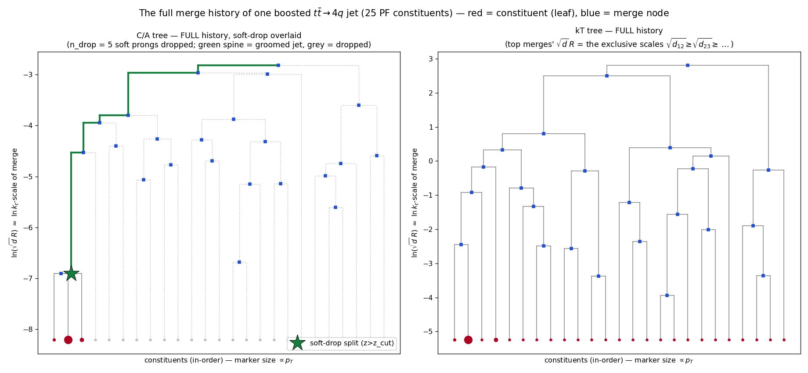

<style scoped>section { font-size: 18px; }</style>

flashjet stores the **complete** binary tree (`hist_p1,p2,child,d`) — every merge, **nothing removed**. One boosted top jet (25 const., $p_T$ 789, $m$ 135). **Left C/A** with soft-drop overlaid: <span style="color:#15803d">**green = the groomed jet**</span>, grey = the $n_{drop}=5$ dropped soft prongs, ★ = passing split ($m_{SD}, z_g, R_g$ live here). **Right kT** (value-sorted): top merges' $\sqrt d\,R = \sqrt{d_{12}}\!\ge\!\sqrt{d_{23}}\!\ge\!\dots$. **Grooming = a pruned path through the C/A tree, not a separate tree.** See [[2026-07-22-full-merge-history]].

---

## …and here grooming *works*: recovering $m_W$

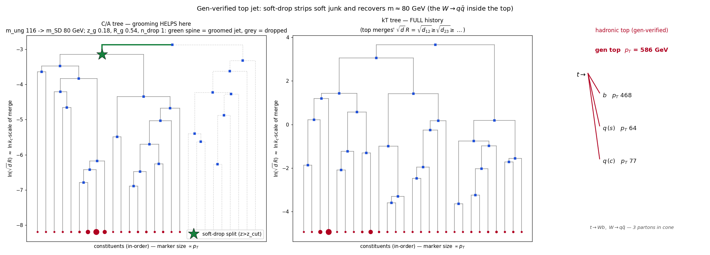

<style scoped>section { font-size: 18px; }</style>

A boosted **$W\to q\bar q$** (30 const., $p_T$ 507). Ungroomed mass is inflated to **120 GeV** by soft wide radiation; soft-drop peels off 4 soft prongs ($z\approx0.005$, grey) and lands the ★ on a **balanced, wide** split — $z_g=0.49$, $R_g=0.34$, $k_t$ jumps to **80 GeV** — giving <span style="color:#15803d">**$m_{SD}=83\approx m_W$**</span>. Contrast the previous slide, where the hardest branch ran into collinear junk and soft-drop misfired ($m_{SD}\!\to\!3$). Same algorithm, two outcomes — why the tagger also uses $n_{drop}$ and the **kT** scales ($\sqrt{d_{12}},\sqrt{d_{23}}$, robust to this), not $m_{SD}$ alone.

---

## Tree gallery — QCD vs clean top

<div class="cols">
<div>

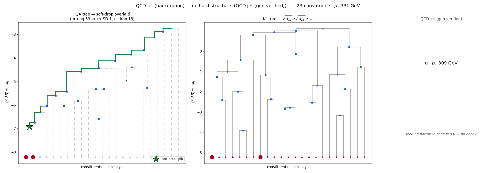

<span class="small">**QCD** (23 const, $p_T$ 331): m_ung 33 → **m_SD 1.2**, $n_{drop}=$**13**. The green spine is a long **staircase** — soft prong after soft prong dropped, mass collapses. No balanced hard split anywhere. *This is why $n_{drop}$ is the best non-mass variable (0.769).*</span>

</div>
<div>

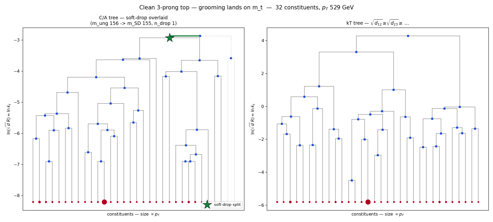

<span class="small">**Clean top** (32 const, $p_T$ 529): m_ung 156 → **m_SD 155**, $n_{drop}=$**1**. Grooming barely works at all — the ★ sits at the very top on a wide balanced split. The well-behaved counterpart to the misfiring top two slides back.</span>

</div>
</div>

<span class="small">Same two-panel format as before (C/A with soft-drop overlaid). The contrast in **spine length** — 13 steps vs 1 — is the entire discriminant, visualised.</span>

---

## Tree gallery — boosted & b-jet

<div class="cols">
<div>

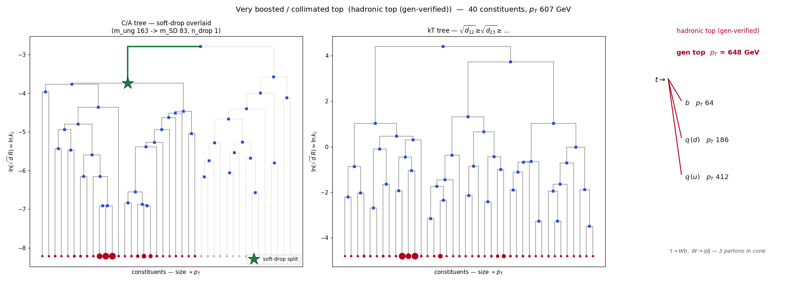

<span class="small">**Boosted / collimated** (35 const, $p_T$ 629): $m_{SD}$ 74, $R_g=$**0.26**. At high $p_T$ the decay angle shrinks ($R_g\!\sim\!m/p_T$) — the hard split moves *down* the tree toward the collinear region and the whole structure compresses. The regime where grooming gets harder.</span>

</div>
<div>

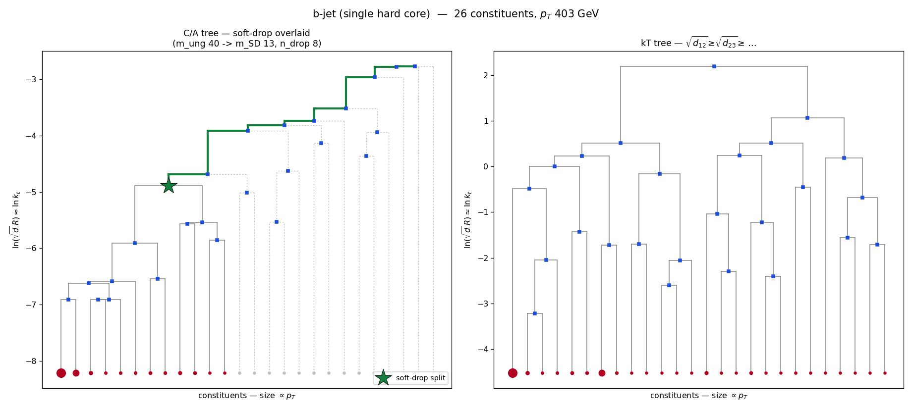

<span class="small">**b jet** (26 const, $p_T$ 403): m_ung 40 → m_SD 13, $n_{drop}=$8. A single hard core with no balanced hard split — the tree looks much more QCD-like than W/top-like. Foreshadows the AK4 result: **a kinematic tree does not see flavour**.</span>

</div>
</div>

---

## AK4 jets — from **MINIAOD** (the constituents NanoAOD doesn't link)

<div class="cols">
<div>

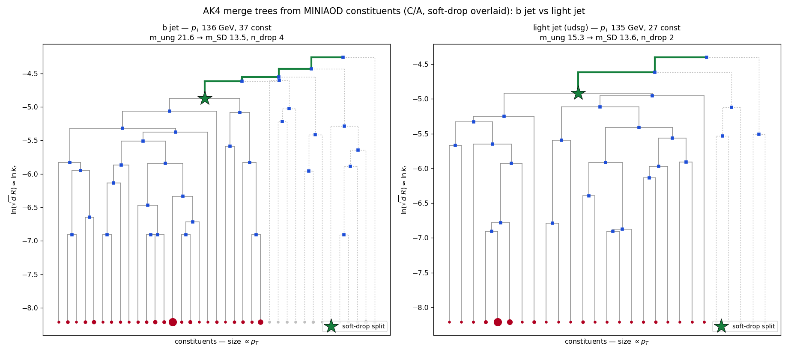

<span class="small">JMENano has AK4 `Jet_*` + `hadronFlavour` but **no PF→AK4 linker** (only `FatJetPFCand` for AK8). So AK4 trees are impossible there. Went to **MINIAOD** (`slimmedJets` carry `packedPFCandidates` as daughters) via DAS: 12 000 AK4 jets, **3552 b / 6593 udsg**, real flavour truth.</span>

</div>
<div>

<style scoped>li { font-size: 18px; margin: 0.15em 0; }</style>

**Two-stage pipeline** (CMSSW python 3.9 and `b_hive` 3.11 are ABI-incompatible):

1. **FWLite** (`CMSSW_14_1_0_pre4`) reads `slimmedJets` + PF daughters + `hadronFlavour` → constituent npz
2. **`b_hive`** runs flashjet C/A + kT + soft-drop + Lund on those constituents → 18 vars + flavour

The figure: a **b jet** and a **light jet** at the *same* $p_T$ (136 vs 135 GeV). Their trees are **near-identical** — both $m_{SD}\approx13.5$, similar depth and shape.

</div>
</div>

---

## AK4 result: the history does **not** do flavour tagging

<div class="cols">
<div>

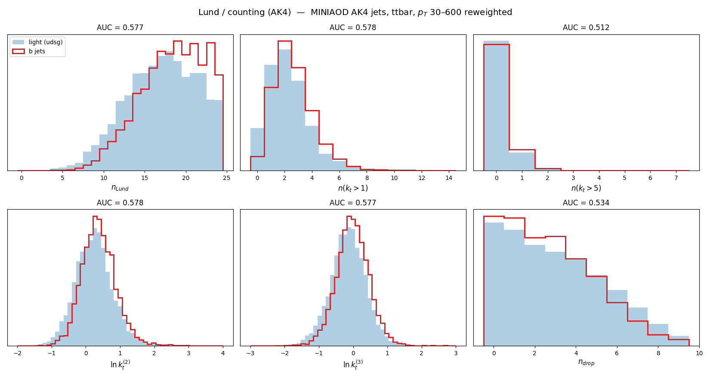

</div>
<div>

<style scoped>li { font-size: 18px; margin: 0.15em 0; }</style>

b vs light (udsg), $p_T$-reweighted — **every variable lands at 0.50–0.59**:

| best AK4 variables | AUC |
|---|---|
| $z$ of hardest emission | 0.591 |
| $\sqrt{d_{12}}$ | 0.588 |
| $\ln k_t^{(2)}$, $n_{Lund}$ | ~0.578 |
| $m_{SD}$ | 0.573 |
| $n(k_t\!>\!5)$, $f_{32}$ | ~0.51 |

**The expected answer, and it matters:** b vs light is a **lifetime** question (displaced tracks, secondary vertices) — absent from a kinematic tree. The residual ~0.55 is a b hadron's mild mass/multiplicity edge.

⇒ Pitch history tokens at **boosted 2-/3-prong tagging** (AK8 0.78–0.83), **not** as a b-tagging input — confirming UParT's IP/SV inputs carry what no tree contains.

</div>
</div>

---

## Correction: AUC tie handling

<style scoped>section { font-size: 19px; } table { font-size: 17px; }</style>

The AUC routine integrated the ROC **without handling ties**. For discrete counts (>80% of jets share one value) that splits tied jets arbitrarily and **manufactures separation**. Caught because AK4 $n(k_t\!>\!5)$ scored **0.773** while b and light had *identical means in every $p_T$ slice* — impossible.

Fixed by building the ROC on **unique values** (proper Mann–Whitney tie handling). Continuous variables are unaffected; the corrected AK8 counts:

| variable | was | **corrected** |
|---|---|---|
| $n(k_t>1)$ | 0.593 | **0.587** |
| $n(k_t>5)$ | 0.691 | **0.663** |
| $n_{drop}$ | 0.765 | **0.769** |
| $f_{match}$ | 0.516 | **0.648** ← was badly *understated* |
| $n_{Lund}$, $n_{const}$ | 0.602 | 0.602 (unchanged) |

All mass/geometry variables ($m_{SD}$ 0.782, $\sqrt{d_{12}}$ 0.792, $R_g$ 0.779, $f_{groom}$ 0.747) are **unchanged**, so the AK8 conclusions stand: $n_{drop}$ is still the best non-mass variable. <span class="small">Full detail: [[2026-07-22-ak4-and-tree-gallery]].</span>

---

## All inputs (1/5) — mass-scale variables

<div class="cols">
<div>

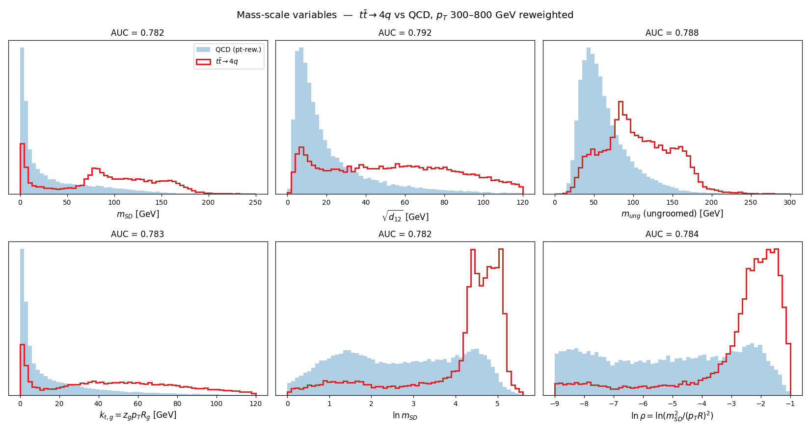

<span class="small">Filled = QCD (pt-reweighted), red = $t\bar t\to 4q$; per-panel weighted single-variable AUC. All at **0.78–0.79** and 0.8–0.97 correlated — they probe the *same* 2-prong decay mass, so add little to one another.</span>

</div>
<div>

<style scoped>li { font-size: 18px; margin: 0.15em 0; }</style>

- <span class="tag ca">C/A</span> **$m_{SD}$** (0.782): soft-drop mass — clean $m_W\!\approx\!80$ peak + $m_t\!\approx\!160$ shoulder; QCD a steep low-mass continuum.
- <span class="tag kt">kT</span> **$\sqrt{d_{12}}$** (0.792, best of group): $\approx\min(p_{T1},p_{T2})\Delta R$ of the last merge — momentum-weighted mass scale of the hardest split.
- <span class="tag ak">anti-kT</span> **$m_{ung}$** (0.788): ungroomed mass — signal keeps its mass, QCD's is inflated by soft wide radiation.
- <span class="tag ca">C/A</span> **$k_{t,g}=z_g p_T R_g$** (0.783): $k_t$ of the groomed split, another mass proxy.
- <span class="tag ca">C/A</span> **$\ln m_{SD}$** (0.782), **$\ln\rho=\ln(m_{SD}^2/(p_TR)^2)$** (0.784): log forms. QCD is ~flat in $\ln\rho$; signal piles at the decay mass — cleanest of the group.

</div>
</div>

---

## All inputs (2/5) — prong-hierarchy / kT variables

<div class="cols">
<div>

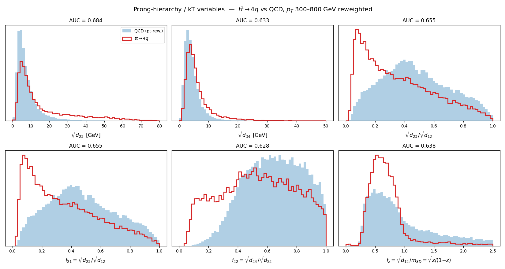

<span class="small">The kT splitting scales *beyond the first* and their **ratios** — do multiple hard prongs exist with a hierarchy (3-prong top, 2-prong W) vs QCD's single DGLAP ladder?</span>

</div>
<div>

<style scoped>li { font-size: 18px; margin: 0.15em 0; }</style>

- <span class="tag kt">kT</span> **$\sqrt{d_{23}}$** (0.684): 2nd kT scale — populated for 3-prong top (W→qq̄ inside), near zero for 2-prong W or 1-prong QCD.
- <span class="tag kt">kT</span> **$\sqrt{d_{34}}$** (0.633): 3rd splitting — weakest, mostly extra radiation.
- <span class="tag kt">kT</span> **$d_{23}/d_{12}$ = $f_{21}$** (0.655): the ratio removes overall scale — signal peaks near 0.1 (hierarchical decay scales), QCD broad.
- <span class="tag kt">kT</span> **$f_{32}=\sqrt{d_{34}}/\sqrt{d_{23}}$** (0.628): next ratio in the hierarchy.
- <span class="tag mix">kT÷C/A</span> **$f_z=\sqrt{d_{12}}/m_{SD}=\sqrt{z/(1-z)}$** (0.638): momentum sharing of the mass split, **mass-decorrelated** — decay shares evenly ($z\!\approx\!\tfrac12$), QCD soft-biased.

</div>
</div>

---

## All inputs (3/5) — Lund / counting variables

<div class="cols">
<div>

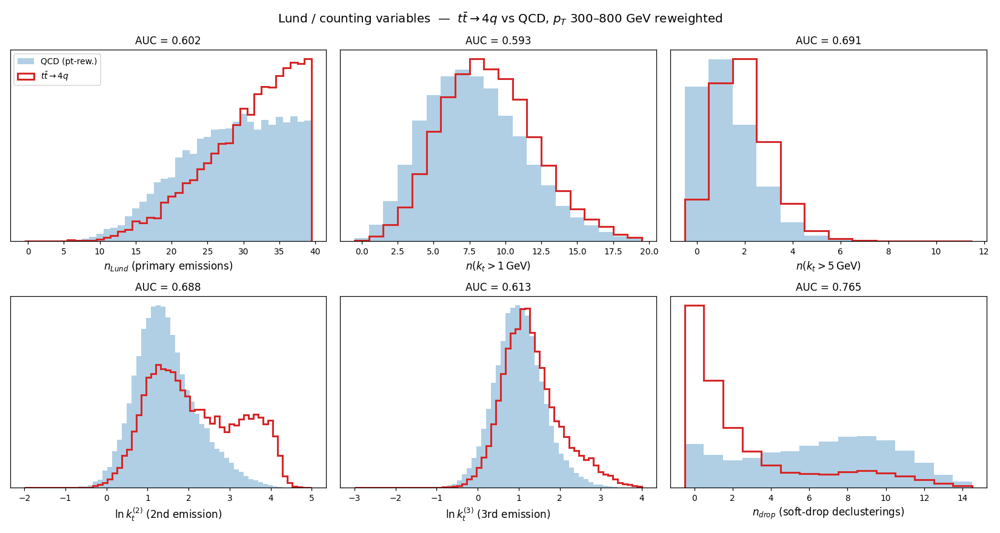

<span class="small">*How many* hard emissions, and how hard the sub-leading ones are — the **declustering sequence**, the information a single mass number cannot carry.</span>

</div>
<div>

<style scoped>li { font-size: 18px; margin: 0.15em 0; }</style>

<span class="small">All from the **C/A** primary declustering sequence (the Lund plane + soft-drop walk).</span>

- <span class="tag ca">C/A</span> **$n_{Lund}$** (0.602), **$n(k_t\!>\!1)$** (0.587): primary-emission counts. Signal has *fewer* (a color singlet radiates less) despite higher pileup — physical.
- <span class="tag ca">C/A</span> **$n(k_t\!>\!5)$** (0.663): counting only *hard* emissions sharpens it — top/W give 1–2, QCD more.
- <span class="tag ca">C/A</span> **$\ln k_t^{(2)}$** (0.688): 2nd-hardest emission — signal bump at $\ln k_t\!\approx\!3.5$–4.5 = the **second decay splitting** (top→W→qq̄).
- <span class="tag ca">C/A</span> **$\ln k_t^{(3)}$** (0.613): 3rd emission — weaker.
- <span class="tag ca">C/A</span> **$n_{drop}$** (0.769, **best non-mass var**): soft-drop declustering count. Decays pass in **0–1** steps; QCD needs up to ~12.

</div>
</div>

---

## All inputs (4/5) — grooming-geometry variables

<div class="cols">
<div>

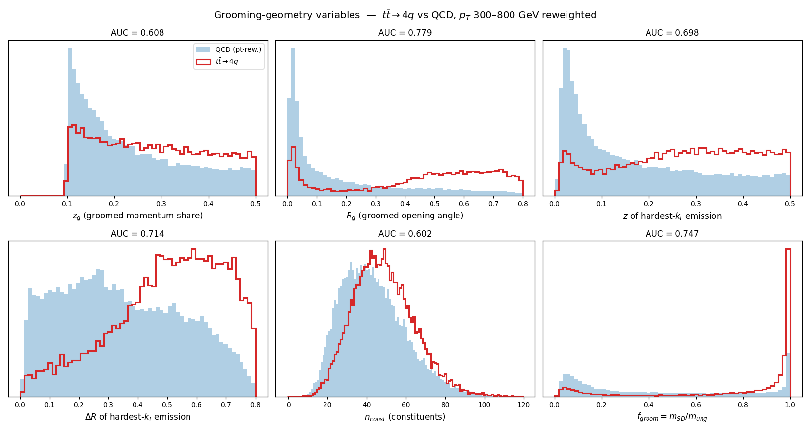

<span class="small">Geometry of the split soft drop keeps, plus constituent count and grooming survival.</span>

</div>
<div>

<style scoped>li { font-size: 18px; margin: 0.15em 0; }</style>

- <span class="tag ca">C/A</span> **$z_g$** (0.608): groomed momentum share — near the $z_{cut}=0.1$ edge, flatter than QCD's $1/z_g$; modest alone.
- <span class="tag ca">C/A</span> **$R_g$** (0.779): groomed opening angle, **strong**. Decay angle $R_g\!\approx\!m/(p_T\sqrt{z(1-z)})$ is fixed and wide; QCD collinear.
- <span class="tag ca">C/A</span> **$z$** (0.698), **$\Delta R$** (0.714) **of the hardest-$k_t$ emission**: for a decay this *is* the decay split, so both are decay-scale.
- <span class="tag ak">anti-kT</span> **$n_{const}$** (0.602): constituent multiplicity — quark/gluon-like, weak alone.
- <span class="tag mix">C/A÷anti-kT</span> **$f_{groom}=m_{SD}/m_{ung}$** (0.747): **grooming survival** — decays keep mass ($\approx1$), QCD loses it ($\ll1$). Strong, mass-shape-decorrelated.

</div>
</div>

---

## All inputs (5/5) — physics-function inputs

<div class="cols">
<div>

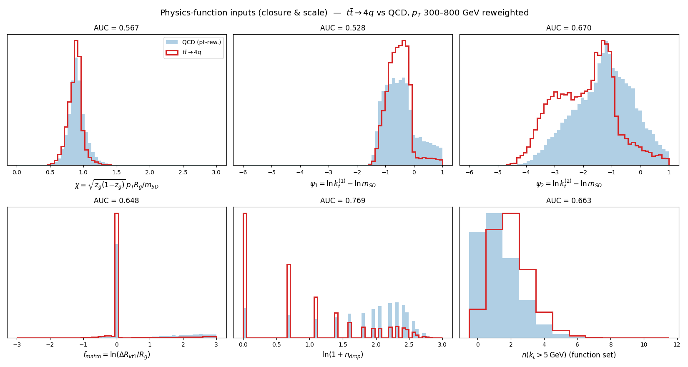

<span class="small">Dimensionless **closure / scale-comparison** functions, each designed to encode a specific decay hypothesis directly.</span>

<span class="small">All AUCs weighted-logistic single-variable, same selection/reweighting as the study. Scripts `tagger_allvars.py` (plots), `tagger_study.py`, `tagger_functions.py`; Condor 9128460 extraction. See [[2026-07-18-tagger-inputs]].</span>

</div>
<div>

<style scoped>li { font-size: 18px; margin: 0.15em 0; }</style>

<span class="small">All from the **C/A** groom + Lund reads (no kT tree enters this set).</span>

- <span class="tag ca">C/A</span> **$\chi=\sqrt{z_g(1-z_g)}\,p_T R_g/m_{SD}$** (0.567): 2-prong **closure** — $\chi\!\approx\!1$ for massless prongs (W), $\chi\!<\!1$ for **massive** prongs (top→Wb). Built-in top/W handle.
- <span class="tag ca">C/A</span> **$\psi_1=\ln k_t^{(1)}-\ln m_{SD}$** (0.528): hardest emission at the decay scale? Weak (≈ mass split for both).
- <span class="tag ca">C/A</span> **$\psi_2=\ln k_t^{(2)}-\ln m_{SD}$** (0.670): **2nd** emission at the decay scale? High for top (the W sub-decay) — strongest $\psi$/$\chi$.
- <span class="tag ca">C/A</span> **$f_{match}=\ln(\Delta R_{kt1}/R_g)$** (0.648): hardest-$k_t$ emission ≡ SD split? $\approx0$ for a clean decay.
- <span class="tag ca">C/A</span> **$\ln(1+n_{drop})$** (0.769): the $n_{drop}$ handle, compressed.
- <span class="tag ca">C/A</span> **$n(k_t\!>\!5)$** (0.663): perturbative activity, in the function set.

</div>
</div>

---

## Reproducibility & full-statistics numbers

<style scoped>
table { font-size: 14.5px; }
section { font-size: 18px; }
</style>

All CMS plots regenerated **raw-to-raw on the C/A tree** at full statistics
(`make_cms_plots.py`, vectorized loader; run on **HTCondor** cluster 9087059, 60 257 jets):

| observable | comparison | result |
|---|---|---|
| jet $p_T$ (QCD) | our anti-kt vs `FatJet_pt×(1−rawFactor)` | median **1.000000**, σ 2.5×10⁻⁴ |
| soft-drop mass (QCD) | our C/A-tree vs $m$(raw sub₁+sub₂) | median **−0.004 GeV**, 95.7% <0.5 GeV |
| $z_g$ (QCD) | our vs raw subjet $z$ | \|Δ\| = **7×10⁻⁵** |
| jet $p_T$ (ttbar 2L2Nu) | 12 561 leading jets, HTCondor 9098883 | median **1.000002**, σ 2.2×10⁻⁴ |
| soft-drop mass (ttbar) | our C/A-tree vs $m$(raw sub₁+sub₂) | median **−0.041 GeV**, 94.2% <0.5 GeV |
| full-event (QCD) | all PFCands → anti-kt, ΔR-match to `FatJet_*` | 7 701 jets, pt **1.0000**, ΔR med **0.0019** |
| $R_g$ (3 samples) | our groomed `dR` vs ΔR(sub₁,sub₂), HTCondor 9099026 | median Δ ≤ 2×10⁻⁴; 99.2/95.9/87.0% <0.01 |
| TTto4Q Run 3 2024 | 16 516 leading jets, raw-to-raw | pt 0.999556, $m_{SD}$ −0.077 GeV — table-floor effect ↑ w/ pileup, rel. 0.14% |

<span class="small">Residual = NanoAOD float storage throughout. Jets: anti-kt $R=0.8$; grooming/Lund: big-$R$ **C/A** reclustering (as FastJet).</span>

---

## Function reference (added)

```text
exclusive_jets_from_history(hist_p1, hist_p2, hist_child, hist_d, mask,
                            n_jets=None, d_cut=None)          # F1
groom_from_history(hist_p1, hist_p2, hist_child, hist_d, mask, p4, R,
                   z_cut=0.1, beta=0.0, mu=None)              # F2 (soft-drop / mMDT / mass-drop)
lund_coordinates_from_history(hist_p1, hist_p2, hist_child, hist_d, mask, p4)  # F3 -> (B,J,S,6)

# helpers
_resolve_roots(...)      # pointer-jump roots of an arbitrary sub-forest
_jet_roots(...)          # per-jet root pseudojet id, beam-merge order
_pseudojet_p4(...)       # E-scheme 4-momentum of every pseudojet, keyed by id
_dense_number_roots(...) # compact per-particle jet index
```

**API surface**: `ClusterOutput.exclusive_jets`, `.groomed_jets`, `.mass_drop`,
`.lund_coordinates`, plus a new `.mask` field to map slots→ids.

---

## Reproducing everything

```bash
# on lxplus, env b_hive (torch 2.5.1)
cd /eos/home-c/cgupta/flashjet/plots/2026-07-13-substructure
micromamba run -n b_hive python make_plots.py        # F1/F2/F3 toy justification + parity
micromamba run -n b_hive python make_paper_plots.py  # anti-kt/SoftDrop/Lund paper figures
micromamba run -n b_hive python make_cms_plots.py    # real CMS UL18 QCD (needs qcd_jmenano_150x.root)
micromamba run -n b_hive python make_fullevent_plots.py  # full-event clustering vs stored AK8
micromamba run -n b_hive python make_ttbar_plots.py  # ttbar (needs ttbar_jmenano_150x.root)
micromamba run -n b_hive python make_compare_plots.py # QCD vs 2L2Nu vs TTto4Q comparisons
micromamba run -n b_hive python outliers.py          # m_SD outlier anatomy
# long jobs run on HTCondor: submit dir ~/flashjet_condor (AFS; /eos paths are
# rejected in submit files), executables cd to EOS + `micromamba run -n b_hive`

# tests
cd /eos/home-c/cgupta/flashjet/FlastJetDemo
micromamba run -n b_hive python -m pytest -q          # 85 passed, 13 skipped
```

Fixed seed `20260713` throughout. Papers catalogued in `References/Flashjet/papers.md`.
