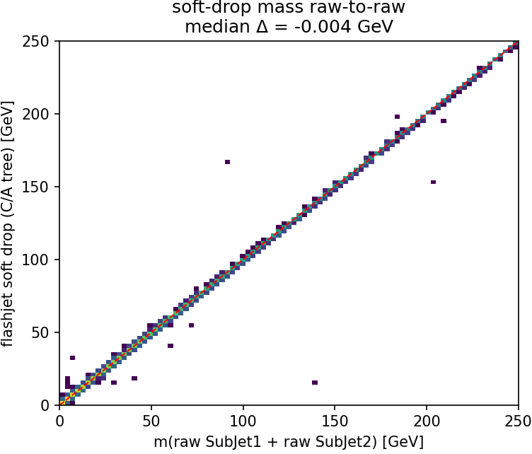
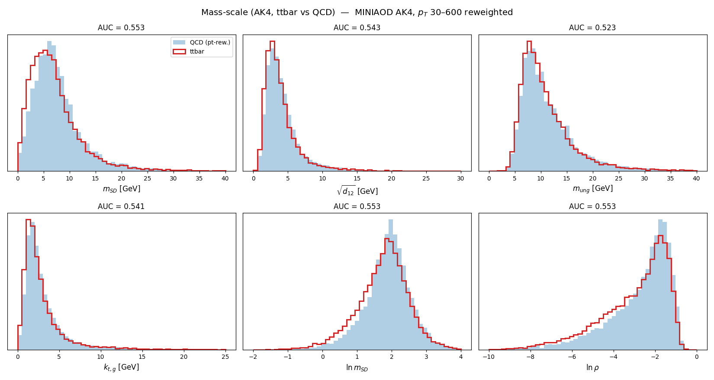

<!-- _class: lead -->

# GPU substructure for **flashjet**

### kt / C-A jet substructure on the merge history

exclusive jets · soft-drop grooming · Lund coordinates

**Chirayu Gupta**

<span class="small">Code: [github.com/…/flashjet](https://github.com/) · branch `benchmarking`, commit `2e912ef`</span>

<span class="small">**Reading guide** — features: <b>F1</b> exclusive-kt · <b>F2</b> soft-drop grooming · <b>F3</b> Lund ·
inputs: <b>A</b> toy events · <b>B</b> toy shower · <b>C</b> real CMS (C1 QCD, C2 ttbar-2ℓ, C3 ttbar-4q) ·
tree tags <span class="tag kt">kT</span> <span class="tag ca">C/A</span> <span class="tag ak">anti-kT</span></span>

---

## Summary

**Three substructure features**, all **pure-torch post-reads of the existing merge history** —
no kernel changes, CPU/CUDA identical, negligible cost:

| | feature | reads | implements |
|---|---|---|---|
| **F1** | exclusive-kt jets | kT history | kt algorithm [1] |
| **F2** | soft-drop / mMDT grooming | C/A history | Soft Drop [4] |
| **F3** | Lund coordinates | C/A history | Lund plane [6] |

**Validated three ways**, each closed against an independent reference:

| validation | reference | headline |
|---|---|---|
| **unit tests** | independent NumPy tree-walks | 85 passed (13 CUDA-only skipped) |
| **paper closures** (toys) | analytic LL predictions | $z_g$ on the $1/z$ curve; areas; $\beta$-ordering |
| **real CMS** (raw-to-raw) | stored FastJet branches | $p_T$ **1.000000**, $m_{SD}$ **−0.004 GeV**, $R_g$ 99.2% <0.01 |

**⇒ flashjet reproduces CMS's FastJet reconstruction to NanoAOD storage precision** — then the same
histories yield **variables that separate the samples** (second half of this talk).

---

## What was already there vs. what we added

<div class="cols">
<div>

**Pre-existing**
- `history.py`: `jet_idx_from_history`, `_resolve_parents`, `_decode`,
  `splitting_scales_from_history`, Triton `_decode_triton`
- `reference.py`: single-event NumPy ground truth (`cluster_event`)
- `nn_reference.py`: nearest-neighbour reference
- `conftest.py`: `random_event` fixtures
- The kernels + the merge-history recording

</div>
<div>

**Added (this work)** — in `history.py`
- **F1** `exclusive_jets_from_history`
- **F2** `groom_from_history`
- **F3** `lund_coordinates_from_history`
- helpers: `_resolve_roots`, `_jet_roots`,
  `_pseudojet_p4`, `_dense_number_roots`
- `api.py`: `ClusterOutput.{exclusive_jets, groomed_jets,
  mass_drop, lund_coordinates}` + a `mask` field
- `tests/test_substructure.py` (new)

</div>
</div>

<span class="small">The `_ref_*` walkers inside `test_substructure.py` are also ours — independent
naive NumPy tree-walks used only to pin the fast implementations.</span>

---

## The three features

|        | Feature             | Function                             | Implements                                                       |
| ------ | ------------------- | ------------------------------------ | ---------------------------------------------------------------- |
| **F1** | Exclusive jets (kt) | `exclusive_jets_from_history(...)`   | kt algorithm — FastJet manual [1], anti-kt [2]                   |
| **F2** | Grooming (C/A)      | `groom_from_history(...)`            | Soft Drop [4] · mMDT [5] · mass-drop [3]                         |
| **F3** | Lund coordinates    | `lund_coordinates_from_history(...)` | Primary Lund plane [6]                                           |

**F1** — undo the last merges of the sequence to expose exactly `n_jets` (or a `d_cut`) subjets;
reduces to the inclusive jets at the trivial cut.
**F2** — walk each jet down the harder branch, dropping the softer prong until
$z > z_{\rm cut}(\Delta R/R)^\beta$ (soft-drop) — the $O(\log_2 n)$ declustering.
**F3** — for every primary split emit $(z,\Delta R, k_t, \ln 1/\Delta R, \ln k_t, d)$; the
$d$-channel ties **exactly** to `splitting_scales`.

---

<!-- _class: lead -->

# How the toys were generated

*(the "simulation" — none of it pre-existing; flashjet only clusters, it does not generate events)*

---

## Input A: The toy event generators (written in the plot scripts)

flashjet takes 4-vectors in and returns jets — it has **no event generator**. To exercise the
features I wrote small, transparent toys *outside the repo*, in the plot scripts.

**`make_plots.py` — two single-fat-jet samples at $p_T\!\approx\!500$ GeV, $R=0.8$:**
- **QCD-like**: one hard collinear core (92% of $p_T$, $\sigma_{y,\phi}=0.06$) + soft wide-angle
  radiation (8%, $\sigma=0.30$). Each "spray" = $n$ massive pions with exponential $p_T$ fractions.
- **W-like**: two hard prongs with pair mass $m=\sqrt{z(1-z)}\,p_T\,\Delta R = 80.4$ GeV
  ($z\in[0.30,0.45]$), random orientation, + 6% soft contamination.

```python
def _spray(rng, n, y0, phi0, pt_total, sigma):     # n pions around (y0,phi0)
    frac = rng.exponential(1., n); frac /= frac.sum()
    pt = pt_total * frac
    y, phi = rng.normal(y0, sigma, n), rng.normal(phi0, sigma, n)
    mt = np.sqrt(M_PI**2 + pt**2)
    return np.stack([pt*np.cos(phi), pt*np.sin(phi), mt*np.sinh(y), mt*np.cosh(y)], 1)
```

<span class="small">1500 events per sample. Purpose: QCD vs W is a *known* truth, so any observable that
fails to separate them (or lands off the analytic curve) would be a real bug.</span>

---

## Input B: The toy parton shower

**`make_paper_plots.py`** builds a **primary, fixed-coupling, leading-log** shower — emissions
sampled **uniformly in the Lund triangle** with density $\bar\alpha$ per unit
$(\ln 1/\theta,\ \ln k_t)$ area, off a hard spine at $(y,\phi)=(0,\pi)$:

$$ \theta=e^{-u},\quad k_t=e^{v},\quad z=\frac{k_t}{p_{T0}\,\theta},\qquad
\text{keep } v\le \ln(p_{T0}/2)-u \;(z\le\tfrac12),\ k_t>k_t^{\min} $$

- **Jet areas**: one hard event + a dense grid of infinitely-soft **ghosts** ($p_T=10^{-8}$);
  the ghosts each algorithm sweeps up trace its catchment area (the anti-kt-paper construction).

<span class="small">$\bar\alpha=0.25$, $p_{T0}=1$ TeV, $R=0.4$, 20 000 showers. Everything is re-runnable with a fixed seed (`20260713`).</span>

---

## Input C: the real CMS datasets

Real detector-level **PF-candidate constituents** — the only NanoAOD flavour (JMENano, 150X) that
stores the `PFCand` table + the `FatJetPFCand` constituent→AK8 map. Pulled via DAS/`xrdcp`.

| tag | dataset | era | jets | used in |
|---|---|---|---|---|
| **C1** | `QCD_Pt-15to7000_Flat2018_pythia8` | UL18 JMENano (13 TeV) | 60 257 | CMS (1)–(4), β-family |
| **C2** | `TTTo2L2Nu` (dileptonic) | UL18 JMENano (13 TeV) | 12 561 | ttbar slides |
| **C3** | `TTto4Q` (fully-hadronic) | RunIII2024 JMENanoV15 (13.6 TeV) | 16 516 | three-sample compare, **separating variables** |

<span class="small">All: leading AK8 jet/event, raw $p_T>300$ GeV, $|\eta|<2.4$, 2–200 linked PF candidates.
`PFCand_pt/mass` are **already PUPPI-weighted** (branch titles); stored `FatJet_*` are JEC-corrected
(raw = `pt×(1−rawFactor)`). AK4 uses **MINIAOD** instead (see backup) — no AK4 constituent linker exists in NanoAOD.</span>

---

<!-- _class: lead -->

# Correctness

*each feature reproduces the signature figure of the paper it implements*

<span class="small">**Bottom line:** on toy inputs with known truth, F1/F2/F3 land exactly on the papers' analytic predictions.</span>

---

## anti-kt jet shapes — reproduces [2] Fig. 1
### Input B (toy shower), clustering only — no substructure feature


**What:** each algorithm's **jet catchment area**. kt & C/A give ragged, area-fluctuating
jets; **anti-kt** gives rigid **circles** around each hard particle — the defining anti-kt result,
from flashjet's own clustering. 1 synthetic event (10 hard particles + ~3200 ghosts), $R=1$.

---

## F1 — kt substructure separates 2-prong from QCD [1, 2]
### Input A (QCD/W toy fat-jets), kt clustering


<div class="cols">
<div>

**Left — $\sqrt{d_{12}}$** (`splitting_scales_from_history`): kt scale of the last merge.
W-like peaks at $\sim m_W/2$, QCD low.

</div>
<div>

**Right — exclusive 2-subjet $z$** (`exclusive_jets_from_history`, $n_{\rm jets}=2$):
W-like balanced ($z\!\approx\!0.35$), QCD lopsided ($z\!\to\!0$).

</div>
</div>

---

## F2 — soft-drop $z_g$ vs the analytic prediction [4]
### Input B (toy shower), C/A soft-drop

<div class="cols">
<div>

The soft-drop momentum fraction $z_g$ from `groom_from_history`
($z_{\rm cut}=0.1,\ \beta=0$) tracks the **leading-log QCD prediction**

$$ p(z_g)=\frac{1/z_g}{\ln(1/2z_{\rm cut})} $$

across the **entire range**, no free parameters. 72% of jets tagged.

> **Decisive grooming-correctness plot**: the target curve is *the* right
> answer, so lying on it is unambiguous closure.

</div>
<div>


</div>
</div>

---

## F2 — groomed mass ordering in $\beta$ [4] Figs. 3–4
### Input B (toy shower), C/A soft-drop at $\beta=0,1,2$

<div class="cols">
<div>

Groomed mass $\rho=m^2/(p_T^2R^2)$ for $\beta=0,1,2$ vs ungroomed.

- Grooming shifts the spectrum to **lower $\rho$** (removes soft-wide radiation).
- **Smaller $\beta$ grooms harder**: the $\beta=0$ curve reaches furthest left.

Reproduces the $\beta$-ordering of the Soft Drop paper.

</div>
<div>


</div>
</div>

---

## F3 — primary Lund plane [6]
### Input A (QCD/W toy fat-jets), C/A clustering


`lund_coordinates_from_history` (C/A, $R=0.8$). **QCD** fills the soft-collinear region smoothly.
**W-like** shows the same background **plus an isolated hard-splitting spot** exactly where the
2-body $m_W$ decay must sit (red ★ = predicted position). [6]

---

<!-- _class: lead -->

# On **real CMS data** (Input C)

*not toys any more: real detector-level PF-candidate constituents*

<span class="small">**Bottom line:** on real constituents, flashjet reproduces CMS's stored FastJet output *jet-by-jet, raw-to-raw, to NanoAOD storage precision*.</span>

---

## The real-data pipeline (`make_cms_plots.py`) — dataset C1

<div class="cols">
<div>

**These plots use *real jet constituents*, not toys:**
1. Pick every CMS **AK8 FatJet** with $p_T>300$, $|\eta|<2.4$.
2. Gather its **PF candidates** via `FatJetPFCand_jetIdx→pfCandIdx→PFCand_{pt,η,φ,m}`.
   **`PFCand_pt/mass` are already PUPPI-weighted** (branch titles) — no separate weight branch.
3. Feed *those constituents* to **our** `cluster(R=0.8, antikt)` — CMS AK8 **is** anti-kt $R=0.8$.

</div>
<div>

4. Leading jet → **F2** soft drop ($z_{\rm cut}=0.1, β=0$, declustering the **C/A** tree, as
   FastJet's SoftDrop does) — and **F3** Lund.
5. Chunked at 3000 jets (torch backend is $O(N^3)$; each AK8 jet is one independent event, so chunking is exact).

**The stored CMS values are JEC-corrected**: raw jet = `FatJet_pt×(1−rawFactor)`;
`FatJet_msoftdrop` = m(sub1+sub2) **with subjet JECs** (proven from data: Δ = +0.0002 GeV).

</div>
</div>

---

## CMS (1) — reclustering closes: our $p_T$ vs CMS `FatJet_pt` — C1

<div class="cols">
<div>

**What:** feed CMS's own AK8 constituents to **our** anti-kt $R=0.8$ and compare the reclustered
jet $p_T$ to CMS's stored `FatJet_pt`, **jet-by-jet**.

**Result — EXACT:** vs the **raw** jet pt (`FatJet_pt×(1−rawFactor)`) the ratio is
**median 1.000000, σ = 2.5×10⁻⁴** — pure NanoAOD storage precision. The apparent ~6% offset
vs the stored value **is the L1L2L3 JEC**, nothing else: CMS stores corrected $p_T$, we
recompute the raw one.

<span class="small">60 257 jets; HTCondor cluster 9087059.</span>

</div>
<div>


</div>
</div>

---

## CMS (2) — soft-drop mass matches CMS **EXACTLY** (raw-to-raw) — C1

<div class="cols">
<div>

**Raw-to-raw, on the C/A tree (20 065 jets):** our **F2** soft-drop mass reproduces CMS
`FatJet_msoftdrop` jet-by-jet — the diagonal is exact to NanoAOD storage precision.

| | our − CMS |
|---|---|
| $m_{\rm SD}$ | **−0.004 GeV** (95.6% <0.5 GeV) |
| $z_g$ | \|Δ\| = **7×10⁻⁵** |

**F2 reproduces CMS `msoftdrop`.** The residual 4.4% tail is fully attributed to NanoAOD storage
(see backup — soft-candidate table floor + rounding).

</div>
<div>



</div>
</div>

---

## CMS (3) — primary Lund plane of 60 257 real QCD jets — C1

<div class="cols">
<div>

**What:** **F3** `lund_coordinates` on the same real AK8 jets. Needs no comparison curve — it *is* a
clean, publication-quality primary Lund plane straight from detector-level simulation.

The full [6] structure emerges with **no toy input**: the hard-collinear perturbative ridge,
the soft plateau, and the three kinematic edges.

</div>
<div>


</div>
</div>

---

## CMS (4) — full-event clustering recovers CMS's own AK8 jets — C1


<div class="cols">
<div>

**What:** the realistic path — feed **every PF candidate in the event** to flashjet anti-kt $R=0.8$
(no `FatJetPFCand` per-jet pre-grouping), then match the resulting inclusive jets to CMS's **stored**
AK8 jets by $\Delta R<0.4$.

</div>
<div>

**Result (7 701 matched jets, $p_T>300$, raw-to-raw):** pt **median 1.0000, 100% within 2%**;
match **$\Delta R$ median 0.0019**; mass spectra identical. Full-event flashjet reproduces CMS's own
FastJet AK8 reconstruction to milliradian $\Delta R$ — no jets known a priori.

</div>
</div>

---

<!-- _class: lead -->

# On a **ttbar** sample — dataset C2

*a second, independent final state · comparison against the sample's own stored FastJet branches*

<span class="small">`TTTo2L2Nu` UL18 JMENano 150X, 344 k events → 12 561 leading AK8 jets. "Comparison against FastJet"
= against CMS's **stored** `FatJet_*`/`SubJet_*`/`tau*` branches, **not** a FastJet re-run.
`TTTo2L2Nu` is **dileptonic** → these jets are mostly **b-jets + ISR**, not hadronic top decays.</span>

---

## ttbar — flashjet = stored FastJet branches (raw-to-raw) — C2


<div class="cols">
<div>

**pt** (our anti-kt $R=0.8$ vs `FatJet_pt×(1−rawFactor)`): median **1.000002**, σ 2.2×10⁻⁴.

</div>
<div>

**soft-drop mass** (our C/A tree vs $m$(raw sub₁+sub₂)): median Δ **−0.041 GeV**, 94.2% <0.5 GeV.

</div>
</div>

<span class="small">The exact match holds on a completely different final state (boosted tops + b-jets), not just QCD —
same conclusion, same NanoAOD-precision residual.</span>

---

## ttbar — our substructure vs stored FastJet observables — C2


<div class="cols">
<div>

**Left (F1):** our exclusive-2-subjet $\sqrt{d_{12}}$ on ttbar jets; the $m_W/m_t$ lines are
**mass-scale references only** (dileptonic sample has no hadronic decays).
**Middle (F2):** our soft-drop $z_g$ vs CMS's **raw subjet** $z$, jet-by-jet — median \|Δ\| = **1.6×10⁻⁴**.

</div>
<div>

**Right (context):** the sample's stored FastJet **N-subjettiness** ratios — $\tau_2/\tau_1$ (W-tag),
$\tau_3/\tau_2$ (top-tag). Our $z_g$ tracking CMS's stored subjet $z$ to 10⁻⁴ closes F2 directly
against FastJet's SoftDrop output.

</div>
</div>

---

<!-- _class: lead -->

# Three samples side by side

*QCD (C1) vs dileptonic ttbar (C2) vs **fully-hadronic** ttbar (C3) — the first sample with real boosted W/top decays*

<span class="small">C1 160 393 jets · C2 8 639 jets · C3 (`TTto4Q` RunIII2024 JMENanoV15, 13.6 TeV) 16 516 jets.
All: leading AK8 jet/event, raw $p_T>300$, $|\eta|<2.4$, ≤200 constituents (`make_compare_plots.py`, HTCondor 9099026).</span>

---

## Lund planes: QCD → b-jets → boosted tops (F3) — C1/C2/C3


<span class="small">**The top-decay scale appears exactly where it must**: the $t\bar t \to 4q$ plane (C3) grows a hard-splitting
blob at $\ln k_t \approx \ln(m_W/2) \approx 3.7$, wide-angle — over **2×** QCD in the ratio panel (right).
The dileptonic sample (C2, b-jets, no hadronic top) shows only a mild version. Same clustering, same F3, three physics regimes.</span>

---

## Spectra: $m_W$ / $m_t$ peaks from our grooming (F1 + F2) — C1/C2/C3


<span class="small">**Left (F2):** our raw soft-drop mass — C3 peaks at $m_W$ with a top shoulder at $m_t$; C2 broad and lower;
C1 falls. **Middle (F2):** $z_g$ — ttbar flatter than QCD's $\sim 1/z$. **Right (F1):** $\sqrt{d_{12}} = m\sqrt{z/(1-z)}$ —
W-window jets peak at **39 ≈ $m_W/2$**, top-window at **81 ≈ $m_t/2$**; QCD collapses to low scales.</span>

---

## $R_g$ — a second jet-by-jet exact match (F2 vs stored subjets) — C1/C2/C3


<div class="cols">
<div>

<span class="small">**What:** our split angle $R_g$ (`groom_from_history`'s `dR`) vs stored
$\Delta R$(sub₁,sub₂), **jet-by-jet**: median Δ ≤ 2×10⁻⁴ — with $z_g$, both grooming observables close.
Run 3 (C3) = the same mechanism at higher pileup: relative agreement stays **0.14%**.</span>

</div>
<div>

<span class="small">

| sample | $p_T$ ratio | $m_{SD}$ Δ | $R_g$ \|Δ\|<0.01 |
|---|---|---|---|
| C1 QCD UL18 | 0.999999 | −0.004 (95.7%<0.5) | **99.2%** |
| C2 $t\bar t$ 2ℓ2ν | 0.999998 | −0.033 (94.1%<0.5) | 95.9% |
| C3 $t\bar t$ 4q '24 | 0.999556 | −0.077 (69.3%<0.5) | 87.0% |

</span>

</div>
</div>

---

<!-- _class: lead -->

# Variables that separate the samples

*the same histories that reproduce FastJet also carry physics that separates QCD from boosted decays*

<span class="small">**Bottom line:** the merge history yields variables that cleanly separate boosted top/W jets from QCD — and localizes *where* they help (boosted 2-/3-prong decays, not AK4 flavour).</span>

---

## Which tree does each variable come from?

Each jet is clustered **three times** (`extract_tagger_vars.py`); every input is a post-read of one history:

<div class="cols">
<div>

<span class="tag ak">anti-kT</span> **$R=0.8$** — the physical jet
`algorithm="antikt"` → leading-jet 4-vector
- $m_{ung}$ (ungroomed mass), $n_{const}$

<span class="tag kt">kT</span> **exclusive splitting scales**
`algorithm="kt"` → `splitting_scales()`
- $\sqrt{d_{12}}, \sqrt{d_{23}}, \sqrt{d_{34}}$ (value-sorted)
- ⇒ ratios $d_{23}/d_{12}$, $f_{21}$, $f_{32}$

</div>
<div>

<span class="tag ca">C/A</span> **big-$R$ recluster → soft-drop + Lund**
`algorithm="cambridge"` → `groomed_jets` + `lund_coordinates`
- groom: $m_{SD}, z_g, R_g, n_{drop}$
- Lund: $n_{Lund}, n(k_t\!>\!1), n(k_t\!>\!5)$, $\ln k_t^{(1,2,3)}$, $z, \Delta R$ of hardest emission

</div>
</div>

<span class="small">**Why two trees?** kT is *value-sorted* — its exclusive scales $\sqrt{d_{12}}\!\ge\!\sqrt{d_{23}}\!\ge\!\dots$ read off the hardest splittings directly (prong hierarchy). C/A is *angular-ordered* — its primary declustering **is** the Lund plane / soft-drop sequence. The colored tags below mark each variable's source.</span>

---

## All inputs (1/4) — mass-scale variables

<div class="cols">
<div>


<span class="small">Filled = QCD (pt-reweighted), red = $t\bar t\to 4q$ (C3); per-panel weighted single-variable AUC. All at **0.78–0.79** and 0.8–0.97 correlated — they probe the *same* 2-prong decay mass, so add little to one another.</span>

</div>
<div>

<style scoped>li { font-size: 18px; margin: 0.15em 0; }</style>

- <span class="tag ca">C/A</span> **$m_{SD}$** (0.782): soft-drop mass — clean $m_W\!\approx\!80$ peak + $m_t\!\approx\!160$ shoulder; QCD a steep low-mass continuum.
- <span class="tag kt">kT</span> **$\sqrt{d_{12}}$** (0.792, best of group): momentum-weighted mass scale of the hardest split.
- <span class="tag ak">anti-kT</span> **$m_{ung}$** (0.788): ungroomed mass — signal keeps its mass, QCD's is inflated by soft wide radiation.
- <span class="tag ca">C/A</span> **$k_{t,g}=z_g p_T R_g$** (0.783): $k_t$ of the groomed split, another mass proxy.
- <span class="tag ca">C/A</span> **$\ln m_{SD}$** (0.782), **$\ln\rho$** (0.784): log forms. QCD ~flat in $\ln\rho$; signal piles at the decay mass.

</div>
</div>

---

## All inputs (2/4) — prong-hierarchy / kT variables

<div class="cols">
<div>


<span class="small">The kT splitting scales *beyond the first* and their **ratios** — do multiple hard prongs exist with a hierarchy (3-prong top, 2-prong W) vs QCD's single DGLAP ladder?</span>

</div>
<div>

<style scoped>li { font-size: 18px; margin: 0.15em 0; }</style>

- <span class="tag kt">kT</span> **$\sqrt{d_{23}}$** (0.684): 2nd kT scale — populated for 3-prong top (W→qq̄ inside), near zero for 2-prong W or 1-prong QCD.
- <span class="tag kt">kT</span> **$\sqrt{d_{34}}$** (0.633): 3rd splitting — weakest, mostly extra radiation.
- <span class="tag kt">kT</span> **$d_{23}/d_{12}$ = $f_{21}$** (0.655): the ratio removes overall scale — signal peaks near 0.1, QCD broad.
- <span class="tag kt">kT</span> **$f_{32}=\sqrt{d_{34}}/\sqrt{d_{23}}$** (0.628): next ratio in the hierarchy.
- <span class="tag mix">kT÷C/A</span> **$f_z=\sqrt{d_{12}}/m_{SD}=\sqrt{z/(1-z)}$** (0.638): momentum sharing, **mass-decorrelated** — decay shares evenly, QCD soft-biased.

</div>
</div>

---

## All inputs (3/4) — Lund / counting variables

<div class="cols">
<div>


<span class="small">*How many* hard emissions, and how hard the sub-leading ones are — the **declustering sequence**, information a single mass number cannot carry. All from the **C/A** primary declustering.</span>

</div>
<div>

<style scoped>li { font-size: 18px; margin: 0.15em 0; }</style>

- <span class="tag ca">C/A</span> **$n_{Lund}$** (0.602), **$n(k_t\!>\!1)$** (0.587): primary-emission counts. Signal has *fewer* despite higher pileup — physical.
- <span class="tag ca">C/A</span> **$n(k_t\!>\!5)$** (0.663): counting only *hard* emissions — top/W give 1–2, QCD more.
- <span class="tag ca">C/A</span> **$\ln k_t^{(2)}$** (0.688): 2nd-hardest emission — signal bump = the **second decay splitting** (top→W→qq̄).
- <span class="tag ca">C/A</span> **$\ln k_t^{(3)}$** (0.613): 3rd emission — weaker.
- <span class="tag ca">C/A</span> **$n_{drop}$** (0.769, **best non-mass var**): soft-drop declustering count. Decays pass in **0–1** steps; QCD needs up to ~12.

</div>
</div>

---

## All inputs (4/4) — grooming-geometry variables

<div class="cols">
<div>


<span class="small">Geometry of the split soft drop keeps, plus constituent count and grooming survival.</span>

</div>
<div>

<style scoped>li { font-size: 18px; margin: 0.15em 0; }</style>

- <span class="tag ca">C/A</span> **$z_g$** (0.608): groomed momentum share — near the $z_{cut}=0.1$ edge; modest alone.
- <span class="tag ca">C/A</span> **$R_g$** (0.779): groomed opening angle, **strong**. Decay angle fixed and wide; QCD collinear.
- <span class="tag ca">C/A</span> **$z$** (0.698), **$\Delta R$** (0.714) **of the hardest-$k_t$ emission**: for a decay this *is* the decay split.
- <span class="tag ak">anti-kT</span> **$n_{const}$** (0.602): constituent multiplicity — quark/gluon-like, weak alone.
- <span class="tag mix">C/A÷anti-kT</span> **$f_{groom}=m_{SD}/m_{ung}$** (0.747): **grooming survival** — decays keep mass ($\approx1$), QCD loses it ($\ll1$).

</div>
</div>

---

## What the variables measure: one jet's full merge history


<style scoped>section { font-size: 18px; }</style>

flashjet stores the **complete** binary tree (`hist_p1,p2,child,d`) — every merge, **nothing removed**. One boosted top jet (25 const., $p_T$ 789, $m$ 135). **Left C/A** with soft-drop overlaid: <span style="color:#15803d">**green = the groomed jet**</span>, grey = the $n_{drop}=5$ dropped soft prongs, ★ = passing split ($m_{SD}, z_g, R_g$ live here). **Right kT** (value-sorted): top merges' $\sqrt d\,R = \sqrt{d_{12}}\!\ge\!\sqrt{d_{23}}\!\ge\!\dots$. **Grooming = a pruned path through the C/A tree.**

---

## …and here grooming *works*: recovering $m_W$


<style scoped>section { font-size: 18px; }</style>

A boosted **$W\to q\bar q$** (30 const., $p_T$ 507). Ungroomed mass inflated to **120 GeV** by soft wide radiation; soft-drop peels off 4 soft prongs (grey) and lands the ★ on a **balanced, wide** split — $z_g=0.49$, $R_g=0.34$, $k_t$ jumps to **80 GeV** — giving <span style="color:#15803d">**$m_{SD}=83\approx m_W$**</span>. Two slides show the same algorithm succeeding vs misfiring — why the separating variables use $n_{drop}$ + the **kT** scales, not $m_{SD}$ alone.

---

## AK8 vs AK4: the history is a **boosted-decay** tool

Same 18 history variables, best single-variable AUC in three studies:

| study | what's being separated | best variable | AUC | reading |
|---|---|---|---|---|
| **AK8 top/W vs QCD** | boosted 2-/3-prong decay vs QCD | $\sqrt{d_{12}}$ | **0.79** | history separates **strongly** |
| **AK4 ttbar vs QCD** | single quark jet (dijet) vs QCD | $m_{SD}$ | **0.55** | one AK4 jet ≈ one quark — no in-jet decay |
| **AK4 b vs light** | flavour (b vs udsg) | $z$ hardest emis. | **0.55** | a **lifetime** question (IP/SV) — invisible to a kinematic tree |

**⇒ The history variables separate boosted 2-/3-prong decays — they do *not* separate AK4 flavour** — quantitative
confirmation that UParT's impact-parameter / secondary-vertex inputs carry information no clustering tree contains.

<span class="small">Sources: AK8 = MINIAOD `slimmedJetsAK8` (same TTto4Q + QCD Run3 2022 files as AK4); AK4 = MINIAOD
`slimmedJets`. Full AK4 trees + b-vs-light / ttbar-vs-QCD variable studies on the next slides.</span>

---

## Full-history tree gallery — QCD vs clean top

<div class="cols">
<div>


<span class="small">**QCD** (23 const, $p_T$ 331): m_ung 33 → **m_SD 1.2**, $n_{drop}=$**13**. Green spine is a long **staircase** — soft prong after soft prong dropped, mass collapses. No balanced hard split. *Why $n_{drop}$ is the best non-mass variable.*</span>

</div>
<div>


<span class="small">**Clean top** (32 const, $p_T$ 529): m_ung 156 → **m_SD 155**, $n_{drop}=$**1**. Grooming barely works — the ★ sits at the very top on a wide balanced split.</span>

</div>
</div>

<span class="small">Spine length 13 vs 1 is the entire discriminant, visualised.</span>

---

## Full-history tree gallery — boosted & b-jet

<div class="cols">
<div>


<span class="small">**Boosted / collimated** (35 const, $p_T$ 629): $R_g=$**0.26**. At high $p_T$ the decay angle shrinks — the hard split moves *down* toward the collinear region, the tree compresses.</span>

</div>
<div>


<span class="small">**b jet** (26 const, $p_T$ 403): single hard core, no balanced split — looks QCD-like. Foreshadows the AK4 result: **a kinematic tree does not see flavour**.</span>

</div>
</div>

---

## AK4 jets — from **MINIAOD** (constituents NanoAOD doesn't link)

<div class="cols">
<div>


<span class="small">JMENano has AK4 `Jet_*` + `hadronFlavour` but **no PF→AK4 linker** (only `FatJetPFCand` for AK8). So AK4 trees are impossible there. Went to **MINIAOD** (`slimmedJets` carry `packedPFCandidates`) via DAS: 12 000 AK4 jets, **3552 b / 6593 udsg**.</span>

</div>
<div>

<style scoped>li { font-size: 18px; margin: 0.15em 0; }</style>

**Two-stage pipeline** (CMSSW py3.9 and `b_hive` py3.11 are ABI-incompatible):

1. **FWLite** reads `slimmedJets` + PF daughters + `hadronFlavour` → constituent npz
2. **`b_hive`** runs flashjet C/A + kT + soft-drop + Lund → 18 vars + flavour

The b jet and light jet at the *same* $p_T$ have **near-identical** trees.

</div>
</div>

---

## AK4 result: no flavour separation (b vs light)

<div class="cols">
<div>


</div>
<div>

<style scoped>li { font-size: 18px; margin: 0.15em 0; }</style>

b vs light (udsg), $p_T$-reweighted — **every variable 0.50–0.59**:

| best AK4 variables | AUC |
|---|---|
| $z$ of hardest emission | 0.591 |
| $\sqrt{d_{12}}$ | 0.588 |
| $m_{SD}$ | 0.573 |
| $n(k_t\!>\!5)$, $f_{32}$ | ~0.51 |

b vs light is a **lifetime** question (displaced tracks, SVs) — absent from a kinematic tree. Confirms UParT's IP/SV inputs carry what no tree contains.

</div>
</div>

---

## AK4 result: ttbar vs QCD (dijet)

<div class="cols">
<div>



</div>
<div>

<style scoped>li { font-size: 18px; margin: 0.15em 0; }</style>

ttbar AK4 vs QCD AK4 (MINIAOD, same source) — **every variable 0.50–0.55**:

- best: $m_{SD}$ 0.553, $n(k_t\!>\!1)$ 0.551, $\sqrt{d_{23}}$ 0.549;
- a single AK4 jet in ttbar is mostly **one quark** (a b, or a light quark from W→qq̄) — no multi-prong decay *inside one jet* for the history to see.

<span class="small">The tiny edge is just the b-jet admixture. Complements the b-vs-light null: the history has no AK4 handle at all.</span>

</div>
</div>

---

<!-- _class: lead -->

# Summary

**flashjet reads the full merge history** — F1 exclusive-kt jets, F2 soft-drop grooming, F3 Lund —
as pure-torch post-reads, validated to **NanoAOD storage precision** against CMS's FastJet output on
QCD and ttbar (raw-to-raw, jet-by-jet).

**Those same histories yield variables that separate the samples**: they cleanly split boosted top/W
jets from QCD (the declustering *sequence*, not just mass), and the study localizes
where they help — **boosted 2-/3-prong decays**, not AK4 flavour.

---

## References

<style scoped>section { font-size: 18px; } ol { line-height: 1.7; }</style>

1. M. Cacciari, G. P. Salam, G. Soyez, *FastJet User Manual*, Eur. Phys. J. C 72 (2012) 1896 — [arXiv:1111.6097](https://arxiv.org/abs/1111.6097). **F1** exclusive jets (`d_cut`/`n_jets`).
2. M. Cacciari, G. P. Salam, G. Soyez, *The anti-$k_t$ jet clustering algorithm*, JHEP 04 (2008) 063 — [arXiv:0802.1189](https://arxiv.org/abs/0802.1189). The `hist_d` distance measure, $p=-1/0/+1$ family, jet areas.
3. J. M. Butterworth, A. R. Davison, M. Rubin, G. P. Salam, *Jet substructure as a new Higgs-search channel*, PRL 100 (2008) 242001 — [arXiv:0802.2470](https://arxiv.org/abs/0802.2470). **F2** original mass-drop ($\mu$) tagger.
4. A. J. Larkoski, S. Marzani, G. Soyez, J. Thaler, *Soft Drop*, JHEP 05 (2014) 146 — [arXiv:1402.2657](https://arxiv.org/abs/1402.2657). **F2** the $z>z_{\rm cut}(\Delta R/R)^\beta$ condition, $z_g$ prediction, $\beta$-ordering.
5. M. Dasgupta, A. Fregoso, S. Marzani, G. P. Salam, *Towards an understanding of jet substructure (mMDT)*, JHEP 09 (2013) 029 — [arXiv:1307.0007](https://arxiv.org/abs/1307.0007). **F2** the $\beta=0$ default.
6. F. A. Dreyer, G. P. Salam, G. Soyez, *The Lund Jet Plane*, JHEP 12 (2018) 064 — [arXiv:1807.04758](https://arxiv.org/abs/1807.04758). **F3** the $(z,\Delta R,k_t,\ln 1/\Delta R,\ln k_t)$ coordinates.

<span class="small">Broader review: S. Marzani, G. Soyez, M. Spannowsky, *Looking Inside Jets*, [arXiv:1901.10342](https://arxiv.org/abs/1901.10342). Papers + a print-ready reader catalogued in `References/Flashjet/papers.md`.</span>

---

<!-- _class: lead -->

# Backup

---

## Multivariable separation: the declustering *sequence* is the payload

<div class="cols">
<div>


</div>
<div>

$t\bar t\to 4q$ (C3) vs $p_T$-reweighted QCD, weighted logistic on the **18-variable** history vector:

- mass-scale vars saturate at AUC **0.794** (they're 0.8–0.97 correlated — the *same* 2-prong mass);
- adding the **declustering sequence** → full set **0.827**, ~2× QCD rejection at 30% eff;
- **$n_{drop}$ alone 0.769** — decay jets pass soft drop in 0–1 steps, QCD needs many;
- $\ln k_t^{(2)}$ resolves the **second** decay splitting (top→W).

<span class="small">The point: this variable set is **free** once the history exists — no new clustering, GPU-batchable. Exploratory (no gen-match, linear model). Condor 9128460.</span>

</div>
</div>

---

## CMS (2b) — anatomy of the residual $m_{SD}$ tail (the 4.4%)


<span class="small">**Every input branch is stored with reduced mantissa** (`PFCand_pt` ~10 bits ≈ 10⁻³,
`SubJet_pt/mass` ~9 bits, `SubJet_rawFactor` ~5 bits ≈ 2%) while CMS ran FastJet at full precision.
Attribution (per-jet tests, 19 695 jets): **50%** — soft candidates **missing from `FatJetPFCand`**
(the table has an effective ~0.1 GeV floor; the tail is one-sided, its groomed-$p_T$ deficit correlates
with $\Delta m$, and $\delta m^2\!\approx\!p_T^{jet} p_T^{lost}\Delta R^2$ matches); **23%** within 3σ of
storage rounding; **20%** rounding-sensitive C/A trees (half-ulp jitter moves them); **7%** genuine
$z\!\approx\!z_{\rm cut}$ prong flips (14× enriched vs core). **Not fixable from NanoAOD — not an
algorithm error**: relative agreement is ~0.1% everywhere. Scripts: `outliers.py` (HTCondor 9098953).</span>

---

## Soft-drop $\beta$-family on real QCD jets (F2) — C1

<div class="cols">
<div>

The toy-shower closure, repeated on **164 292 real CMS jets**: re-groom the same C/A trees at
$\beta = 0, 1, 2$ ($z_{\rm cut}=0.1$) and plot $\rho = m^2/(p_T^2 R^2)$.

- grooming pushes mass **down**; **smaller $\beta$ grooms harder** — the exact ordering
  of Soft Drop [4] Figs. 3–4;
- $\beta=0$ (mMDT) develops the characteristic flat low-$\rho$ tail.

<span class="small">Grooming re-run 3× on the *same* merge histories (a pure post-read: no re-clustering — the point of the history design).</span>

</div>
<div>


</div>
</div>

---

## Correction: AUC tie handling

<style scoped>section { font-size: 19px; } table { font-size: 17px; }</style>

The AUC routine integrated the ROC **without handling ties**. For discrete counts (>80% of jets share one value) that splits tied jets arbitrarily and **manufactures separation**. Caught because AK4 $n(k_t\!>\!5)$ scored **0.773** while b and light had *identical means in every $p_T$ slice* — impossible.

Fixed by building the ROC on **unique values** (proper Mann–Whitney tie handling). Continuous variables unaffected; corrected AK8 counts:

| variable | was | **corrected** |
|---|---|---|
| $n(k_t>1)$ | 0.593 | **0.587** |
| $n(k_t>5)$ | 0.691 | **0.663** |
| $n_{drop}$ | 0.765 | **0.769** |
| $f_{match}$ | 0.516 | **0.648** |

All mass/geometry variables ($m_{SD}$ 0.782, $\sqrt{d_{12}}$ 0.792, $R_g$ 0.779) **unchanged** — AK8 conclusions stand.

---

## Reproducibility & full-statistics numbers

<style scoped>
table { font-size: 14.5px; }
section { font-size: 18px; }
</style>

All CMS plots regenerated **raw-to-raw on the C/A tree** at full statistics
(`make_cms_plots.py`, HTCondor cluster 9087059, 60 257 jets):

| observable | comparison | result |
|---|---|---|
| jet $p_T$ (QCD) | our anti-kt vs `FatJet_pt×(1−rawFactor)` | median **1.000000**, σ 2.5×10⁻⁴ |
| soft-drop mass (QCD) | our C/A-tree vs $m$(raw sub₁+sub₂) | median **−0.004 GeV**, 95.7% <0.5 GeV |
| $z_g$ (QCD) | our vs raw subjet $z$ | \|Δ\| = **7×10⁻⁵** |
| jet $p_T$ (ttbar 2L2Nu) | 12 561 leading jets, HTCondor 9098883 | median **1.000002**, σ 2.2×10⁻⁴ |
| soft-drop mass (ttbar) | our C/A-tree vs $m$(raw sub₁+sub₂) | median **−0.041 GeV**, 94.2% <0.5 GeV |
| full-event (QCD) | all PFCands → anti-kt, ΔR-match | 7 701 jets, pt **1.0000**, ΔR med **0.0019** |
| $R_g$ (3 samples) | our groomed `dR` vs ΔR(sub₁,sub₂) | median Δ ≤ 2×10⁻⁴; 99.2/95.9/87.0% <0.01 |

<span class="small">Residual = NanoAOD float storage throughout. Jets: anti-kt $R=0.8$; grooming/Lund: big-$R$ **C/A** reclustering (as FastJet).</span>

---

## Function reference (added)

```text
exclusive_jets_from_history(hist_p1, hist_p2, hist_child, hist_d, mask,
                            n_jets=None, d_cut=None)          # F1
groom_from_history(hist_p1, hist_p2, hist_child, hist_d, mask, p4, R,
                   z_cut=0.1, beta=0.0, mu=None)              # F2 (soft-drop / mMDT / mass-drop)
lund_coordinates_from_history(hist_p1, hist_p2, hist_child, hist_d, mask, p4)  # F3 -> (B,J,S,6)

# helpers
_resolve_roots(...)      # pointer-jump roots of an arbitrary sub-forest
_jet_roots(...)          # per-jet root pseudojet id, beam-merge order
_pseudojet_p4(...)       # E-scheme 4-momentum of every pseudojet, keyed by id
_dense_number_roots(...) # compact per-particle jet index
```

**API surface**: `ClusterOutput.exclusive_jets`, `.groomed_jets`, `.mass_drop`,
`.lund_coordinates`, plus a new `.mask` field to map slots→ids.

---

## Reproducing everything

```bash
# on lxplus, env b_hive (torch 2.5.1)
cd /eos/home-c/cgupta/flashjet/plots/2026-07-13-substructure
micromamba run -n b_hive python make_plots.py        # F1/F2/F3 toy justification + parity
micromamba run -n b_hive python make_paper_plots.py  # anti-kt/SoftDrop/Lund paper figures
micromamba run -n b_hive python make_cms_plots.py    # real CMS UL18 QCD (C1)
micromamba run -n b_hive python make_ttbar_plots.py  # ttbar (C2)
micromamba run -n b_hive python make_compare_plots.py # C1/C2/C3 comparisons
# AK4/AK8 from MINIAOD: cmsenv in CMSSW_14_1_0_pre4 + voms-proxy-init, then
#   python3 dump_ak4_constituents.py / dump_ak8_constituents.py  (FWLite)
#   micromamba run -n b_hive python ak4_substructure.py / ak4_vs_ak8.py

# tests
cd /eos/home-c/cgupta/flashjet/FlastJetDemo
micromamba run -n b_hive python -m pytest -q          # 85 passed, 13 skipped
```

Fixed seed `20260713` throughout. Papers catalogued in `References/Flashjet/papers.md`.
