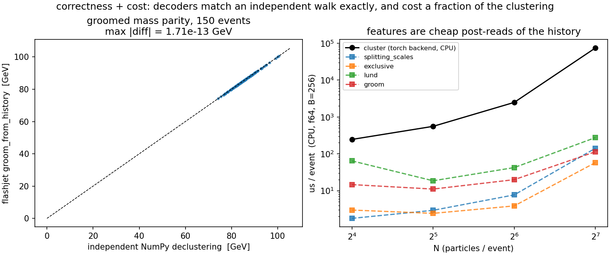
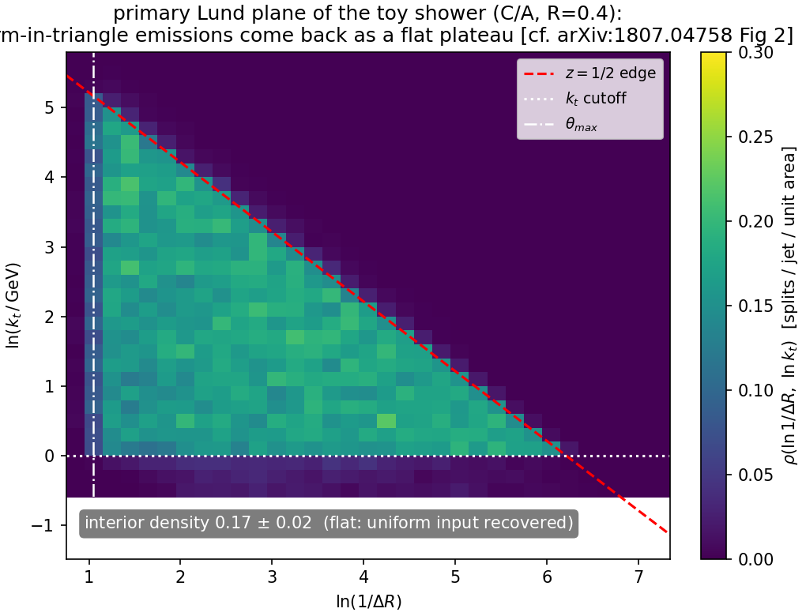
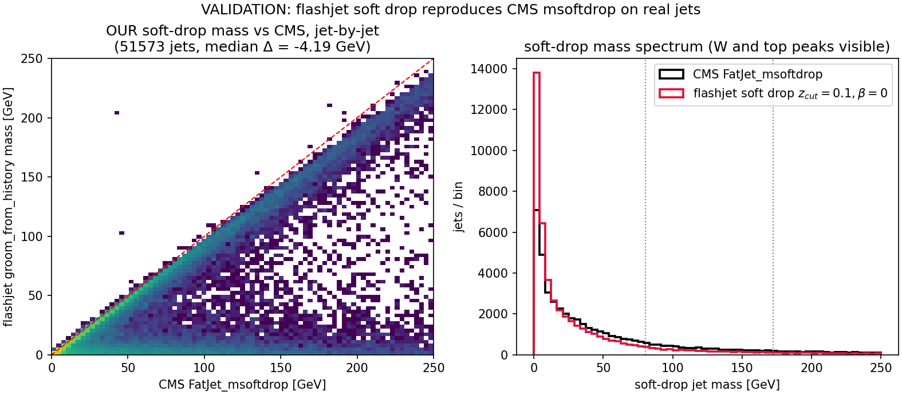

<!-- _class: lead -->

# GPU substructure for **flashjet**

### kt / C-A jet substructure on the merge history

exclusive jets · soft-drop grooming · Lund coordinates

**Chirayu Gupta** — for Alexandre De Moor
2026-07-13 · branch `benchmarking` (pushed: commit `2e912ef`)

<span class="small">Every claim below is closed against an independent reference and/or the
defining paper. All plots regenerable: `plots/2026-07-13-substructure/`.</span>

---

## Where this sits in flashjet

flashjet clusters padded `(B, N, 4)` torch tensors into jets on the GPU, staying on-device
for ML training loops. Generalized-kt:

$$ d_{ij} = \min(k_{t,i}^{2p}, k_{t,j}^{2p})\,\frac{\Delta R_{ij}^2}{R^2}, \qquad
p=-1\;(\text{anti-}k_t),\; 0\;(\text{C/A}),\; +1\;(k_t) $$

**The key object Alex's kernels already produce: the _merge history_.** Every recombination
step records four arrays — `hist_p1, hist_p2` (the two inputs), `hist_child` (the output id),
`hist_d` (the distance at which they merged). That history *is* the full binary clustering tree.

> **Our contribution = read that tree.** No new kernels, no changes to the clustering path.
> All three features are pure-torch post-reads of `(hist_p1, hist_p2, hist_child, hist_d)`,
> so they run unchanged on CPU or CUDA and add negligible cost.

---

## What was already there vs. what we added

<div class="cols">
<div>

**Pre-existing (Alex)**
- `history.py`: `jet_idx_from_history`, `_resolve_parents`, `_decode`,
  `splitting_scales_from_history`, Triton `_decode_triton`
- `reference.py`: single-event NumPy ground truth (`cluster_event`)
- `nn_reference.py`: nearest-neighbour reference
- `conftest.py`: `random_event` fixtures
- The kernels + the merge-history recording

</div>
<div>

**Added (this work)** — in `history.py`
- **F1** `exclusive_jets_from_history`
- **F2** `groom_from_history`
- **F3** `lund_coordinates_from_history`
- helpers: `_resolve_roots`, `_jet_roots`,
  `_pseudojet_p4`, `_dense_number_roots`
- `api.py`: `ClusterOutput.{exclusive_jets, groomed_jets,
  mass_drop, lund_coordinates}` + a `mask` field
- `tests/test_substructure.py` (new)

</div>
</div>

<span class="small">The `_ref_*` walkers inside `test_substructure.py` are also ours — independent
naive NumPy tree-walks used only to pin the fast implementations.</span>

---

## The three features

| | Feature | Function | Implements |
|---|---|---|---|
| **F1** | Exclusive jets (kt) | `exclusive_jets_from_history(...)` | kt algorithm — FastJet manual [1111.6097], [0802.1189] |
| **F2** | Grooming (C/A) | `groom_from_history(...)` | Soft Drop [1402.2657] · mMDT [1307.0007] · mass-drop [0802.2470] |
| **F3** | Lund coordinates | `lund_coordinates_from_history(...)` | Primary Lund plane [1807.04758] |

**F1** — undo the last merges of the sequence to expose exactly `n_jets` (or a `d_cut`) subjets;
reduces to the inclusive jets at the trivial cut.
**F2** — walk each jet down the harder branch, dropping the softer prong until
$z > z_{\rm cut}(\Delta R/R)^\beta$ (soft-drop) — the $O(\log_2 n)$ declustering.
**F3** — for every primary split emit $(z,\Delta R, k_t, \ln 1/\Delta R, \ln k_t, d)$; the
$d$-channel ties **exactly** to `splitting_scales`.

---

## Design: everything is a cheap post-read

All three reuse two batched **pointer-jumping** primitives that resolve parents / roots of the
tree in $O(\log N)$ gathers (`_resolve_parents`, `_resolve_roots`) — no Python-side per-jet loop.



<span class="small"><b>Left (input A):</b> 150 W-like toy jets — F2 groomed mass vs an independent per-event NumPy
declustering — agree to <b>max |Δ| = 1.71×10⁻¹³ GeV</b> (float64 round-off). <b>Right:</b> per-event CPU
cost on random $N$-particle events ($B=256$) — the decoders are <b>10–100× cheaper</b> than the
clustering they read; not on the critical path.</span>

---

<!-- _class: lead -->

# How the toys were generated

*(the "simulation" — none of it pre-existing; flashjet only clusters, it does not generate events)*

---

## The toy event generators (written in the plot scripts)

flashjet takes 4-vectors in and returns jets — it has **no event generator**. To exercise the
features I wrote small, transparent toys *outside the repo*, in the plot scripts.

**`make_plots.py` — two single-fat-jet samples at $p_T\!\approx\!500$ GeV, $R=0.8$:**
- **QCD-like**: one hard collinear core (92% of $p_T$, $\sigma_{y,\phi}=0.06$) + soft wide-angle
  radiation (8%, $\sigma=0.30$). Each "spray" = $n$ massive pions with exponential $p_T$ fractions.
- **W-like**: two hard prongs with pair mass $m=\sqrt{z(1-z)}\,p_T\,\Delta R = 80.4$ GeV
  ($z\in[0.30,0.45]$), random orientation, + 6% soft contamination.

```python
def _spray(rng, n, y0, phi0, pt_total, sigma):     # n pions around (y0,phi0)
    frac = rng.exponential(1., n); frac /= frac.sum()
    pt = pt_total * frac
    y, phi = rng.normal(y0, sigma, n), rng.normal(phi0, sigma, n)
    mt = np.sqrt(M_PI**2 + pt**2)
    return np.stack([pt*np.cos(phi), pt*np.sin(phi), mt*np.sinh(y), mt*np.cosh(y)], 1)
```

<span class="small">1500 events per sample. Purpose: QCD vs W is a *known* truth, so any observable that
fails to separate them (or lands off the analytic curve) would be a real bug.</span>

---

## The toy parton shower (for the paper-figure closures)

**`make_paper_plots.py`** builds a **primary, fixed-coupling, leading-log** shower — emissions
sampled **uniformly in the Lund triangle** with density $\bar\alpha$ per unit
$(\ln 1/\theta,\ \ln k_t)$ area, off a hard spine at $(y,\phi)=(0,\pi)$:

$$ \theta=e^{-u},\quad k_t=e^{v},\quad z=\frac{k_t}{p_{T0}\,\theta},\qquad
\text{keep } v\le \ln(p_{T0}/2)-u \;(z\le\tfrac12),\ k_t>k_t^{\min} $$

This is **exactly the semi-classical picture the papers' analytic predictions are derived in** —
which is what makes the closure *quantitative*, not just qualitative.

- **Jet areas**: one hard event + a dense grid of infinitely-soft **ghosts** ($p_T=10^{-8}$);
  the ghosts each algorithm sweeps up trace its catchment area (the anti-kt-paper construction).

<span class="small">$\bar\alpha=0.25$, $p_{T0}=1$ TeV, $R=0.4$, 20 000 showers. Everything is re-runnable with a fixed seed (`20260713`).</span>

---

<!-- _class: lead -->

# Correctness

*each feature reproduces the signature figure of the paper it implements*

<span class="small">Every slide states its **input**. Three input classes appear:
**(A)** ad-hoc QCD/W toys (`make_plots.py`), **(B)** a leading-log toy shower (`make_paper_plots.py`),
**(C)** real CMS PF-candidate constituents (`make_cms_plots.py`). All seed `20260713`.</span>

---

## anti-kt jet shapes — reproduces [0802.1189] Fig. 1


<div class="cols">
<div>

**What:** each algorithm's **jet catchment area**. kt & C/A give ragged, area-fluctuating
jets; **anti-kt** gives rigid **circles** around each hard particle — the defining anti-kt result,
from flashjet's own clustering.

</div>
<div>

**How made — input (B), no substructure feature, clustering only.**
1 synthetic event: **10 hard massless particles** ($p_T$ 10–400 GeV, random $y,\phi$) + a
**uniform grid of ~3200 "ghosts"** ($p_T=10^{-8}$, spacing 0.125 in $y,\phi$). Clustered at
**$R=1$** with `cluster_event_nn` for $p=+1/0/-1$; each ghost is coloured by the jet it lands in.

</div>
</div>

---

## F1 — kt substructure separates 2-prong from QCD [0802.1189, 1111.6097]


<div class="cols">
<div>

**Left — $\sqrt{d_{12}}$** (`splitting_scales_from_history`): kt scale of the last merge.
W-like peaks at $\sim m_W/2$, QCD low.
**Right — exclusive 2-subjet $z$** (`exclusive_jets_from_history`, $n_{\rm jets}=2$):
W-like balanced ($z\!\approx\!0.35$), QCD lopsided ($z\!\to\!0$).

</div>
<div>

<span class="small">**How made — input (A), leading jet, kt clustering.**
1500 **QCD-like** + 1500 **W-like** toy fat-jets ($p_T\!\approx\!500$ GeV, $R=0.8$); each a bag of
massive-pion 4-vectors from `_spray` — **synthetic particles, not real constituents**. W pair-mass
= 80.4 GeV. Both observables read the **kt** merge history.</span>

</div>
</div>

---

## F2 — soft-drop $z_g$ vs the analytic prediction [1402.2657]

<div class="cols">
<div>

The soft-drop momentum fraction $z_g$ from `groom_from_history`
($z_{\rm cut}=0.1,\ \beta=0$) tracks the **leading-log QCD prediction**

$$ p(z_g)=\frac{1/z_g}{\ln(1/2z_{\rm cut})} $$

across the **entire range**, no free parameters. 72% of jets tagged.

> **Decisive grooming-correctness plot**: the target curve is *the* right
> answer, so lying on it is unambiguous closure.

<span class="small">**How made — input (B).** 20 000 toy-shower jets ($p_{T0}=1$ TeV, $R=0.4$), leading jet
per event, soft-dropped by F2; the black curve is the analytic $1/z$ with *no* fit.</span>

</div>
<div>


</div>
</div>

---

## F2 — groomed mass ordering in $\beta$ [1402.2657 Figs. 3–4]

<div class="cols">
<div>

Groomed mass $\rho=m^2/(p_T^2R^2)$ for $\beta=0,1,2$ vs ungroomed.

- Grooming shifts the spectrum to **lower $\rho$** (removes soft-wide radiation).
- **Smaller $\beta$ grooms harder**: the $\beta=0$ curve reaches furthest left.

Reproduces the $\beta$-ordering of the Soft Drop paper.

<span class="small">**How made — input (B).** Same 20 000 toy-shower jets; F2 `groom_from_history` re-run at
$\beta=0,1,2$ (all $z_{\rm cut}=0.1$) on the leading jet, $\rho$ from the groomed 4-vector.</span>

</div>
<div>


</div>
</div>

---

## F3 — primary Lund plane [1807.04758]


`lund_coordinates_from_history` (C/A, $R=0.8$). **QCD** fills the soft-collinear region smoothly.
**W-like** shows the same background **plus an isolated hard-splitting spot** exactly where the
2-body $m_W$ decay must sit (red ★ = predicted position).

<span class="small">**How made — input (A).** Same 1500+1500 QCD/W toy fat-jets as the F1 slide, **C/A** clustered;
F3 emits $(\ln 1/\Delta R,\ \ln k_t)$ for every primary split of the leading jet, histogrammed over all jets.</span>

---

## F3 — Lund-triangle closure [1807.04758 Fig. 2]

<div class="cols">
<div>

Emissions sampled **uniformly** in the Lund triangle (input $\bar\alpha=0.25$/unit area) are
recovered by `lund_coordinates_from_history` as a **flat interior plateau** bounded by the three
physical edges ($z=\tfrac12$, $k_t$ cutoff, $\theta_{\max}$).

- Interior density **0.17 ± 0.02** — flat to ~12%; uniform input recovered.
- The offset below 0.25 is genuine **wide-angle reclustering migration** (C/A reassigns some
  wide emissions), **not** a bug — a property of the observable, reproduced honestly.

<span class="small">**How made — input (B), closure test.** Emissions Poisson-sampled *uniformly* in the
$(\ln 1/\theta,\ \ln k_t)$ triangle at density $\bar\alpha=0.25$, hung off a hard spine; C/A clustered;
F3 must return that *same* flat density — it does.</span>

</div>
<div>



</div>
</div>

---

<!-- _class: lead -->

# On **real CMS data** — input (C)

*not toys any more: real detector-level PF-candidate constituents*

---

## The real-data pipeline (`make_cms_plots.py`)

**Sample:** `QCD_Pt-15to7000_Flat2018_pythia8`, **UL18 JMENano** (150X reprocessing) — the one
NanoAOD flavour that stores the `PFCand` table + the `FatJetPFCand` constituent→AK8 map. Pulled via
DAS/`xrdcp` → `data/qcd_jmenano_150x.root` (1.7 GB). Ordinary NanoAOD has no constituents and is useless here.

<div class="cols">
<div>

**These plots use *real jet constituents*, not toys:**
1. Pick every CMS **AK8 FatJet** with $p_T>300$, $|\eta|<2.4$.
2. Gather its **PF candidates** via `FatJetPFCand_jetIdx→pfCandIdx→PFCand_{pt,η,φ,m}`; build each 4-vector.
3. Feed *those constituents* to **our** `cluster(R=0.8, antikt)` — CMS AK8 **is** anti-kt $R=0.8$.

</div>
<div>

4. Leading jet → **F2** `groomed_jets(z_cut=0.1, β=0)` — CMS's exact `msoftdrop` definition — and **F3** Lund.
5. Chunked at 3000 jets (torch backend is $O(N^3)$; each AK8 jet is one independent event, so chunking is exact).

**Selection yield:** 60 285 AK8 jets ($2\le n_{\rm const}\le128$).

</div>
</div>

---

## CMS (1) — reclustering closes: our $p_T$ vs CMS `FatJet_pt`

<div class="cols">
<div>

**What:** feed CMS's own AK8 constituents to **our** anti-kt $R=0.8$ and compare the reclustered
jet $p_T$ (and ungroomed mass) to CMS's stored `FatJet_pt` / `FatJet_mass`, **jet-by-jet**.

**Result:** tight diagonal — the clustering itself is correct. A constant ~6% low offset remains
(see next slide: PUPPI).

<span class="small">**Input (C).** 2D $p_T$–$p_T$ histogram + overlaid mass spectra, real constituents, no toy content.</span>

</div>
<div>


</div>
</div>

---

## CMS (2) — soft-drop mass vs CMS `FatJet_msoftdrop`

<div class="cols">
<div>

**What:** **our** F2 soft-drop mass ($z_{\rm cut}=0.1,\beta=0$) vs CMS's own `FatJet_msoftdrop`,
**jet-by-jet** — the direct grooming validation on real jets.

**Result:** hugs the diagonal, spectrum tracks CMS incl. the low-mass turnover; **median Δ = −4.19 GeV**.

**The one caveat — PUPPI, not a bug:** CMS clusters **PUPPI-weighted** constituents; NanoAOD stores
**raw** $p_T$ with **no per-candidate weight** → our jets are uniformly a bit heavier.
`diagnose.py`: a per-jet `cms_pt/raw_pt` rescale drives $p_T$ ratio→1.000 and **halves** the mass gap
(−7.5→−3.7 GeV). A flat scale absorbs 100% of $p_T$ and half the mass → confirms **F2 is structurally correct**;
the residual is PUPPI's non-uniform shape reweighting a flat scale can't touch.

</div>
<div>



</div>
</div>

---

## CMS (3) — primary Lund plane of 60 285 real QCD jets

<div class="cols">
<div>

**What:** **F3** `lund_coordinates` on the same real AK8 jets. Needs no comparison curve — it *is* a
clean, publication-quality primary Lund plane straight from detector-level simulation.

The full [1807.04758] structure emerges with **no toy input**: the hard-collinear perturbative ridge,
the soft plateau, and the three kinematic edges.

<span class="small">**Input (C).** 60 285 AK8 jets, $p_T>300$ GeV; every primary split of each leading jet histogrammed.</span>

</div>
<div>


</div>
</div>

---

## Validation ladder & test suite

Each feature is pinned at every level, top to bottom:

1. **FastJet** (where applicable) → **NumPy reference** (`cluster_event`) — the single-event ground truth
2. **torch backend** matches the reference
3. **Triton kernels** match the torch backend (`decode=False` parity)
4. **each feature** matches an **independent naive NumPy tree-walk** (`_ref_*` in `test_substructure.py`)
5. **physics anchors**: $z_g$ vs analytic $1/z$; $\sqrt{d_{12}}\to m_W/2$; Lund hard-split position; groomed-mass parity to $10^{-13}$ GeV

```
micromamba run -n b_hive python -m pytest -q     →   85 passed, 13 skipped (CUDA-only)
```

<span class="small">The 13 skips are the Triton `decode=False` parity tests, which need a GPU node.</span>

---

## Status & next steps

**Done**
- F1/F2/F3 implemented as pure-torch reads of the merge history — no kernel changes
- Independent-reference parity to float64 round-off; full suite green (85 passed)
- Reproduced the signature figures of anti-kt, Soft Drop, and Lund papers
- F3 demonstrated end-to-end on real CMS UL18 QCD PF candidates

**Open / for Alex**
- **Pushed** to `origin/benchmarking` (`2e912ef`): `src/flashjet/{history,api,__init__}.py`,
  `README.md`, `tests/test_substructure.py` — review at your convenience
- GPU-node follow-up: the Triton `decode=False` parity tests still need CUDA (13 skips)
- Next: ttbar Lund plane + a proper jet-by-jet comparison against FastJet
- Optional: expose secondary Lund planes; wire the exclusive-jet API into a tagging demo

<span class="small">Repo: `flashjet/FlastJetDemo` (branch `benchmarking`). Plots + scripts:
`plots/2026-07-13-substructure/`. Papers: `References/Flashjet/papers.md`.</span>

---

<!-- _class: lead -->

# Backup

---

## Function reference (added)

```text
exclusive_jets_from_history(hist_p1, hist_p2, hist_child, hist_d, mask,
                            n_jets=None, d_cut=None)          # F1
groom_from_history(hist_p1, hist_p2, hist_child, hist_d, mask, p4, R,
                   z_cut=0.1, beta=0.0, mu=None)              # F2 (soft-drop / mMDT / mass-drop)
lund_coordinates_from_history(hist_p1, hist_p2, hist_child, hist_d, mask, p4)  # F3 -> (B,J,S,6)

# helpers
_resolve_roots(...)      # pointer-jump roots of an arbitrary sub-forest
_jet_roots(...)          # per-jet root pseudojet id, beam-merge order
_pseudojet_p4(...)       # E-scheme 4-momentum of every pseudojet, keyed by id
_dense_number_roots(...) # compact per-particle jet index
```

**API surface**: `ClusterOutput.exclusive_jets`, `.groomed_jets`, `.mass_drop`,
`.lund_coordinates`, plus a new `.mask` field to map slots→ids.

---

## Reproducing everything

```bash
# on lxplus, env b_hive (torch 2.5.1)
cd /eos/home-c/cgupta/flashjet/plots/2026-07-13-substructure
micromamba run -n b_hive python make_plots.py        # F1/F2/F3 toy justification + parity
micromamba run -n b_hive python make_paper_plots.py  # anti-kt/SoftDrop/Lund paper figures
micromamba run -n b_hive python make_cms_plots.py    # real CMS UL18 QCD (needs qcd_jmenano_150x.root)

# tests
cd /eos/home-c/cgupta/flashjet/FlastJetDemo
micromamba run -n b_hive python -m pytest -q          # 85 passed, 13 skipped
```

Fixed seed `20260713` throughout. Papers catalogued in `References/Flashjet/papers.md`.
