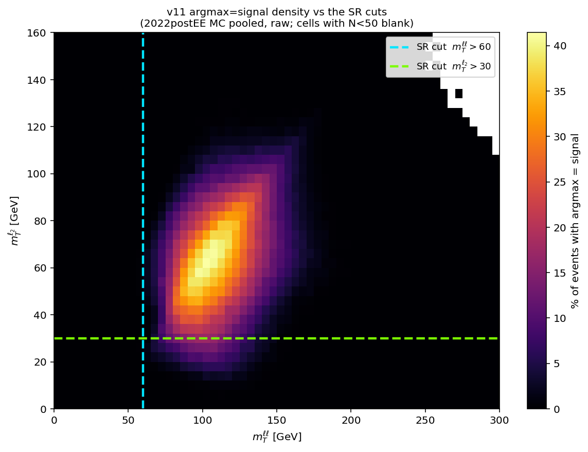
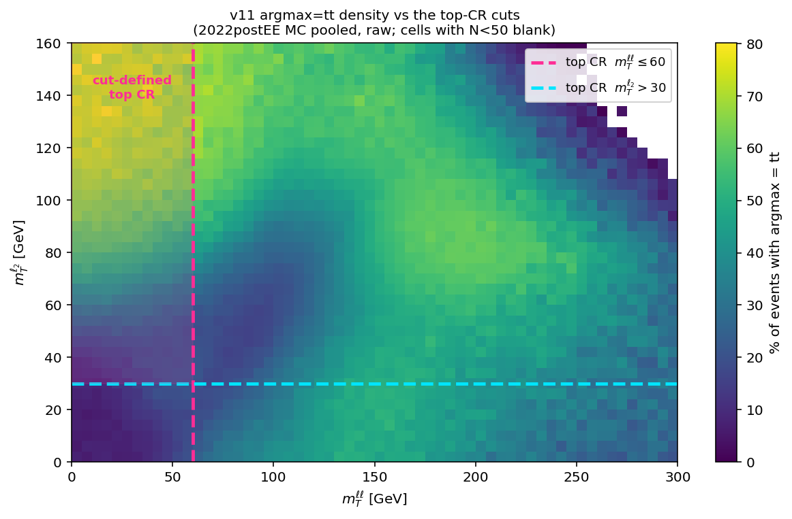
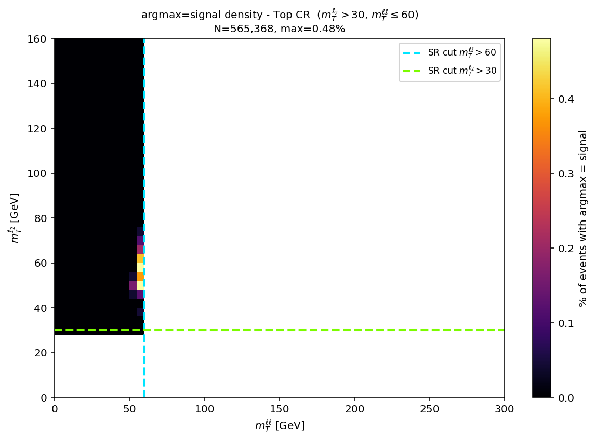

<!-- _class: lead -->

H→WW · 2022postEE · v11 6-class MVA

# Kinematic cuts buy pre-selection S/√B — they do not buy control-region purity

The MVA defines **purer** control regions *without* any kinematic cut, and already applies
those cuts internally when it picks the signal region.
The real lever on SR yield is the **charm-tag working point**.

---

## 01 · The tt̄ control region is purer when the MVA defines it

### Purity = fraction of events whose *true* process is tt̄. Pooled MC, 4,046,127 events, raw/unweighted.

| tt̄ CR definition | N | tt̄ purity | signal contam. | non-tt̄ bkg |
|---|---:|---:|---:|---:|
| **argmax = tt̄, no kinematic cuts** | **1,565,461** | **87.86%** | **0.0004%** | **12.14%** |
| mTl2>30 & mTll≤60 *(classic top CR)* | 565,368 | 78.10% | 0.0142% | 21.89% |
| mll>72 | 2,375,781 | 83.04% | 0.0009% | 16.96% |
| mll>72 & mTl2>30 & mTll>60 | 1,614,248 | 83.12% | 0.0004% | 16.88% |

**The MVA CR wins on both axes at once** — purest (87.9% vs 78.1%) *and* 2.8× larger
(1.57M vs 565k). The classic cut-based top CR is the **worst of the four**, and carries
35× the signal contamination of the MVA CR.

---

## 01b · What is actually in the MVA tt̄ CR

| true process | N | fraction |
|---|---:|---:|
| tt̄ | 1,375,464 | 87.86% |
| single top | 146,891 | 9.38% |
| Higgs bkg | 41,122 | 2.63% |
| diboson | 1,872 | 0.12% |
| V+jets | 105 | 0.01% |
| **H+c (signal)** | **7** | **0.00%** |

Single-top is the only real contaminant — and it is physically tt̄-like, which is exactly
what you want a tt̄ CR to constrain. Signal leakage is **7 events out of 1.57M**.

---

## 02 · The MVA has already internalised the SR kinematic cuts

### Fraction of events called signal across the (mll, mTll) plane — no kinematic cut applied

below the mTll wall0.0098%75 events of 662,103

above the wall11.36%1,160× higher

argmax=signal support is bounded at mTll ∈ [52.8, 202] and mll ≤ 100 —
despite `mtll` **not being an input feature**.

---

## 03 · Where the network puts tt̄ — and where the hand-made CR sits

### argmax=tt̄ density across the same plane, with the cut-defined top CR overlaid

The tt̄ class fills a **broad** region — the cut box (mTll≤60 & mTl2>30)
sits inside it but captures only **15.3%** of all argmax=tt̄ events. Purity inside the box is
42.5% vs 38.1% outside: the cut buys **+4 points of tt̄ fraction while discarding 85% of the
tt̄ the network already identifies.** That is the whole case for the MVA-defined CR on one plot.

---

## 03b · Same behaviour in the top CR — separation is learned, not cut

Across the entire cut-defined top CR the argmax=signal fraction peaks at **0.48%**;
only **66 of 565,368** events are called signal (0.0117%), max P(H+c) = 0.358 — below the
0.5 needed to ever win argmax.

**The cut is redundant with the classifier.** The network independently recovers the same
region because both follow the same physics — not because it was trained on the cut.
`hww_MVA.yaml` has no mT/mll cut in its base selection; labels are process truth.

---

## 04 · Cutting shrinks the training set the MVA needs

### Efficiency of each kinematic cut, on top of the ≥1 c-jet requirement

| cut | εS | εB | S/√B | gain |
|---|---:|---:|---:|---:|
| mTll > 60 | 0.926 | 0.790 | 0.00091 | 1.04× |
| mTl2 > 30 | 0.890 | 0.827 | 0.00086 | 0.98× |
| mll ≤ 72 | 0.978 | 0.397 | 0.00136 | 1.55× |
| **all three (the SR)** | **0.845** | **0.271** | **0.00143** | **1.63×** |

**The cost, made concrete.** Putting `mll≤72` into the base selection empties the
high-mll CR *by construction* — a region holding **2.38M events at 83.0% tt̄ purity**.
You trade a well-populated constraint region for a 1.63× pre-selection number the MVA does not need.

---

## 05 · The real lever: the charm tag, not the kinematics

c-jet eff — H+c signal23.1%medium WP discards 77% of signal

c-jet eff — ggH15.9%the shape-degenerate competitor

enrichment H+c / ggH1.46×ggH:H+c 681:1 → 467:1

### Loose vs medium, measured offline on the untagged tree (5,619 H+c events, `hww_2dcat_nocjet`)

| c-tag option | signal N | eff of ≥1-jet base | vs medium |
|---|---:|---:|---:|
| medium (CvL>0.160, CvB>0.304) | 3,244 | 57.7% | 1.00× |
| **loose (CvL>0.054, CvB>0.182)** | **5,337** | **95.0%** | **1.65×** |
| no tag at all | 5,619 | 100.0% | 1.73× |

**Loosening the WP recovers 1.65× the signal — most of what dropping the tag entirely would give
(1.73×), while still rejecting light-flavour.** Compare the kinematic cuts, worth 1.63× on S/√B but
paid for with the control regions.

---

## 05b · The missing half: what the looser WP admits — and the answer is *no*

### `hww_ctag_compare`, 2022preEE, full MC — four categories over **one** untagged jet collection, weighted yields

| process | base (no tag) | medium WP | loose WP | kin, no tag |
|---|---:|---:|---:|---:|
| **H+c (signal)** | 1.79× | **1.00×** | **1.70×** | 1.56× |
| **ggH (degenerate)** | 2.92× | **1.00×** | **2.67×** | 2.16× |
| tt | 1.87× | 1.00× | 1.55× | 0.56× |
| V+jets | 2.39× | 1.00× | 2.23× | 0.34× |

signal gain, medium→loose1.70×what slide 05 measured

ggH gain, medium→loose2.67×the half that was missing

H+c/ggH enrichment retained0.64×loosening destroys 36% of it

**ggH grows 1.57× faster than signal.** The charm tag exists to buy H+c-over-ggH
enrichment, and loosening the WP gives back **36%** of it. Dropping the tag entirely is
worse (0.62×). The acceptance gain on slide 05 is real but it is **not free** — this is the
measurement that decides it, and it says **keep the medium WP.**

---

## 06 · What this argument does not yet prove

- ~~**Loosening the WP admits more ggH too.**~~ **Now measured — see slide 05b.** ggH rises
  2.67× against signal's 1.70×, so the enrichment falls to 0.64×. CvL carries the
  H+c-vs-ggH separation (AUC 0.731), CvB does not (0.551 ≈ coin flip); a looser WP moves
  down the CvL axis and admits the degenerate background faster than the signal.
- **Purity is measured here; sensitivity is not.** These are event counts, not a limit. The
  limit also depends on how systematics act on a larger background.
- **Selection and SF boundaries do not coincide.** The 2D SF scheme bins on
  `x=CvL/(CvL+CvB(1−CvL))` and `y=1−CvB`; a rectangular WP cut is a different shape in
  that plane. Already true in production, but worth stating.

**Slides 01–05 are 2022postEE** (`hww_combine_fixed` MVA tree, raw counts); **slide 05b is
2022preEE** (`hww_ctag_compare`, weighted yields, full MC). The two agree on the signal
ratio to within a few percent across different eras, weighting, and code paths — the
raw-postEE loose/medium of 1.65× against the weighted-preEE 1.70×.

The **H+c and ggH samples are 100% complete** (7/7 and 4/4 partitions), so the
signal, ggH, and enrichment figures on slide 05b are final — they were unchanged between
the 174/191 and 186/191 snapshots. The tt and V+jets rows are drawn from 186/191 jobs.

---

<!-- _class: lead -->

## Summary

1. **MVA-defined CRs are purer than cut-defined ones** — 87.9% vs 78.1% on tt̄, and 2.8× the events.
2. **The MVA already applies the SR kinematic cuts internally** — 0.0098% vs 11.36% argmax=signal
   across the mTll wall, with `mtll` not even an input.
3. **Cutting deletes the sidebands the network learns from**, and empties the CRs you need to fit.
4. **Neither acceptance lever is free.** Medium → loose recovers **1.70×** the signal —
   comparable to the 1.63× the kinematic cuts buy — but admits ggH at **2.67×**, giving back
   36% of the H+c/ggH enrichment. **Keep the medium WP.** The kinematic cuts buy 1.63× on
   S/√B but empty the CRs. The MVA-defined regions remain the one change that costs nothing.

<footer>Slides 01–05: 2022postEE, v11 6-class MVA [hplusc, higgsbkg, tt, st, diboson, vjets], pooled MC 4,046,127 events, raw · Slide 05b: 2022preEE hww_ctag_compare, weighted yields, full MC · purity = true-process fraction</footer>
