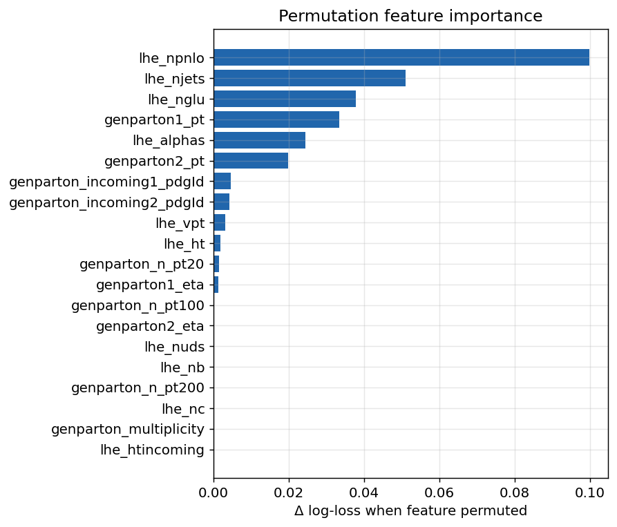
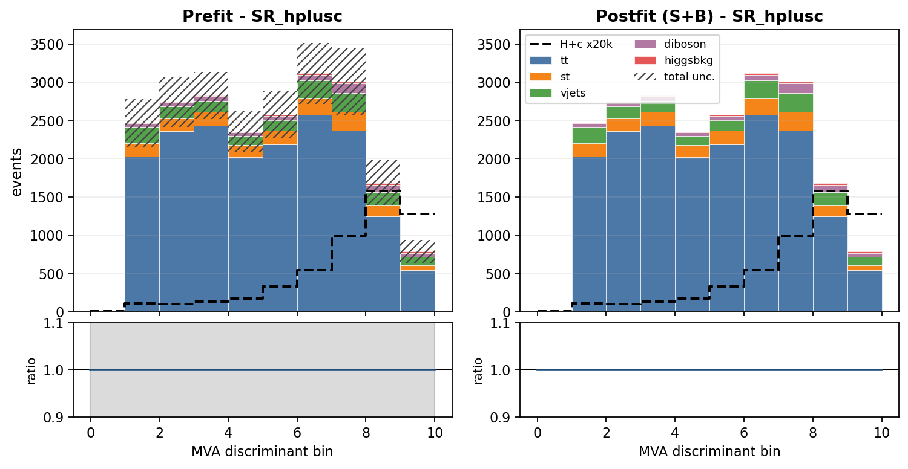
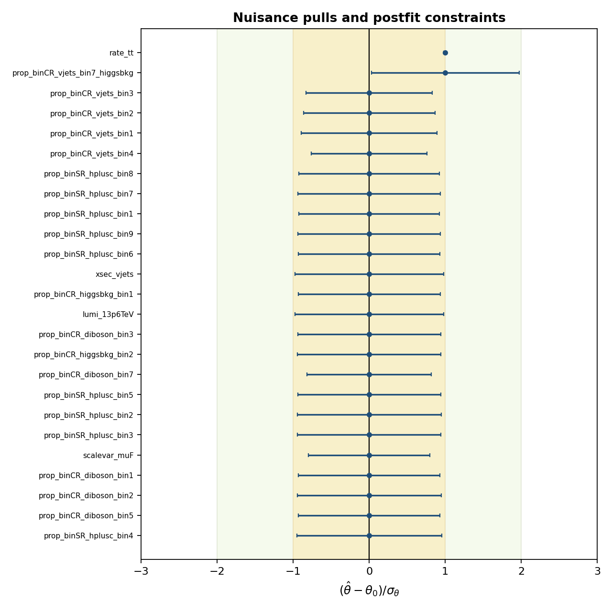
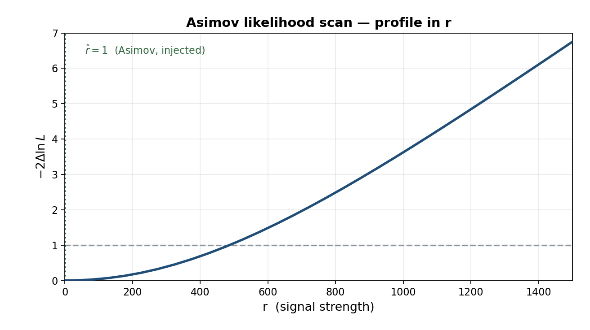
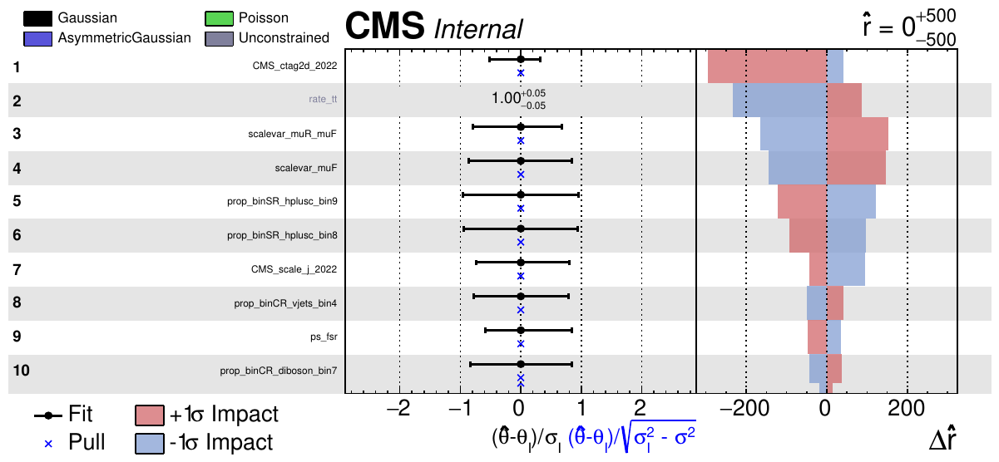

<!-- _class: lead -->

# H → WW + charm

### Analysis status

Chirayu Gupta · VUB · August 2026

<br>

**2022postEE · 26.7 fb⁻¹ · expected UL 1034**

---

# Sections

| § | topic |
|---|---|
| 1 | Analysis and selection |
| 2 | MVA-defined regions |
| 3 | c-tagging — 2D working points and scale factors |
| 4 | Negative-weight reweighting |
| 5 | W+jets jet-binned samples |
| 6 | Systematics and impacts |
| 7 | Status and outlook |

Dedicated decks: `ctag-sf-deck.pdf` (34 slides) · `negrw-deck.pdf` (57 slides)

---

<!-- _class: sec -->

# 1 · Analysis and selection

---

# Why H+c

The Higgs coupling to **charm** is the least constrained of the accessible Yukawas.
Associated production **H + c** probes it directly, without relying on the
H→cc̄ decay.

| | |
|---|---|
| **production** | pp → H + c (+X) |
| decay | H → WW* → 2ℓ2ν |
| final state | **opposite-sign eμ** + MET + ≥1 c-tagged jet |
| dataset | 2022postEE, **26.7 fb⁻¹**, ReReco `22Sep2023` |

<div class="key">

The eμ requirement removes Z→ee/μμ by construction, so the irreducible background
is **real tt̄** rather than Drell-Yan.

</div>

Reference: **AN-23-102**, the full Run 2 analysis at 138 fb⁻¹.

---

# Signal and final state

**H → WW → 2ℓ2ν, produced with a charm quark.**

Final state: **opposite-sign eμ** + MET + **≥1 c-tagged jet**

| object | selection |
|---|---|
| muons | tight ID + tight PF iso, p<sub>T</sub> > 10, \|η\| < 2.4 |
| electrons | wp80iso, p<sub>T</sub> > 10, \|η\| < 2.5, ΔR(e,µ) > 0.4 |
| ll pair | OS, p<sub>T</sub> > 20 / 10, pair p<sub>T</sub> > 30, m<sub>ll</sub> > 12 |
| jets | p<sub>T</sub> > 30, \|η\| < 2.4, tight-lepveto ID, ΔR(j,ℓ) > 0.4 |
| c-jets | p<sub>T</sub> > 20, **PNet medium** CvL/CvB |
| MET | PuppiMET |

<div class="key">

eµ removes the Z→ee/µµ peak **by construction** — the irreducible background is
**real tt̄**, not Drell-Yan. Triggers: MuonEG, SingleMu, SingleEle.

</div>

---

# Signal region composition

| process | SR yield | share of SR |
|---|---|---|
| tt̄ | 17,744 | 82.3% |
| st | 1,543 | 7.2% |
| vjets | 1,523 | 7.1% |
| diboson | 609 | 2.8% |
| higgsbkg | 132 | 0.6% |
| **H+c signal** | **0.26** | **0.001%** |
| **total** | **21,552** | |

<div class="warn">

The signal is **0.26 events** against ~21,600 background — which is why MC
statistics, rather than data statistics, drives the sensitivity.

</div>

---

<!-- _class: sec -->

# 2 · MVA-defined regions

---

# Six classes, one network

| setting | value |
|---|---|
| model | `SimpleMLP_MultiClass` (b-hive) |
| classes | `hplusc, higgsbkg, tt, st, diboson, vjets` |
| features | **26**, including the **11 c-tag one-hot categories** |
| training | 30 epochs, batch 1024, lr 1e-3, loss weighting on |
| split | 80/20, deterministic by NanoAOD `event` id |

<div class="key">

The 11 one-hot categories mean the network sees the **full 2D CvL/CvB plane** —
the same information the scale factors are binned in, not a binary pass/fail.

</div>

---

# argmax defines the regions

**The winning class picks the channel; the winning score is the discriminant.**

| region | events | dominant process |
|---|---|---|
| SR_hplusc | 21,552 | **tt 82.3%** |
| CR_higgsbkg | 9,220 | tt 86.4% |
| CR_tt | 44,199 | **tt 94.1%** |
| CR_st | 20,135 | tt 87.6% |
| CR_diboson | 6,585 | tt 72.4% |
| CR_vjets | 9,214 | **vjets 43.2%** |

Regions are **orthogonal by construction** — no cut optimisation to tune or defend,
and every event is used somewhere.

---

# Four of five CRs are tt-dominated — by design

The SR is itself **82% tt**: in an eμ final state tt̄ is dominant everywhere, so a
tt-rich CR is expected, not a failure.

<div class="key">

**CR_tt: 94.1% purity over 44k events.** It pins the free-floating `rate_tt`, which
covers 82% of the SR — the single most valuable constraint in the fit.

</div>

**CR_vjets holds 59.6% of all V+jets** in the fit. Without it there is no V+jets
constraint from anywhere.

<div class="warn">

Collapsing the CRs to single bins was **measured**: +33 units for three CRs, ~+50
for all five. The shapes carry real constraint, so all six channels keep 10 bins.

</div>

---

# Templates entering the fit


6 channels × 6 processes × 10 bins. **CR_vjets** (bottom right) is the only region
where V+jets (orange) is visible — it carries 59.6% of all V+jets in the fit.

---

<!-- _class: sec -->

# 3 · c-tagging
## 2D working points and scale factors

---

# From working points to a plane

PNet gives **two** discriminants per jet: **CvL** (charm vs light) and **CvB**
(charm vs bottom). A single working-point cut throws most of that away.

The calibration instead partitions the **whole plane** into **11 categories**
`L0, C0–C4, B0–B4` — including the untagged `L0` bin.

| property | value |
|---|---|
| axes | CvL, CvB — **verified sufficient**, no third variable needed |
| categories | 11: `L0`, `C0`–`C4`, `B0`–`B4` |
| index | computed from CvL/CvB **already stored per jet** |
| applied | natively in the processor (`CTag2DCorrector`) |

<div class="key">

Because the scheme spans the **full plane including `L0`**, the SF machinery works
even for a selection with no working point at all.

</div>

---

# Only 7 of 11 categories are populated

Occupancy of the five largest (`C4` and `B0` are populated but sparse):

| category | jets | c (%) | b (%) | light (%) |
|---|---|---|---|---|
| `L0` | 130,694 | 13.5 | 4.7 | **81.8** |
| `C0` | 188,702 | 28.2 | 6.2 | 65.7 |
| `C1` | 170,043 | 58.0 | 7.9 | 34.1 |
| `C2` | 17,823 | 58.6 | 33.4 | 8.0 |
| `C3` | 1,082 | 30.6 | **57.9** | 11.5 |

The scheme targets a broader phase space than ours — the b-rich `B1`–`B4`
categories are empty after the eμ + c-jet selection.

<div class="key">

Category index is computed from CvL/CvB already stored per jet — **no NanoAOD
reprocessing was ever needed**.

</div>

---

# The scale factor matrix


---

# The uncertainty band is the nuisance


---

# What the calibration costs

| configuration | limit |
|---|---|
| no SF | 1150 |
| **+ `CMS_ctag2d_2022`** | **1164** |

<div class="key">

Applying the calibration **worsens** the limit by 14 units — as it must.
A scale factor adds a nuisance. The point is correctness.

</div>

<div class="warn">

Currently **one nuisance** covering the whole plane. Decorrelation is pending.

</div>

---

<!-- _class: sec -->

# 4 · Negative-weight reweighting

*full detail: `negrw-deck.pdf` (57 slides)*

---

# The estimator is a cancellation

aMC@NLO events carry **signed** weights. The yield estimator

$$\hat{N}_B = \sum_{i \in B} w_i, \qquad w_i = \pm|w_i|$$

is a **difference of two large numbers**.

- the **expectation** is correct — the yield is unbiased
- the **variance** is not: it scales with $\sum w_i^2 = \sum |w_i|^2$, the *unsigned*
  statistics, while the mean is the much smaller signed sum
- effective statistics collapse: $N_{eff} = (\sum w)^2/\sum w^2 \ll N$

<div class="warn">

**16.4%** of our V+jets events carried a negative weight. In a sparse bin the
positives and negatives can cancel **completely** — leaving zero content with a
large finite error.

</div>

---

# V+jets was starved exactly under the signal


**(A)** the MC-stat band explodes where the signal peaks — one bin was
DY $= 0 \pm 41$ from ±79k weights cancelling · **(B)** $N_{eff}$ per bin: V+jets ≈10,
every other process 10³–10⁴ · **(C)** DY per-event weights, uniformly ±10⁵

---

# The method — an algebraic identity

Write the signed generator density as a difference of two positive densities:

$$\text{PDF}(\vec{x}) = a\,\text{PDF}_+ - b\,\text{PDF}_-, \qquad a-b=1$$

With $P_+(\vec{x}) = a\text{PDF}_+ / (a\text{PDF}_+ + b\text{PDF}_-)$:

$$\text{PDF}(\vec{x}) = \underbrace{(2P_+(\vec{x})-1)}_{g(\vec{x})}\cdot(a\text{PDF}_+ + b\text{PDF}_-)$$

The right factor is the **unsigned** density — what $\sum|w|$ samples.

<div class="key">

So $\sum|w|\,g$ and $\sum w$ estimate **the same distribution**. Yield-preserving
by construction, not an approximation.

</div>

Exact for the *true* $P_+$. We use $\hat{P}_+$ from a finite classifier — so closure
becomes an **empirical** property that must be measured.

---

# Training region — train loose, infer tight

$g(\vec{x})$ is a **generator property**; it does not know about the analysis selection.
So we train on a far larger sample than the SR.

| | region |
|---|---|
| **train** | all base cuts + veto of the eμ SR topology |
| **infer** | the tight eμ signal region |

<div class="key">

**Disjoint by construction.** An event that is not "exactly one eμ pair" can never be
an SR event — no event-id bookkeeping needed.

</div>

Rejected alternatives: inverting MET (kinematically softer → extrapolation) and
inverting the c-jet requirement (flips into the *opposite* gen corner).

---

# Inputs — 20 generator-level features

| group | variables |
|---|---|
| LHE event | `lhe_njets`, `lhe_nb`, `lhe_nc`, `lhe_nuds`, `lhe_nglu`, `lhe_npnlo` |
| LHE kinematics | `lhe_ht`, `lhe_htincoming`, `lhe_vpt`, `lhe_alphas` |
| gen partons | multiplicity, `n_pt20/100/200`, incoming PDG IDs |
| leading partons | `genparton1/2_pt`, `genparton1/2_eta` |

<div class="key">

**All generator-level.** The paper explicitly **rejects reco-level variables** —
closure is only guaranteed on quantities the generator itself sampled.

</div>

The two weight classes separate visibly in nearly every one of these features.

---

# The classifier

| setting | value |
|---|---|
| model | `HistGradientBoostingClassifier` (scikit-learn) |
| inputs | 20 generator-level (`lhe_*`, `genparton_*`) |
| training events | 9.8M |
| **ensemble AUC** | **0.829** |

<div class="key">

AUC 0.83 on an **intrinsically stochastic** target — the weight sign is not a
deterministic function of the kinematics, so a perfect classifier cannot exist
even in principle. 0.83 means the generator-level features genuinely carry the
information the NLO subtraction encodes.

</div>

---

# Classifier ROC


---

# The reweight factor and its spread


| quantity | value | reading |
|---|---|---|
| $g$ mean | **0.672** | $=2\times0.836-1$, matching the global positive fraction |
| $g$ range | $[-0.991,\,0.993]$ | inside the physical $[-1,1]$ — no pathological events |
| $\delta g$ mean / max | **0.006** / 0.467 | 20-model ensemble agreement is tight |

$\delta g$ is the ensemble spread and becomes the **`CMS_negrw_vjets`** nuisance.

---

# Is $P_+$ calibrated outside the training region?


Bin SR events by **predicted** $P_+$, plot the **observed** fraction with $w>0$.
Points land on the diagonal across the full range ($P_+ \approx 0.15 \to 0.93$) —
the classifier is calibrated where it is applied, not only where it was trained.

---

# Which features carry the information



Permutation importance: the increase in log-loss when a feature is scrambled.

---

# Closure


Training-region closure **0.994** on 9.8M events — the reweighting removes
variance and nothing else.

---

# The gain


Integrated gain **1.6×**; per-bin ratio **≈3×** in the signal-rich bins.

---

# SR closure and the renormalisation

The SR is a small, kinematically-biased corner of the training domain, so the
per-event $g$ does not average to the *local* positive fraction:

| dataset | rows | $\sum\lvert w\rvert g \,/\, \sum w$ |
|---|---|---|
| `DYto2L_2Jets_50` | 9,646 | 1.014 |
| `WtoLNu_2Jets` | 485 | 1.133 |
| **total** | 10,205 | **1.058** |

<div class="key">

**The reweighted template is renormalised to the nominal yield, per dataset**
(DY ×0.986, WtoLNu ×0.900). The yield is therefore **restored exactly**, while the
variance reduction — which comes from per-bin spread, not the integral — is untouched.

</div>

<div class="warn">

This renormalisation is **our extension, not the paper's**. `CMS_negrw_vjets`
covers the residual *method* uncertainty (the ensemble spread), which profiles
to **0.0%**.

</div>

---

<!-- _class: sec -->

# 5 · W+jets jet-binned samples

---

# Inclusive → jet-binned

AN-23-102 §2.3 rejects the inclusive NLO sample outright:
*"not used… 5 times smaller than LO and with large fraction of negative weights."*

| sample | xsec (pb) | events | files | neg-w |
|---|---|---|---|---|
| `WtoLNu-2Jets_0J` | 55,760 | 678M | 3,432 | 10.2% |
| `WtoLNu-2Jets_1J` | 9,529 | 523M | 2,669 | 25.7% |
| `WtoLNu-2Jets_2J` | 3,532 | 345M | 2,135 | 34.7% |
| **sum** | **68,821** | **1,546M** | **8,236** | |
| *old inclusive* | *67,710* | *282M* | *381* | *16.1%* |

Cross sections from **XSDB**; sum within **+1.6%** of the inclusive — normal NLO
merging spread, not a double-count. Measured negative-weight fractions match XSDB
to ~1%.

<div class="warn">

XSDB labels these `accuracy: "LO"` — **wrong**, auto-populated. `amcatnloFXFX` is
NLO, proven by the 10–35% negative weights, impossible at LO.

</div>

---

# Why the gain is not simply 5.5×

Raw events rise **5.5×**, but the useful quantity is effective statistics:

| sample | $n_{eff}/N$ | equivalent lumi |
|---|---|---|
| 0J | 0.635 | 7.7 /fb |
| 1J | 0.237 | 13.0 /fb |
| 2J | 0.094 | 9.1 /fb |
| **combined** | | **29.8 /fb** |
| *inclusive* | *0.460* | ***1.9 /fb*** |

The inclusive sample spends most of its cross section on **0-jet** events, which
almost never survive the ≥1 c-jet requirement.

<div class="key">

Of the 4,851 surviving SR events, **2J alone contributes 69%** — despite being the
smallest sample. The jet-binned samples are enriched in exactly what the selection needs.

</div>

---

# W+jets result: 1160 → 1034

| | before | after |
|---|---|---|
| **expected UL** | 1160 | **1034** |
| V+jets $n_{eff}$ (SR) | 280 | **1170** |
| V+jets stat. error | 5.98% | **2.92%** |
| V+jets rate | 1508 | 1523 |

<div class="key">

**The rate barely moved while the statistical error halved** — the signature of a
statistics gain, not a normalisation change.

</div>

---

# Was the gain really W+jets?

`tt` (+4.8%) and `st` (+3.8%) also moved between the two cards — both were
re-merged from scratch. Checked per-process:

| process | $n_{eff}$ ratio |
|---|---|
| **vjets (SR)** | **4.18×** |
| vjets (CR_st) | **9.89×** |
| vjets (CR_tt) | **5.86×** |
| tt, st, diboson, higgsbkg | 0.87 – 1.13× |

<div class="key">

**The n_eff gain is confined to V+jets.** Other processes move by ≤13% in *both*
directions — re-merge jitter, not a systematic shift. Both cards were also
re-verified independently: **1160** and **1034**.

</div>

---

<!-- _class: sec -->

# 6 · The combine card

---

# Card structure

```
imax 6      # 6 channels: SR_hplusc + 5 argmax CRs
jmax 5      # 6 processes minus one
kmax *      # nuisances counted automatically

shapes * SR_hplusc  v11_hplusc_2dcat.root \
         SR_hplusc_$PROCESS  SR_hplusc_$PROCESS_$SYSTEMATIC
   ... one line per channel
```

| | |
|---|---|
| channels | `SR_hplusc`, `CR_higgsbkg`, `CR_tt`, `CR_st`, `CR_diboson`, `CR_vjets` |
| processes | `hplusc`, `higgsbkg`, `tt`, `st`, `diboson`, `vjets` |
| binning | **10 bins per channel** — the winning MVA score |
| histograms | 1,626 in the ROOT file (nominal + all up/down) |
| observation | `-1` in every channel — **Asimov, blind** |

---

# The two special entries

**A free-floating tt normalisation:**

```
rate_tt  rateParam  *  tt  1.0  [0,5]
```

One parameter, **shared across all six channels**, so CR_tt (94% pure, 44k events)
determines the tt normalisation in the SR. This is why tt̄ carries no `xsec` lnN —
its rate comes from data, following AN-23-102.

**Bin-by-bin MC statistics:**

```
SR_hplusc    autoMCStats 10
CR_higgsbkg  autoMCStats 10
   ... one line per channel
```

Barlow–Beeston-lite. Threshold 10 means bins with $n_{eff} > 10$ get a single
Gaussian nuisance; sparser bins get individual Poisson terms.

---

# How a template becomes a card entry

```
parquet  →  read_scale = lumi × xsec / sumw  →  TH1 per (channel, process)
                                             →  + one TH1 per systematic ↑↓
```

<div class="key">

**Normalisation is a two-place mechanism.** The per-event `genWeight` enters
post-selection through the weights container; the denominator `sumw` is summed
**pre-selection** and written to `sumw_records` — including chunks that select
zero events. Reading it from parquet metadata instead undercounts.

</div>

Object shifts (JES/JER, lepton scale/res) cannot be weights — they change the MVA
score, so each is a **separate parquet tree**, re-selected and re-scored, giving
12 shifted directories.

---

<!-- _class: sec -->

# 6 · Systematics

---

# The full inventory

**22 shape · 9 lnN · `rate_tt` free rateParam · autoMCStats (threshold 10)**

| shape (weight) | shape (object shift) |
|---|---|
| `pileup` | `CMS_scale_j_2022` (JES) |
| `ps_isr`, `ps_fsr` | `CMS_res_j_2022` (JER) |
| `scalevar_muR`, `_muF`, `_muR_muF` | `CMS_scale_e_2022`, `CMS_res_e_2022` |
| `lhe_pdf`, `lhe_alphaS` | `CMS_scale_m_2022`, `CMS_res_m_2022` |
| `muon_id`, `muon_iso` | |
| `electron_id`, `electron_reco` ×3 | **lnN** |
| `CMS_ctag2d_2022` | `lumi_13p6TeV`, `xsec_st/diboson/vjets/higgsbkg` |
| `CMS_negrw_vjets` | `BR_HtoWW`, `BR_Htautau`, `xsec_hplusc_4FS_5FS` |
| `flavor_composition_ggH` (placeholder) |


---

# Object shifts need full reprocessing

JES/JER and lepton scale/resolution **change the MVA score**, so they cannot be
applied as an event weight.

Each is a **separate parquet tree**, re-run through the full selection *and*
re-scored by the network — 12 shifted directories.

<div class="key">

Inference coverage over every shift directory is **verified after each rebuild** —
a partially-scored set would leave object-shift templates frozen at nominal.

</div>

---

# Top-p<sub>T</sub> reweighting

Implemented following `hh2bbww` (the framework behind AN-24-091), using the
**theory-based (NNLO/NLO)** parameterisation with the Run 3 rescaling:

| property | value |
|---|---|
| form | theory-based NNLO/NLO |
| Run 3 factor | × (0.991 + 7.5e-5·p<sub>T</sub>) |
| nominal | reweighted |
| p<sub>T</sub> cap | none — well-behaved at high p<sub>T</sub> |

```python
sf_run2 = 0.103*exp(-0.0118*pT) - 0.000134*pT + 0.973
sf      = (0.991 + 0.000075*pT) * sf_run2
weight  = sqrt(prod(sf))       # over the two gen tops
down    = 1.0                  # "no correction" is the variation
```

The variation is **down = 1.0** ("no correction"), symmetric about the nominal.

---

# Higgs heavy-flavour

ggH is only **13.1%** of the merged `higgsbkg` group (VBF 29.0%, ggZH 23.3%,
ZH 21.0%, WH 9.1%), so a flat lnN on the group either over-penalises the other 87%
or must be diluted to an average — and cannot produce a shape effect.

**Implemented as a per-event weight instead**, keyed on gen-jet flavour.

<div class="warn">

**Why our Bkg-Higgs impact stays small even once activated.** Freezing it moves the
limit by <1 unit, against **7.6%** in AN-23-102. Two causes: the per-event weight is
**not yet active**, *and* `higgsbkg` is only **0.6% of our SR** — ours is
tt-dominated, theirs is Higgs-background-dominated. It will rise, but **not to 7.6%**.

</div>

**Replaced with a per-event weight**, ported from HiggsDNA `Higgs_plus_HF_syst`:

```python
num_HF_jets = ak.sum(genJets.hadronFlavour == 4, axis=-1)   # pT>25, |eta|<2.5
up   = where(num_HF_jets > 0, 1.5, 1.0)     # AN-23-102: 50% on ggH
down = where(num_HF_jets > 0, 0.5, 1.0)
```

<div class="key">

Keys on **gen-jet flavour**, so process grouping stops mattering — and it produces
the shape a flat lnN structurally cannot.

</div>

---

# MET unclustered energy

<div class="warn">

**Implemented, not yet in the card** — it needs the shifted trees from a
reprocessing pass, so it does not appear in the 22 shape nuisances above.

</div>

For Run 3 PuppiMET the shift is taken directly from the NanoAOD branches:

```python
events.PuppiMET.ptUnclusteredUp / ptUnclusteredDown
events.PuppiMET.phiUnclusteredUp / phiUnclusteredDown
```

Matches HiggsDNA `MET_syst_Unclustered` — same branches, same up/down ordering.

---

# What is implemented

| systematic | implementation |
|---|---|
| `CMS_negrw_vjets` | ensemble spread of the negative-weight reweighting |
| `CMS_ctag2d_2022` | 2D CvL/CvB SF, applied natively in the processor |
| `electron_reco` ×3 | p<sub>T</sub>-binned (<20, 20–75, >75 GeV) |
| `lhe_pdf`, `lhe_alphaS` | NNPDF replicas, MC2Hessian |
| `top_pt` | hh2bbww theory form — *pending activation* |
| `higgs_plus_c` | per-event HF weight — *pending activation* |
| MET unclustered | object shift — *pending activation* |

<div class="warn">

The last three are implemented and verified but **not in the current card** — each
needs its weight column or shifted tree from a reprocessing pass.

</div>

---

# Deliberately excluded

| item | decision |
|---|---|
| **muon reco SF** | **not applicable** — HiggsDNA exposes no reco key; hh2bbww registers `mu_id_sf`/`mu_iso_sf` and no `mu_reco_sf`. Two frameworks, same conclusion. |
| **PU jet ID** | absent from both frameworks for Run 3 |
| **UE / tune** | requires **dedicated tune samples** — cannot be a weight |
| `hdamp`, `mtop` | sample-based tt modelling — **under consideration**, see next slide |

---

# tt modelling: `hdamp` and `mtop`

Two standard Run 3 tt̄ modelling uncertainties, both **not currently in the card**:

| term | what it is |
|---|---|
| **`hdamp`** | The Powheg damping parameter controlling the matching between the NLO matrix element and the parton shower. It sets how much hard radiation comes from the ME rather than the shower, so varying it changes the **jet multiplicity and jet p<sub>T</sub> spectrum** of tt̄. |
| **`mtop`** | The top-quark mass used in generation. Varying it (typically ±1 GeV) shifts the tt̄ **kinematics and acceptance**. |

Neither can be applied as an event weight — both require **dedicated alternative
samples** generated with the varied parameter.

<div class="warn">

**Undecided whether to add these.** They are standard in Run 3 tt̄ analyses, but
absent from AN-23-102 Table 16, and tt̄ normalisation here is already taken from
data via the free `rate_tt`. Adding them means generating and processing new samples.

</div>

---

# What moves the limit

Each nuisance frozen in turn; **Δ is the improvement in the expected limit.**

| frozen | limit | Δ | % of 1034 |
|---|---|---|---|
| **all constrained** (stat-only) | **641** | **393** | **38.0%** |
| theory shapes (scale + PS + α<sub>S</sub>) | 883 | 151 | 14.6% |
| `xsec_hplusc_4FS_5FS` | 921 | 113 | 10.9% |
| `scalevar_muF` | 944 | 90 | 8.7% |
| autoMCStats (all) | 956 | 78 | 7.5% |
| `CMS_ctag2d_2022` | 964 | 70 | 6.8% |
| `rate_tt` | 1011 | 23 | 2.2% |
| JES | 1023 | 11 | 1.1% |

<div class="key">

**autoMCStats is no longer the leading term.** It was dominant before the W+jets
change; at 7.5% the analysis is no longer MC-stat-limited in the way it was.
Signal theory now leads.

</div>

<div class="warn">

**Rows overlap and do not add.** `scalevar_muF` sits inside the theory group;
freezing one nuisance also lets the others re-profile. Read this as a **ranking**,
not a decomposition.

</div>

---

# Template composition — signal region



Backgrounds stacked, H+c overlaid (×20k). Hatched band = **prefit** total
uncertainty, ≈14% per bin. Postfit errors are absent because combine writes a
**zero postfit covariance** on an Asimov fit.

---

# Nuisance pulls and constraints



<div class="key">

All nuisances sit at **zero pull with ~unit width** — correct for an Asimov fit, and
the check that nothing is being pulled or over-constrained. **`rate_tt` is the
exception**: pinned at 1.00 ± 0.05 by the 94%-pure CR_tt.

</div>

---

# Likelihood scan



---

# What the likelihood scan shows

The profile likelihood in the signal strength — all nuisances minimised at each
point in r.

| feature | value | meaning |
|---|---|---|
| minimum | **r̂ = 1** | the fit recovers the injected Asimov signal — no bias |
| $-2\Delta\ln L = 1$ | **r ≈ 525** | the 1σ interval on r |
| $-2\Delta\ln L = 3.84$ | **r ≈ 1075** | the 2σ crossing |
| curvature | — | how fast the likelihood falls away = the sensitivity |

<div class="key">

The 3.84 crossing (**1075**) sits close to the quoted CLs limit (**1034**) — the two
constructions agree when the background-only and signal+background hypotheses are
well separated, which is the regime here.

</div>

---

# Nuisance impacts — top 10



<div class="warn">

The header `r̂ = 0 +500/−500` is a **plotImpacts rounding artefact** — the actual fit
returns **r̂ = 0.99996, −513/+483**, i.e. exactly the injected Asimov value.

</div>

---

# Reading the impacts — the asymmetries

**Left panel** — the pull $(\hat\theta-\theta_0)/\sigma_\theta$. All pulls sit at zero:
this is an **Asimov** fit, so by construction nothing is pulled. A non-zero pull here
would mean the fit is being dragged, and would need explaining.

**Right panel** — $\Delta\hat r$ when each nuisance is moved by $\pm1\sigma$.

<div class="key">

**Red (+1σ) and blue (−1σ) are not mirror images.** Three sources of asymmetry:

</div>

| source | why |
|---|---|
| **asymmetric lnN** | `xsec_st` is `0.9873/1.0167` — the up and down variations differ by construction |
| **template shape** | up/down shifts of JES or ctag move events between bins non-linearly |
| **re-profiling** | pushing one nuisance lets the others re-fit, and they respond differently in each direction |

<div class="warn">

The **fit range matters**. An earlier run with `--rMin 0` clipped every −1σ impact
at the boundary and produced a one-sided plot. A symmetric range around $\hat r$ is
required for the impacts to be meaningful.

</div>

---

<!-- _class: sec -->

# 7 · Status and outlook

---

# The road so far


Note the suppressed zero on the y-axis — the c-tag step is a genuine but small
**+14** increase, not the spike it appears to be.

---

# Where we stand

| | limit |
|---|---|
| AN-23-102 scaled to 26.7 fb⁻¹ | **1144** |
| **this analysis** | **1034** |
| our statistical only | **641** |

<div class="key">

**Better than** the published analysis scaled to our luminosity — 1034 vs 1144,
a **9.6% improvement**, on **5× less data**.

</div>

<div class="warn">

**The scaling is indicative, not rigorous.** $503\times\sqrt{138/26.7}=1144$ assumes a
purely statistics-limited extrapolation. AN-23-102's Table 17 puts its statistical term
at 73.8%, so it is *not* fully statistics-limited — the true scaled value would be
somewhat **worse** than 1144, making our margin **larger** than 9.6%, not smaller.

</div>

<div class="warn">

The systematic breakdown of the 1034 is **under investigation** — the full
term-by-term comparison against AN-23-102 Table 17 is not yet settled.

</div>

---

# What is still missing

<div class="warn">

**No data/MC agreement plots yet** — the analysis is blind and the comparison
plots are still being produced.

</div>

| item | status |
|---|---|
| **4FS/5FS signal theory** | placeholder 1.30 — needs re-derivation at 13.6 TeV |
| **Trigger scale factors** | implemented, **not yet enabled** |
| **Higgs heavy-flavour** (`higgs_plus_c`) | implemented, pending activation |
| **top-p<sub>T</sub> reweighting** | implemented, pending activation |
| Dataset substitutions | W+jets p<sub>T</sub>-binned (full AN stitch) |
| | DY → Z→ττ filtered |
| | tt / single-top `-ext` samples |
| | `WZto3LNu` |

---

# Priorities

| # | item | why |
|---|---|---|
| **1** | Re-derive `xsec_hplusc_4FS_5FS` | 30% flat lnN on a statistics-starved signal |
| **2** | Enable trigger SFs | implemented, one flag |
| **3** | Activate `higgs_plus_c` + `top_pt` | proper HF and tt treatment |
| **4** | Add the missing datasets | more MC statistics |
| 5 | Decorrelate `CMS_ctag2d_2022` | currently one nuisance over the whole plane |

---

<!-- _class: lead -->

# Summary

**Expected UL 1371 → 1034** · statistical-only **641**

V+jets $n_{eff}$ **280 → 1170**

### Within ~5% of the Run 2 analysis scaled to our luminosity

Remaining: 4FS/5FS re-derivation, trigger SFs, dataset substitutions
