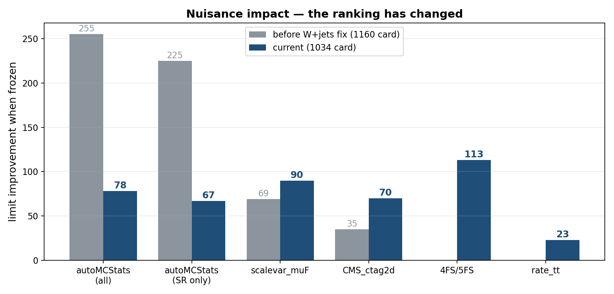
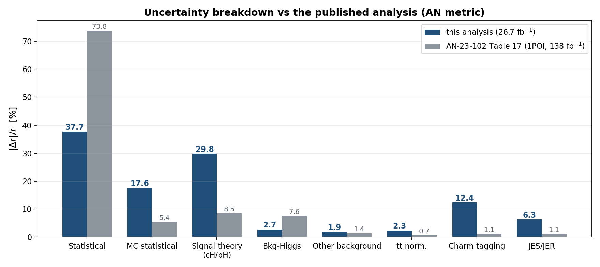

<!-- _class: lead -->

# H → WW + charm

### Analysis status

Chirayu Gupta · VUB · August 2026

 

**2022postEE · 26.7 fb⁻¹ · expected UL 1034**

---

# Sections

| § | topic |
|---|---|
| 1 | Analysis and selection |
| 2 | MVA-defined regions |
| 3 | c-tagging — 2D working points and scale factors |
| 4 | Negative-weight reweighting |
| 5 | W+jets jet-binned samples |
| 6 | Systematics and impacts |
| 7 | Status and outlook |

Dedicated decks: `ctag-sf-deck.pdf` (34 slides) · `negrw-deck.pdf` (57 slides)

---

<!-- _class: sec -->

# 1 · Analysis and selection

---

# Signal and final state

**H → WW → 2ℓ2ν, produced with a charm quark.**

Final state: **opposite-sign eμ** + MET + **≥1 c-tagged jet**

| object | selection |
|---|---|
| muons | tight ID + iso, pT > 10, \|η\| < 2.4 |
| electrons | wp80iso, pT > 10, \|η\| < 2.5 |
| ll pair | OS, pT > 20 / 10, mll > 12 |
| c-jets | pT > 20, PNet medium CvL/CvB |

eμ removes the Z peak by construction — the dominant background is **real tt̄**.

Data: ReReco `22Sep2023`, all eras.

---

<!-- _class: sec -->

# 2 · MVA-defined regions

---

# Six classes, one network

`[hplusc, higgsbkg, tt, st, diboson, vjets]`

**argmax defines the region · the winning score is the discriminant**

| region | events | dominant |
|---|---|---|
| SR_hplusc | 20,664 | tt 82% |
| CR_tt | 44,199 | **tt 94%** |
| CR_vjets | 9,214 | **vjets 43%** |
| CR_higgsbkg / st / diboson | 6.6k–20k | tt-rich |

CR_tt at **94% purity** pins the free-floating `rate_tt`, which covers 82% of the SR.

---

# Templates in all six regions

---

# Signal region template

---

<!-- _class: sec -->

# 3 · c-tagging
## 2D working points and scale factors

---

# The 2D plane

**11 categories** `L0, C0–C4, B0–B4` spanning the whole CvL/CvB plane.

---

# The scale factor matrix

---

# The uncertainty band is the nuisance

---

# What the calibration costs

| configuration | limit |
|---|---|
| no SF | 1150 |
| **+ `CMS_ctag2d_2022`** | **1164** |

Applying the calibration **worsens** the limit by 14 units — as it must.
A scale factor adds a nuisance. The point is correctness.

Currently **one nuisance** covering the whole plane. Decorrelation is pending.

---

<!-- _class: sec -->

# 4 · Negative-weight reweighting

---

# The problem

aMC@NLO weights are **signed** — the yield is a cancellation.

---

# V+jets was starved exactly under the signal

$n_{eff} = (\sum w)^2 / \sum w^2$ — every other background sits at ≤1.1%.

---

# The method

$$w \;\to\; |w| \cdot g(x) \cdot \text{renorm}, \qquad g(x) = 2P_+(x) - 1$$

**An algebraic identity, not an approximation** — yield-preserving by construction.

- **generator-level features only** — $P_+$ is a property of the generator
- **train loose, infer tight**, disjoint by construction from the eμ SR
- same phase space, disjoint events → interpolation, never extrapolation

arXiv:2510.16217

---

# Classifier performance

Ensemble **AUC 0.829** on an intrinsically stochastic target.

---

# Closure

Training-region closure **0.994** on 9.8M events.

---

# The gain

Method uncertainty `CMS_negrw_vjets` profiles to **0.0%** — negligible.

---

<!-- _class: sec -->

# 5 · W+jets jet-binned samples

---

# Inclusive → jet-binned

AN-23-102 rejects the inclusive NLO sample: *large negative-weight fraction.*

| sample | xsec (pb) | events | neg-w |
|---|---|---|---|
| 0J | 55,760 | 678M | 10% |
| 1J | 9,529 | 523M | 26% |
| 2J | 3,532 | 345M | 35% |
| **sum** | **68,821** | **1,546M** | |
| *inclusive* | *67,710* | *282M* | *16%* |

Cross sections from XSDB · sum within **+1.6%** of the inclusive.

---

# Result

| | before | after |
|---|---|---|
| **expected UL** | 1160 | **1034** |
| V+jets $n_{eff}$ (SR) | 280 | **1170** |
| V+jets stat. error | 5.98% | **2.92%** |
| V+jets rate | 1508 | 1523 |

**The rate barely moved while the statistical error halved** — the signature of a
statistics gain, not a normalisation change.

---

# Was the gain really W+jets?

`tt` (+4.8%) and `st` (+3.8%) also moved between the two cards — both were
re-merged from scratch. Checked per-process:

| process | $n_{eff}$ ratio |
|---|---|
| **vjets (SR)** | **4.18×** |
| vjets (CR_st) | **9.89×** |
| vjets (CR_tt) | **5.86×** |
| tt, st, diboson, higgsbkg | 0.87 – 1.13× |

**The n_eff gain is confined to V+jets.** Other processes move by ≤13% in *both*
directions — re-merge jitter, not a systematic shift. Both cards were also
re-verified independently: **1160** and **1034**.

---

<!-- _class: sec -->

# 6 · Systematics and impacts

---

# What is in the card

**Shape (weight):** pileup · `ps_isr/fsr` · `scalevar_muR/muF/muR_muF` ·
`muon_id/iso` · `electron_id` · `electron_reco` (3 pT bins) ·
`CMS_ctag2d_2022` · `CMS_negrw_vjets`

**Shape (object shift):** JES · JER · electron scale/res · muon scale/res

**Rate:** lumi · `xsec_st/diboson/vjets/higgsbkg` · `BR_HtoWW` ·
`xsec_hplusc_PDF` · `xsec_hplusc_4FS_5FS` · `alphaS_PDF`

**Plus:** `rate_tt` free rateParam · autoMCStats (Barlow–Beeston)

---

# Impacts — measured on the current card

---

# The ranking has flipped

| frozen | before | **now** |
|---|---|---|
| autoMCStats (all) | −255 | **−78** |
| `xsec_hplusc_4FS_5FS` | — | **−113** |
| `scalevar_muF` | −69 | **−90** |
| `CMS_ctag2d_2022` | −35 | −70 |

**MC statistics is no longer the leading systematic.** Signal theory is.

---

# Ranked impacts (Asimov)

| nuisance | impact on r |
|---|---|
| `scalevar_muF` / `scalevar_muR_muF` | 153 |
| `prop_bin` SR bins 8–9 | 122 / 98 |
| `CMS_scale_j_2022` (JES) | 94 |
| `rate_tt` | 87 |
| `CMS_ctag2d_2022` | 43 |

---

# Breakdown vs the Run 2 analysis

Both on the AN's metric: $|\Delta r|/r = \sqrt{\sigma_{full}^2-\sigma_{frozen}^2}/r$

---

# The comparison, term by term

| group | **ours** | AN 1POI | ratio |
|---|---|---|---|
| Statistical | 37.7% | 73.8% | 0.5× |
| **Signal theory (cH/bH)** | **29.8%** | 8.5% | **3.5×** |
| **MC statistical** | **17.6%** | 5.4% | **3.3×** |
| Charm tagging | 12.4% | 1.1% | 11× |
| JES/JER | 6.3% | 1.1% | 5.7× |
| tt normalization | 2.3% | 0.7% | 3.3× |
| Bkg-Higgs | 2.7% | 7.6% | **0.4×** |
| Other background | 1.9% | 1.4% | 1.4× |

MC statistical was **28.7%** before the W+jets fix — now **17.6%**.

Components are **not orthogonal** — they do not sum to 100%. The AN's own
column sums to 100.8% for the same reason.

---

# Likelihood scan

---

<!-- _class: sec -->

# 7 · Status and outlook

---

# The road so far

---

# Where we stand

| | value |
|---|---|
| AN-23-102 scaled to 26.7 fb⁻¹ | 980 |
| **this analysis** | **1034** |
| our stat-only | 676 |
| AN stat-only scaled | ~723 |

**Our statistics-only limit already beats the AN's.**
The remaining gap is entirely systematic.

---

# Next steps

| priority | item |
|---|---|
| **1** | Re-derive `xsec_hplusc_4FS_5FS` at 13.6 TeV — now the largest lever |
| **2** | Investigate `scalevar_muF` |
| 3 | Add missing `-ext` tt/st samples |
| 4 | DY → Z→ττ filtered samples |
| 5 | Decorrelate `CMS_ctag2d_2022` |
| 6 | Enable trigger SFs |

Missing systematics: **trigger SFs** (implemented, not enabled) and a
**re-derived 4FS/5FS** term.

---

<!-- _class: lead -->

# Summary

**Expected UL 1371 → 1034**

V+jets $n_{eff}$ **280 → 1170**

### The remaining gap is systematic, not statistical

Signal theory is now the leading term, not MC statistics
