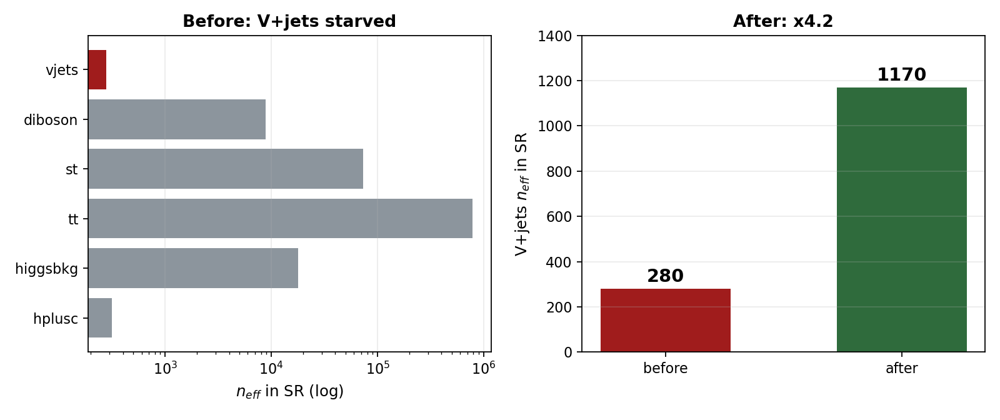
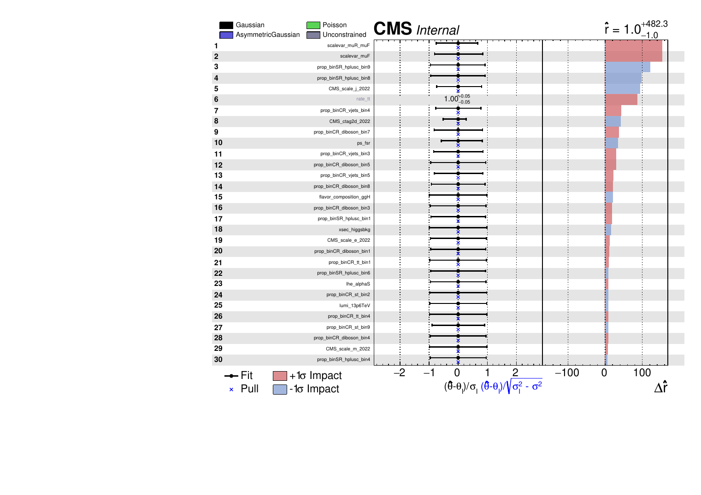

<!-- _class: lead -->

# H → WW + charm

### Analysis status

Chirayu Gupta · VUB · August 2026

<br>

**2022postEE · 26.7 fb⁻¹ · expected UL 1034**

---

# Sections

| § | topic |
|---|---|
| 1 | Analysis and selection |
| 2 | MVA-defined regions |
| 3 | c-tagging — 2D working points and scale factors |
| 4 | Negative-weight reweighting |
| 5 | W+jets jet-binned samples |
| 6 | Systematics and impacts |
| 7 | Status and outlook |

Dedicated decks: `ctag-sf-deck.pdf` (34 slides) · `negrw-deck.pdf` (57 slides)

---

<!-- _class: sec -->

# 1 · Analysis and selection

---

# Signal and final state

**H → WW → 2ℓ2ν, produced with a charm quark.**

Final state: **opposite-sign eμ** + MET + **≥1 c-tagged jet**

| object | selection |
|---|---|
| muons | tight ID + iso, p<sub>T</sub> > 10, \|η\| < 2.4 |
| electrons | wp80iso, p<sub>T</sub> > 10, \|η\| < 2.5 |
| ll pair | OS, p<sub>T</sub> > 20 / 10, m<sub>ll</sub> > 12 |
| c-jets | p<sub>T</sub> > 20, PNet medium CvL/CvB |

<div class="key">

eμ removes the Z peak by construction — the dominant background is **real tt̄**.

</div>

Data: ReReco `22Sep2023`, all eras.

---

<!-- _class: sec -->

# 2 · MVA-defined regions

---

# Six classes, one network

`[hplusc, higgsbkg, tt, st, diboson, vjets]`

**argmax defines the region · the winning score is the discriminant**

| region | events | dominant |
|---|---|---|
| SR_hplusc | 20,664 | tt 82% |
| CR_tt | 44,199 | **tt 94%** |
| CR_vjets | 9,214 | **vjets 43%** |
| CR_higgsbkg / st / diboson | 6.6k–20k | tt-rich |

<div class="key">

CR_tt at **94% purity** pins the free-floating `rate_tt`, which covers 82% of the SR.

</div>

---

# Templates in all six regions


---

<!-- _class: sec -->

# 3 · c-tagging
## 2D working points and scale factors

---

# The 2D plane


**11 categories** `L0, C0–C4, B0–B4` spanning the whole CvL/CvB plane.

---

# The scale factor matrix


---

# The uncertainty band is the nuisance


---

# What the calibration costs

| configuration | limit |
|---|---|
| no SF | 1150 |
| **+ `CMS_ctag2d_2022`** | **1164** |

<div class="key">

Applying the calibration **worsens** the limit by 14 units — as it must.
A scale factor adds a nuisance. The point is correctness.

</div>

<div class="warn">

Currently **one nuisance** covering the whole plane. Decorrelation is pending.

</div>

---

<!-- _class: sec -->

# 4 · Negative-weight reweighting

---

# The problem


aMC@NLO weights are **signed** — the yield is a cancellation.

---

# V+jets was starved exactly under the signal



$n_{eff} = (\sum w)^2 / \sum w^2$ — every other background sits at ≤1.1%.

---

# The method

$$w \;\to\; |w| \cdot g(x) \cdot \text{renorm}, \qquad g(x) = 2P_+(x) - 1$$

**An algebraic identity, not an approximation** — yield-preserving by construction.

- **generator-level features only** — $P_+$ is a property of the generator
- **train loose, infer tight**, disjoint by construction from the eμ SR
- same phase space, disjoint events → interpolation, never extrapolation

arXiv:2510.16217

---

# Classifier performance


Ensemble **AUC 0.829** on an intrinsically stochastic target.

---

# Closure


Training-region closure **0.994** on 9.8M events.

---

# The gain


<div class="key">

Method uncertainty `CMS_negrw_vjets` profiles to **0.0%** — negligible.

</div>

---

<!-- _class: sec -->

# 5 · W+jets jet-binned samples

---

# Inclusive → jet-binned

AN-23-102 rejects the inclusive NLO sample: *large negative-weight fraction.*

| sample | xsec (pb) | events | neg-w |
|---|---|---|---|
| 0J | 55,760 | 678M | 10% |
| 1J | 9,529 | 523M | 26% |
| 2J | 3,532 | 345M | 35% |
| **sum** | **68,821** | **1,546M** | |
| *inclusive* | *67,710* | *282M* | *16%* |

Cross sections from XSDB · sum within **+1.6%** of the inclusive.

---

# Result

| | before | after |
|---|---|---|
| **expected UL** | 1160 | **1034** |
| V+jets $n_{eff}$ (SR) | 280 | **1170** |
| V+jets stat. error | 5.98% | **2.92%** |
| V+jets rate | 1508 | 1523 |

<div class="key">

**The rate barely moved while the statistical error halved** — the signature of a
statistics gain, not a normalisation change.

</div>

---

# Was the gain really W+jets?

`tt` (+4.8%) and `st` (+3.8%) also moved between the two cards — both were
re-merged from scratch. Checked per-process:

| process | $n_{eff}$ ratio |
|---|---|
| **vjets (SR)** | **4.18×** |
| vjets (CR_st) | **9.89×** |
| vjets (CR_tt) | **5.86×** |
| tt, st, diboson, higgsbkg | 0.87 – 1.13× |

<div class="key">

**The n_eff gain is confined to V+jets.** Other processes move by ≤13% in *both*
directions — re-merge jitter, not a systematic shift. Both cards were also
re-verified independently: **1160** and **1034**.

</div>

---

<!-- _class: sec -->

# 6 · Systematics

---

# The full inventory

**22 shape · 9 lnN · 1 rateParam · autoMCStats**

| shape (weight) | shape (object shift) |
|---|---|
| `pileup` | `CMS_scale_j_2022` (JES) |
| `ps_isr`, `ps_fsr` | `CMS_res_j_2022` (JER) |
| `scalevar_muR`, `_muF`, `_muR_muF` | `CMS_scale_e_2022`, `CMS_res_e_2022` |
| `lhe_pdf`, `lhe_alphaS` | `CMS_scale_m_2022`, `CMS_res_m_2022` |
| `muon_id`, `muon_iso` | |
| `electron_id`, `electron_reco` ×3 | **lnN** |
| `CMS_ctag2d_2022` | `lumi_13p6TeV`, `xsec_st/diboson/vjets/higgsbkg` |
| `CMS_negrw_vjets` | `BR_HtoWW`, `BR_Htautau`, `xsec_hplusc_4FS_5FS` |

Plus **`rate_tt`** (free rateParam, tt from data) and **autoMCStats** (threshold 10).

---

# Object shifts need full reprocessing

JES/JER and lepton scale/resolution **change the MVA score**, so they cannot be
applied as an event weight.

Each is a **separate parquet tree**, re-run through the full selection *and*
re-scored by the network — 12 shifted directories.

<div class="warn">

**This is the trap that once cost 500 units.** A partial inference run scored only
19 of 57 directories and left object-shift templates frozen at nominal; the limit
read 1676 instead of 1185. Inference coverage is now verified after every rebuild.

</div>

---

# What we fixed — 1 · top-p<sub>T</sub> reweighting

Our first implementation was **wrong** and was corrected against `hh2bbww`
(the Hamburg framework behind AN-24-091).

| | what we had | what we now apply |
|---|---|---|
| form | data-based exponential | **theory-based (NNLO/NLO)** |
| Run 3 | none | **× (0.991 + 7.5e-5·p<sub>T</sub>)** |
| nominal | left at 1.0 | **reweighted** |
| p<sub>T</sub> cap | invented 500 GeV | **none** (form is well-behaved) |

```python
sf_run2 = 0.103*exp(-0.0118*pT) - 0.000134*pT + 0.973
sf      = (0.991 + 0.000075*pT) * sf_run2
weight  = sqrt(prod(sf))       # over the two gen tops
down    = 1.0                  # "no correction" is the variation
```

Our original coefficients were real — but belonged to the *other*, data-driven variant.

---

# What we fixed — 2 · Higgs heavy-flavour

The original **flat lnN on merged `higgsbkg` was mis-scoped**: ggH is only **13.1%**
of that group (VBF 29.0%, ggZH 23.3%, ZH 21.0%, WH 9.1%).

A flat lnN either over-penalises the other 87% (1.40) or must be watered down to an
average (1.066) — and **cannot produce a shape effect at all**.

**Replaced with a per-event weight**, ported from HiggsDNA `Higgs_plus_HF_syst`:

```python
num_HF_jets = ak.sum(genJets.hadronFlavour == 4, axis=-1)   # pT>25, |eta|<2.5
up   = where(num_HF_jets > 0, 1.5, 1.0)     # AN-23-102: 50% on ggH
down = where(num_HF_jets > 0, 0.5, 1.0)
```

<div class="key">

Keys on **gen-jet flavour**, so process grouping stops mattering — and it produces
the shape a flat lnN structurally cannot.

</div>

---

# What we fixed — 3 · MET unclustered energy

The `CorrectedMETFactory` path **never runs for Run 3 PuppiMET**, so the
unclustered-energy shift was silently absent.

Now taken directly from the NanoAOD branches:

```python
events.PuppiMET.ptUnclusteredUp / ptUnclusteredDown
events.PuppiMET.phiUnclusteredUp / phiUnclusteredDown
```

Independently confirmed against HiggsDNA `MET_syst_Unclustered` — same branches,
same up/down ordering.

---

# What we added

| systematic | what was done |
|---|---|
| `CMS_negrw_vjets` | **new** — ensemble spread of the negative-weight reweighting |
| `CMS_ctag2d_2022` | **new** — 2D CvL/CvB SF applied natively in the processor |
| `electron_reco` ×3 | **split** into p<sub>T</sub> bins (<20, 20–75, >75 GeV) |
| `lhe_pdf`, `lhe_alphaS` | **added** — NNPDF replicas, MC2Hessian |
| `top_pt` | **rewritten** to the hh2bbww theory form |
| `higgs_plus_c` | **new** — per-event HF weight replacing the lnN |
| MET unclustered | **new** object shift |

---

# What we checked and deliberately excluded

| item | decision |
|---|---|
| **muon reco SF** | **not applicable** — HiggsDNA exposes no reco key; hh2bbww registers `mu_id_sf`/`mu_iso_sf` and no `mu_reco_sf`. Two frameworks, same conclusion. |
| **PU jet ID** | absent from both frameworks for Run 3 |
| **UE / tune** | requires **dedicated tune samples** — cannot be a weight |
| `hdamp`, `mtop` | sample-based tt modelling; absent from AN-23-102 Table 16 too |

<div class="warn">

`hdamp` and `mtop` are standard Run 3 tt modelling terms. Both need alternative
samples. Recorded as a **documented decision**, not an oversight.

</div>

---

# The result

| | limit | fraction |
|---|---|---|
| **full** | **1034** | 100% |
| statistical only | **641** | **62%** |
| systematics | — | **38%** |

<div class="key">

**62% statistical · 38% systematic**

</div>

<div class="warn">

The 1034 number is **under investigation** — the systematic breakdown is not final
and should not be quoted term-by-term.

</div>

---

# Templates entering combine


6 channels × 6 processes × 10 bins

---

# Shape systematics in the signal region


All shape nuisances, up (solid) vs down (dashed), ratio to nominal

---

# Prefit vs postfit — signal region


Asimov fit, r = 1 injected

---

# Likelihood scan


---

# Nuisance impacts



---

<!-- _class: sec -->

# 7 · Status and outlook

---

# The road so far


---

# Where we stand

| | limit |
|---|---|
| AN-23-102 scaled to 26.7 fb⁻¹ | 980 |
| **this analysis** | **1034** |
| our statistical only | **641** |

<div class="key">

Within **~5%** of the published analysis scaled to our luminosity, on
**5× less data**.

</div>

<div class="warn">

The systematic breakdown of the 1034 is **under investigation** — the full
term-by-term comparison against AN-23-102 Table 17 is not yet settled.

</div>

---

# What is still missing

| item | status |
|---|---|
| **4FS/5FS signal theory** | placeholder 1.30 — needs re-derivation at 13.6 TeV |
| **Trigger scale factors** | implemented, **not yet enabled** |
| **Higgs heavy-flavour** (`higgs_plus_c`) | implemented, pending activation |
| **top-p<sub>T</sub> reweighting** | implemented, pending activation |
| Dataset substitutions | W+jets p<sub>T</sub>-binned (full AN stitch) |
| | DY → Z→ττ filtered |
| | tt / single-top `-ext` samples |
| | `WZto3LNu` |

<div class="key">

Everything else in AN-23-102 Table 16 is **covered and in the card**:
22 shape + 9 lnN + `rate_tt` + autoMCStats.

</div>

---

# Priorities

| # | item | why |
|---|---|---|
| **1** | Re-derive `xsec_hplusc_4FS_5FS` | 30% flat lnN on a statistics-starved signal |
| **2** | Enable trigger SFs | implemented, one flag |
| **3** | Activate `higgs_plus_c` + `top_pt` | proper HF and tt treatment |
| **4** | Add the missing datasets | more MC statistics |
| 5 | Decorrelate `CMS_ctag2d_2022` | currently one nuisance over the whole plane |

---

<!-- _class: lead -->

# Summary

**Expected UL 1371 → 1034** · statistical-only **641**

V+jets $n_{eff}$ **280 → 1170**

### Within ~5% of the Run 2 analysis scaled to our luminosity

Remaining: 4FS/5FS re-derivation, trigger SFs, dataset substitutions
