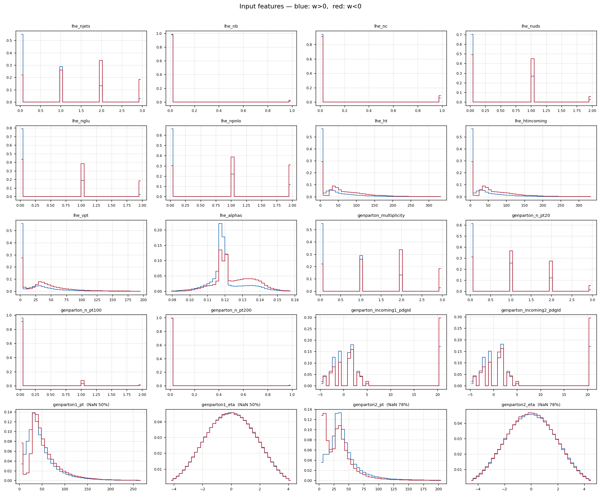
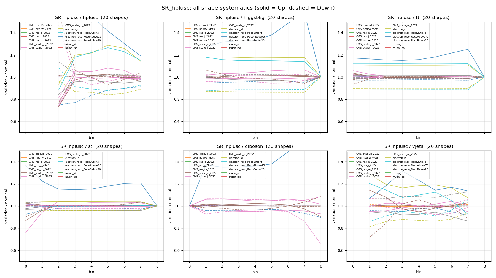
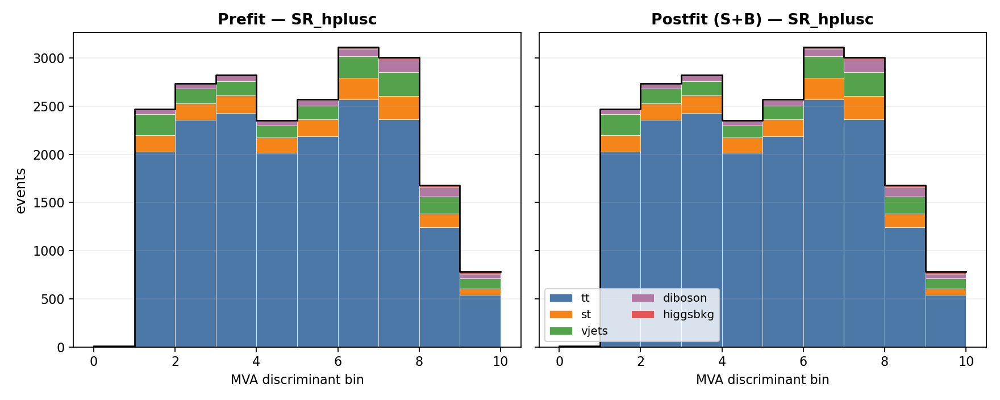
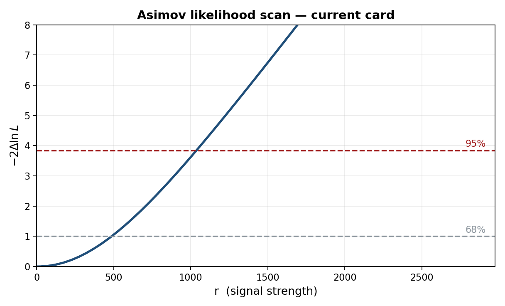
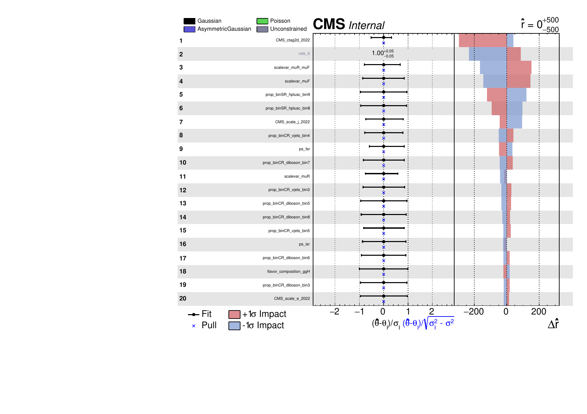
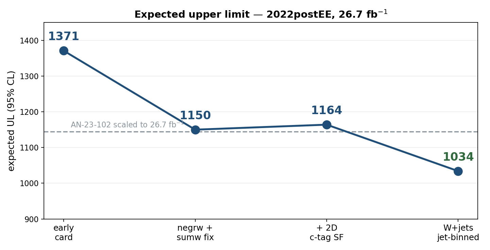

<!-- _class: lead -->

# H → WW + charm

### Analysis status

Chirayu Gupta · VUB · August 2026

<br>

**2022postEE · 26.7 fb⁻¹ · expected UL 1034**

---

# Sections

| § | topic |
|---|---|
| 1 | Analysis and selection |
| 2 | MVA-defined regions |
| 3 | c-tagging — 2D working points and scale factors |
| 4 | Negative-weight reweighting |
| 5 | W+jets jet-binned samples |
| 6 | Systematics and impacts |
| 7 | Status and outlook |

Dedicated decks: `ctag-sf-deck.pdf` (34 slides) · `negrw-deck.pdf` (57 slides)

---

<!-- _class: sec -->

# 1 · Analysis and selection

---

# Why H+c

The Higgs coupling to **charm** is the least constrained of the accessible Yukawas.
Associated production **H + c** probes it directly, without relying on the
H→cc̄ decay.

| | |
|---|---|
| production | pp → H + c (+X) |
| decay | H → WW* → 2ℓ2ν |
| final state | **opposite-sign eμ** + MET + ≥1 c-tagged jet |
| dataset | 2022postEE, **26.7 fb⁻¹**, ReReco `22Sep2023` |

<div class="key">

The eμ requirement removes Z→ee/μμ by construction, so the irreducible background
is **real tt̄** rather than Drell-Yan.

</div>

Reference: **AN-23-102**, the full Run 2 analysis at 138 fb⁻¹.

---

# Signal and final state

**H → WW → 2ℓ2ν, produced with a charm quark.**

Final state: **opposite-sign eμ** + MET + **≥1 c-tagged jet**

| object | selection |
|---|---|
| muons | tight ID + tight PF iso, p<sub>T</sub> > 10, \|η\| < 2.4 |
| electrons | wp80iso, p<sub>T</sub> > 10, \|η\| < 2.5, ΔR(e,µ) > 0.4 |
| ll pair | OS, p<sub>T</sub> > 20 / 10, pair p<sub>T</sub> > 30, m<sub>ll</sub> > 12 |
| jets | p<sub>T</sub> > 30, \|η\| < 2.4, tight-lepveto ID, ΔR(j,ℓ) > 0.4 |
| c-jets | p<sub>T</sub> > 20, **PNet medium** CvL/CvB |
| MET | PuppiMET |

<div class="key">

eµ removes the Z→ee/µµ peak **by construction** — the irreducible background is
**real tt̄**, not Drell-Yan. Triggers: MuonEG, SingleMu, SingleEle.

</div>

---

# The selection is brutal on V+jets

| process | SR yield | survival |
|---|---|---|
| tt̄ | 17,744 | dominant |
| st | 1,543 | |
| vjets | 1,523 | **1 in 542,000** |
| diboson | 609 | |
| higgsbkg | 132 | |
| **H+c signal** | **0.26** | |

<div class="warn">

The signal is **0.26 events** against ~21,600 background. Everything in this
analysis follows from that ratio — which is why MC statistics, not data
statistics, has been the limiting factor.

</div>

---

<!-- _class: sec -->

# 2 · MVA-defined regions

---

# Six classes, one network

| | |
|---|---|
| model | `SimpleMLP_MultiClass` (b-hive) |
| classes | `hplusc, higgsbkg, tt, st, diboson, vjets` |
| features | **26**, including the **11 c-tag one-hot categories** |
| training | 30 epochs, batch 1024, lr 1e-3, loss weighting on |
| split | 80/20, deterministic by NanoAOD `event` id |

<div class="key">

The 11 one-hot categories mean the network sees the **full 2D CvL/CvB plane** —
the same information the scale factors are binned in, not a binary pass/fail.

</div>

---

# argmax defines the regions

**The winning class picks the channel; the winning score is the discriminant.**

| region | events | dominant process |
|---|---|---|
| SR_hplusc | 20,664 | tt 82.0% |
| CR_higgsbkg | 9,220 | tt 86.4% |
| CR_tt | 44,199 | **tt 94.1%** |
| CR_st | 20,135 | tt 87.6% |
| CR_diboson | 6,585 | tt 72.4% |
| CR_vjets | 9,214 | **vjets 43.2%** |

Regions are **orthogonal by construction** — no cut optimisation to tune or defend,
and every event is used somewhere.

---

# Four of five CRs are tt-dominated — by design

The SR is itself **82% tt**: in an eμ final state tt̄ is dominant everywhere, so a
tt-rich CR is expected, not a failure.

<div class="key">

**CR_tt: 94.1% purity over 44k events.** It pins the free-floating `rate_tt`, which
covers 82% of the SR — the single most valuable constraint in the fit.

</div>

**CR_vjets holds 59.6% of all V+jets** in the fit. Without it there is no V+jets
constraint from anywhere.

<div class="warn">

Collapsing the CRs to single bins was **measured**: +33 units for three CRs, ~+50
for all five. The shapes carry real constraint, so all six channels keep 10 bins.

</div>

---

# Templates in all six regions


---

<!-- _class: sec -->

# 3 · c-tagging
## 2D working points and scale factors

---

# From working points to a plane

PNet gives **two** discriminants per jet: **CvL** (charm vs light) and **CvB**
(charm vs bottom). A single working-point cut throws most of that away.

The calibration instead partitions the **whole plane** into **11 categories**
`L0, C0–C4, B0–B4` — including the untagged `L0` bin.


---

# Only 7 of 11 categories are populated

| category | jets | c (%) | b (%) | light (%) |
|---|---|---|---|---|
| `L0` | 130,694 | 13.5 | 4.7 | **81.8** |
| `C0` | 188,702 | 28.2 | 6.2 | 65.7 |
| `C1` | 170,043 | 58.0 | 7.9 | 34.1 |
| `C2` | 17,823 | 58.6 | 33.4 | 8.0 |
| `C3` | 1,082 | 30.6 | **57.9** | 11.5 |

The scheme is designed for a broader phase space than ours — the b-rich `B*`
categories are essentially empty after the eμ + c-jet selection.

<div class="key">

Category index is computed from CvL/CvB already stored per jet — **no NanoAOD
reprocessing was ever needed**.

</div>

---

# The scale factor matrix


---

# The uncertainty band is the nuisance


---

# What the calibration costs

| configuration | limit |
|---|---|
| no SF | 1150 |
| **+ `CMS_ctag2d_2022`** | **1164** |

<div class="key">

Applying the calibration **worsens** the limit by 14 units — as it must.
A scale factor adds a nuisance. The point is correctness.

</div>

<div class="warn">

Currently **one nuisance** covering the whole plane. Decorrelation is pending.

</div>

---

<!-- _class: sec -->

# 4 · Negative-weight reweighting

*full detail: `negrw-deck.pdf` (57 slides)*

---

# The estimator is a cancellation

aMC@NLO events carry **signed** weights. The yield estimator

$$\hat{N}_B = \sum_{i \in B} w_i, \qquad w_i = \pm|w_i|$$

is a **difference of two large numbers**.

- the **expectation** is correct — the yield is unbiased
- the **variance** is not: it scales with $\sum w_i^2 = \sum |w_i|^2$, the *unsigned*
  statistics, while the mean is the much smaller signed sum
- effective statistics collapse: $N_{eff} = (\sum w)^2/\sum w^2 \ll N$

<div class="warn">

**16.4%** of our V+jets events carried a negative weight. In a sparse bin the
positives and negatives can cancel **completely** — leaving zero content with a
large finite error.

</div>

---

# V+jets was starved exactly under the signal


**(A)** the MC-stat band explodes where the signal peaks — one bin was
DY $= 0 \pm 41$ from ±79k weights cancelling · **(B)** $N_{eff}$ per bin: V+jets ≈10,
every other process 10³–10⁴ · **(C)** DY per-event weights, uniformly ±10⁵

---

# The method — an algebraic identity

Write the signed generator density as a difference of two positive densities:

$$\text{PDF}(\vec{x}) = a\,\text{PDF}_+ - b\,\text{PDF}_-, \qquad a-b=1$$

With $P_+(\vec{x}) = a\text{PDF}_+ / (a\text{PDF}_+ + b\text{PDF}_-)$:

$$\text{PDF}(\vec{x}) = \underbrace{(2P_+(\vec{x})-1)}_{g(\vec{x})}\cdot(a\text{PDF}_+ + b\text{PDF}_-)$$

The right factor is the **unsigned** density — what $\sum|w|$ samples.

<div class="key">

So $\sum|w|\,g$ and $\sum w$ estimate **the same distribution**. Yield-preserving
by construction, not an approximation.

</div>

Exact for the *true* $P_+$. We use $\hat{P}_+$ from a finite classifier — so closure
becomes an **empirical** property that must be measured.

---

# Training region — train loose, infer tight

$g(\vec{x})$ is a **generator property**; it does not know about the analysis selection.
So we train on a far larger sample than the SR.

| | region |
|---|---|
| **train** | all base cuts + veto of the eμ SR topology |
| **infer** | the tight eμ signal region |

<div class="key">

**Disjoint by construction.** An event that is not "exactly one eμ pair" can never be
an SR event — no event-id bookkeeping needed.

</div>

Rejected alternatives: inverting MET (kinematically softer → extrapolation) and
inverting the c-jet requirement (flips into the *opposite* gen corner).

---

# Inputs — 20 generator-level features



Blue $w>0$, red $w<0$. The paper explicitly **rejects reco-level variables** —
closure is only guaranteed on generator quantities.

---

# The classifier

| | |
|---|---|
| model | `HistGradientBoostingClassifier` |
| inputs | 20 gen-level (`lhe_*`, `genparton_*`) |
| training events | 9.8M |
| **ensemble AUC** | **0.829** |


AUC 0.83 on an **intrinsically stochastic** target — the weight sign is not a
deterministic function of kinematics, so a perfect classifier cannot exist.

---

# Closure


Training-region closure **0.994** on 9.8M events — the reweighting removes
variance and nothing else.

---

# The gain, and the honest caveat


<div class="warn">

**The SR closure carries an offset** — the SR is a small, kinematically-biased corner
of the training space. Reweighting fixes **variance, not yield**; the benefit
($N_{eff}$ from reduced per-bin variance) survives. Covered by `CMS_negrw_vjets`,
which profiles to **0.0%**. *This caveat is our extension, not the paper's.*

</div>

---

<!-- _class: sec -->

# 5 · W+jets jet-binned samples

---

# Inclusive → jet-binned

AN-23-102 §2.3 rejects the inclusive NLO sample outright:
*"not used… 5 times smaller than LO and with large fraction of negative weights."*

| sample | xsec (pb) | events | files | neg-w |
|---|---|---|---|---|
| `WtoLNu-2Jets_0J` | 55,760 | 678M | 3,432 | 10.2% |
| `WtoLNu-2Jets_1J` | 9,529 | 523M | 2,669 | 25.7% |
| `WtoLNu-2Jets_2J` | 3,532 | 345M | 2,135 | 34.7% |
| **sum** | **68,821** | **1,546M** | **8,236** | |
| *old inclusive* | *67,710* | *282M* | *381* | *16.1%* |

Cross sections from **XSDB**; sum within **+1.6%** of the inclusive — normal NLO
merging spread, not a double-count. Measured negative-weight fractions match XSDB
to ~1%.

<div class="warn">

XSDB labels these `accuracy: "LO"` — **wrong**, auto-populated. `amcatnloFXFX` is
NLO, proven by the 10–35% negative weights, impossible at LO.

</div>

---

# Why the gain is not simply 5.5×

Raw events rise **5.5×**, but the useful quantity is effective statistics:

| sample | $n_{eff}/N$ | equivalent lumi |
|---|---|---|
| 0J | 0.635 | 7.7 /fb |
| 1J | 0.237 | 13.0 /fb |
| 2J | 0.094 | 9.1 /fb |
| **combined** | | **29.8 /fb** |
| *inclusive* | *0.460* | ***1.9 /fb*** |

The inclusive sample spends most of its cross section on **0-jet** events, which
almost never survive the ≥1 c-jet requirement.

<div class="key">

Of the 4,851 surviving SR events, **2J alone contributes 69%** — despite being the
smallest sample. The jet-binned samples are enriched in exactly what the selection needs.

</div>

---

# Result

| | before | after |
|---|---|---|
| **expected UL** | 1160 | **1034** |
| V+jets $n_{eff}$ (SR) | 280 | **1170** |
| V+jets stat. error | 5.98% | **2.92%** |
| V+jets rate | 1508 | 1523 |

<div class="key">

**The rate barely moved while the statistical error halved** — the signature of a
statistics gain, not a normalisation change.

</div>

---

# Was the gain really W+jets?

`tt` (+4.8%) and `st` (+3.8%) also moved between the two cards — both were
re-merged from scratch. Checked per-process:

| process | $n_{eff}$ ratio |
|---|---|
| **vjets (SR)** | **4.18×** |
| vjets (CR_st) | **9.89×** |
| vjets (CR_tt) | **5.86×** |
| tt, st, diboson, higgsbkg | 0.87 – 1.13× |

<div class="key">

**The n_eff gain is confined to V+jets.** Other processes move by ≤13% in *both*
directions — re-merge jitter, not a systematic shift. Both cards were also
re-verified independently: **1160** and **1034**.

</div>

---

<!-- _class: sec -->

# 6 · Systematics

---

# The full inventory

**22 shape · 9 lnN · 1 rateParam · autoMCStats**

| shape (weight) | shape (object shift) |
|---|---|
| `pileup` | `CMS_scale_j_2022` (JES) |
| `ps_isr`, `ps_fsr` | `CMS_res_j_2022` (JER) |
| `scalevar_muR`, `_muF`, `_muR_muF` | `CMS_scale_e_2022`, `CMS_res_e_2022` |
| `lhe_pdf`, `lhe_alphaS` | `CMS_scale_m_2022`, `CMS_res_m_2022` |
| `muon_id`, `muon_iso` | |
| `electron_id`, `electron_reco` ×3 | **lnN** |
| `CMS_ctag2d_2022` | `lumi_13p6TeV`, `xsec_st/diboson/vjets/higgsbkg` |
| `CMS_negrw_vjets` | `BR_HtoWW`, `BR_Htautau`, `xsec_hplusc_4FS_5FS` |

Plus **`rate_tt`** (free rateParam, tt from data) and **autoMCStats** (threshold 10).

---

# Object shifts need full reprocessing

JES/JER and lepton scale/resolution **change the MVA score**, so they cannot be
applied as an event weight.

Each is a **separate parquet tree**, re-run through the full selection *and*
re-scored by the network — 12 shifted directories.

<div class="warn">

**This is the trap that once cost 500 units.** A partial inference run scored only
19 of 57 directories and left object-shift templates frozen at nominal; the limit
read 1676 instead of 1185. Inference coverage is now verified after every rebuild.

</div>

---

# What we fixed — 1 · top-p<sub>T</sub> reweighting

Our first implementation was **wrong** and was corrected against `hh2bbww`
(the Hamburg framework behind AN-24-091).

| | what we had | what we now apply |
|---|---|---|
| form | data-based exponential | **theory-based (NNLO/NLO)** |
| Run 3 | none | **× (0.991 + 7.5e-5·p<sub>T</sub>)** |
| nominal | left at 1.0 | **reweighted** |
| p<sub>T</sub> cap | invented 500 GeV | **none** (form is well-behaved) |

```python
sf_run2 = 0.103*exp(-0.0118*pT) - 0.000134*pT + 0.973
sf      = (0.991 + 0.000075*pT) * sf_run2
weight  = sqrt(prod(sf))       # over the two gen tops
down    = 1.0                  # "no correction" is the variation
```

Our original coefficients were real — but belonged to the *other*, data-driven variant.

---

# What we fixed — 2 · Higgs heavy-flavour

The original **flat lnN on merged `higgsbkg` was mis-scoped**: ggH is only **13.1%**
of that group (VBF 29.0%, ggZH 23.3%, ZH 21.0%, WH 9.1%).

A flat lnN either over-penalises the other 87% (1.40) or must be watered down to an
average (1.066) — and **cannot produce a shape effect at all**.

**Replaced with a per-event weight**, ported from HiggsDNA `Higgs_plus_HF_syst`:

```python
num_HF_jets = ak.sum(genJets.hadronFlavour == 4, axis=-1)   # pT>25, |eta|<2.5
up   = where(num_HF_jets > 0, 1.5, 1.0)     # AN-23-102: 50% on ggH
down = where(num_HF_jets > 0, 0.5, 1.0)
```

<div class="key">

Keys on **gen-jet flavour**, so process grouping stops mattering — and it produces
the shape a flat lnN structurally cannot.

</div>

---

# What we fixed — 3 · MET unclustered energy

The `CorrectedMETFactory` path **never runs for Run 3 PuppiMET**, so the
unclustered-energy shift was silently absent.

Now taken directly from the NanoAOD branches:

```python
events.PuppiMET.ptUnclusteredUp / ptUnclusteredDown
events.PuppiMET.phiUnclusteredUp / phiUnclusteredDown
```

Independently confirmed against HiggsDNA `MET_syst_Unclustered` — same branches,
same up/down ordering.

---

# What we added

| systematic | what was done |
|---|---|
| `CMS_negrw_vjets` | **new** — ensemble spread of the negative-weight reweighting |
| `CMS_ctag2d_2022` | **new** — 2D CvL/CvB SF applied natively in the processor |
| `electron_reco` ×3 | **split** into p<sub>T</sub> bins (<20, 20–75, >75 GeV) |
| `lhe_pdf`, `lhe_alphaS` | **added** — NNPDF replicas, MC2Hessian |
| `top_pt` | **rewritten** to the hh2bbww theory form |
| `higgs_plus_c` | **new** — per-event HF weight replacing the lnN |
| MET unclustered | **new** object shift |

---

# What we checked and deliberately excluded

| item | decision |
|---|---|
| **muon reco SF** | **not applicable** — HiggsDNA exposes no reco key; hh2bbww registers `mu_id_sf`/`mu_iso_sf` and no `mu_reco_sf`. Two frameworks, same conclusion. |
| **PU jet ID** | absent from both frameworks for Run 3 |
| **UE / tune** | requires **dedicated tune samples** — cannot be a weight |
| `hdamp`, `mtop` | sample-based tt modelling; absent from AN-23-102 Table 16 too |

<div class="warn">

`hdamp` and `mtop` are standard Run 3 tt modelling terms. Both need alternative
samples. Recorded as a **documented decision**, not an oversight.

</div>

---

# The result

| | limit | fraction |
|---|---|---|
| **full** | **1034** | 100% |
| statistical only | **641** | **62%** |
| systematics | — | **38%** |

<div class="key">

**62% statistical · 38% systematic**

</div>

<div class="warn">

The 1034 number is **under investigation** — the systematic breakdown is not final
and should not be quoted term-by-term.

</div>

---

# Shape systematics in the signal region



All shape nuisances, up (solid) vs down (dashed), ratio to nominal

---

# Prefit vs postfit — signal region



Asimov fit, r = 1 injected

---

# Likelihood scan



---

# Nuisance impacts



---

# Reading the impacts — the asymmetries

**Left panel** — the pull $(\hat\theta-\theta_0)/\sigma_\theta$. All pulls sit at zero:
this is an **Asimov** fit, so by construction nothing is pulled. A non-zero pull here
would mean the fit is being dragged, and would need explaining.

**Right panel** — $\Delta\hat r$ when each nuisance is moved by $\pm1\sigma$.

<div class="key">

**Red (+1σ) and blue (−1σ) are not mirror images.** Three sources of asymmetry:

</div>

| source | why |
|---|---|
| **asymmetric lnN** | `xsec_st` is `0.9873/1.0167` — the up and down variations differ by construction |
| **template shape** | up/down shifts of JES or ctag move events between bins non-linearly |
| **re-profiling** | pushing one nuisance lets the others re-fit, and they respond differently in each direction |

<div class="warn">

The **fit range matters**. An earlier run with `--rMin 0` clipped every −1σ impact
at the boundary and produced a one-sided plot. A symmetric range around $\hat r$ is
required for the impacts to be meaningful.

</div>

---

<!-- _class: sec -->

# 7 · Status and outlook

---

# The road so far



---

# Where we stand

| | limit |
|---|---|
| AN-23-102 scaled to 26.7 fb⁻¹ | 980 |
| **this analysis** | **1034** |
| our statistical only | **641** |

<div class="key">

Within **~5%** of the published analysis scaled to our luminosity, on
**5× less data**.

</div>

<div class="warn">

The systematic breakdown of the 1034 is **under investigation** — the full
term-by-term comparison against AN-23-102 Table 17 is not yet settled.

</div>

---

# What is still missing

| item | status |
|---|---|
| **4FS/5FS signal theory** | placeholder 1.30 — needs re-derivation at 13.6 TeV |
| **Trigger scale factors** | implemented, **not yet enabled** |
| **Higgs heavy-flavour** (`higgs_plus_c`) | implemented, pending activation |
| **top-p<sub>T</sub> reweighting** | implemented, pending activation |
| Dataset substitutions | W+jets p<sub>T</sub>-binned (full AN stitch) |
| | DY → Z→ττ filtered |
| | tt / single-top `-ext` samples |
| | `WZto3LNu` |

<div class="key">

Everything else in AN-23-102 Table 16 is **covered and in the card**:
22 shape + 9 lnN + `rate_tt` + autoMCStats.

</div>

---

# Priorities

| # | item | why |
|---|---|---|
| **1** | Re-derive `xsec_hplusc_4FS_5FS` | 30% flat lnN on a statistics-starved signal |
| **2** | Enable trigger SFs | implemented, one flag |
| **3** | Activate `higgs_plus_c` + `top_pt` | proper HF and tt treatment |
| **4** | Add the missing datasets | more MC statistics |
| 5 | Decorrelate `CMS_ctag2d_2022` | currently one nuisance over the whole plane |

---

<!-- _class: lead -->

# Summary

**Expected UL 1371 → 1034** · statistical-only **641**

V+jets $n_{eff}$ **280 → 1170**

### Within ~5% of the Run 2 analysis scaled to our luminosity

Remaining: 4FS/5FS re-derivation, trigger SFs, dataset substitutions
