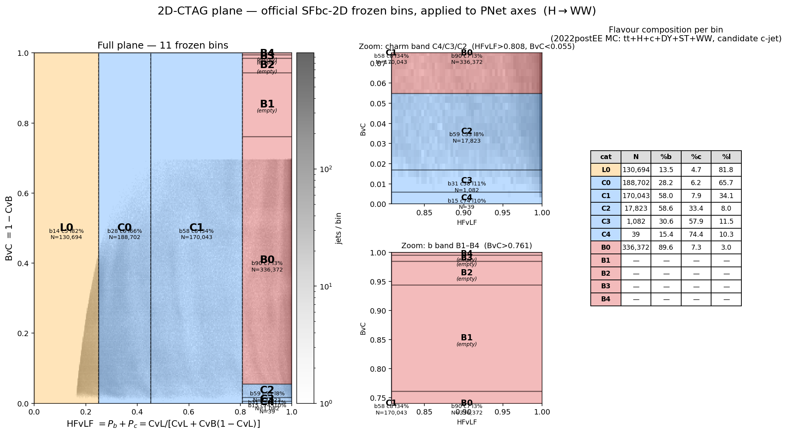
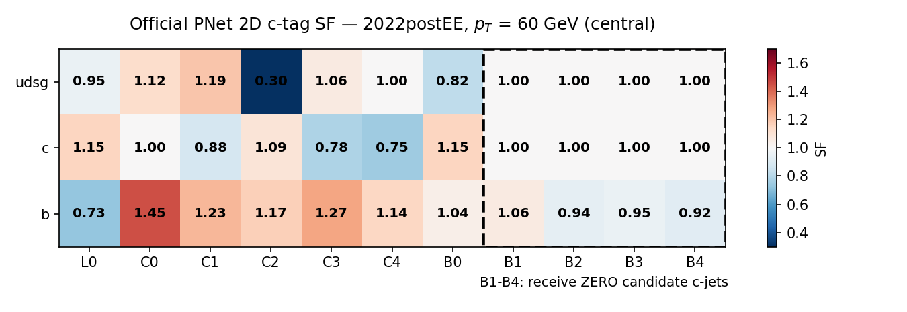
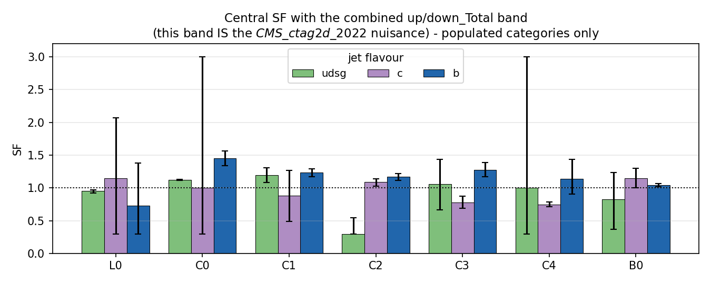
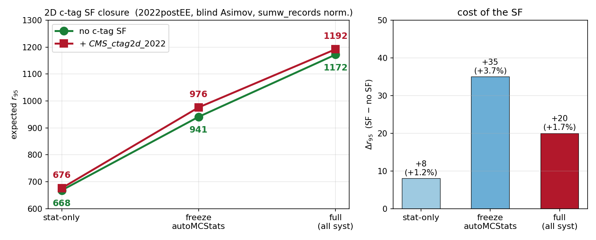

<!-- _class: lead -->

# Official 2D c-tag Scale Factors

## Working points, calibration, and what they cost the limit

**Chirayu Gupta** — VUB
2026-07-31

<span class="small">BTV SFbc-2D scheme (AN-25-222) · PNet AK4 · H+c → WW, 2022postEE</span>

---

## What this deck answers

1. **What** the 2D scheme is, and why it replaces single-cut working points.
2. **How** our stored variables map onto the official axes — and why no reprocessing was needed.
3. **Which** categories are actually populated in our analysis (fewer than you'd think).
4. **What** the official per-category SFs are, and how wide their uncertainty is.
5. <span class="hl">**Closure:** the limit with and without the SF, everything else held fixed.</span>

<span class="small">Every number here is measured on the `hww_combine_fixed` 2022postEE workflow.
The with/without comparison is a controlled A/B — the no-SF variant is built from the
pre-SF backup parquets through the *same* builder, on the *same* day, with only the
`CMS_ctag2d_2022` nuisance removed.</span>

---

## Part 1 — The 2D scheme

<!-- _class: lead -->

---

## From working points to a plane

The BTV **SFbc-2D** calibration (AN-25-222) replaces a single-cut working point with a
**2D plane** partitioned into **11 categories** — `L0, C0–C4, B0–B4` — each carrying its
own scale factor, with **frozen** bin edges.

<div class="cols">
<div>

| axis | definition |
|---|---|
| **BvC** (y) | $1 - \text{CvB}$ |
| **HFvLF** (x) | $P_b + P_c = 1 - P_L$ |

</div>
<div class="small">

**Frozen edges (official, 2026-06-29)**

```
HFvLF (x): [0.000, 0.250, 0.452, 0.808, 1.000]
BvC   (y): [0.000, 0.006, 0.017, 0.055,
            0.761, 0.944, 0.985, 0.995, 1.000]
```

</div>
</div>

<span class="hl">Use the official frozen edges</span> — inventing our own would re-randomise the
bins each run and break the published SF lookup entirely.

<span class="small">Integer ids used everywhere:
`L0=0, C0=1, C1=2, C2=3, C3=4, C4=5, B0=6, B1=7, B2=8, B3=9, B4=10`.</span>

---

## Key result: the axes need only CvsL and CvsB

The scheme as sketched needs the raw b-score, which **our parquets never stored**.
It turns out not to matter.

CMS PNet AK4 discriminants share one 3-simplex $(b,\,c,\,L \equiv uds+g)$:

$$\text{CvsL} = \frac{P_c}{P_c+P_L},\qquad \text{CvsB} = \frac{P_c}{P_c+P_b},\qquad P_b+P_c+P_L = 1$$

Three equations, three unknowns → **unique** solution:

$$P_b = \frac{\text{CvL}\,(\text{CvB}-1)}{\text{CvB}\cdot\text{CvL}-\text{CvB}-\text{CvL}},
\qquad \text{HFvLF} = \frac{\text{CvL}}{\text{CvL}+\text{CvB}(1-\text{CvL})},
\qquad \text{BvC} = 1-\text{CvB}$$

<span class="ok">Consequence: no NanoAOD reprocessing was ever needed</span> — the categories are
computed directly from the two stored columns.

---

## Verified three independent ways

| check | result |
|---|---|
| Symbolic (sympy) | unique closed form exists |
| 2M random valid probability triplets | max $\|B_\text{rec}-B\|$ = **4×10⁻¹⁶** (machine precision) |
| 30k real jets, `Jet_btagPNetB` from a Run3Summer22 **NanoAODv12** file | median **2.8×10⁻⁵**, 95pct 1.4×10⁻⁴ |

<span class="small">The ~10⁻⁵ residual on real data is NanoAOD **float-storage rounding**, not a
modelling gap — a gluon-class mismatch would show O(0.1–1) errors, not O(10⁻⁵). So "L" in CvsL
lumping $uds+g$ is consistent, and the recovery is exact up to storage precision.</span>

---

## The plane, plotted



<span class="tiny">Density = 2022postEE MC (tt + H+c + DY + Single Top + WW), **candidate c-jet**,
845k jets. Insets zoom the two thin bands, which are invisible at full scale.</span>

---

## ⚠️ Only 7 of 11 categories are populated

<div class="cols">
<div class="small">

| cat | N | %b | %c | %l |
|-----|---:|---:|---:|---:|
| L0 | 130,694 | 13.5 | 4.7 | **81.8** |
| C0 | 188,702 | 28.2 | 6.2 | 65.7 |
| C1 | 170,043 | 58.0 | 7.9 | 34.1 |
| C2 | 17,823 | 58.6 | 33.4 | 8.0 |
| C3 | 1,082 | 30.6 | **57.9** | 11.5 |
| C4 | 39 | 15.4 | **74.4** | 10.3 |
| B0 | 336,372 | **89.6** | 7.3 | 3.0 |
| **B1–B4** | **0** | — | — | — |

</div>
<div class="small">

**Why:** the c-jet *candidate* is already charm-selected, so it sits at high `CvB`, i.e.
**low BvC**. The B1–B4 band ($\text{BvC} > 0.761$) is **cut away by construction**.

- Charm purity rises correctly C2→C3→C4 (33% → 58% → 74%), so the *ordering* is physical —
  but the high-purity charm bins hold very few jets.
- On the **leading jet** (not charm-selected) the full ladder does populate, and b-purity
  rises monotonically B0→B4: 24 → 75 → 93 → 98 → 100%.

<span class="hl">The scheme is sound; our candidate-c-jet selection truncates it.</span>

</div>
</div>

---

## Part 2 — The scale factors

<!-- _class: lead -->

---

## Source and signature

Official **per-category** 2D flavour-tagging SFs for PNet AK4 — the H→γγ / `cmshgg`
"2D_HF_Tagging" ingredients, correctionlib v2.

<div class="small">

| campaign | file |
|---|---|
| 2022 preEE | `.../ingredients/2022/2D_HF_Tagging/flavTaggingSF_2022preEE.json.gz` |
| **2022 postEE** | `.../ingredients/2022/2D_HF_Tagging/flavTaggingSF_2022postEE.json.gz` |
| 2023 preBPix | `.../ingredients/2023/2D_HF_Tagging/flavTaggingSF_2023preBPix.json.gz` |
| 2023 postBPix | `.../ingredients/2023/2D_HF_Tagging/flavTaggingSF_2023postBPix.json.gz` |

</div>

**Correction:** `ParticleNetAK4_pseudocontinuous`
**Signature:** `evaluate(systematic, flavor, wp, abseta, pt)` — see next slide.

---

## The `evaluate` signature, argument by argument

<div class="small">

| arg | values |
|---|---|
| `systematic` | `central`; `up_Total`/`down_Total` (combined — **use this for one nuisance**); `up_Stat`/`down_Stat`; plus a large per-source decomposition. <span class="hl">There is no bare `up`/`down`.</span> |
| `flavor` | `0` = udsg, `4` = c, `5` = b — the jet's **hadron flavour** (`cjet_cand_flavour`) |
| `wp` | the 2D category id: <span class="hl">`L0=0, C0..C4 = 40..44, B0..B4 = 50..54`</span> — **not** our stored `0..10`, so it must be remapped |
| `abseta` | **inclusive** — a single `eta_0p00toinf` bin, so the value is irrelevant |
| `pt` | binned `[20, 35, 50, 70, 90, 120]`, flat below 20 and above 120 |

</div>

<span class="small">The SF file exposes **525** systematic keys in total. We collapse them to the
single combined `Total` band — see the recommendation at the end for when and how to
decorrelate.</span>

---

## The central SF matrix



<span class="small">Evaluated at $p_T$ = 60 GeV. Corrections are **O(10–30%)** in the populated
categories — not small. The b-row is well determined everywhere (b-jets are abundant); the
udsg C2 value of 0.30 is a floor on a nearly-empty light-flavour cell.</span>

---

## The uncertainty band — this *is* the nuisance



<span class="small">`up_Total`/`down_Total`, populated categories only. Where a category is
well populated for that flavour the band is a few percent (b in C1/C2/B0). Where it is
**starved**, the band hits the ±[0.3, 3.0] guard rails — c in C0, udsg in C3/C4.
<span class="hl">A single `Total` nuisance inherits the *widest* of these.</span></span>

---

## How it enters the fit

The SF is a genuine correction on the candidate c-jet, so it multiplies the **nominal** weight,
with one combined shape+norm nuisance `CMS_ctag2d_<year>` carrying `up_Total`/`down_Total`.

<div class="small">

Applier `b-hive/scripts/apply_ctag2d_sf.py` adds three columns per MC `mva/<sample>.parquet`
(data untouched; idempotent, `.bak_pre_ctag2dsf` backup):

- `weight_nominal` ← `weight_nominal × SF_central` — and **every existing `weight_*` variation
  is scaled by the same central SF**, so the correction is everywhere.
- `weight_CMS_ctag2d_<year>Up` = `weight_nominal_corrected × SF_upTotal / SF_central`
- `weight_CMS_ctag2d_<year>Down` = `weight_nominal_corrected × SF_downTotal / SF_central`

Category per row is recomputed from `cvsl_pnet`/`cvsb_pnet`; flavour from `cjet_cand_flavour`;
rows with no candidate c-jet (`cjet_cand_pt` NaN) get SF = 1.

</div>

<span class="hl">Object-shift consistency:</span> the JES/JER/lepton templates read
`weight_nominal` from their **own** shift dirs. The SF is applied there too — recomputed from
each dir's *shifted* scores/pt — so each shift is measured against the same SF-corrected
baseline. Otherwise every object-shift nuisance would pick up a spurious ~6% offset.
**All 12 shift dirs corrected.**

---

## Part 3 — Closure: with vs without the SF

<!-- _class: lead -->

---

## How the A/B was built

<div class="small">

To make this a **controlled** comparison rather than a comparison against an old number,
both datacards were rebuilt from scratch, the same day, through the same builder:

| | no-SF variant | with-SF variant |
|---|---|---|
| workflow | `hww_combine_nosf` | `hww_combine_sfchk` |
| `mva/` parquets | symlinks → **585** `.bak_pre_ctag2dsf` files | the live SF-corrected files |
| yaml | `hww_combine_fixed.yaml` **minus one line** | `hww_combine_fixed.yaml` verbatim |
| nuisance count | **29** | **30** |
| negrw | ✅ identical treatment | ✅ identical treatment |

</div>

<span class="ok">The two cards differ by exactly one nuisance row and the central-SF weight
rescale.</span> Nothing was overwritten — the baseline `hww_combine_fixed` tree is untouched,
and the no-SF tree is symlinks only (no data copied).

<span class="small">Both are built **after** the negative-weight reweighting, so the negrw
renorm factors appear identically in both build logs.</span>

---

## ⚠️ A normalization trap found while doing this

<div class="small">

**The parquets *are* self-normalising — the builder just wasn't reading the self-normalising
part.** `make_combine_inputs.py` hand-rolls its own `sumw` sum instead of calling the repo's
`read_parquet_sumw()`. There are **three** sources:

| # | source of `sumw` | verdict |
|---|---|---|
| 1 | **`sumw_records/`** — `dump_chunk_sumw`, **pre-selection, every read-chunk** | ✅ correct |
| 2 | per-shard schema metadata in `parquets_<sample>/base/` | ❌ **undercounts** |
| 3 | sidecar `analysis/filesets/sumw_<year>.json` | ⚠️ stale for signal |

**Why #2 fails:** a read-chunk where *no event survives selection* writes no data shard, so its
generator weight vanishes. Measured: `WtoLNu_2Jets` **5.4×**, `DYto2L_10to50` **23.8×**,
`TbarQto2Q` **72.6×**; tt / st / Higgs all exactly 1.000.

</div>

<span class="hl">`sumw` is the denominator</span> of $\text{lumi}\times\sigma/\text{sumw}$, so
undercounting **inflates** the yield — and it lands on `WtoLNu`, squarely on V+jets.

<span class="small">**Fixed 2026-07-31:** `read_scale` now reads **source #1**, with the sidecar
only as a *logged* fallback. The v11 build uses **zero** fallbacks.</span>

---

## ⚠️ …and the sidecar turned out to be stale for the signal

<div class="cols">
<div class="small">

For `HplusCharm_HtoWW` the two *independent parquet-derived* sources agree **exactly**:

```
sumw_records   : 7.822690e+04
shard metadata : 7.822690e+04   ratio 1.0000
sidecar json   : 9.265575e+04   ratio 0.8443
```

**Proof the records are complete** — each record encodes
`<file-uuid>_<tree>_<lo>-<hi>`, so coverage is checkable:

```
80 records -> 80 distinct UUIDs   (= 80 files)
chunks/file : min 1, max 1
gaps 0  ·  overlaps 0
events covered : 277,345
```

<span class="tiny">The direct `Runs`-tree `genEventSumw` check needs a grid proxy (private
IIHE production) and could not be run.</span>

</div>
<div class="small">

**So switching is a normalisation change, not only a bug fix.** Per-process, summed over all
six channels:

| process | sidecar | records | ratio |
|---|---|---|---|
| **hplusc** | 0.25 | 0.29 | **1.184** |
| higgsbkg | 284.2 | 285.2 | 1.004 |
| tt | 93624.2 | 93624.2 | 1.000 |
| st | 7457.2 | 7457.2 | 1.000 |
| diboson | 2137.6 | 2137.6 | 1.000 |
| **vjets** | 6163.1 | 6534.9 | **1.060** |

<span class="hl">Note the sign:</span> a *smaller* records-sumw makes the yield *larger*.

</div>
</div>

---

## What that does to the numbers

| variant | full | stat-only | freeze autoMCStats |
|---|---|---|---|
| <span class="small">*sidecar (superseded)* — no SF</span> | *1343* | *788* | *1100* |
| <span class="small">*sidecar (superseded)* — + SF</span> | *1371* | *797* | *1144* |
| **`sumw_records`** — no SF | **1172** | **668** | **941** |
| **`sumw_records`** — + `CMS_ctag2d_2022` | **1192** | **676** | **976** |

<div class="cols">
<div class="small">

Ratio records/sidecar: **0.869** (SF), **0.873** (no SF), 0.848 stat-only, 0.853 freeze —
all clustered around the naive signal-scaling expectation $1/1.1844 = 0.844$, slightly above
it because the +6% vjets background partly offsets the signal gain.

</div>
<div class="small">

<span class="hl">This is a normalisation shift, not a sensitivity gain.</span> Nothing about the
discriminant, the reweighting or the systematics changed.

Both physics conclusions survive: the SF still costs **~1.7%**, and the fit is still
**autoMCStats-dominated**.

</div>
</div>

<span class="tiny">Both series reproducible: `v11_hplusc_v4.{root,txt}.bak_sidecar_20260731`,
builder `make_combine_inputs.py.bak_sidecar_20260731`.</span>

---

## The closure result



<span class="small">Measured **2026-07-31** from freshly rebuilt inputs, both arms through the
same builder on the same day, on the corrected **`sumw_records`** normalisation
(see the two slides that follow).</span>

---

## Reading the closure

| variant | full (all syst) | stat-only | freeze autoMCStats |
|---|---|---|---|
| baseline, **no SF** | **1172** | 668 | 941 |
| **+ `CMS_ctag2d_2022`** | **1192** | 676 | 976 |
| Δ | **+20 (+1.7%)** | +8 (+1.2%) | +35 (+3.7%) |

<div class="cols">
<div class="small">

**The SF weakens the limit by ~1.7% — and that is the correct sign.**

A real c-tag scale factor *should* cost something: it introduces a genuine
uncertainty that was previously being ignored, not assumed away.

</div>
<div class="small">

**Decomposition**
- **stat-only +1.2%** — pure yield rescaling. Mean central SF ≈ 1.06, so SR $S/\sqrt{B}$
  shifts slightly. Not an uncertainty effect at all.
- **full +1.7%** — the extra degradation is the one new nuisance's wide
  (+44%/−16%) band doing its job.

</div>
</div>

<span class="hl">The stat-only → full gap is still autoMCStats-dominated</span> (freeze → 976),
i.e. low-stat SR templates remain the driver, **not** the SF.

---

## The matched combination: 2D-cat MVA + SF

The SFs calibrate the **2D-category** tagging, so they physically belong with the 2D-cat MVA
scores, not the baseline continuous scores. Built as a separate workflow `hww_combine_2dcat`.

| variant | full | stat-only | freeze autoMCStats |
|---|---|---|---|
| *baseline (no SF)* | *1343* | *788* | *1100* |
| *baseline scores + SF* | *1371* | *797* | *1144* |
| ***2D-cat scores + SF*** | ***1422*** | ***749*** | *1168* |

<span class="hl">⚠️ These three are the OLD sidecar normalisation</span> — kept here because the
2D-cat arm has **not yet been re-measured**. Its workflow tree was re-processed on 2026-07-30
and currently has no scored `mva/` parquets; the one-hot + inference + build chain is being
re-run. Until it completes, only the *relative* reading below is safe, not the absolute values.

<div class="cols">
<div class="small">

<span class="ok">**Stat-only improves −5%** (749 vs 788).</span>
The 2D-cat MVA is the sharper discriminant: signal $\langle P_\text{hplusc}\rangle$
rises to 0.514 (from 0.377) and **91.1%** of signal lands in the SR (from 70.8%).
Consistent with its +0.004 AUC.

</div>
<div class="small">

<span class="hl">**Full limit is worse +6%** (1422).</span>
The 2D-cat argmax also pulls **2.3× more tt** into the SR (tt→SR 18.9% vs 8.3%), so SR yields
roughly double. tt is the dominant background, so the enlarged SR is more systematics-exposed.

</div>
</div>

<span class="small">**Verdict:** an honest separation-vs-systematics trade, not a bug. Levers to
recover it: tighten the SR, split ggH out of higgsbkg, or narrow the SF nuisance using a less
conservative decomposition than `Total`.</span>

---

## Does the 2D categorisation cost MVA performance?

Retrain of v11 (6-class) with the two continuous PNet scores **removed** and the 11 one-hot
categories **added**:

| Discriminant | 2D-cats | Baseline | Δ |
|---|---|---|---|
| **hplusc_vs_all** | **0.9322** | 0.9284 | **+0.0038** |
| hplusc_vs_higgsbkg | 0.8302 | 0.8506 | <span class="hl">−0.0204</span> |
| hplusc_vs_tt | 0.9438 | 0.9375 | +0.0063 |
| hplusc_vs_st | 0.9334 | 0.9287 | +0.0047 |
| hplusc_vs_diboson | 0.8855 | 0.8840 | +0.0015 |
| hplusc_vs_vjets | 0.9425 | 0.9348 | +0.0077 |

<span class="small">**≈ equivalent**, marginally better overall, 4 of 5 background ROCs improve.
The one regression is vs **higgs-background** — separating H+c from other Higgs modes needs the
fine charm-tag gradient a coarse 11-bin (effectively ~6-bin) scheme discards.</span>

---

## …but the charm tag is a small part of the MVA

<div class="cols">
<div class="small">

**Top features (2D-cats model, 26 inputs)**

| # | feature | rel% |
|---|---|---|
| 1 | dilepton_mass | 25.4% |
| 2 | mtl1 | 17.6% |
| 3 | met_pt | 11.9% |
| 4 | mtl2 | 10.6% |
| 5 | dilepton_pt | 8.2% |
| 6 | lepton1_pt | 8.1% |
| … | | |
| 11 | **ctag2d_B0** | 1.2% |
| 12 | **ctag2d_L0** | 0.6% |
| 26 | **ctag2d_C4** | **0.00%** |

</div>
<div class="small">

| model | charm-tag total | share |
|---|---|---|
| 2D-cats (11 one-hot) | 0.03064 | **2.8%** |
| baseline (2 scores) | 0.02340 | **1.9%** |

1. **Kinematics dominate both models** — `dilepton_mass` + `mtl1` alone are ~43%.
   This is the headline caveat on *any* c-tag change.
2. The 2D block carries **more** aggregate importance (2.8% vs 1.9%) — the
   categorisation redistributes information rather than discarding it.
3. Within the block, importance concentrates in the **populated** bins (B0, L0, C0).
   `C4` is exactly zero (39 jets) and B1–B4 are ~0 (empty) —
   <span class="hl">4–5 of the 11 inputs are dead weight.</span>

</div>
</div>

---

## Summary of measured effects

| change | full $r_{95}$ | vs baseline |
|---|---|---|
| baseline (negrw, no SF) | **1172** | — |
| + official 2D c-tag SF | **1192** | **+1.7%** |
| <span class="small">+ SF, with 2D-cat MVA scores</span> | <span class="small">*pending re-measurement*</span> | <span class="small">*was +5.9%*</span> |

<div class="small">

- All on the corrected **`sumw_records`** normalisation. <span class="tiny">(Superseded sidecar
  series: 1343 / 1371 / 1422.)</span>
- The SF costs **~1.7%** — the expected size and the correct sign for adding a real,
  previously-neglected uncertainty.
- Applying the SF **without** the matching 2D-cat discriminant is the mildest option, and is
  what `hww_combine_fixed` currently does.
- The matched (2D-cat + SF) combination is more *physically* consistent and genuinely separates
  better (stat-only −5%), but its wider SR admits more tt and loses on the full limit today.

</div>

<span class="hl">Neither option is wrong — they trade discrimination against systematic exposure.
The choice should be revisited once the SF band is narrowed below `Total`.</span>

---

## Recommendations

<div class="small">

**1. Keep `up_Total`/`down_Total` as ONE nuisance for now.** Full decorrelation (per-source,
per-flavour, per-pt) is a whole-datacard exercise; the HiggsDNA `bTagShapeSF` treatment is the
model to follow when it is done. <span class="hl">A `Total` band is conservative, not wrong.</span>

**2. Collapse or drop the dead categories.** B1–B4 receive **zero** candidate c-jets and C4 gets
39. Feeding 4–5 constant-zero inputs to the MVA is pure noise surface. Either collapse them into
a single "B" bin, or apply the scheme to a jet collection that spans the plane.

**3. Try the additive variant before spending v32 GPU time.** Keep `cvsl`/`cvsb` **and** the
one-hot categories. The only v11 regression was vs higgsbkg (−0.020), exactly where fine gradient
matters — the additive model should recover it while keeping the +0.004 overall gain.

**4. Extend to the other campaigns.** The 2023 preBPix/postBPix and 2022 preEE SF files are
already wired in; only 2022postEE is populated in the combine tree today.

</div>

---

<!-- _class: lead -->

## Summary

**2D c-tag SFs are wired in, validated, and cost ~2% of the limit.**

The 11-category scheme needs only the two stored PNet scores —
no reprocessing (verified to machine precision).

<span class="hl">Only 7 of 11 categories are populated</span> for the candidate c-jet;
4 MVA inputs are identically zero.

**1172 → 1192** with the SF <span class="small">(`sumw_records` normalisation)</span>

<span class="small">Full write-up: `Projects/HToWW/2026-07-19-ctag2d-full-documentation.md`
· reference: `References/HToWW/2D-SFbc-calibration-AN-25-222.pdf`</span>

---

<!-- _class: lead -->

# Backup

---

## Central SF matrix, numerically

<div class="small">

2022postEE, $p_T$ = 60 GeV, $|\eta|$ inclusive.

| flavour | L0 | C0 | C1 | C2 | C3 | C4 | B0 | B1 | B2 | B3 | B4 |
|---|---|---|---|---|---|---|---|---|---|---|---|
| udsg | 0.953 | 1.122 | 1.193 | 0.300 | 1.062 | 1.000 | 0.822 | 1.000 | 1.000 | 1.000 | 1.000 |
| c | 1.149 | 1.000 | 0.885 | 1.091 | 0.781 | 0.749 | 1.148 | 1.000 | 1.000 | 1.000 | 1.000 |
| b | 0.730 | 1.450 | 1.232 | 1.167 | 1.274 | 1.142 | 1.042 | 1.064 | 0.938 | 0.953 | 0.921 |

**Note on the L0 convention:** for L0, `up_Total` sits *below* `central`
(udsg 0.925 < 0.953; c 0.300 < 1.149). L0 is the **anti-tag** category, so an upward shift in
tagging efficiency *lowers* the veto SF. The band must therefore be taken as
$|\text{up}-\text{central}|$ and $|\text{central}-\text{down}|$, **not** assumed ordered.

**Across the whole 2022postEE MC every event lands in L0 / C0–C4 / B0; B1–B4 receive zero
events** (verified in the applier dry-run), so those SFs are exact no-ops regardless of value.

</div>

---

## File map

<div class="small">

| what | where |
|---|---|
| processor helper | `~/higgscharm/analysis/utils/ctag2d.py` (branch `NewWorkflows`) |
| SF applier | `b-hive/scripts/apply_ctag2d_sf.py` |
| SF files | `/eos/cms/store/group/phys_higgs/cmshgg/ingredients/{2022,2023}/2D_HF_Tagging/` |
| backfill script | `b-hive/scripts/append_ctag2d.py` |
| one-hot appender | `b-hive/scripts/append_onehot.py` |
| 2D-cat re-scorer | `b-hive/scripts/rescore_2dcat.py` |
| 2D-cat combine workflow | `~/higgscharm/analysis/workflows/hww_combine_2dcat.yaml` |
| 2D-cat combine tree | `outputs/hww_combine_2dcat/2022postEE/` |
| **no-SF closure workflow** | `~/higgscharm/analysis/workflows/hww_combine_nosf.yaml` |
| **no-SF closure tree** | `outputs/hww_combine_nosf/2022postEE/` (symlinks to `.bak_pre_ctag2dsf`) |
| 2dcats train config | `b-hive/config/HPlusCHToWW_2dcats.yml` |
| feature importance | `b-hive/scripts/feature_importance_2dcats.py` |
| plane plot | `/eos/user/c/cgupta/HToWW/plots/ctag2d_plane_bins.{png,pdf}` |
| SF plots (this deck) | `/eos/user/c/cgupta/HToWW/plots/ctag/` |

</div>

---

## Two batch gotchas (cost hours, worth keeping)

<div class="small">

Both hit the 2D-cat MVA retrain on the H100 pool:

**1. `request_memory` must be set.** The 3000 MB default OOMs in `DatasetConstructorTask`
(peaks ~4.2 GB reading the big parquets) and the job is **held**, not failed — so it looks
like it's still queued.

**2. But do not inflate it.** 16 GB rounds to `RequestMemory = 18000`, which then matches
**zero** H100 slots (`condor_q -analyze` → "0 slots match … did not match any machines'
constraints"). Free H100 GPUs are scarce and only the large memory tiers qualify, so
over-requesting silently blocks matching.

<span class="hl">8000 MB is the sweet spot</span> — safely above the 4.2 GB peak, matched in ~8 s.

**3. Training reads `mva_labeled/`, not the top-level parquets.** The first submit died with
`ValueError: key "cjet_cand_ctag2d_L0" does not exist` because the appender had only been run on
the top-level files. Check the columns exist in `mva_labeled/{train,test}` before submitting.

</div>
