<!-- _class: lead -->

# Negative-Weight Reweighting for V+jets

## Diagnosis, training, validation and the limit — the complete fix

**Chirayu Gupta** — VUB
2026-07-31

<span class="small">Method: Palmer & Kronheim, [arXiv:2510.16217](https://arxiv.org/abs/2510.16217)
H+c → WW, 2022postEE</span>

---

## The headline

<div class="cols">
<div>

| builder | baseline | **negrw** | Δ |
|---|---|---|---|
| **v11** | 1742 | **1343** | **−23%** |
| **v32** | 1935 | **1491** | **−23%** |

<span class="small">Expected 95% CL upper limit $r_{95}$, blind Asimov.</span>

</div>
<div class="small">

The H+c → WW limit was **not** limited by physics systematics — it was limited by
**Monte-Carlo statistical noise** in the V+jets template, caused by amc@NLO
negative weights.

Learning *where the negative weights live* and replacing the random
$\pm$ cancellation with its expectation removes the noise **at the source**,
without touching the physics.

<span class="hl">Same yield. Same shape. Much smaller variance.</span>

</div>
</div>

---

## Part 1 — The problem

<!-- _class: lead -->

---

## The estimator is a cancellation

amc@NLO events carry **signed** weights. The standard yield estimator

$$\hat{N}_B \;=\; \sum_{i \in B} w_i, \qquad w_i = \pm|w_i|$$

is a *difference of two large numbers*.

- The **expectation** is correct — the yield is unbiased.
- The **variance** is not: it scales with $\sum w_i^2 = \sum |w_i|^2$, i.e. with the
  *unsigned* statistics, while the mean is the much smaller signed sum.
- Effective statistics collapse: $N_\text{eff} = (\sum w)^2 / \sum w^2 \ll N$.

<span class="hl">16.4%</span> of our V+jets events carry a negative weight.

In a sparse bin, the positives and negatives can cancel **completely** — leaving a
bin with zero content and a finite, large error.

---

## The original diagnosis: V+jets is starved exactly under the signal

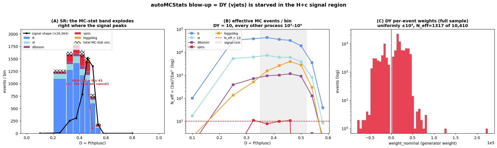

<span class="tiny">**(A)** SR stack — the MC-stat band explodes right where the signal peaks;
bin 6 is DY $= 0 \pm 41$ from ±79k NLO weights cancelling. **(B)** $N_\text{eff}$ per bin —
V+jets sits at **≈10** across the signal-rich region while every other process is at
10³–10⁴. **(C)** the DY per-event generator weights: uniformly **±10⁵**, giving
$N_\text{eff}$ = 1317 out of 10,410 events.</span>

---

## It is not a systematic — it is the top nuisance in the fit

<div class="cols">
<div>

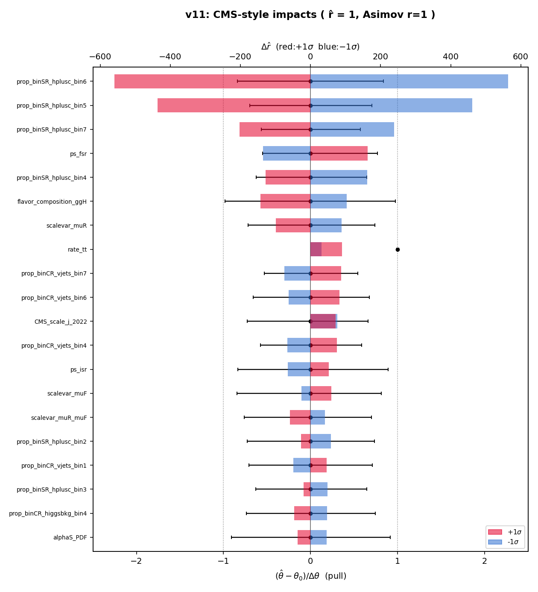

</div>
<div class="small">

CMS-style impacts, $r=1$ Asimov. The **top three** nuisances are

`prop_binSR_hplusc_bin6`
`prop_binSR_hplusc_bin5`
`prop_binSR_hplusc_bin7`

— all `autoMCStats` parameters, each with $|\Delta\hat r| \sim 400\text{–}600$, far above
every physics systematic (`ps_fsr`, `scalevar_muR`, `CMS_scale_j`…).

<span class="hl">`bin6` is #1</span> — the same bin the template plot shows as
$0\pm\infty$. The diagnosis and the fit agree.

</div>
</div>

---

## How far off we are from the published analysis

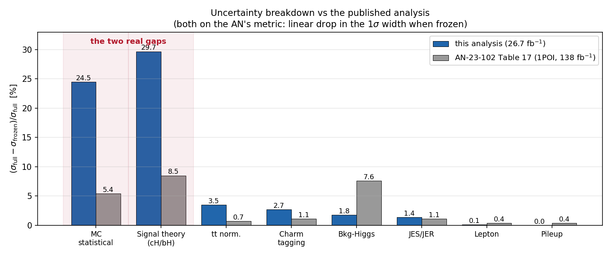

<span class="small">Freeze scan on the **current** card (2026-07-31), both sides on the AN's own
metric. <span class="ok">The experimental block is essentially at parity</span> —
JES/JER 1.4 vs 1.1, charm-tag 2.7 vs 1.1, lepton 0.1 vs 0.4, pileup 0.0 vs 0.4. Only **two**
groups differ materially: **MC-stat** (~4.5×) and **signal theory** (~3.5×, the flat 30%
`xsec_hplusc_4FS_5FS`). Bkg-Higgs is *smaller* than the AN's — our
`flavor_composition_ggH` is still a 1.40 placeholder vs their 1.50-on-ggH.</span>

---

## ⚠️ Getting that comparison right — the metric matters

<div class="cols">
<div class="small">

**AN-23-102 has no Table 18.** The inventory is **Table 16**, the impacts **Table 17**.

Table 17's percentages decode from Figure 54 (1POI, Asimov $r=1$, total uncertainty on $r$ =
441.6):

```
freeze MC-stat -> residual
  sqrt(441.6^2 - 144.3^2) = 417.4
  drop = 5.5%     Table 17 says 5.4%  ✅
```

So the AN's metric is the **linear drop in the 1σ width**,
$(\sigma_\text{full}-\sigma_\text{frozen})/\sigma_\text{full}$.

</div>
<div class="small">

Quoting a *different* quantity — e.g. $\sqrt{\sigma_\text{full}^2-\sigma_\text{frozen}^2}/r$ —
inflates every entry and makes the systematics look far worse than they are:

| group | AN metric | the wrong one |
|---|---|---|
| MC-stat | 24.5% | 28.7% |
| charm-tag | **2.7%** | 10.2% |
| tt norm | **3.5%** | 11.5% |
| JES/JER | **1.4%** | 7.3% |

<span class="hl">Always state which definition is being used.</span>

</div>
</div>

<span class="tiny">⚠️ One caveat: the AN's own **"Statistical 73.8%"** does not reproduce under
this definition (freezing stat gives a 43.1% drop), so their statistical row appears to be
normalised differently from their systematic rows. The systematic rows are trustworthy —
MC-stat reproduces to 0.1%.</span>

---

## What that does to the actual template

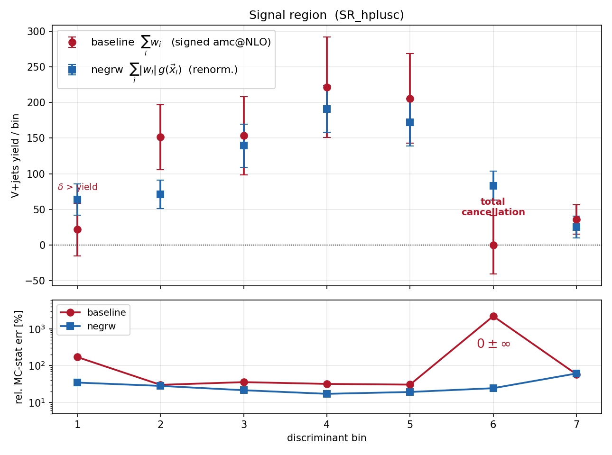

<span class="tiny">V+jets in the SR, **from the real combine input file**. Bin 6 is a
<span class="hl">total cancellation</span> — content floored to $10^{-6}$ with error $\pm41$,
i.e. a relative MC-stat error of $4\times10^9\,\%$. Bin 1 has error larger than its yield.</span>

---

## The consequence in the fit

`autoMCStats` gives every template bin a nuisance sized by its MC-stat error.
A bin with $0 \pm \infty$ hands the fit an **unconstrained** background parameter
sitting directly under the signal.

| | v11 | v32 |
|---|---|---|
| stat-only floor | 771 | 600 |
| freeze `autoMCStats` | 1032 | 1068 |
| **full** | **1742** | **1935** |
| <span class="hl">autoMCStats inflation</span> | **+710** | **+867** |

<span class="small">~81% of the total uncertainty traced to V+jets undersampling in the SR.
The gap between "freeze autoMCStats" and "full" **is** the problem — it is bigger than every
physics systematic combined.</span>

---

## Part 2 — The method

<!-- _class: lead -->

---

## Replace the random sign with its expectation

Train a classifier for the probability that an event has a positive weight, given
**generator-level** kinematics $\vec{x}$ only:

$$P_+(\vec{x}) \;=\; P\big(\text{genWeight} > 0 \mid \vec{x}\big)$$

Define the reweight factor and the new estimator

$$g(\vec{x}) \;=\; 2P_+(\vec{x}) - 1 \;=\; P_+ - P_-, \qquad \hat{N}_B \;=\; \sum_{i\in B} |w_i|\,g(\vec{x}_i)$$

<div class="cols">
<div class="small">

**Why the mean is unchanged:** $g(\vec{x})$ is exactly the *expected sign* of an event at
$\vec{x}$. Summing $|w|\cdot\langle\text{sign}\rangle$ instead of the realised $\pm|w|$
replaces a random quantity by its mean.

</div>
<div class="small">

**Why the variance drops:** every event now contributes with the **same sign**, scaled by a
smooth factor. No cancellation is left to fluctuate. The gain is largest exactly where the
cancellation was worst — sparse, hard bins.

</div>
</div>

---

## It is an algebraic identity, not an approximation

<div class="small">

From the paper (their Eqs. 2–6). Write the (signed) generator density as a difference of two
normalised positive densities:

$$\text{PDF}(\vec{x}) = a\,\text{PDF}_+(\vec{x}) - b\,\text{PDF}_-(\vec{x}), \qquad a,b\ge0,\; a-b=1$$

The positive-weight probability at $\vec x$ is then

$$P_+(\vec{x}) = \frac{a\,\text{PDF}_+}{a\,\text{PDF}_+ + b\,\text{PDF}_-}
\quad\Longrightarrow\quad
\text{PDF}(\vec{x}) = \underbrace{\big(2P_+(\vec{x})-1\big)}_{g(\vec{x})}\cdot\big(a\,\text{PDF}_+ + b\,\text{PDF}_-\big)$$

The right-hand factor is the **unsigned** density — which is what $\sum|w|$ samples.
So $\sum|w|\,g$ and $\sum w$ estimate *the same distribution*.

</div>

<span class="hl">Caveat that drives everything downstream:</span> this is exact for the **true**
$P_+$. We use an estimate $\hat{P}_+$ from a finite classifier, so closure becomes an
**empirical** property that has to be measured — hence the validation in Part 4.

---

## Part 3 — Training

<!-- _class: lead -->

---

## Training region: train loose, infer tight

$g(\vec{x})$ is a **generator property** — it does not know about the analysis selection.
So we can train on a far larger sample than the SR.

| | Training region | Inference region |
|---|---|---|
| **Selection** | base cuts + `veto_emu_sr` | tight eμ signal region |
| **Meaning** | veto *only* the exactly-one-eμ-pair topology | the analysis SR |
| **Statistics** | **9,832,308** events (502 parquet) | ~10⁴ events |

- <span class="ok">Event-disjoint by construction</span> (paper §V.4) → no train/infer
  overfitting bias, no hold-out needed.
- Disjoint *events*, **not** orthogonal *phase space* — same generator physics, so $g$ transfers.
- <span class="ok">Veto integrity verified:</span> 0 eμ SR events leaked into training.
- <span class="ok">Coverage verified:</span> SR-proxy $\vec{x}$ lies inside the training domain
  in every gen feature → **interpolation, never extrapolation**.

---

## Inputs: 20 generator-level features

<div class="cols">
<div class="small">

**LHE event-level (10)**
`lhe_njets`, `lhe_nb`, `lhe_nc`, `lhe_nuds`,
`lhe_nglu`, `lhe_npnlo`, `lhe_ht`,
`lhe_htincoming`, `lhe_vpt`, `lhe_alphas`

**Hard-process gen partons (10)**
`genparton_multiplicity`,
`genparton_n_pt20 / n_pt100 / n_pt200`,
`genparton_incoming1_pdgId`, `genparton_incoming2_pdgId`,
`genparton1_pt`, `genparton1_eta`,
`genparton2_pt`, `genparton2_eta`

</div>
<div class="small">

- The paper's hand-built **parton-count / HT / V-pT / merging** variables.
- **Label:** `weight_nominal > 0` — the fully-populated signed amc@NLO weight.
  Every event is usable; nothing is thrown away.
- Events with < 2 hard partons have **missing** parton kinematics → left as `NaN`,
  handled **natively** by the histogram GBDT (no imputation, no sentinel value).
- <span class="hl">Only generator quantities.</span> Nothing reconstructed enters $g$,
  so the reweighting cannot sculpt the analysis observable.

</div>
</div>

---

## The two weight classes really are separated


<span class="tiny">Blue: $w>0$ · Red: $w<0$, per input feature. The classes separate visibly in the
merging / parton-count variables — exactly what the classifier exploits.</span>

---

## The model

**`HistGradientBoostingClassifier`** (scikit-learn) — histogram-binned GBDT: bins each feature
into ~256 buckets, grows shallow trees. Scales to ~10M events, handles `NaN` natively.

<div class="cols">
<div>

| parameter | value |
|---|---|
| `loss` | `log_loss` |
| `max_iter` | 200 |
| `learning_rate` | 0.05 |
| `max_depth` | 4 |
| `l2_regularization` | 1.0 |
| `early_stopping` | True (`val_frac` 0.15) |

</div>
<div class="small">

**Ensemble of 20 classifiers**
- Each on an independent **60% subsample**, drawn without replacement, different seed.
- `log_loss` ⇒ the output is a **calibrated probability** — mandatory, since $P_+$ is used
  as a probability, not as a ranking score.
- **Why 20?** The spread across members, $\delta g = 2\,\text{std}(P_+)$, *is* the method's
  own uncertainty. The ensemble doesn't just give a better central value — it
  **generates its own error band**.

</div>
</div>

---

## Training convergence

<div class="cols">
<div>

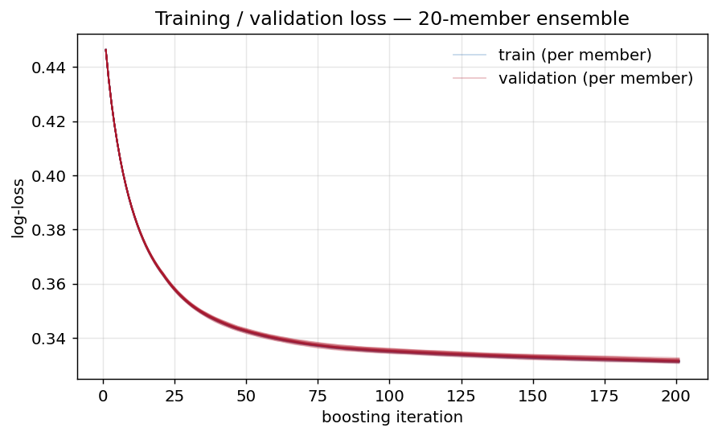

</div>
<div>


</div>
</div>

- Smooth convergence; **train and validation curves lie on top of each other** → no overfitting
  (shallow depth-4 trees + L2 = 1.0 are doing their job).
- Loss still gently descending at iteration 200 → <span class="hl">early stopping never fires;
  all 20 members hit the `max_iter` ceiling</span> (median `n_iter` = 200).
- <span class="hl">Known headroom:</span> more iterations / deeper trees could still improve
  $P_+$. Not pursued — the limit is already dominated by other things (Part 5).

---

## Classifier performance

<div class="cols">
<div>


</div>
<div>

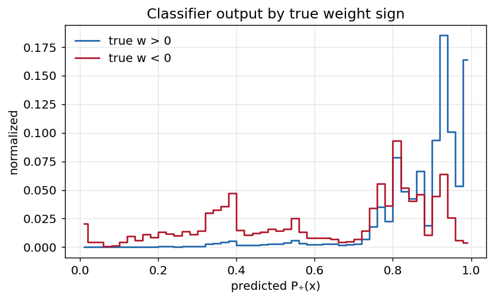

</div>
</div>

| metric | value |
|---|---|
| ensemble log-loss | **0.331** |
| ensemble AUC | **0.829** |

<span class="tiny">AUC 0.83 on an *intrinsically stochastic* problem — the sign is not a
deterministic function of $\vec x$, so 1.0 is not the target. What matters is that $P_+$ is
**calibrated**.</span>

---

## What drives the prediction?

<div class="cols">
<div>


</div>
<div class="small">

Permutation importance = increase in log-loss when a feature is scrambled.

**Physically sensible ordering:**
1. `lhe_npnlo` — the **NLO merging variable**, dominates by far
2. `lhe_njets` — parton multiplicity
3. `lhe_nglu` — gluon count
4. `genparton1_pt` — leading parton hardness
5. `lhe_alphas`, `genparton2_pt`

These are exactly the variables that control where amc@NLO **negative weights** are
generated — the merging and subtraction regions.

<span class="ok">→ The model learned real generator structure, not noise.</span>

</div>
</div>

---

## The reweight factor $g$ and its uncertainty

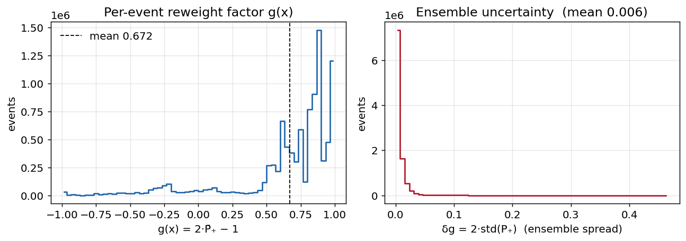

| | value | reading |
|---|---|---|
| $g$ mean | **0.672** | $= 2\times0.836-1$ — matches the global positive fraction ✅ |
| $g$ range | $[-0.991,\ 0.993]$ | well inside the physical $[-1,1]$; no pathological events |
| $\delta g$ mean / max | **0.006** / 0.467 | 20-model agreement is tight |

---

## Closure on the training region

<div class="cols">
<div>

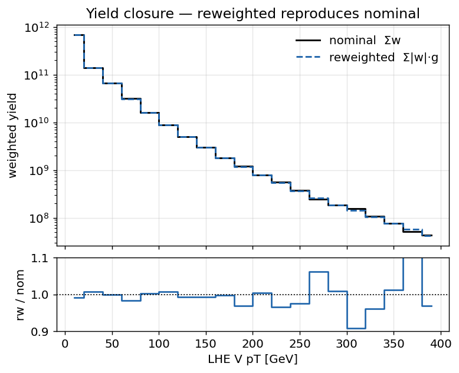

</div>
<div>

$$\frac{\sum |w|\,g}{\sum w} = \mathbf{0.994}$$

<span class="small">Ratio flat at unity across the whole V-pT spectrum, including the hard tail.

The reweighting **preserves the physics** — it removes variance and nothing else.

This is the primary gate on the method: if $\hat P_+$ were mis-modelled, this ratio would
drift away from 1.</span>

</div>
</div>

---

## The payoff: effective statistics

<div class="cols">
<div>

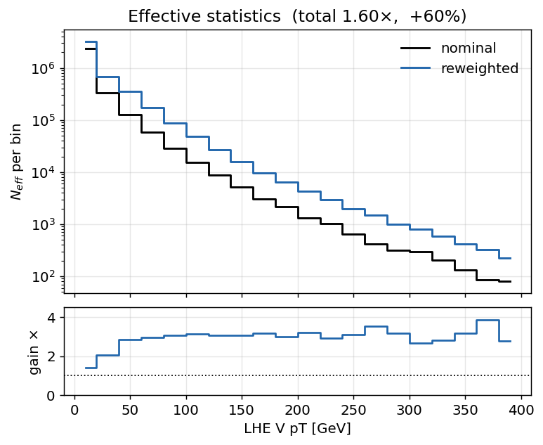

</div>
<div class="small">

**Total: $N_\text{eff}$ 2.92M → 4.68M (+60%)**

<span class="hl">~3× gain sustained across the entire hard V-pT tail</span>
(2.8–3.8× for $p_T^V > 40$ GeV).

The bulk (first bin) gains least — it was never starved. The gain grows
**exactly where autoMCStats hurts**.

That is the whole design: this method does nothing where you don't need it.

</div>
</div>

---

## Per-bin gain in the tail

<div class="small">

| $p_T^V$ [GeV] | $N_\text{eff}$ nominal | $N_\text{eff}$ reweighted | gain |
|---|---|---|---|
| 0–20 | 2,341,819 | 3,262,187 | 1.39× |
| 40–60 | 125,911 | 357,341 | 2.84× |
| 80–100 | 28,976 | 88,889 | **3.07×** |
| 120–140 | 8,759 | 26,802 | **3.06×** |
| 160–180 | 3,068 | 9,671 | **3.15×** |
| 200–220 | 1,331 | 4,271 | **3.21×** |
| 260–280 | 420 | 1,488 | **3.54×** |
| 340–360 | 134 | 424 | **3.18×** |
| 360–380 | 85 | 326 | **3.84×** |

</div>

<span class="small">In the **actual SR** the gain is even larger: <span class="hl">3.44×</span>
(455 → 1563) — the SR is precisely the starved regime the method targets.</span>

---

## Part 4 — Validation on the real SR

<!-- _class: lead -->

<span class="small">The model was trained on the veto-eμ region.
Everything here is measured on the **tight eμ SR it never saw** (10,205 V+jets events).</span>

---

## Is $P_+$ calibrated out-of-training-region?

<div class="cols">
<div>

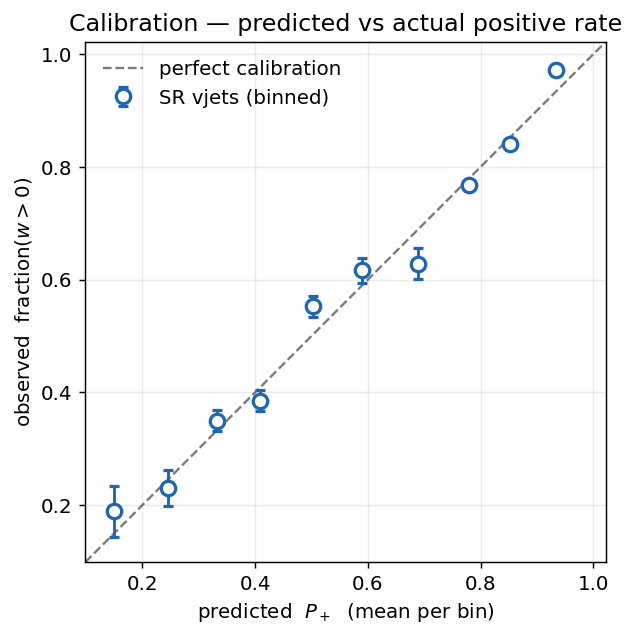

</div>
<div class="small">

Bin SR events by **predicted** $P_+$; plot the **observed** fraction with $w>0$ in each bin.

Points land on the diagonal across the full range ($P_+ \approx 0.15 \to 0.93$).

<span class="ok">The predicted positive-rate *is* the realised one</span> — in a region the
classifier was never trained on.

This is the check that matters most: $g = 2P_+-1$ is only meaningful if $P_+$ is a
probability, not merely a good ranking.

</div>
</div>

---

## Does $g$ track the realised sign?

<div class="cols">
<div>

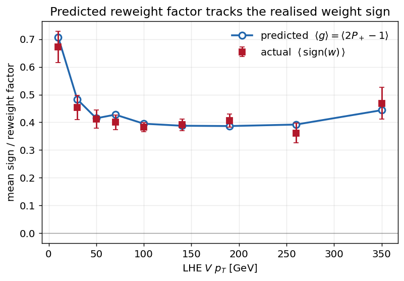

</div>
<div class="small">

Predicted $\langle g\rangle = \langle 2P_+-1\rangle$ (blue) vs the **actual**
$\langle\mathrm{sign}(w)\rangle$ (red), in bins of $p_T^V$.

Every measured point sits on the predicted curve — at **every** $p_T^V$, including the
hard tail where the statistics are thinnest and the reweighting matters most.

<span class="ok">The reweight factor reproduces the realised weight sign differentially,
not just on average.</span>

</div>
</div>

---

## SR closure and sign separation

<div class="cols">
<div>

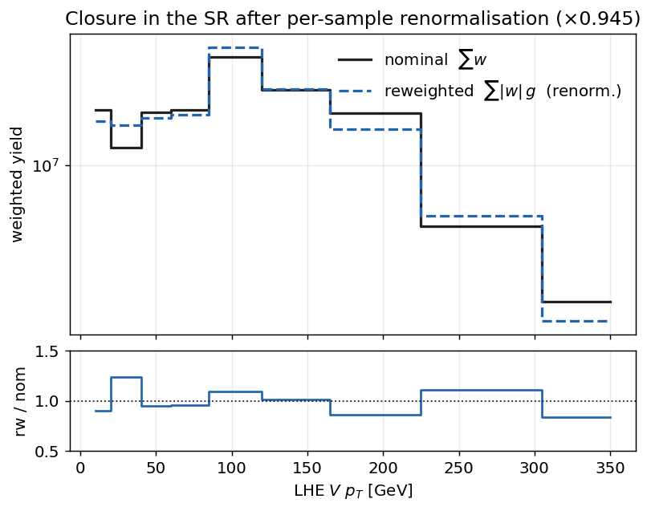
<span class="tiny">After per-sample renorm: reweighted $\sum|w|g$ tracks nominal $\sum w$, ratio ≈ 1.</span>

</div>
<div>

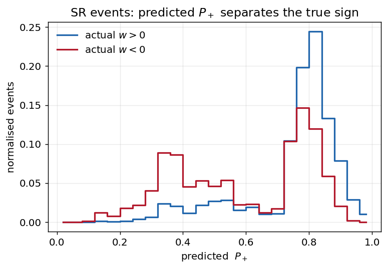
<span class="tiny">True $w>0$ (blue) peak at high $P_+$; true $w<0$ (red) shift low — on SR events.</span>

</div>
</div>

<span class="small">The SR closes to <span class="hl">~6%</span> before renormalisation
(training-region closure was 0.994 on 9.8M events). The SR is a small, kinematically-biased
corner of the training domain, so per-event $g$ does not perfectly average to the *local*
positive fraction. Next slide: what we do about it.</span>

---

## The one honest caveat: the SR closure offset

<div class="small">

| dataset | rows | $\sum\|w\|g / \sum w$ |
|---|---|---|
| DYto2L_2Jets_50 | 9,646 | **1.014** |
| WtoLNu_2Jets | 485 | **1.133** |
| DYto2L_2Jets_10to50 | 74 | 2.24 <span class="tiny">(74 rows — noise)</span> |
| **total** | 10,205 | **1.058** |

</div>

**Decision: renormalise the reweighted V+jets template to the nominal yield, per dataset.**
<span class="tiny">Applied factors: DYto2L_50 ×0.986, WtoLNu ×0.900, DYto2L_10to50 ×0.446.</span>

<div class="cols">
<div class="tiny">

**Why it is defensible**
- Reweighting fixes **variance, not yield** — exact closure is what the identity guarantees in
  the large-$N$ limit; the rescale forces our finite-$N$ estimate back onto it.
- Standard shape-only template practice (the existing DY smoothing does the same).
- It **keeps the entire benefit**: $N_\text{eff}$ comes from reduced per-bin variance, which a
  global rescale does not touch.

</div>
<div class="tiny">

**Why it must be stated**
- <span class="hl">This is our extension, not the paper's.</span> Their closure was clean
  enough that they apply no post-hoc rescale.
- The WtoLNu 13% is the one number worth revisiting (feature coverage of the W corner of the SR).
- It should be declared as such in the AN / thesis.

</div>
</div>

---

## The method's own uncertainty — and why it's negligible

`CMS_negrw_vjets`: a **V+jets-only shape nuisance** built from the 20-model ensemble spread,

$$\text{Up/Down} \;=\; |w_\text{nom}|\cdot\mathrm{clip}\big(g \pm \delta g,\,-1,\,1\big),$$

each renormalised to the nominal yield ⇒ **shape-only** (paper §IV C, event-level).

| | v11 | v32 |
|---|---|---|
| limit without the nuisance | 1343 | 1491 |
| limit **with** it | **1343** | **1491** |

<span class="small">Max per-bin effect **±1.3%** (SR V+jets Up 730.5 / nom 735.4 / Down 740.5),
against per-bin MC-stat still ~20%. $\delta g$ mean ≈ 0.012 — the 20 members agree tightly — so
combine simply profiles it away. <span class="ok">1343 / 1491 are therefore honest numbers that
already include the method's own uncertainty.</span></span>

---

## Part 5 — Result

<!-- _class: lead -->

---

## Where the improvement comes from

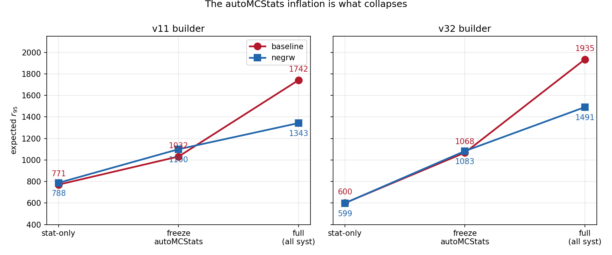

<span class="small">The two curves are **on top of each other** at stat-only and at
freeze-autoMCStats, and separate only at "full". The entire gain is the collapse of the
autoMCStats inflation — nothing else moved.</span>

---

## The numbers

| builder | metric | baseline | **negrw** | Δ |
|---|---|---|---|---|
| **v11** | full | 1742 | **1343** | **−23%** |
| | stat-only | 771 | 788 | +2% |
| | freeze autoMCStats | 1032 | 1100 | +7% |
| | <span class="hl">autoMCStats inflation</span> | **710** | **243** | **−66%** |
| **v32** | full | 1935 | **1491** | **−23%** |
| | stat-only | 600 | 599 | flat |
| | freeze autoMCStats | 1068 | 1083 | +1% |
| | <span class="hl">autoMCStats inflation</span> | **867** | **408** | **−53%** |

<span class="small">**Why stat-only moves +2% for v11 and not for v32:** the reweighting changes the
per-bin MC-stat errors themselves (bin 6: $0\pm\infty \to 91\pm25\%$), so a rebalance is
expected — not a distortion.</span>

---

## Where these numbers stand today

<span class="small">The 1742 → 1343 comparison above is the **clean negrw A/B**: both sides
built identically, so the −23% is the reweighting's effect alone. Two later configuration
changes moved the absolute scale (neither is about negrw):</span>

| configuration | no SF | + c-tag SF |
|---|---|---|
| negrw, as measured above | 1343 | 1371 |
| <span class="small">+ `sumw_records` normalisation</span> | 1172 | 1192 |
| <span class="small">+ LOWESS smoothing OFF</span> | **1150** | **1164** |

<div class="cols">
<div class="small">

**1. `sumw_records` (−14%)** — the builder was reading a *stale sidecar* `sumw` for the signal.
The self-normalising per-chunk records give a signal template **18.4% larger**. A pure
normalisation fix; not a sensitivity gain.

</div>
<div class="small">

**2. Smoothing off (−2%)** — LOWESS was smoothing the negrw-reweighted vjets shape variations
*on top of* the reweighting, double-treating them. Stat-only is **identical** either way,
confirming only systematics were touched.

</div>
</div>

<span class="tiny">⚠️ vs the published analysis: AN-23-102 quotes an expected UL of **431 at
138 fb⁻¹**. Scaled to our 26.7 fb⁻¹ that is $431\sqrt{138/26.7}=$ **980**, so we are ~19%
worse — not at parity. Our stat-only 676 does beat the AN's scaled ~723.</span>

---

## The template-level evidence

<div class="cols">
<div>


<span class="tiny">SR: mean rel. MC-stat error over usable bins **59.6% → 30.3%**, plus one bin
recovered from $0\pm\infty$.</span>

</div>
<div>

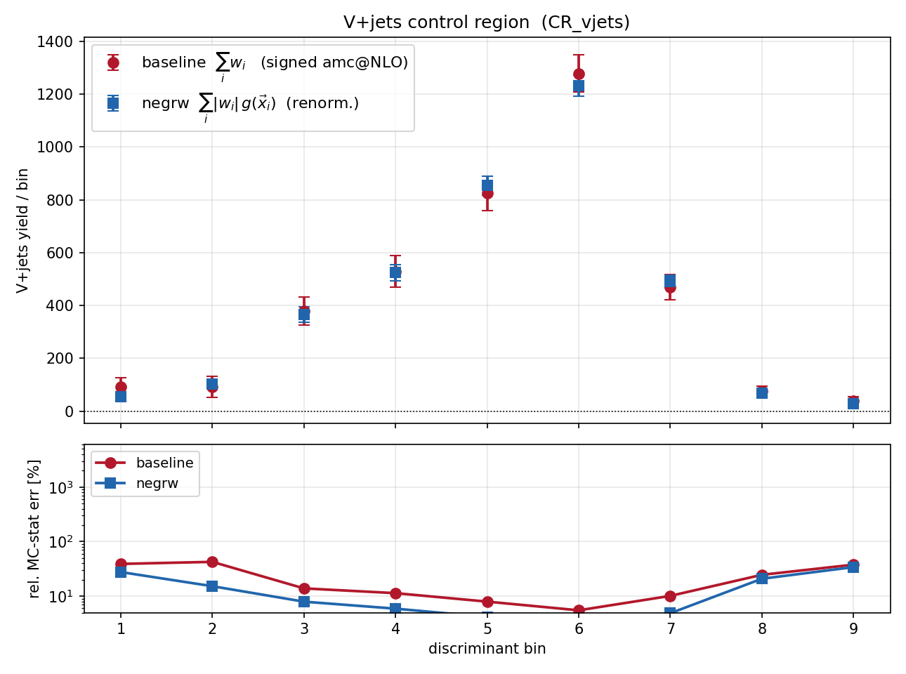
<span class="tiny">CR_vjets: **21.4% → 13.8%**. Every bin's error shrinks; contents stay
physical; yield preserved by the renorm.</span>

</div>
</div>

<span class="small">This is the mechanism, measured directly on the combine inputs — not inferred
from the limit. The limit improvement is a *consequence* of these two plots.</span>

---

## Reproducibility — the version trap

The ensemble is trained **inside the same Singularity image the analysis workers run**
(`coffea-base-almalinux9:0.7.30-py3.10`, **scikit-learn 1.7.2**), submitted as a Condor job.

<div class="small">

- A model pickled by a *different* sklearn version **fails to load on the workers**
  (`AttributeError: __pyx_unpickle_CyHalfBinomialLoss`). Version match is **mandatory, not
  cosmetic** — and it fails at run time on the grid, not at build time.
- Corollary: the local `b_hive` env (sklearn 1.4.2) can no longer load this model. Local
  processor tests must run **inside the image**.
- The model must live on **AFS**, not EOS — the worker container cannot read arbitrary EOS
  paths (`PermissionError`). Master copy stays on EOS; workers read the AFS stage.
- Reproduces the earlier reference run to 3 decimals (closure 0.994, $N_\text{eff}$ +60%).

</div>

---

## Three real bugs found before the physics was trusted

<div class="small">

**1. The dataset gate was substring-matching — and would have reweighted SIGNAL.**
`any(p in dataset for p in ["DYto2L","WtoLNu"])` matches
`WplusH_WtoLNu_Hto2Wto2L2Nu` → the **WH signal** template would have been silently reweighted
with a V+jets generator model. Fixed to exact matching against the three exact dataset names.

**2. The exact match was then too strict and silently did nothing.**
Condor passes `--dataset DYto2L_2Jets_50_7` (partition suffix), so exact matching rejected
*everything* — the first submit wrote parquets with **no `weight_negrw` at all** and no error.
Fixed by stripping a trailing `_\d+` before matching, still anchored so WH stays untouched.

**3. Model on EOS → `PermissionError` inside the container.** Every Condor job would have died.

</div>

<span class="hl">Lesson adopted:</span> Condor jobs **overwrite** their output dir on write, so a
buggy submit is itself destructive. Run **one canary job and verify the columns** before any full
submit over live data.

---

## Implementation

The trained ensemble is applied **inside the coffea processor**, adding **2 columns** to the
V+jets SR parquets:

| column | meaning |
|---|---|
| `weight_negrw` | $g = 2\bar{P}_+ - 1$ — the per-event reweight factor |
| `weight_negrw_std` | $\delta g = 2\,\text{std}(P_+)$ — ensemble spread → shape systematic |

<div class="small">

- **Config-gated + dataset-gated**: the `negrw:` block in `hww_combine_fixed.yaml` lists three
  exact dataset names → **V+jets only**; nothing else in the analysis is touched.
- Combine fills the V+jets template with $|w_\text{nom}|\cdot g\cdot(\text{renorm})$ and adds the
  `CMS_negrw_vjets` shape nuisance from $\pm\delta g$.
- Object-shift call sites do **not** get negrw Up/Down — no double counting.
- <span class="hl">Reweighting REPLACES smoothing.</span> Both regularise the same sparse tail;
  stacking them double-counts and muddies interpretation. `dy_template_smooth.py` is not run.

</div>

---

## Status

<div class="cols">
<div class="small">

**Done ✅**
- Training region designed + validated (0 eμ leaked; interpolation-only coverage)
- 20-model ensemble trained, version-matched to the workers
- Closure 0.994; $N_\text{eff}$ +60% (~3× tail, **3.44× in the SR**)
- Processor injection, 3 bugs found and fixed, canary-validated
- Full vjets SR re-run (989 files) + merge
- Wired into **both** combine builders + method nuisance
- <span class="ok">Limit: 1742 → 1343 (v11), 1935 → 1491 (v32)</span>
- Provenance re-verified: live parquets reproduce from the Jul-15 model to $4\times10^{-16}$

</div>
<div class="small">

**Open / known**
- <span class="hl">WtoLNu SR closure 1.133</span> — the largest single residual; worth a
  feature-coverage check of the W corner.
- ~7% of vjets SR events (689/10325) lost to transient xrootd errors on one site; re-run with
  it blacklisted before quoting a final number.
- **PCA over the per-bin ensemble covariance** (paper §IV D) instead of the event-level
  $\pm\delta g$ band — needs per-model $P_+$ re-dumped. Given the nuisance is already
  negligible (±1.3%), low priority.
- Training headroom (early stopping never fired).

</div>
</div>

---

## What this did *not* fix

<div class="small">

After negrw, v32 was re-optimised in four ways. **All four made the limit worse or did nothing** —
recorded so they are not retried:

| attempt | result |
|---|---|
| prune empty / low-$N_\text{eff}$ bins | 1491 → **1512** |
| rebin / "log-transform" the discriminant | no config beats current (bracketed both sides) |
| blame the CRs for the MC-stat tax | refuted — it is **87% in the SR** |
| free `tt` rateParam | 1491 → **1542** (1581 with tt theory dropped) |

**Two lessons worth keeping:**
1. `autoMCStats N` already applies `event-threshold=N` and **skips sub-threshold bins** — empty
   bins cost nothing, so pruning them buys nothing.
2. <span class="hl">Freezing a nuisance ≠ constraining it better.</span> A freeze scan measures
   how much freedom the fit *uses*; it is **not** a recoverable budget. Every "fix" derived from
   reading it that way failed.

The remaining v32 deficit is **structural**: it concentrates signal into bins that are ~72% tt.
The one open lever is **more MC statistics at high $D$** — exactly what negrw bought.

</div>

---

<!-- _class: lead -->

## Summary

**The limit was MC-statistics-limited, not systematics-limited.**

Learning $P_+(\vec{x})$ and estimating with $\sum|w|g$ instead of $\sum w$
raises $N_\text{eff}$ by **3.44× in the SR** —

<span class="hl">$r_{95}$: 1742 → 1343 (v11), 1935 → 1491 (v32), both −23%</span>

Same yield, same shape, validated out-of-training-region,
with the method's own uncertainty included and shown to be negligible.

<span class="small">arXiv:2510.16217 · notes: `Projects/HToWW/negrw-training/`</span>

---

<!-- _class: lead -->

# Backup

---

<!-- _class: lead -->

## Backup A — every combine input

<span class="small">All 6 channels × 6 processes, their MC-stat errors,
and all 20 shape systematics.</span>

---

## All six channels — stacked nominal templates

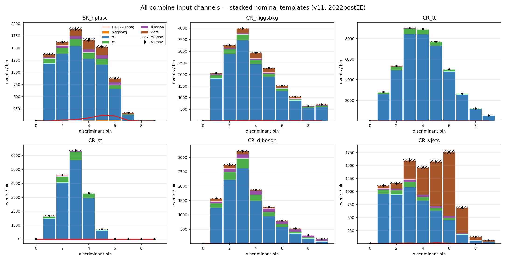

<span class="tiny">Signal (red line) scaled by a **single global ×2000** in every panel, so shapes
are comparable across channels. Hatched = total background MC-stat; black points = the Asimov
dataset the blind limit is run against. tt (blue) dominates everywhere except `CR_vjets`.</span>

---

## Every template individually (6 channels × 6 processes)

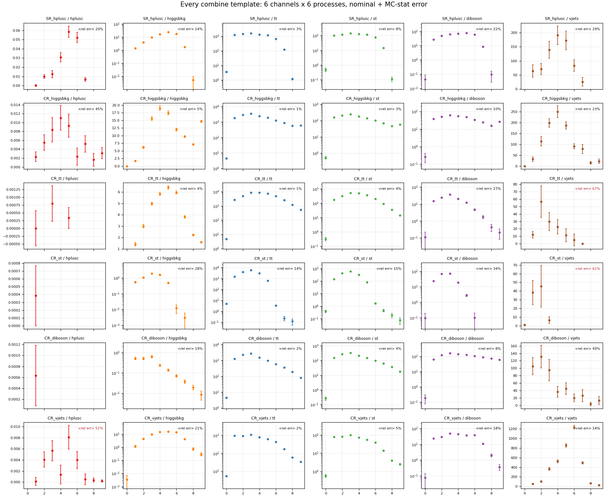

<span class="tiny">Annotation = mean relative MC-stat error over populated bins,
<span class="hl">red when > 50%</span>. **tt is 1–3% everywhere; V+jets is 14–67%.**</span>

---

## All 20 shape systematics — signal region


<span class="tiny">Every Up (solid) / Down (dashed) variation as a ratio to nominal, per process.
Most are sub-percent lines hugging 1.0; the visible excursions are the theory shapes
(`scalevar_*`, `ps_*`). This is why the JES/JER/lepton block contributes only 18 of the 484
systematic tax.</span>

---

## All 20 shape systematics — control regions (1/2)

<div class="cols">
<div>

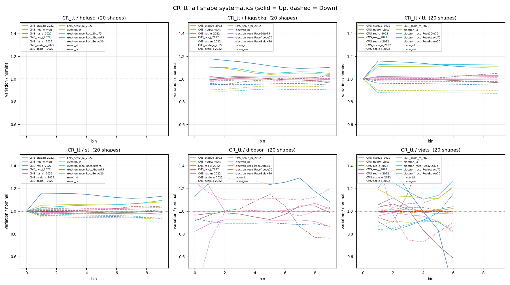
<span class="tiny">`CR_tt` — the tt-pure region.</span>

</div>
<div>

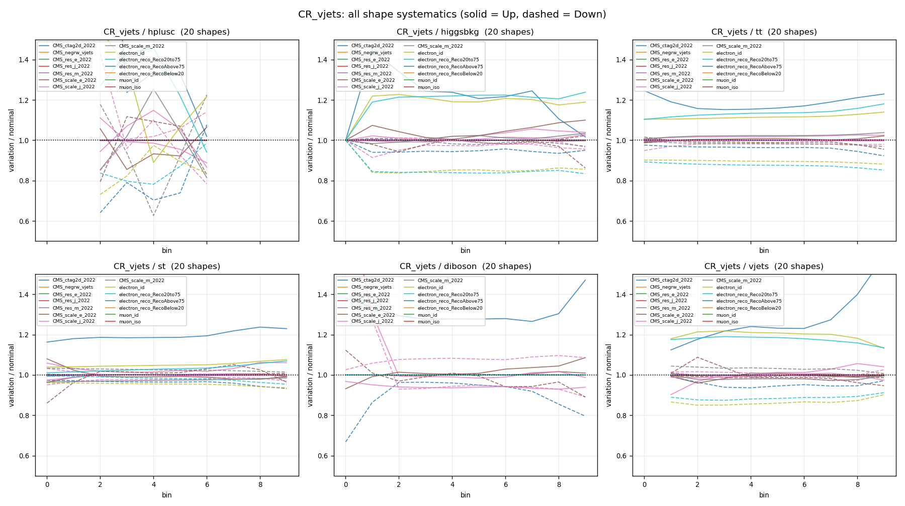
<span class="tiny">`CR_vjets` — note `CMS_negrw_vjets` appears only here and in the SR.</span>

</div>
</div>

---

## All 20 shape systematics — control regions (2/2)

<div class="cols3">
<div>

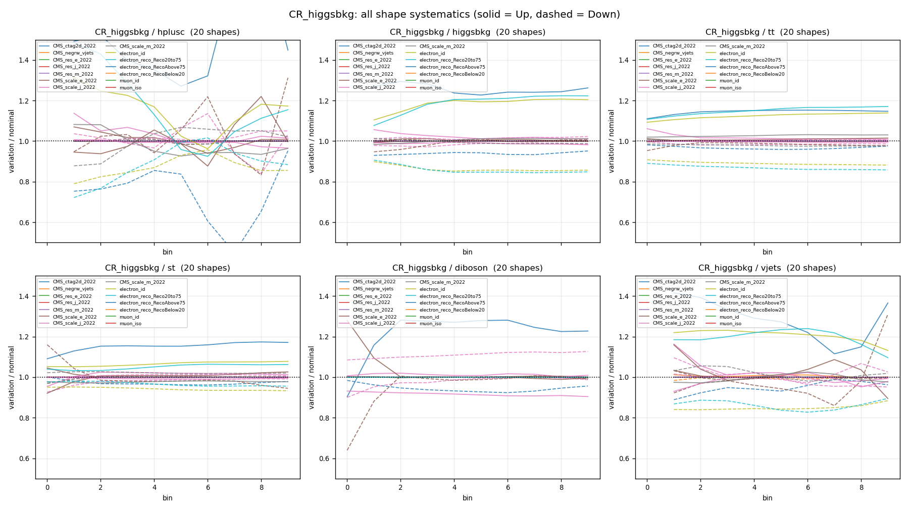
<span class="tiny">`CR_higgsbkg`</span>

</div>
<div>

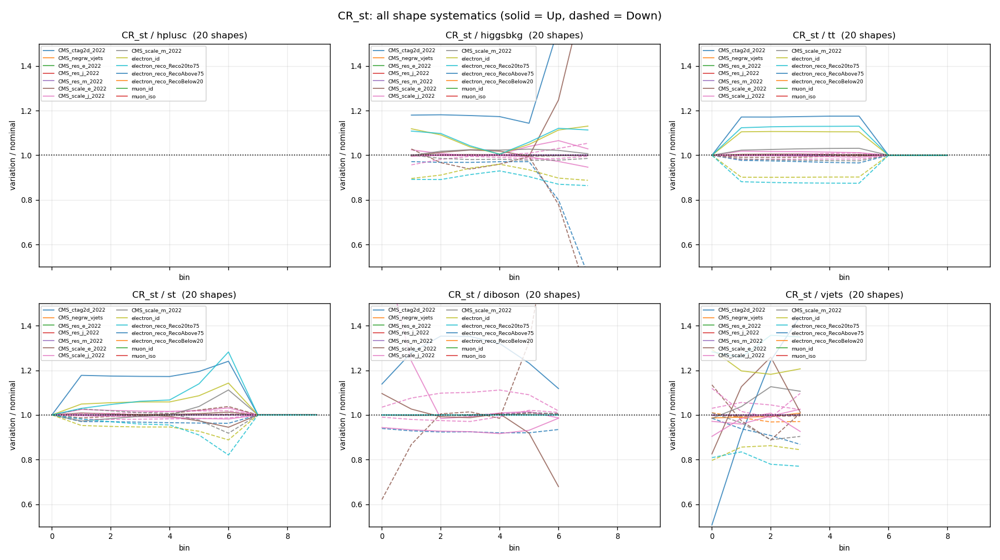
<span class="tiny">`CR_st`</span>

</div>
<div>

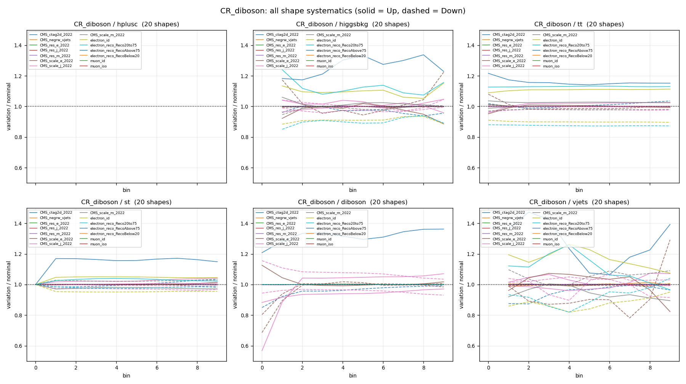
<span class="tiny">`CR_diboson`</span>

</div>
</div>

<span class="tiny">The 20 shapes are: `pileup`, `ps_isr`, `ps_fsr`, `scalevar_muR`,
`scalevar_muF`, `scalevar_muR_muF`, `muon_id`, `muon_iso`, `electron_id`,
`electron_reco_{RecoBelow20,Reco20to75,RecoAbove75}`,
`CMS_{scale,res}_{e,m,j}_2022` (6 object shifts), `CMS_ctag2d_2022`, `CMS_negrw_vjets`.</span>

---

## Fit diagnostics

<div class="cols">
<div>

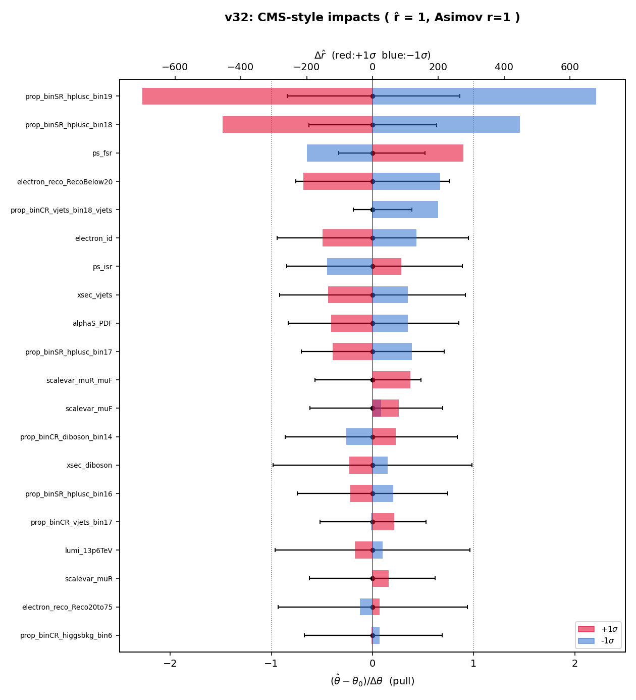
<span class="tiny">v32 impacts — `autoMCStats` dominates here too, confirming this is a
property of the inputs and not of one discriminant.</span>

</div>
<div>

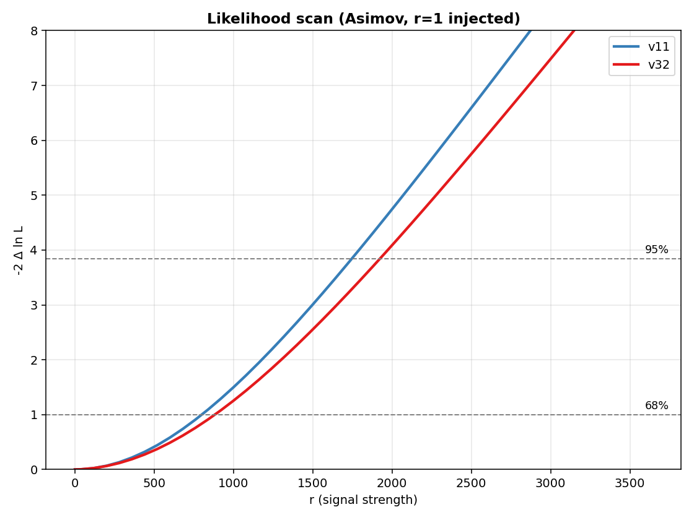
<span class="tiny">$-2\Delta\ln L$ vs $r$ for v11 and v32 (Asimov, $r=1$ injected)
with 68/95% lines.</span>

</div>
</div>

---

## Where we started: limits before the fix

<div class="cols">
<div>

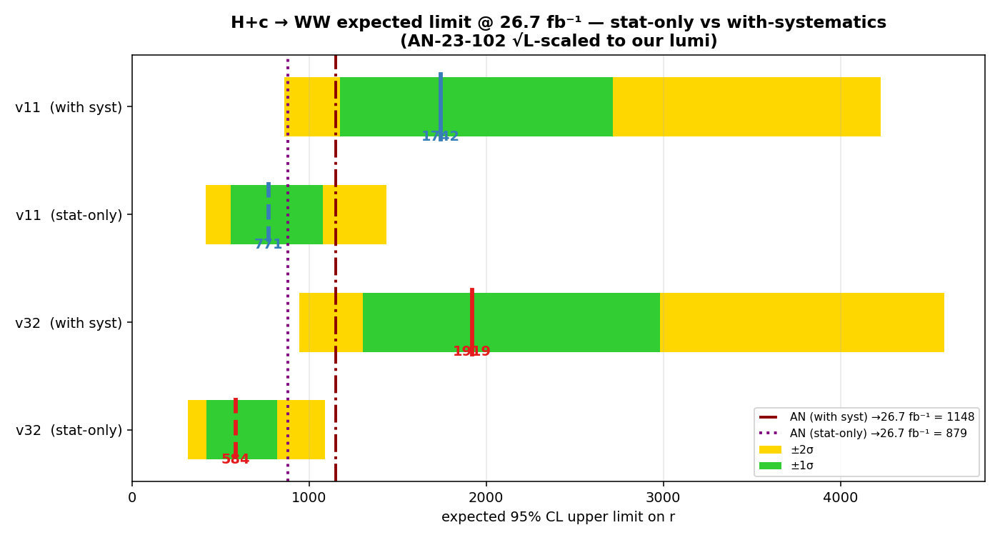
<span class="tiny">stat-only and with-systematics for v11 & v32, vs AN-23-102 √L-scaled to
26.7 fb⁻¹ (syst 1148, stat 879). **Our stat-only beats the AN's; our with-syst is far
worse** — the signature of systematic (here MC-stat) inflation.</span>

</div>
<div>

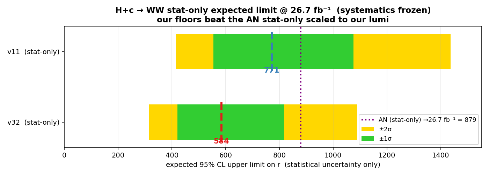
<span class="tiny">stat-only only: v11 = 771, v32 = 584 vs AN scaled = 879. Our
discriminants are genuinely good — the floors beat the published analysis at equal
luminosity.</span>

</div>
</div>

---

## The pre-negrw workaround, for the record

<div class="cols">
<div>

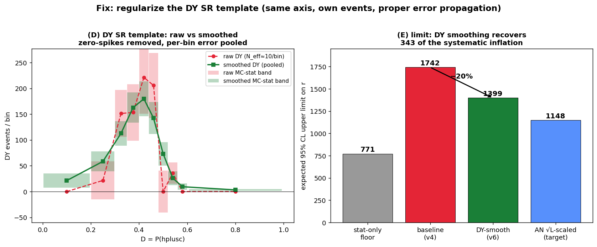

</div>
<div class="small">

Before the reweighting existed, the symptom was treated by **smoothing** the DY template:
1742 → **1399**.

<span class="hl">This is what negrw replaced.</span> Smoothing pools the sparse tail into a
smooth shape — it hides the variance rather than removing it, and it biases the template
shape by construction.

The reweighting instead raises $N_\text{eff}$ **at the source** (3.44× in the SR) and reaches
**1343** without touching the shape.

<span class="tiny">Per the Jul-17 decision, the two are **not** stacked — running both would
double-count the regularisation.</span>

</div>
</div>

---

<!-- _class: lead -->

## Backup B — reference

---

## Configuration reference

<div class="small">

| item | value |
|---|---|
| Training workflow | `hww_genrw_train`, 2022postEE |
| Training selection | base cuts + `veto_emu_sr` |
| Events / files | 9,832,308 / 502 parquet |
| Positive fraction | 0.836 |
| Model | 20 × `HistGradientBoostingClassifier` |
| Subsample | 60%, without replacement, seeded |
| Hyperparameters | `log_loss`, `max_iter` 200, `lr` 0.05, `max_depth` 4, `l2` 1.0 |
| Ensemble log-loss / AUC | 0.331 / 0.829 |
| Closure ratio (train region) | 0.994 |
| $N_\text{eff}$ (train region) | 2.92M → 4.68M (+60%) |
| $N_\text{eff}$ (SR) | 455 → 1563 (**3.44×**) |
| Image | `coffea-base-almalinux9:0.7.30-py3.10` (sklearn 1.7.2) |
| Model artifact (master) | `/eos/user/c/cgupta/HToWW/b-hive/negrw_out_img/negrw_models.joblib` |
| Model artifact (workers) | `/afs/cern.ch/user/c/cgupta/negrw_model/negrw_models.joblib` |
| Reweighted datasets | `DYto2L_2Jets_10to50`, `DYto2L_2Jets_50`, `WtoLNu_2Jets` |

</div>

---

## Where it can fail

<div class="small">

The identity $\sum|w|g \equiv \sum w$ holds for the **true** $P_+$. With an estimated
$\hat{P}_+$ the failure modes are:

**1. Mis-modelled $P_+$** (poor features, under-trained). Symptom: closure ratio drifts from 1.
→ Gated by the closure test (0.994) and the SR calibration plot.

**2. Extrapolation.** If the inference region sits outside the training domain in some feature,
$\hat{P}_+$ is unconstrained there. → Gated by the explicit coverage check (interpolation only).

**3. Wrong events reweighted.** A generator-specific $g$ applied to a different process is
silently wrong. → This is bug #1 above; gated by exact dataset matching.

**4. Local closure ≠ global closure.** Even a well-calibrated $\hat P_+$ can drift in a small,
kinematically-biased corner — this is our 6% SR offset, handled by the per-dataset renorm and
declared as an extension beyond the paper.

</div>

---

## Per-bin SR template, numerically

<div class="small">

V+jets, `SR_hplusc`, from the combine input ROOT files.

| bin | baseline $\sum w$ | rel. err | negrw $\sum\|w\|g$ | rel. err |
|---:|---:|---:|---:|---:|
| 1 | 21.5 ± 36.8 | 171% | 63.9 ± 22.2 | 35% |
| 2 | 151.4 ± 45.6 | 30% | 70.9 ± 20.0 | 28% |
| 3 | 153.3 ± 54.7 | 36% | 139.3 ± 30.0 | 22% |
| 4 | 221.3 ± 70.6 | 32% | 191.1 ± 32.8 | 17% |
| 5 | 205.6 ± 62.8 | 31% | 172.1 ± 33.2 | 19% |
| 6 | <span class="hl">0.00 ± 41.0</span> | <span class="hl">$\infty$</span> | 83.4 ± 20.4 | 24% |
| 7 | 35.8 ± 20.9 | 58% | 25.3 ± 15.5 | 61% |

Bin 6 is the bin that drove $r_{95}=1742$: content floored to $10^{-6}$ by the builder's
positivity guard, error $\pm41$ — an unconstrained background parameter directly under the signal.

</div>
