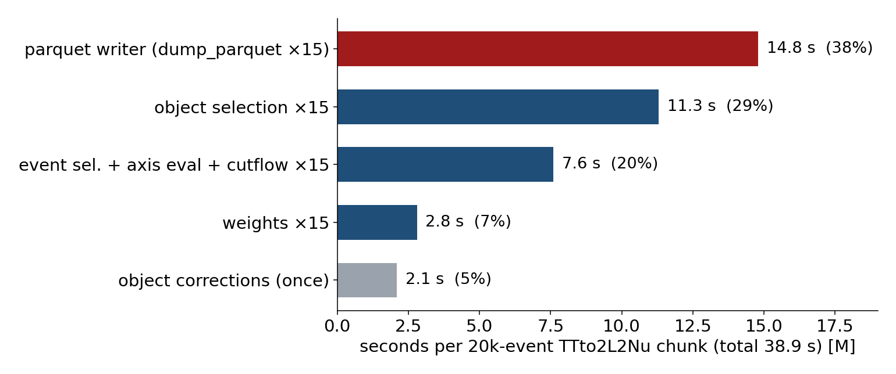
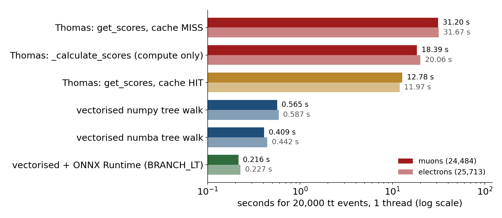
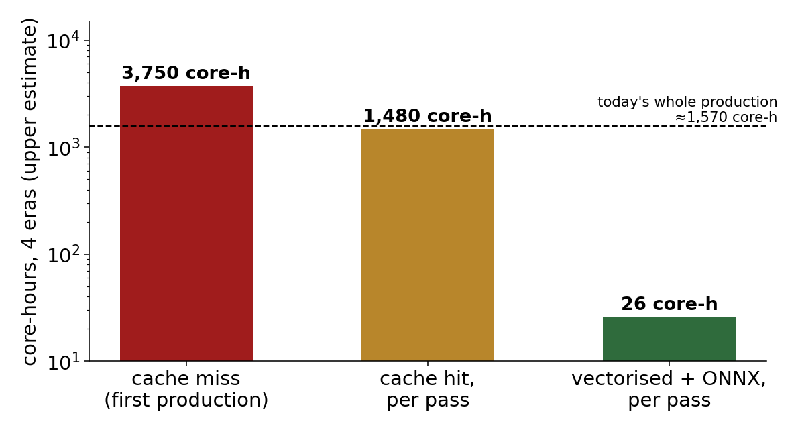

<!-- _class: lead -->
<!-- _paginate: false -->

# higgscharm framework: the next plan

### One processor, two modes (train / run), produced once

### + a faster, TMVA-exact ttH lepton-MVA (proposal for Thomas)

<br>

Chirayu Gupta · VUB · 9 October 2026

<span class="small">Numbers tagged [M] measured, [L] from production logs, [E] estimated. Source: <code>framework-plan-2026-10/2026-10-08-framework-optimization-plan.md</code></span>

---

# Bottom line

<div class="stats">
<div class="stat"><b>~2×</b><span>less processor CPU<br>1,570 → 700–900 core-h [E]</span></div>
<div class="stat"><b>h → min</b><span>after-production steps per era<br>1.5–2.5 h today [L]</span></div>
<div class="stat"><b>266 → &lt;5 GB</b><span>EOS per production<br>(histograms instead of parquet)</span></div>
<div class="stat"><b>26 vs 1,480</b><span>core-h per pass for ttH lepton-MVA<br>ONNX vs cache hit [M→E]</span></div>
</div>

- The event loop is **CPU-bound**, not I/O-bound. **38%** of it is one slow parquet conversion (447× fixable) [M].
- **Run mode** scores the MVA inside the processor and fills histograms → no merge, no inference pass, no parquet cards.
- **Train mode** is a cheap nominal-only pass (~14% of a full pass per chunk) [M] used once to retrain.
- **GPUs are not needed** for this analysis today: the MLP scores 0.9 M events/s on one CPU thread [M].
- The correctness fixes add almost nothing to the cost. The **speed-up comes from the restructure**.

---

# Today: where the processor CPU goes



- 89% of a chunk is **re-running everything for each of the 14 object-shift passes** [M].
- `pa.Table.from_pydict(awkward)` converts element by element: 1.020 s → **0.0023 s** with `ak.to_numpy` first [M].
- `correctionlib.from_file` is re-parsed **109× per chunk** (~3%) [M]. Jobs request 1 CPU but use 2 [L].

---

# Today: the downstream round trip and EOS

<div class="cols">
<div>

| step, per era [L] | preEE | postEE | preBPix | postBPix |
|---|---|---|---|---|
| merge | 32 min | 65 min | 50 min | 33 min |
| inference | 9 min | 23 min | 17 min | 10 min |
| card build | 18 min | 43 min | 31 min | 12 min |

- First-pass job failures **25–34%** (dead xrootd sites) [L].
- One corrupted ROOT histogram from an EOS write glitch.
- Production wall time **1–2 days** for 4 eras.

</div>
<div>

**EOS: 266 GB per production** [M]

| 2022postEE (91.7 GB) | GB |
|---|---|
| per-job shards (only until merge) | 39.0 |
| merged shift trees (half = `mva/` rewrite) | 38.0 |
| merged + `mva/` nominal | 11.8 |

- Inference rewrites the **whole dataframe** to add 6 scores.
- 53 `weight_*` columns ≈ 50% of nominal bytes.

</div>
</div>

---

# Target: one processor, two modes

<div class="cols">
<div>

```text
NanoAOD chunk
  └─ corrections, once (JEC/JER/Type-1 MET, lepton SS)
  └─ for pass in [nominal, 14 shifts]:
        select objects + events
        weights container
        X = features.compute(...)      ← one shared module
        ┌──────────── RUN mode ────────────┐
        │ score = model(X)  (ONNX, k-fold) │
        │ fill templates[dataset, channel, │
        │      score, variation]           │
        └──────────────────────────────────┘
        ┌──────────── TRAIN mode ──────────┐
        │ nominal pass only                │
        │ write slim ntuple (features,     │
        │ weight, label, fold)             │
        └──────────────────────────────────┘
```

</div>
<div>

**New / changed modules**

- `features/hww.py`: the 26 inputs incl. **c-tag 2D one-hots**, plus a `FEATURES_HASH`.
- `models/registry.py`: model + `meta.yaml`; **refuses to run** if the feature hash differs.
- `sinks/hist_sink.py`, `sinks/ntuple_sink.py` (numpy-backed writer).
- `config/validate.py`: runs on the submit host before any job.
- `build_cards.py` reads summed histograms; replaces both card scripts and `ttsyst.yaml`.

</div>
</div>

---

# Principles behind the restructure

<div class="cols">
<div>

### Fail loud
A missing column, key, PD name, xsec or weight variation **raises**. Exceptions are an explicit allow-list in config. Silent fallbacks caused **8 of the bugs** found this month.

### Validate before submitting
PD names map to trigger logic; every carded sample has xsec > 0; every shape systematic has a producer; correctionlib tags exist (would have caught the JER split-tag no-op).

</div>
<div>

### Train and fit see identical inputs
One feature function for both. The registry checks the hash, so a model can never be scored on features it was not trained on.

### k-fold by `event % 5`
Each event is scored by the fold that did not see it. Removes the training-overlap caveat without losing fit statistics.

### Shift-aware later
Lepton shifts skip jet work; JES/JER skip lepton work. **Further ~2×** [E], after the restructure.

</div>
</div>

---

# Produce once: Pass A → freeze → Pass B

| step | what | cost | used for |
|---|---|---|---|
| **Phase 0–2** | decisions, all P0 fixes, validator, writer fix, feature module, train mode | 1–2 weeks [E] | |
| **Pass A** | TRAIN mode, 4 eras, data + MC, nominal only | ~14–20% of a production; ~0.5 day wall [E] | retrain, data/MC + slope study, **stat-only** limit check |
| **Freeze v12** | 6 classes + Wγ, k-fold, central signal, all eras | minutes on CPU | registry entry + hash |
| **Phase 4** | RUN mode + closure test vs parquet route | 5–7 days [E] | templates must match **bin by bin ≤1e-6** |
| **Pass B** | RUN mode, the **only full production** | 1–1.5 days wall [E] | cards, limits, impacts |

- Pass B can also write an opt-in **slim per-shift ntuple** (features + weights, ~30–40% of today's bytes) as insurance against a later retrain.
- Pre-fix reference to beat: Run 3 expected **691** (stat-only 338.5) at 61.9 fb⁻¹.

---

# GPUs: measured, not needed now

| question | measurement | verdict |
|---|---|---|
| Is the event loop I/O-bound? | TT job: 9 h CPU in 5 h wall on 2 workers [L]; decompression 0.7 s of 39 s [M] | **No.** CPU-bound in awkward/Python overhead |
| MLP inference (v11, 14.9k params) | 1 M events in 1.09 s, 1 thread [M] | inline scoring ≈ **12 ms per 20k chunk** |
| MLP training | 0.4–0.6 M events/s on CPU [M] | 30 epochs × 5 M rows ≈ 4–6 min [E] |
| ttH lepton BDT (500 trees) | 8.8 µs/lepton, ONNX, 1 thread [M] | CPU is fine |

- coffea 0.7 / awkward 1 and correctionlib have **no GPU backend**; condor CPU slots have no GPUs.
- Worth booking a GPU for: bigger models (13-class κ-HCE, particle-level), k-fold × seed ensembles, hyper-parameter scans.

---

<!-- _class: sec -->

# ttH lepton-MVA: proposed changes for Thomas

Branch `tvl/MVA` read with `git show`, nothing merged. Benchmarked on 20k real 2022postEE tt events (~50k leptons), scripts in `/eos/user/c/cgupta/higgscharm/runall/plan/tthmva/`

---

# What the branch does today

<div class="cols">
<div>

**Scoring** (`analysis/tthMVA/`)
- `cache.py` loops over every (event, lepton) and reads 13 scalars with `events.Muon[i, j]` + `float()`.
- `evaluator.py` walks 500 trees per lepton as nested Python dicts, `if value > cut: right`.

**Cache**
- One parquet per NanoAOD file, keyed `(run, lumi, event, lepton idx)`, under a directory named after **his condor partitions**.
- On a miss: compute, temp file, `FileLock`, merge. On every call: re-read the whole file, build a Python `set` + `dict`.

</div>
<div>

**Issues found**
- **114 GB / 42k files** on EOS, tied to one partitioning.
- Path logic mis-derives the user path from `/eos/home-c/...` (measured).
- Scores computed **after** muon scale/smearing; TMVA was trained on NanoAOD-level inputs.
- `>` instead of TMVA's `>=` → **not TMVA-exact** (next slides).
- Same **Type-1 MET sign/double-count bug** and **no-op JER** that we fixed on 2026-10-06 are present in his `jerc.py`.

</div>
</div>

---

# Benchmark: compute beats the cache, even on a hit



**ONNX (`BRANCH_LT`) is 144× / 140× faster than a cache miss and 59× / 53× faster than a cache hit** (μ / e) [M]. A cache hit also pays a fixed **1.7–2.2 s per call** to load an 18 MB real cache file (2.15 M leptons) [M].

---

# At production scale the cache never pays off

<div class="cols">
<div>



</div>
<div>

Per pass, 4 eras (≈1.1e10 leptons, upper estimate) [E]:

| | core-h |
|---|---|
| cache miss (first production) | **3,750** |
| cache hit | **1,480** |
| — if called in each of 15 shift passes | ×15 |
| vectorised + ONNX | **26** |

- 26 core-h ≈ **1.7%** of today's whole production.
- Storage: **114 GB → 0**. No locks across hundreds of workers, no partition coupling.

</div>
</div>

---

# Correctness: TMVA sends `x == cut` to the right

| evaluator | max \|Δ\| vs `TMVA::Reader`, random leptons | max \|Δ\| on tie leptons |
|---|---|---|
| vectorised numpy / numba, float32 `>=` | 3.3e-16 | 3.3e-16 |
| **ONNX `BRANCH_LT`** | ≤ 1e-6 | **≤ 1e-6** |
| Thomas's evaluator (`>`) | — | **3.2e-2 (e), 1.4e-3 (μ)** |
| our August ONNX (`BRANCH_LEQ`) | — | same as Thomas (our bug too) |

- `TMVA::DecisionTreeNode::GoesRight` is `x >= cut` in single precision.
- **3.3% of electrons** (861 / 25,713) sit exactly on a split: NanoAOD `Electron_mvaIso` is stored at reduced precision and its values (0.99999881, …) are themselves split thresholds. Muons: 11 / 24,484 (`jetBTagDeepFlavB`, `segmentComp`).
- Working-point flips in this sample: **1 / 25,713** electrons at 0.9, none for muons at 0.67. Small, but the evaluator should be exact.

---

# Proposed change 1: score once per chunk, vectorised

```python
# analysis/leptonmva/tth.py  (ported from plan/tthmva/tthmva_vec.py)
import pyarrow  # noqa: F401  -- import BEFORE onnxruntime in the job image (GLIBCXX clash)
import onnxruntime as ort

def lepton_features(events, coll):            # coll = "Muon" | "Electron"
    """All leptons at once -> (n_leptons, 13) array + counts. Same expressions as the XML."""
    ...                                       # guarded jetIdx -> flat jet index for btagDeepFlavB,
                                              # min(1/(1+jetRelIso),1.5), log|dxy|, log|dz|, ...

def tth_scores(events, coll, model_path):
    X, counts = lepton_features(events, coll)
    sess = _session(model_path)               # cached per (coll, era), 1 intra-op thread
    s = sess.run(None, {sess.get_inputs()[0].name: X.astype("float32")})[0].reshape(-1)
    return ak.unflatten(s, counts)            # final TMVA score, no extra transform

# BaseProcessor.process(): ONCE per chunk, on NanoAOD-level inputs, BEFORE object corrections
events["Muon", "tthMVA"]     = tth_scores(events, "Muon",     MODELS["Muon", era])
events["Electron", "tthMVA"] = tth_scores(events, "Electron", MODELS["Electron", era])
```

Every shift pass reuses the attached field. Nothing is cached on disk. Fallback if ONNX is unwanted: the numba walk (17 µs/lepton, TMVA-exact).

---

# Proposed change 2: what to keep, drop and validate

<div class="cols">
<div>

### Keep from `tvl/MVA`
- The TMVA XMLs (md5 identical to ours).
- WP definitions in `working_points.py` (`muon_promptMVA` > 0.67, `electron_promptMVA` > 0.9 / pT-split 0.35), re-pointed at `tthMVA`.
- `add_promptMVA_weights` + the latinos SF JSONs, **after** checking their WP, ID baseline and era coverage.
- His small `jerc.py` hygiene fixes (`Path.exists()`, `import warnings`, `raise ValueError`).

### Drop
- `cache.py`, `TMVAGradBDT`, `convert_xml_to_json.py`, `FileLock`, the user-path logic, and the 114 GB cache.

</div>
<div>

### ONNX model
- Regenerate with the converter fixed to **`BRANCH_LT`** (fixed files already in `plan/tthmva/out/`).
- Ship each `.onnx` with a `meta.yaml`: variable list + XML sha256.

### Validation script, in the repo
- `TMVA::Reader` vs ONNX on ≥1000 real leptons per flavour **including all tie leptons**; require ≤ 1e-6.
- One spot-check file per era.
- Decide the `log|dxy|`, `log|dz|` floor at 0 (TMVA sees `-inf`).

### Decide together
- NanoAOD pT (as trained, default) vs scale-corrected pT as input.

</div>
</div>

---

# Proposed change 3: integration order

<div class="warn">

**If the ttH-MVA working points go into the final result, they must be in Pass A and Pass B.** They change the lepton selection, add SFs and a systematic, and shift the MVA training population. Deciding later means another full production.

</div>

1. Port only the lepton-MVA pieces onto `hww-analysis`. **Do not merge** the ~28 overlapping files (his branch keeps the pre-fix Type-1 MET and no-op JER).
2. Add `leptonmva/tth.py` + ONNX `BRANCH_LT` + validation script (2–3 days [E]).
3. Compare lepton efficiency and selected yields vs the cut-based ID on tt and DY.
4. SF provenance check with Thomas, per era.
5. Then Pass A.

---

# Roadmap

| phase | scope | effort [E] |
|---|---|---|
| **0** decisions | 3rd-lepton veto, mT cut, Type-1 MET jets + JER-in-MET, jet veto map, **ttH-MVA adoption**, xsecs (WH/ZH/ggH), Wγ in training, k | ≤ 1 day |
| **1** correctness + fail-loud | 14 P0 fixes, NNLOPS scope, SC-η, writer + correctionlib perf, xrootd failover, validator | 3–5 days |
| **1b** ttH-MVA (if adopted) | vectorised features, ONNX `BRANCH_LT`, WPs + SFs | 2–3 days |
| **2** features + train mode + registry | `features/hww.py`, ntuple sink, k-fold labels, ONNX export | 3–4 days |
| **3** Pass A + retrain v12 | gate: AUC ≥ v11; stat-only limit vs 338.5 | ~0.5 day wall + training |
| **4** run mode | inline scoring, hist sink, shift datasets, `build_cards.py`, closure test | 5–7 days |
| **5** Pass B | the only full production → cards → limits → impacts | 1–1.5 days wall |
| **6** optional | shift-aware recompute (~2×), card-level P2 items, EOS cleanup | |

---

# Must-fix before Pass A (P0, selected)

| # | issue | effect |
|---|---|---|
| P0-1 | preEE `SingleMuon`/`DoubleMuon` PDs not recognised by the trigger logic | **6% duplicate data rows** in preEE |
| P0-2 | c-tag 2D one-hot MVA inputs never computed (filled with 0) | MVA saw zeros |
| P0-3 | `WminusH_WtoLNu`, `WplusH_Wto2Q` (H→WW) have **xsec 0.0** | WH→WW yield ×~2.2 after the fix |
| P0-4 | JER no-op, Type-1 MET sign, dead `CMS_res_e`, top-pT in shifts, WH→ττ PDF | fixed in code, **not yet reprocessed** |
| P0-5 | Type-1 MET sums over lepton-dominated / EM jets | MET shape |
| P0-6/7 | jets not re-sorted after JEC/JER; **jet veto map not applied** | leading-jet variables; mandatory veto |
| P0-8 | muon scale/smearing JSON pinned to the buggy 2025-08 release | muon pT |
| P0-9/13 | card builder and several corrections **silently fall back** | hidden errors |
| P0-14 | completeness checked by jobs, not events | truncated files go unnoticed |

<span class="small">Full list with file:line in the plan note, §5 (P0-1 … P0-14, P1, P2).</span>

---

# Decisions needed

<div class="cols">
<div>

### Selection (before Pass A)
- Third-lepton veto (recommended: yes)
- mT cut (can stay off if the MVA uses mT)
- Which jets enter the Type-1 MET sum; JER in MET or not
- Jet veto map (mandatory for 2022EE / 2023BPix)
- **Adopt Thomas's ttH-MVA working points?**

</div>
<div>

### Physics inputs
- WH / ZH / ggH cross sections (LHCHWG 13.6 TeV table)
- gg→WW / powheg WW samples (DAS first)
- Wγ in training (needs W+jets overlap removal)
- k for k-fold (5 proposed)
- Keep the slim ntuple safety net in Pass B?

</div>
</div>

<div class="key">

**Ask to Thomas:** move to vectorised scoring with ONNX `BRANCH_LT` once per chunk, drop the cache, and port only the lepton-MVA pieces onto the fixed branch. The benchmark scripts and fixed ONNX files are ready to share.

</div>
