<!-- _class: lead -->

# H+c flavour-scheme uncertainty

### From a flat 30% to a derived 3FS/4FS shape systematic

Chirayu Gupta · VUB · September 2026

 

Leading GEN c-hadron pT · validated on official Run 2 and Run 3 samples

---

# Scope — what this uncertainty covers

**This systematic covers ONLY the difference between the 3FS and 4FS flavour schemes.**

It does **not** cover the difference between the NLO normalisation of the nominal 4FS FxFx sample and higher-order predictions. LHCHWG-2026-007 (Table 3) finds the NNLO (MiNNLOPS) inclusive H+c cross section **~25% below NLO** at 13.6 TeV.

- Nominal signal is **unchanged**: 4FS FxFx, its own event weights, its NLO cross section
- No stitching, no NNLO normalisation: the sample is NLO, and an NNLO total would not carry the right selection efficiency
- The role of the uncertainty is **identical to Run 2** (AN-23-102 §7.1): *"Obtain the flavor scheme uncertainties (4FS vs. 3FS) … The differences between the two predictions are used as uncertainty"*
- What changes is **how** that difference is evaluated

---

# Today: a flat 30% inherited from Run 2

<table class="num">
<tr><th>item</th><th>Run 2 (HIG-24-009, AN-23-102)</th><th>this analysis today</th></tr>
<tr><td>nominal</td><td>4FS FxFx, σ = 90 fb (NLO)</td><td>4FS FxFx, NLO</td></tr>
<tr><td>FS uncertainty</td><td>3FS vs 4FS <b>non-FxFx</b> yield difference</td><td><code>xsec_hplusc_4FS_5FS</code> lnN 1.30</td></tr>
<tr><td>size</td><td>"order 30%, 3FS undershooting 4FS"</td><td>30%, flat</td></tr>
<tr><td>impact</td><td>dominant theory uncertainty; kink in the likelihood</td><td>expected limit 921 → 1034 (+11%)</td></tr>
</table>

**Limitations of the flat recipe**
- compares 3FS with a 4FS sample (non-FxFx) that is **not** the nominal
- one number: no pT dependence, no propagation through the selection
- **cannot be redone in Run 3**: there is no 3FS H→WW sample, only 3FS H→γγ

---

# What LHCHWG-2026-007 tells us

**Table 3** (13.6 TeV, H→γγ, γ + c-jet fiducial, fb):

<table class="num">
<tr><th></th><th>3FS</th><th>4FS</th><th>3FS/4FS</th></tr>
<tr><td>NLO</td><td>0.0140</td><td>0.0226</td><td><b>0.62</b></td></tr>
<tr><td>NLO × own NNLO K</td><td>0.0182</td><td>0.0172</td><td><b>1.06</b></td></tr>
</table>

- the big plain-yield gap is mostly **normalisation** (perturbative order), not kinematics
- **Fig. 11:** in a fiducial γγ + c-jet region, 4FS FxFx, 3FS, stitched and MiNNLOPS agree in **shape** within ~10–15%
- the paper: the plain yield comparison "resulting in O(30%) discrepancy" is **not needed**

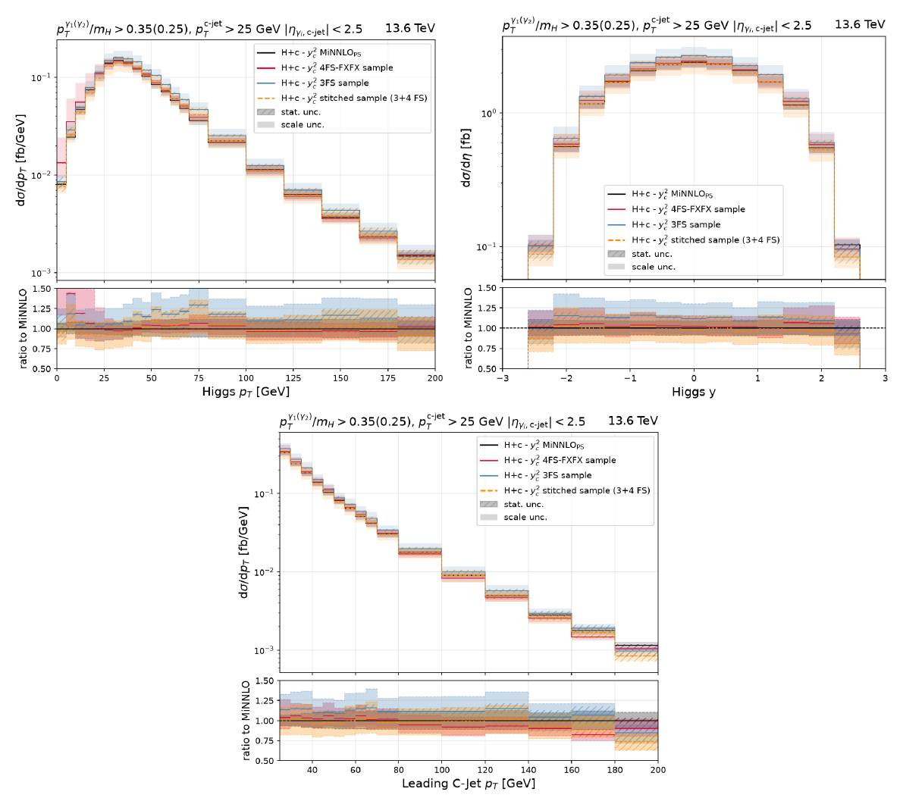

LHCHWG-2026-007, Fig. 11 (arXiv:2608.26863)

⇒ Evaluate the **scheme difference as a shape**, with both schemes at the same inclusive cross section.

---

# Method

**Event variable:** leading GEN **c-hadron** pT
- weakly-decaying open-charm hadron (D⁰, D±, Ds, Λc, …; charmonium excluded; D\*→D counted once)
- not from a b-hadron, |η| < 2.5, pT > T = **5 GeV** (10 GeV as check)
- stored in NanoAOD `GenPart` (Run 2 v9, Run 3 v13) → **same definition in derivation and in the analysis**
- **immune to the Higgs decay products** — GEN c-jets are not: photons / leptons are clustered into `GenJet`s

**Weights** — both schemes at the **same inclusive cross section** (pure fraction ratios, normalisation-free):

$$w(\text{bin}) = \frac{\sigma_{3FS}(\text{bin})/\sigma_{3FS}^{\text{incl}}}{\sigma_{4FS}(\text{bin})/\sigma_{4FS}^{\text{incl}}}, \qquad w_0 \text{ for events with no c-hadron above } T$$

- **Up = w** (3FS-like), **Down = 2 − w** (mirror); nominal = 1
- inclusive cross section unchanged by construction; the variation **redistributes** events → changes the selection efficiency

---

# Samples — all official, all files read

<table class="num">
<tr><th>sample (H+c, MuRFScaleDynX0p50)</th><th>3FS files</th><th>3FS events</th><th>4FS FxFx files</th><th>4FS FxFx events</th></tr>
<tr><td>Run 3 2022preEE, H→γγ</td><td>54</td><td>1.06 M</td><td>61</td><td>2.20 M</td></tr>
<tr><td>Run 3 2022postEE, H→γγ</td><td>57</td><td>3.87 M</td><td>123</td><td>7.56 M</td></tr>
<tr><td>Run 3 2023, H→γγ</td><td>37</td><td>2.78 M</td><td>48</td><td>5.64 M</td></tr>
<tr><td>Run 3 2023BPix, H→γγ</td><td>28</td><td>1.37 M</td><td>27</td><td>2.68 M</td></tr>
<tr><td>Run 2 UL18, H→γγ</td><td>72</td><td>2.00 M</td><td>120</td><td>4.88 M</td></tr>
<tr><td>Run 2 UL18, H→WW→2ℓ2ν</td><td>4</td><td>5.00 M</td><td>68</td><td>19.8 M</td></tr>
</table>

- negative-weight fraction: **3FS ≈ 40%**, 4FS FxFx ≈ 21%
- Run 3 has **no 3FS H→WW** → weights derived on H→γγ, transfer to H→WW validated in Run 2
- NanoAOD streamed over xrootd, 0 files skipped; standalone scripts, outside the analysis framework

---

# The weights — Run 3, four eras combined

<table class="num">
<tr><th>leading c-hadron pT [GeV]</th><th>none</th><th>5–10</th><th>10–15</th><th>15–20</th><th>20–30</th><th>30–45</th><th>45–60</th><th>60–80</th><th>80–110</th><th>&gt;110</th></tr>
<tr><td><b>wup</b></td><td>0.776</td><td>1.410</td><td>1.231</td><td>1.106</td><td>1.052</td><td>1.047</td><td>1.077</td><td>1.076</td><td>1.151</td><td>1.183</td></tr>
<tr><td>stat. unc.</td><td>0.002</td><td>0.004</td><td>0.005</td><td>0.007</td><td>0.007</td><td>0.009</td><td>0.016</td><td>0.023</td><td>0.035</td><td>0.051</td></tr>
</table>

- 3FS puts **more** of the cross section into events with a c-hadron above 5 GeV: f(≥1c) = 0.595 (3FS) vs 0.478 (4FS FxFx)
- largest effect at **low** c-hadron pT (+41% at 5–10 GeV), 5–15% above 20 GeV
- delivered as correctionlib: `hplusc_fs_shape` (inputs `syst`, `gen_chad1_pt`; −1 if no c-hadron)

Consistent with the paper's Fig. 8: 3FS / 4FS FxFx leading D-hadron pT ≈ 1.1–1.25 at equal inclusive σ.

---

# Validation 1 — Run 3 eras

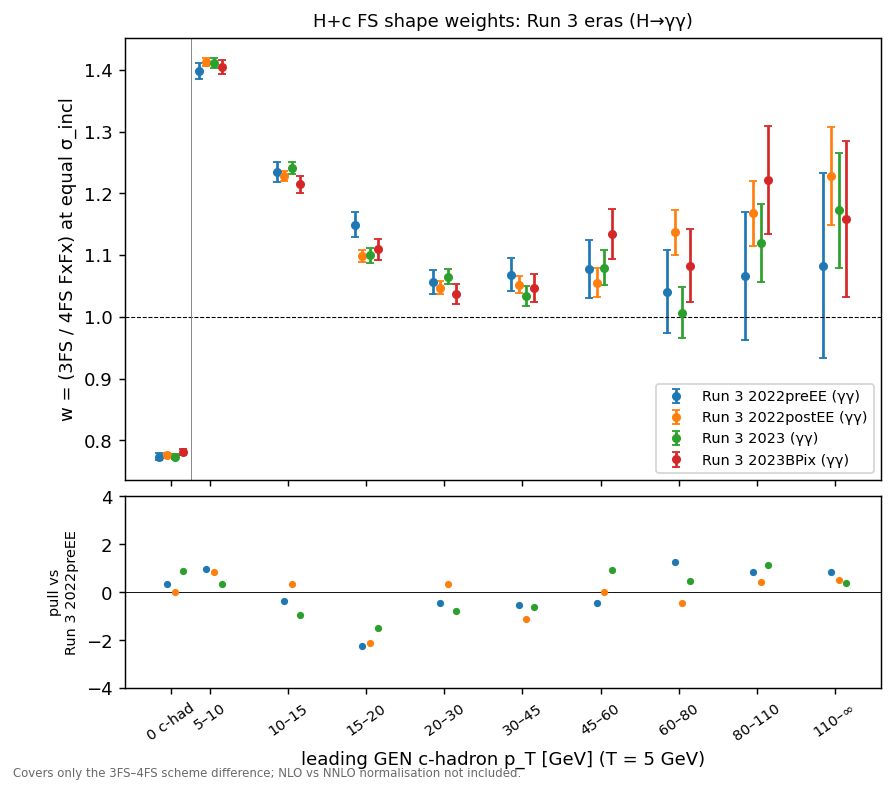

All six era pairs compatible: **χ²/ndf = 6.2 – 10.0 / 10** → one combined Run 3 table.

---

# Validation 2 — H→γγ vs H→WW (Run 2 UL18)

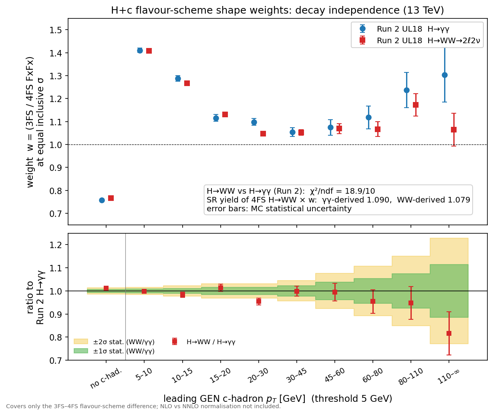

- ratio H→WW / H→γγ consistent with 1 within the **±1–2σ statistical bands** in 9 of 10 bins
- bins holding most of the cross section agree within **≤ 1.6%**
- one bin at 2.9σ (20–30 GeV); χ²/ndf = 18.9/10
- weights applied to the 4FS H→WW sample, SR yield: γγ-derived **1.090** vs WW-derived **1.079** (~1%)

**Verdict:** weights derived on H→γγ describe H→WW → the same procedure can be used in Run 3, where only 3FS H→γγ exists.

The 20–30 GeV bin is a fluctuation of the Run 2 H→γγ 3FS sample (backup).

---

# Validation 3 — energy and threshold

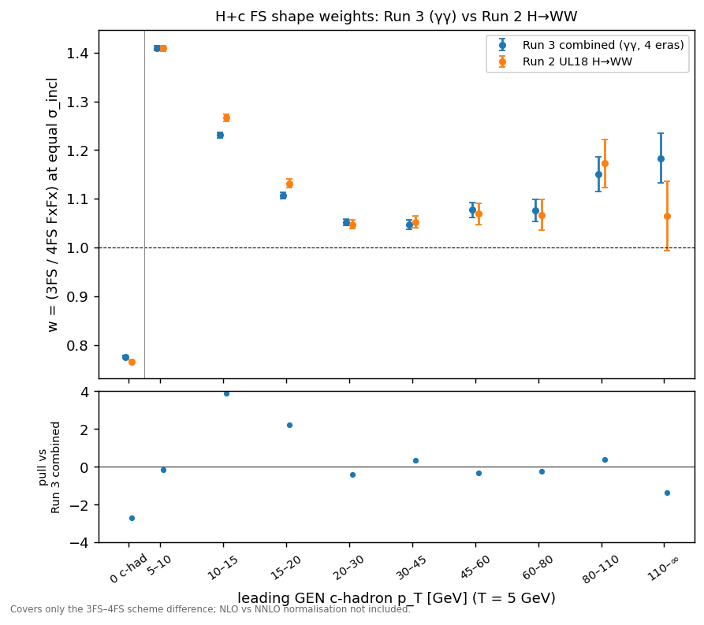

Run 2 (13 TeV) vs Run 3 (13.6 TeV): differences **2–5%** (χ² 30/10 for WW) — an energy effect; the Run 3 analysis uses the **Run 3** table.

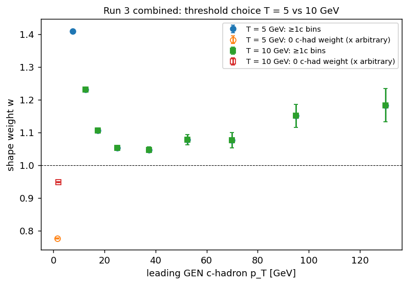

T = 5 vs 10 GeV: **identical above 10 GeV** by construction; only w0 changes (0.78 → 0.95).

---

<!-- _class: sec -->

# Reco-level validation on real H→WW

Run 2 UL18 — the only era with a real 3FS H→WW sample

Standalone approximation of the selection: OS eμ, tight μ / WP80 e, pT > 20/10, pT,ll > 30, 12 < mll ≤ 72, mT,l2 > 30, mT,ll > 60; SR adds ≥ 1 jet pT > 20 with DeepJet-medium c-tag (UL18 stand-in for PNet)

---

# Closure on the SR yield

All samples at the **same inclusive cross section** (scheme comparison only):

<table class="num">
<tr><th>region</th><th>real 3FS / 4FS</th><th>4FS × wup (γγ Run 3)</th><th>(γγ Run 2)</th><th>(WW-derived)</th><th>4FS × wdown</th></tr>
<tr><td>preselection</td><td>1.041 ± 0.010</td><td>0.998</td><td>0.999</td><td>0.998</td><td>1.002</td></tr>
<tr><td><b>SR (≥1 c-tag)</b></td><td><b>1.063 ± 0.023</b></td><td><b>1.073</b></td><td>1.090</td><td>1.079</td><td>0.927</td></tr>
</table>

- the systematic moves the SR yield by **±7.3%** and **covers the real 3FS sample** (+6.3 ± 2.3%), closing within 0.5σ
- weights derived on γγ (Run 2 or Run 3) vs on WW itself: **1.073 – 1.090 vs 1.079** → decay transfer holds at reco level
- compare: Run 2 assigned a flat **30%**

Honest detail: part of the SR closure is a compensation — 3FS has +4% at preselection that the c-hadron weights do not model, while the weights give a larger c-tag gain (+7.5%) than the real 3FS (+2%).

---

# SR shapes — 3FS vs 4FS FxFx with the systematic

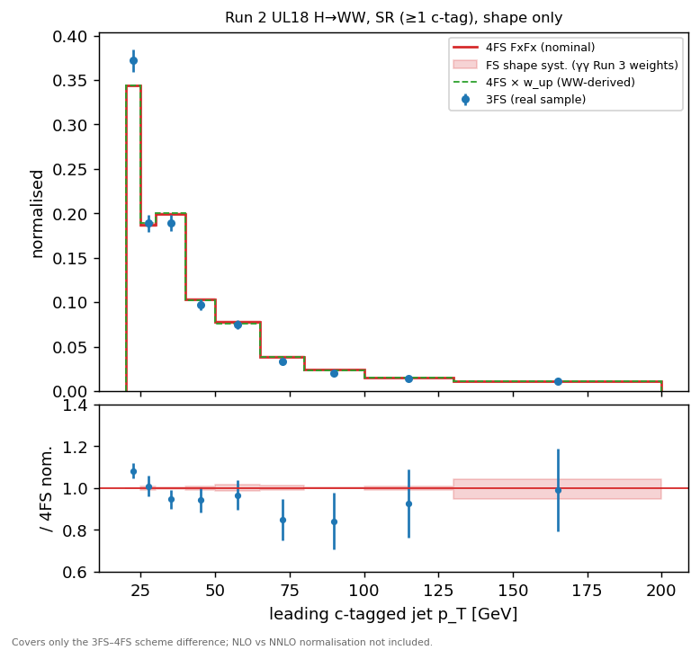

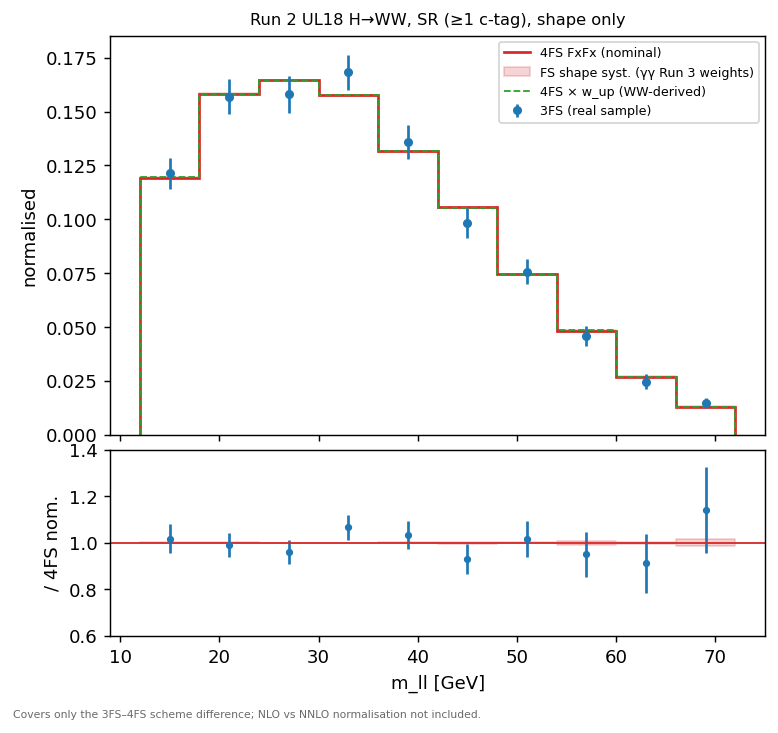

3FS and 4FS FxFx agree within statistics in c-jet pT/η, mll, pT,ll, mT, lepton pT, MET, c-tag scores, N c-tags (χ² ≈ ndf). The systematic's shape effect in these observables is ±1–4%.

---

# Open item — jet multiplicity

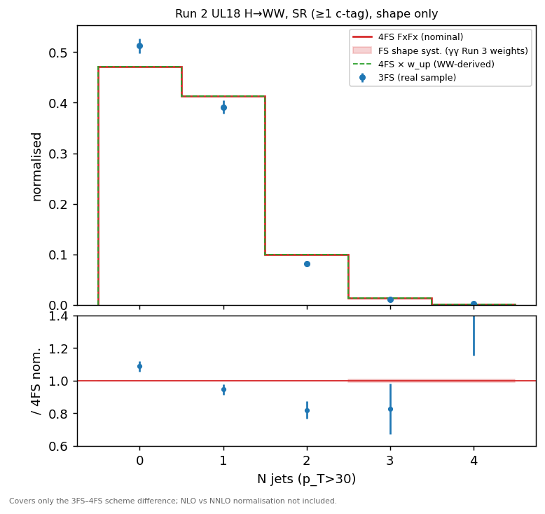

<table class="num">
<tr><th>N jets (pT>30)</th><th>4FS FxFx</th><th>3FS</th><th>3FS/4FS</th></tr>
<tr><td>0</td><td>0.471</td><td>0.512</td><td>1.09</td></tr>
<tr><td>1</td><td>0.413</td><td>0.391</td><td>0.95</td></tr>
<tr><td>2</td><td>0.100</td><td>0.082</td><td>0.82</td></tr>
<tr><td>3</td><td>0.014</td><td>0.011</td><td>0.8</td></tr>
</table>

- **χ² = 23/5, not covered**: the c-hadron weights move N jets by only ±1%
- partly a merging effect (FxFx has H+1j at ME level, 3FS is unmerged)

**Options:** (a) add an N-jet component derived from Run 2 H→WW; (b) check the N-jet weight in the fit first; (c) document as a limitation

---

# Why not stitch — what it would cost

SR of the Run 2 H→WW study, same inclusive cross section:

<table class="num">
<tr><th></th><th>4FS FxFx (nominal)</th><th>stitched (3FS ≥1c + 4FS 0c)</th><th>3FS</th></tr>
<tr><td>7-point scale envelope of the SR yield</td><td>+13.4 / −9.5%</td><td>+14.1 / −14.8%</td><td>+16.7 / −17.9%</td></tr>
<tr><td>negative-weight fraction</td><td>21%</td><td>mixed</td><td>40%</td></tr>
<tr><td>effective MC events in the SR (Neff)</td><td><b>55 971</b></td><td>dominated by 3FS part</td><td><b>2 265</b></td></tr>
<tr><td>3FS H→WW available in Run 3</td><td>—</td><td><b>no</b></td><td><b>no</b></td></tr>
</table>

- stitching needs 3FS H→WW samples that do not exist in Run 3, and brings a larger scale envelope and ~25× fewer effective events
- the shape systematic keeps the 4FS FxFx statistics and scale treatment, and reproduces the 3FS SR yield (slide 12)

---

# Relation to LHCHWG-2026-007

<table>
<tr><th>paper</th><th>this approach</th></tr>
<tr><td>drop the plain massive-vs-massless yield uncertainty (O(30%))</td><td>✅ dropped</td></tr>
<tr><td>scheme differences are mostly normalisation; shapes agree within ~10–15% (Tab. 3, Fig. 11)</td><td>✅ evaluated as a shape, both schemes at equal inclusive σ</td></tr>
<tr><td>μR = μF = HT/4, 7-point envelope</td><td>✅ samples use this setup; signal scale variations kept in the card</td></tr>
<tr><td>stitching when no NNLO+PS is available</td><td>➖ not done: no 3FS H→WW in Run 3; ±15% scale and ~25× MC-stat cost</td></tr>
<tr><td>split on c-jets with pT > 10 GeV</td><td>➖ c-hadron pT > 5 GeV (decay-immune, NanoAOD); identical above 10 GeV</td></tr>
<tr><td>"reweight the NLO+PS cross section with the most accurate inputs available"</td><td>➖ nominal kept at NLO — <b>see the scope caveat</b></td></tr>
</table>

---

# Summary

- The 30% `xsec_hplusc_4FS_5FS` lnN is replaced by a **3FS/4FS shape systematic** in leading GEN c-hadron pT, with both schemes at the same inclusive cross section
- Derived on **official** Run 3 H→γγ samples (four eras, consistent), delivered as correctionlib
- **Validated:** Run 3 eras ✔ · H→γγ vs H→WW (1% on the SR yield) ✔ · real 3FS H→WW SR yield covered and closed within 0.5σ ✔
- Size on the SR yield: **±7.3%** vs the flat 30% before
- Open: **jet multiplicity** not covered (up to −18% at 2 jets) — decision needed

**Scope:** covers ONLY the 3FS–4FS flavour-scheme difference. It does not cover the NLO vs NNLO normalisation of the nominal sample (~25% lower at NNLO, LHCHWG-2026-007 Table 3).

**Next:** GEN c-hadron column + weight in the framework → reprocess H+c signal → card: remove lnN, add `hplusc_fs_shape` → limit and impacts

---

<!-- _class: sec -->

# Backup

---

# Backup — the 20–30 GeV bin

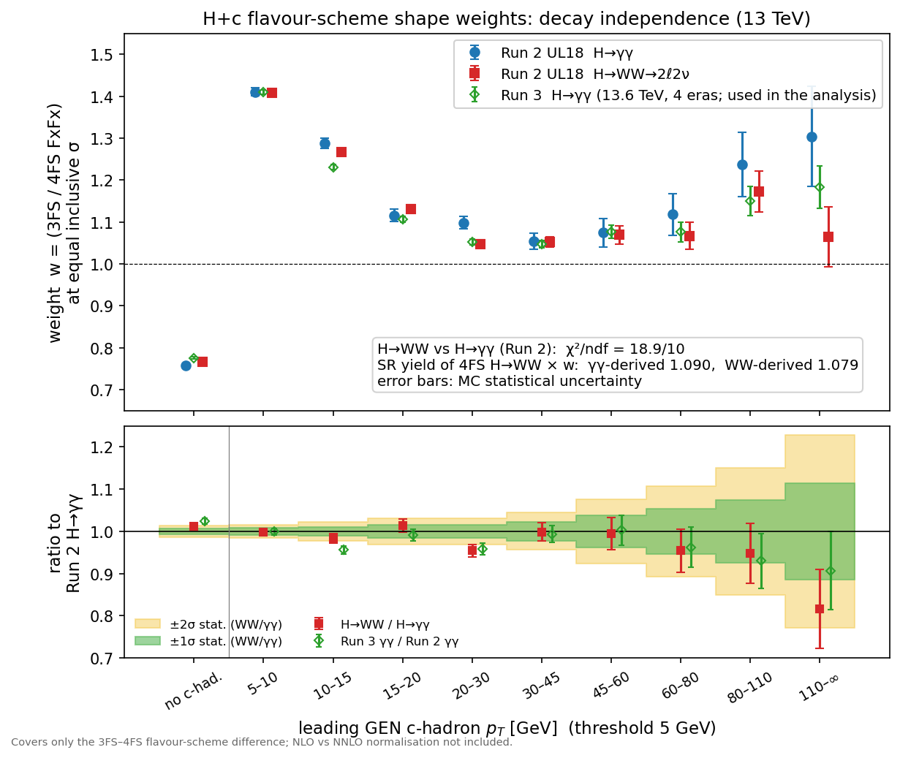

- **Run 2 H→γγ is the outlier, not H→WW:** Run 3 H→γγ (same decay) gives the same ratio to Run 2 γγ as H→WW does (0.955–0.96 at 20–30 GeV) → not a decay effect
- not a narrow spike: ~5% coherent excess of Run 2 γγ over 22–32 GeV (2 GeV bins, each ≤ 2.3σ)
- no bad file: per-file χ² 49/71 (3FS), 80/119 (4FS); jackknife-by-file error ≤ sum-w² error
- Run 2 γγ 3FS is the smallest sample: 2 M events, 40% negative weights
- P(≥ 1 bin at ≥ 2.9σ among 10) = 3.7%

**→ statistical fluctuation; the Run 3 weights used in the analysis agree with H→WW in this bin (1.052 vs 1.048).**

---

# Backup — the γγ vs WW table (T = 5 GeV)

<table class="num">
<tr><th>c-hadron pT [GeV]</th><th>H→γγ</th><th>H→WW</th><th>WW vs γγ</th><th>pull</th></tr>
<tr><td>none</td><td>0.757 ± 0.005</td><td>0.766 ± 0.003</td><td>+1.2%</td><td>+1.5</td></tr>
<tr><td>5–10</td><td>1.410 ± 0.010</td><td>1.409 ± 0.006</td><td>−0.1%</td><td>−0.1</td></tr>
<tr><td>10–15</td><td>1.288 ± 0.012</td><td>1.266 ± 0.007</td><td>−1.7%</td><td>−1.6</td></tr>
<tr><td>15–20</td><td>1.116 ± 0.015</td><td>1.131 ± 0.009</td><td>+1.3%</td><td>+0.9</td></tr>
<tr><td>20–30</td><td>1.098 ± 0.015</td><td>1.048 ± 0.009</td><td>−4.6%</td><td>−2.9</td></tr>
<tr><td>30–45</td><td>1.054 ± 0.020</td><td>1.053 ± 0.013</td><td>−0.1%</td><td>0.0</td></tr>
<tr><td>45–60</td><td>1.074 ± 0.034</td><td>1.069 ± 0.022</td><td>−0.5%</td><td>−0.1</td></tr>
<tr><td>60–80</td><td>1.118 ± 0.050</td><td>1.067 ± 0.032</td><td>−4.6%</td><td>−0.9</td></tr>
<tr><td>80–110</td><td>1.237 ± 0.077</td><td>1.173 ± 0.049</td><td>−5.2%</td><td>−0.7</td></tr>
<tr><td>&gt;110</td><td>1.304 ± 0.120</td><td>1.065 ± 0.072</td><td>−18%</td><td>−1.7</td></tr>
</table>

T = 10 GeV: χ² = 18.6/9, same picture.

---

# Backup — why a c-hadron and not a c-jet

<table>
<tr><th>definition</th><th>γγ vs WW</th><th>usable in the framework</th></tr>
<tr><td>GEN c-jet (NanoAOD <code>GenJet</code>, hadronFlavour 4)</td><td>✗ χ² = 81/7 — Higgs photons/leptons are clustered into the jets</td><td>yes</td></tr>
<tr><td>GEN c-jet, decay products removed by ΔR &lt; 0.4</td><td>~ shapes OK, 1.4% fraction offset (removes whole c-jets)</td><td>yes</td></tr>
<tr><td>GEN c-jet, Higgs constituents subtracted (MiniAOD)</td><td>✓ R agrees to 0.4%</td><td>✗ needs MiniAOD</td></tr>
<tr><td><b>GEN c-hadron (NanoAOD <code>GenPart</code>)</b></td><td><b>✓ SR yield agrees to ~1%</b></td><td><b>✓</b></td></tr>
</table>

- the official jet `hadronFlavour` is itself defined by ghost-associated c-hadrons → same charm content
- c-hadron pT ≈ 60% of the c-jet pT: T = 5 GeV ≈ the paper's 10 GeV c-jet split

---

# Backup — reco SR: more observables

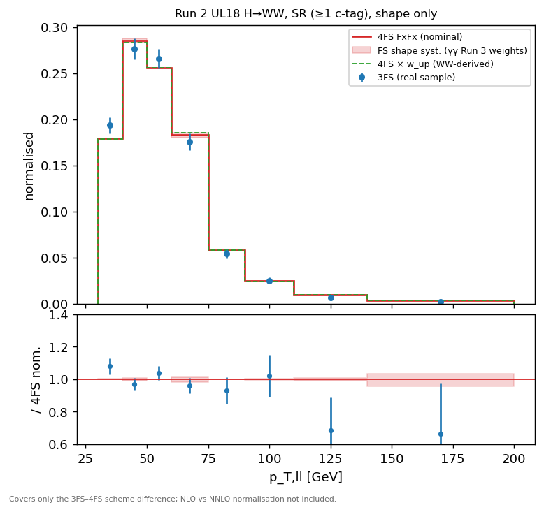

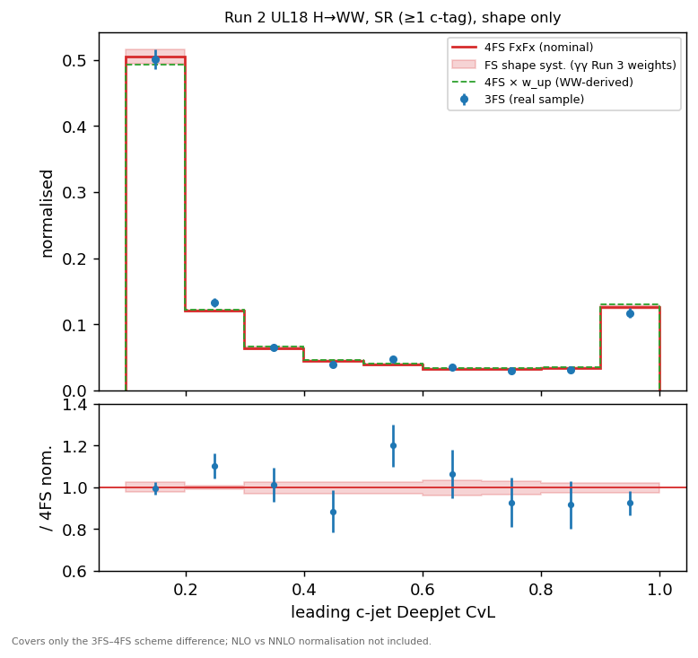

GEN leading c-hadron pT in the SR: χ² 82.9/10 (4FS nominal vs 3FS) → **7.0/10** after wup — the weight does what it is built to do.

---

# Backup — provenance

- scripts: `/eos/user/c/cgupta/HToWW/fs_unc/gen/` — `derive_chad.py`, `run_chad.sh`, `shape_weights.py`, `reco_dump.py`, `reco_ana.py`
- weights: `fs_unc/fs_shape/weights.{md,json}`, correctionlib `fs_unc/fs_shape/hplusc_fs_shape_correctionlib.json`
- reco study tables: `fs_unc/fs_shape/reco_run2_WW.md`
- plots: `fs_unc/plots/fs_shape/` (GEN) and `fs_unc/plots/fs_shape/reco_run2_WW/` (reco)
- normalisation of the samples never enters: weights are ratios of fractions (σbin/σincl) of each scheme
- LHE scale weights: 9 per event in all samples, 7-point = indices 0,1,3,5,7,8
- Paper: LHCHWG-2026-007, arXiv:2608.26863 (§4.4, §5.3, Table 3, Figs. 8–11)
