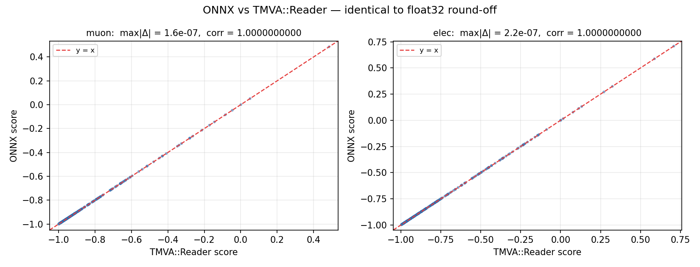
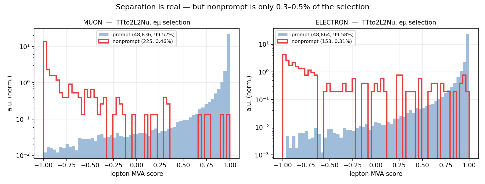
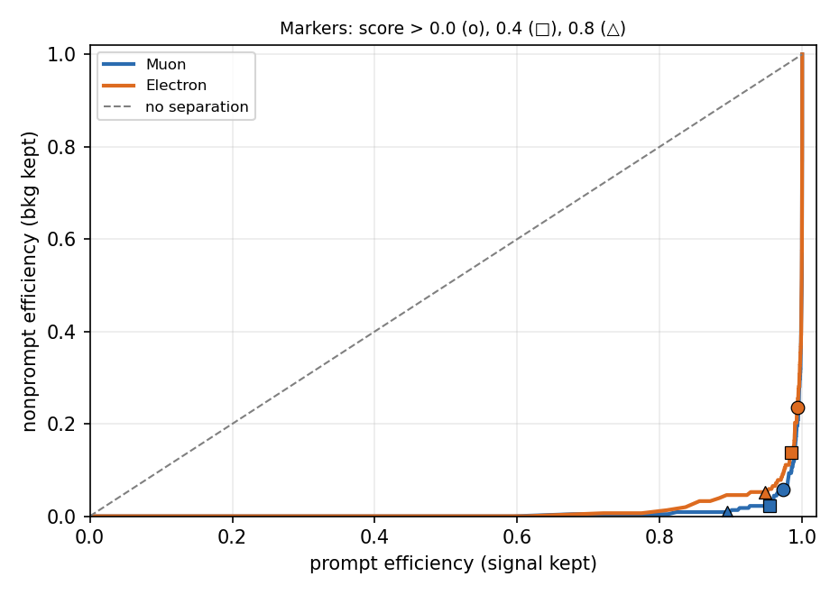

<!-- _class: lead -->

# Lepton MVA in ONNX

### TMVA → ONNX conversion, validation, and what the scores say about our eµ selection

Chirayu Gupta · H→WW + charm · 12 August 2026

---

# What the files turned out to be

Two TMVA weight XMLs, initially assumed to be trigger scale factors.

**They are not.** No HLT path, no leg p<sub>T</sub>/η efficiency map, no data/MC ratio anywhere in them.

They are the **ttH-multilepton lepton MVA** (`mvaTTH`) — a per-lepton
prompt-vs-nonprompt discriminant.

| | |
|---|---|
| Creator / date | `cvico`, 2023-12-20 |
| Origin | `CMGTools/TTHAnalysis`, CMSSW_12_4_12, wz-run3 |
| Method | `BDT::BDTG` — 500 trees, MaxDepth 8, shrinkage 0.1 |
| Classes | binary: Signal = prompt, Background = nonprompt |
| Transforms | `NTransformations="0"` — no input preprocessing |
| Training events | 879,894 (muon) |

---

# Why not just read the NanoAOD branch?

`Muon_mvaTTH` and `Electron_mvaTTH` **do exist** in NanoAODv12 — verified on a
central `TTto2L2Nu` v12 file.

We do not use them:

- the stock branch is a **Run 2** training
- these XMLs are a dedicated **2022EE** retraining
- same 13 variables, **different weights**

<div class="warn">

The stock branch would be **subtly** wrong, not obviously wrong — the worst
kind. Evaluate these weights instead.

</div>

All 13 input branches verified present for **both** flavours in NanoAODv12 — 0 missing.

---

# The 13 inputs

| i | muon | electron |
|---|---|---|
| 0–1 | `pt`, `eta` | `pt`, `eta` |
| 2–4 | `pfRelIso03_all`, `miniPFRelIso_chg`, neutral remainder | same |
| 5–6 | `jetNDauCharged`, `jetPtRelv2` | same |
| 7 | `jetIdx>-1 ? Jet_btagDeepFlavB[jetIdx] : 0` | same |
| 8 | `min(1/(1+jetRelIso), 1.5)` | same |
| 9–11 | `sip3d`, `log|dxy|`, `log|dz|` | same |
| 12 | **`segmentComp`** | **`mvaIso`** |

Isolation + jet association + impact parameters + one detector-specific variable.

Slot 7 is a **conditional cross-collection lookup**, not a plain branch.

---

# The response formula

TMVA `BoostType=Grad`, two classes:

```python
raw   = sum_t res_t(x)              # leaf 'res' values summed, no extra factor
score = 2 / (1 + exp(-2*raw)) - 1   # in (-1, 1)
```

**Shrinkage is already folded into the stored leaf values.** Do not reapply it.

Verified empirically rather than assumed:

| | leaf `res` absmax |
|---|---|
| tree 0 | 0.0999 ≈ shrinkage 0.1 |
| tree 499 | 0.0224 |

The cap at ~0.1 and the decay across the ensemble are exactly what
gradient boosting with pre-folded shrinkage produces.

---

# Mapping TMVA trees onto ONNX

Node attributes in the XML:

| attribute | meaning |
|---|---|
| `IVar` | feature index (`-1` on leaves) |
| `Cut` | split threshold |
| `nType` | `-99` marks a leaf |
| `pos` | `s` / `l` / `r` — root, left, right |
| `res` | leaf response |

TMVA sends `var <= Cut` to the **left** child.
ONNX `BRANCH_LEQ` has the same convention → `true_branch = left`.

Emitted as a `TreeEnsembleRegressor` (raw sum) followed by the closed-form
squashing, so the graph reproduces the **full score**, not just the raw sum.

---

# Validation: three implementations

<div class="cols">
<div>

**1. ONNX**
`TreeEnsembleRegressor` + squashing

**2. numpy**
independent recursive mask-based tree walk

**3. `TMVA::Reader`**
the reference implementation, via LCG view
`LCG_104a/x86_64-el9-gcc12-opt`

</div>
<div>

<div class="warn">

ONNX-vs-numpy alone is **not sufficient** — both encode *my* reading of the
format.

Only `TMVA::Reader` can catch an inverted branch or a double-applied
shrinkage.

</div>

</div>
</div>

`TMVA::Reader` is slow (scalar API, 500 trees): 2000 points times out at 2 min;
300 points suffices.

---

# Validation result



| pair | N | max &#124;Δ&#124; | corr |
|---|---|---|---|
| ONNX vs numpy (muon / elec) | 2000 | 2.2e-07 / 2.9e-07 | — |
| **ONNX vs `TMVA::Reader` (muon)** | 300 | **1.6e-07** | **1.0000000000** |
| **ONNX vs `TMVA::Reader` (elec)** | 300 | **2.2e-07** | **1.0000000000** |

<div class="verdict">

That is float32 round-off. **The conversion is exact.**

</div>

---

# So: should we use it?

The conversion succeeded. That does not by itself mean the cut belongs in our
analysis.

The deciding question:

## How much nonprompt background is actually in our selection?

Measured directly — central `TTto2L2Nu` v12, 400k events, with the
`hww_combine_2dcat` lepton selection reproduced:

- muon: tight ID + tight PF iso, p<sub>T</sub> > 10, |η| < 2.4
- electron: wp80iso, p<sub>T</sub> > 10, |η| < 2.5
- exactly one of each, opposite sign, lead p<sub>T</sub> > 20, sublead > 10

**49,070 eµ events** survive. Truth label from `genPartFlav`.

---

# The headline number

| flavour | prompt | **nonprompt** | other |
|---|---|---|---|
| muon | 48,836 — 99.52% | **225 — 0.46%** | 9 — 0.02% |
| electron | 48,864 — 99.58% | **153 — 0.31%** | 53 — 0.11% |

<div class="verdict">

**Nonprompt leptons are 0.3–0.5% of the selection.** The existing cut-based
tight ID + isolation has already removed essentially all of them.

</div>

The MVA is aimed at a background we have already eliminated by other means.

---

# The separation itself is real



| | muon | electron |
|---|---|---|
| median score, prompt | **+0.9952** | **+0.9945** |
| median score, nonprompt | **−0.9510** | −0.7640 |

Electron separation is weaker — `mvaIso` sits in slot 12 and already overlaps
heavily with the wp80iso cut applied upstream.

---

# What a cut would cost



Muon working points:

| cut | eff(prompt) | eff(nonprompt) | rejection |
|---|---|---|---|
| > 0.0 | 97.32% | 5.78% | 94.22% |
| > 0.4 | 95.47% | 2.22% | 97.78% |
| > 0.8 | 89.45% | 0.89% | 99.11% |

---

# The trade, quantified

Taking `score > 0.4` on both legs:

| | |
|---|---|
| removes | ~98% of an already-0.46% contamination → **~0.45 pp** |
| costs | ~4.5% of prompt muons + ~1.5% of prompt electrons → **~6% of signal** |

<div class="warn">

**~6% of signal efficiency to remove ~0.45% of background.**

The loss lands directly on H+c signal — whose limit is already dominated by MC
statistics (autoMCStats = −255 of the −523 total systematic budget).

</div>

---

# No reference analysis of ours does this

| analysis | lepton treatment |
|---|---|
| **AN-23-102** (our Run 2 predecessor) | no lepton MVA |
| **HH→bbWW Run 3** (same eµ, 13.6 TeV) | cut-based ID + PF rel-iso |
| **ttH-multilepton** (2011.03652) | **source of these weights** — "tight lepton" = loose + MVA cut |

ttH-multilepton works in **same-sign 2ℓ / 3ℓ / 4ℓ**, where nonprompt is a
*leading* background and there is no OS continuum.

Ours is **OS eµ, 82% real tt̄**, both leptons genuinely prompt.

The technique is imported from a different topology — the 0.4% measurement is
the quantitative version of that observation.

---

# The calibration cost, if we did adopt it

From the ttH paper's efficiency section — once "tight" is defined by an MVA cut:

1. measure efficiency by **tag-and-probe in Z→ℓℓ**
2. cross-check in an **OS eµ + ≥2 jets tt̄ CR**, nonprompt subtracted via an SS eµ sideband
3. take the DY-vs-tt̄ difference as a **1–2% systematic**

<div class="warn">

That tt̄ control region **is our signal region**.

And SFs for these specific 2022EE weights are unlikely to exist publicly.

</div>

Plus a full reprocessing campaign.

---

# Recommendation

<div class="verdict">

**Do not adopt a lepton-MVA cut in the eµ signal region.** The cost/benefit is
clearly negative on these numbers.

</div>

Where the converted models could still earn their keep:

| use | note |
|---|---|
| **Nonprompt/QCD control region** | *invert* the MVA → clean enriched region. Much better use than cutting in the SR. |
| **Input feature, not a cut** | costs no signal efficiency by construction; needs retraining, and gain is small at 0.4% |
| **Evidence the selection is already clean** | this measurement itself — a publishable statement |

---

# Caveats

- **Single TT file**, 400k events → 225 nonprompt muons, 153 electrons.
  Adequate for a 0.4%-vs-6% decision; too coarse for a precise WP scan.
- **tt̄ only.** V+jets/QCD have higher nonprompt fractions, but they are 7.3%
  and ~0% of the SR — the conclusion is not sensitive to this.
- **`log|dxy|` floor unresolved.** Used `1e-6`; the training producer's
  convention is unknown. Affects few leptons, but must be pinned before any
  production use.

---

# Artifacts — all durable on EOS

```
/eos/user/c/cgupta/HToWW/leptonmva/
  onnx/muon_mvaTTH_2022EE.onnx        0.38 MB   <- validated
  onnx/electron_mvaTTH_2022EE.onnx    0.40 MB   <- validated
  tmva_to_onnx.py          converter (checks Options, refuses transforms)
  numpy_ref.py             independent numpy evaluator
  tmva_reference.py        TMVA::Reader reference (needs LCG view)
  validate_vs_tmva.py      the comparison
  tmva_reference.npz       frozen reference inputs + scores
  diagnostic_nonprompt.py  the eµ measurement
```

Re-run validation at any time:

```bash
cd /eos/user/c/cgupta/HToWW/leptonmva
$MAMBA_EXE run -n b_hive python3 validate_vs_tmva.py
```

**No production code was modified.**

---

<!-- _class: lead -->

# Summary

**Conversion:** exact — corr = 1.0000000000 vs `TMVA::Reader`

**Nonprompt in our eµ selection:** 0.3–0.5%

**A cut would cost ~6% of signal to remove ~0.45% of background**

### Recommend: do not cut. Keep the models for a nonprompt CR.
