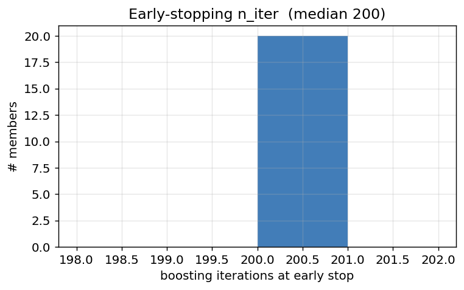
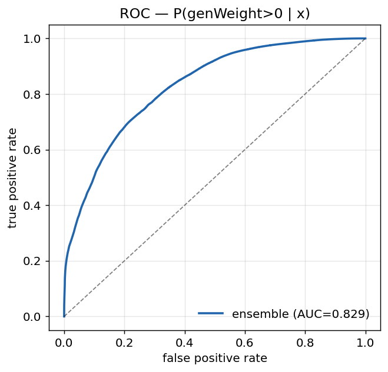

<!-- _class: lead -->

# Negative-Weight Reweighting for V+jets

## Fixing the autoMCStats blow-up in H+c → WW

**Chirayu Gupta** — VUB
2026-07-15

Method: Palmer & Kronheim, [arXiv:2510.16217](https://arxiv.org/abs/2510.16217)

---

## The problem

- H+c → WW limit is **dominated by MC statistical uncertainty**, not systematics.
- `autoMCStats` blows up in the signal region: **r₉₅ = 1742**, with **~81%** of the total uncertainty from **V+jets undersampling** in the SR.
- Root cause: **amc@NLO negative weights**. The estimator is a cancellation

  $$\sum_i w_i \quad\text{with}\quad w_i = \pm|w_i|$$

  Positive and negative weights cancel → the *yield* is fine, but the **variance is huge** → effective statistics $N_{\text{eff}}$ collapses in sparse bins.
- **16.4%** of our V+jets training events carry a negative weight.

---

## The idea (arXiv:2510.16217)

Instead of differencing $\pm w$, **learn where the negative weights live** and reweight.

Train a classifier for the probability that an event has a positive weight, given only **generator-level** kinematics $\vec{x}$:

$$P_+(\vec{x}) = P(\text{genWeight} > 0 \mid \vec{x})$$

Then reweight each event by

$$g(\vec{x}) = 2\,\bar{P}_+(\vec{x}) - 1 \qquad\Longrightarrow\qquad \sum_i |w_i|\,g(\vec{x}_i)$$

- **Same expectation value** as $\sum w$ (closure requirement).
- **Smaller variance** → higher $N_{\text{eff}}$ → autoMCStats shrinks **at the source**.
- No cancellation: every event now contributes with weight $|w|$, scaled by a smooth learned factor.

---

## Training region: train loose, infer tight

$g(\vec{x})$ is a **generator property** — independent of the analysis selection. This lets us train on a much larger sample than the SR.

| | Training region | Inference region |
|---|---|---|
| **Selection** | base cuts + `veto_emu_sr` | tight eμ signal region |
| **Meaning** | veto *only* the exactly-one-eμ-pair topology | the analysis SR |
| **Statistics** | **9.83M** events | ~10³ events |

- **Event-disjoint by construction** (paper §V.4) → no train/infer overfitting bias, no hold-out needed.
- Disjoint *events*, **not** orthogonal *phase space* — same generator physics.
- ✅ **Coverage validated:** SR-proxy $\vec{x}$ is contained inside the training domain in all gen features → **interpolation, never extrapolation**.

---

## Inputs: 20 generator-level features

**LHE event-level (10)**
`lhe_njets`, `lhe_nb`, `lhe_nc`, `lhe_nuds`,
`lhe_nglu`, `lhe_npnlo`, `lhe_ht`,
`lhe_htincoming`, `lhe_vpt`, `lhe_alphas`

**Hard-process gen partons (10)**
`genparton_multiplicity`,
`genparton_n_pt20 / n_pt100 / n_pt200`,
`genparton_incoming1_pdgId`, `genparton_incoming2_pdgId`,
`genparton1_pt`, `genparton1_eta`,
`genparton2_pt`, `genparton2_eta`

- These are the paper's hand-built **parton-count / HT / V-pT / merging** variables.
- **Label:** `weight_nominal > 0`
  (the fully-populated signed amc@NLO weight)
- Events with < 2 hard partons have **missing** parton kinematics → left as `NaN`, handled **natively** by HistGBDT (no imputation).

---

## Input features — split by weight sign

Blue: $w>0$ · Red: $w<0$. The two classes are visibly separated in the merging/parton-count variables — that separation is exactly what the classifier exploits.

---

## The model

**`HistGradientBoostingClassifier`** (scikit-learn) — histogram-binned GBDT: bins each feature into ~256 buckets, grows shallow trees. Scales to ~10M events, handles `NaN` natively.

| parameter | value |
|---|---|
| `loss` | `log_loss` |
| `max_iter` | 200 |
| `learning_rate` | 0.05 |
| `max_depth` | 4 |
| `l2_regularization` | 1.0 |
| `early_stopping` | True (`val_frac` 0.15) |

**Ensemble of 20 classifiers**
- Each trained on a **60% subsample**, drawn without replacement, different seed.
- `log_loss` ⇒ output is a **calibrated probability**, which is what $P_+$ must be.
- **Why 20?** The *spread* across members,
  $\delta g = 2\,\text{std}(P_+)$, becomes the **observable-level shape systematic** (PCA over the per-bin ensemble covariance).
- The ensemble isn't just a better central value — it **generates its own uncertainty**.

---

## Training convergence

- Smooth convergence; **train and validation lie on top of each other** → no overfitting (shallow depth-4 trees + L2 = 1.0).
- Loss still gently descending at iteration 200 → **early stopping never fires; all 20 members hit the `max_iter` ceiling** (median `n_iter` = 200).
- Headroom: more iterations / deeper trees could still improve $P_+$ — worth a scan.

---

## Classifier performance

| metric | value |
|---|---|
| ensemble log-loss | **0.331** |
| ensemble AUC | **0.829** |

True $w>0$ events pile up at $P_+ \to 1$; $w<0$ events spread to low $P_+$. The classifier is genuinely learning the negative-weight structure — not memorising noise.

---

## What drives the prediction?

Permutation importance = increase in log-loss when a feature is scrambled.

**Physically sensible ordering:**
1. `lhe_npnlo` — the **NLO merging variable**, dominates by far
2. `lhe_njets` — parton multiplicity
3. `lhe_nglu` — gluon count
4. `genparton1_pt` — leading parton hardness
5. `lhe_alphas`, `genparton2_pt`

These are exactly the variables that control where amc@NLO **negative weights** are generated (merging / subtraction regions).

→ The model has learned **real generator structure.**

---

## The reweight factor $g(\vec{x})$ and its uncertainty

| | value |
|---|---|
| $g$ mean | **0.672** (≈ $2\times0.836 - 1$, matches the positive fraction ✅) |
| $g$ range | $[-0.991,\ 0.993]$ — well inside the physical $[-1, 1]$ |
| $\delta g$ mean / max | **0.006** / 0.467 — ensemble agreement is tight |

---

## Closure: the reweighted estimator reproduces the nominal

$$\frac{\sum |w|\,g}{\sum w} = \mathbf{0.994}$$

Ratio flat at unity across the whole V-pT spectrum. The reweighting **preserves the physics** — it only removes the variance.

---

## The payoff: effective statistics

- **Total: $N_{\text{eff}}$ 2.92M → 4.68M (+60%)**
- ~3× gain sustained across the entire hard V-pT tail (2.8–3.8× for $p_T^V > 40$ GeV) — precisely the **starved bins that drive autoMCStats**.

---

## Per-bin gain in the tail

| $p_T^V$ [GeV] | $N_{\text{eff}}$ nominal | $N_{\text{eff}}$ reweighted | gain |
|---|---|---|---|
| 0–20 | 2,341,819 | 3,262,187 | 1.39× |
| 40–60 | 125,911 | 357,341 | 2.84× |
| 80–100 | 28,976 | 88,889 | **3.07×** |
| 120–140 | 8,759 | 26,802 | **3.06×** |
| 160–180 | 3,068 | 9,671 | **3.15×** |
| 200–220 | 1,331 | 4,271 | **3.21×** |
| 260–280 | 420 | 1,488 | **3.54×** |
| 340–360 | 134 | 424 | **3.18×** |
| 360–380 | 85 | 326 | **3.84×** |

The bulk (bin 0) gains least — it was never statistics-starved. **The gain grows exactly where we need it.**

---

## Implementation: reweight at the processor stage

The trained ensemble is applied **inside the coffea processor**, adding **2 columns** to the V+jets SR parquets:

| column | meaning |
|---|---|
| `weight_negrw` | $g = 2\bar{P}_+ - 1$ — the per-event reweight factor |
| `weight_negrw_std` | $\delta g = 2\,\text{std}(P_+)$ — ensemble spread → shape systematic |

- **Config-gated + dataset-gated**: `negrw:` block in `hww_combine_fixed.yaml`, `datasets: [DYto2L, WtoLNu]` → **V+jets only**, nothing else in the analysis is touched.
- Combine then fills the V+jets template with $|w_{\text{nominal}}|\cdot g$, plus a PCA shape nuisance built from $\pm\,\delta g$.
- Pure factors — no change to any other weight or correction.

---

## Reproducibility note

The ensemble is trained **inside the same Singularity image the analysis workers run**
(`coffea-base-almalinux9:0.7.30-py3.10`, **scikit-learn 1.7.2**), submitted as a Condor job.

- A model pickled by a *different* sklearn version **fails to load on the workers**
  (`AttributeError: __pyx_unpickle_CyHalfBinomialLoss`) — version match is mandatory, not cosmetic.
- Training set: **9,832,308** events, **502** parquet files, `hww_genrw_train` workflow, 2022postEE.
- Reproduces the earlier reference run to 3 decimal places (closure 0.994, $N_{\text{eff}}$ +60%).

---

## Status & next steps

**Done ✅**
- Training region designed + validated (veto integrity: **0 eμ leaked**; coverage: interpolation only)
- 20-model ensemble trained, version-matched to the workers
- Closure **0.994**, $N_{\text{eff}}$ **+60%** (~3× in the tail)
- Processor-stage injection implemented + smoke-validated on a V+jets SR file

**Next 🔜**
1. Re-run **V+jets only** on `hww_combine_fixed` → SR parquets with `weight_negrw`
2. Wire into combine: V+jets template ← $|w|\cdot g$, + PCA shape nuisance from $\pm\delta g$
3. **Re-run the limit** → check autoMCStats collapses and **r₉₅ drops from 1742**

---

<!-- _class: lead -->

# Backup

---

## Method summary

**Why $\sum|w|g$ works.** For an observable bin $B$:

$$\mathbb{E}\Big[\sum_{i \in B} |w_i|\,g(\vec{x}_i)\Big] = \mathbb{E}\Big[\sum_{i \in B} w_i\Big]$$

because $g(\vec{x}) = 2P_+(\vec{x}) - 1 = P_+ - P_-$ is exactly the expected **sign** of an event at $\vec{x}$. Summing $|w|\cdot\langle\text{sign}\rangle$ instead of the realised $\pm|w|$ replaces a **random** cancellation with its **expectation** — same mean, lower variance.

The gain is largest where the cancellation was worst: sparse, high-$p_T^V$ bins with few events and mixed signs.

**Where it can fail:** if $P_+$ is mis-modelled (poor features, extrapolation), closure breaks. Hence the two gates — the **coverage check** (interpolation only) and the **closure test** (ratio 0.994).

---

## Configuration reference

| item | value |
|---|---|
| Training workflow | `hww_genrw_train`, 2022postEE |
| Training selection | base cuts + `veto_emu_sr` |
| Events / files | 9,832,308 / 502 parquet |
| Positive fraction | 0.836 |
| Model | 20 × `HistGradientBoostingClassifier` |
| Subsample | 60%, without replacement |
| Hyperparameters | `log_loss`, `max_iter` 200, `lr` 0.05, `max_depth` 4, `l2` 1.0 |
| Ensemble log-loss / AUC | 0.331 / 0.829 |
| Closure ratio | 0.994 |
| $N_{\text{eff}}$ | 2.92M → 4.68M (+60%) |
| Image | `coffea-base-almalinux9:0.7.30-py3.10` (sklearn 1.7.2) |
| Model artifact | `/eos/user/c/cgupta/HToWW/b-hive/negrw_out_img/negrw_models.joblib` |

