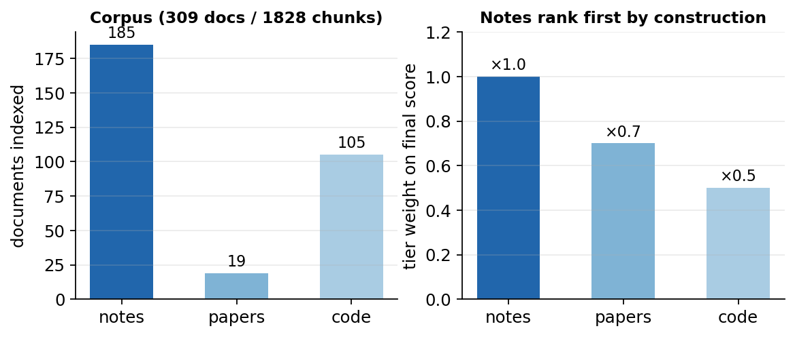
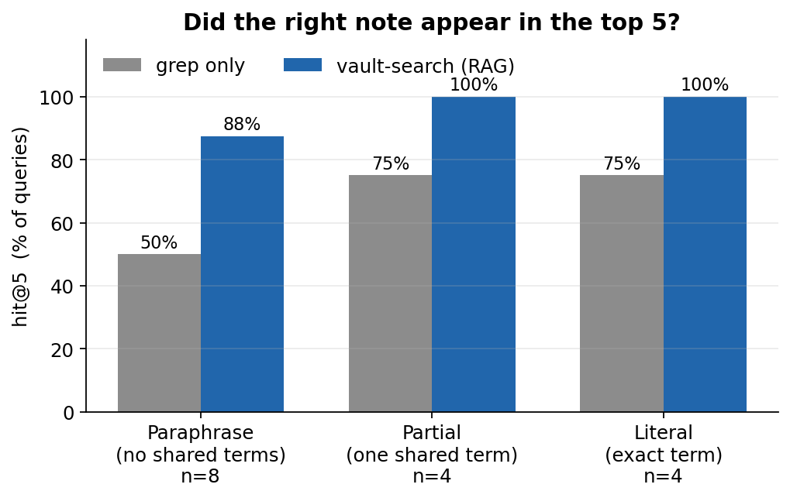
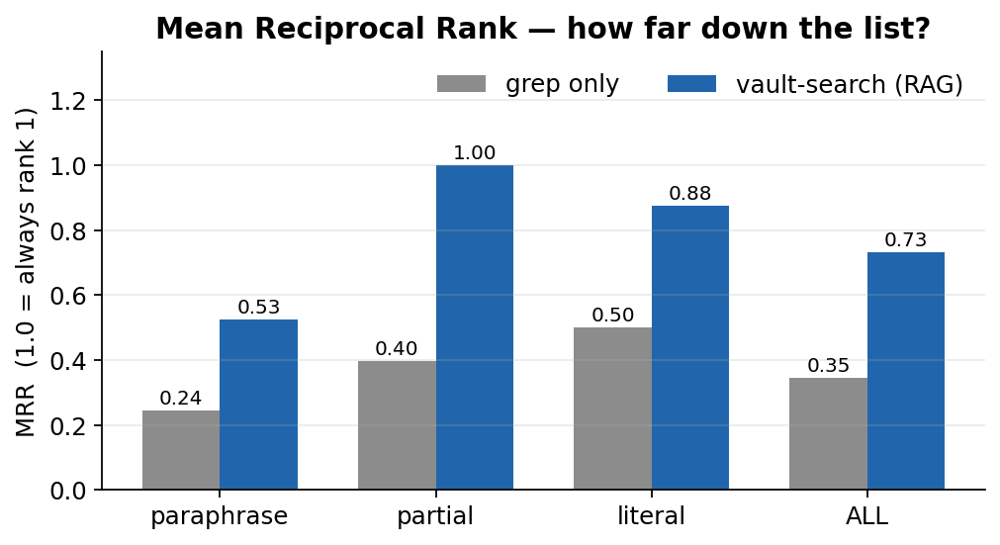
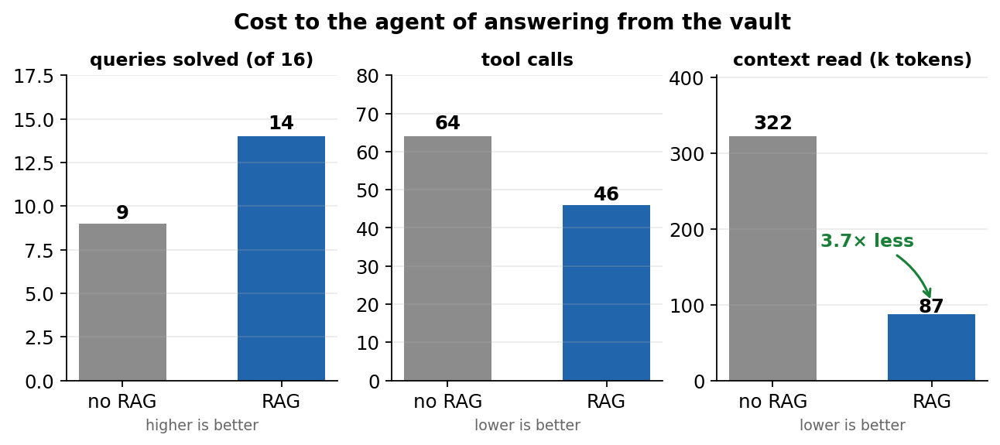
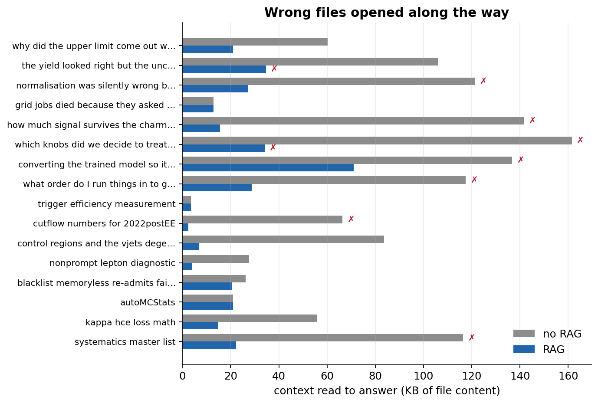
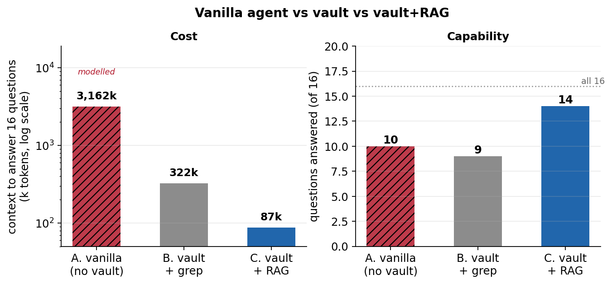
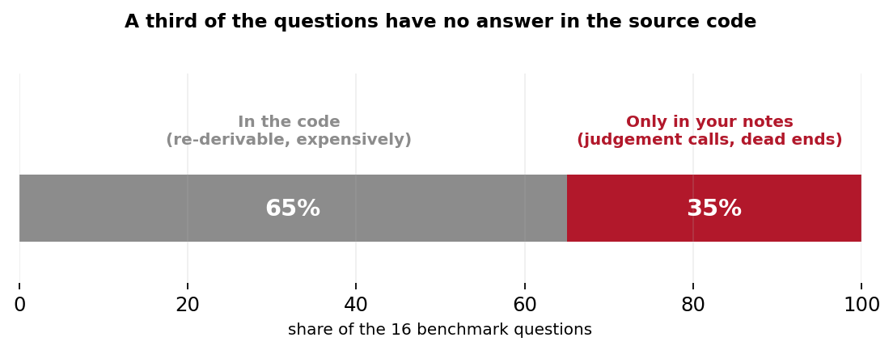
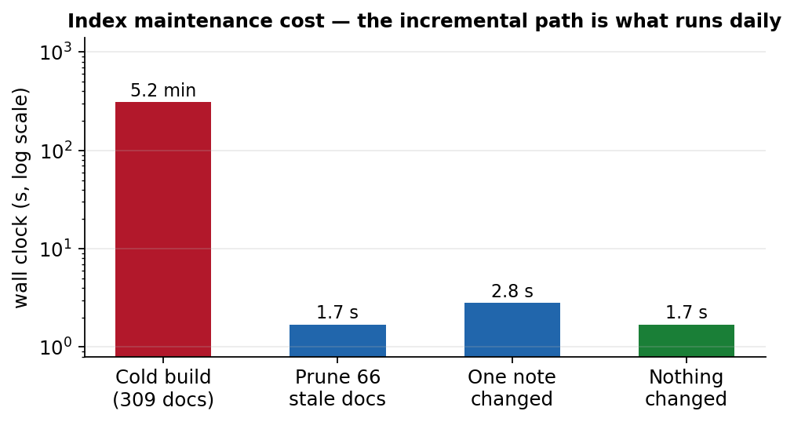

<!-- _class: lead -->

# A RAG layer over the Obsidian vault

### How it works, and what it actually buys

<span class="small">Chirayu Gupta — 2026-08-13</span>

<span class="tiny">Built on <b>obsidian-second-brain</b> (MIT) · embeddings via local Ollama <code>bge-m3</code></span>

---

## The problem

When you say *"why did the limit come out wrong?"*, I have to find the note that
answers it. Without an index, my only tool is `grep`.

That fails in a specific way: **you rarely remember the word the note uses.**

<div class="cols">
<div>

**What you ask**
<span class="small">

- "the yield was fine but the uncertainty blew up"
- "totals came from the wrong place"
- "how much signal survives the charm cut"

</span>
</div>
<div>

**What the note says**
<span class="small">

- `autoMCStats`, `amc@NLO negative weights`
- `sumw`, `parquet metadata`, `sidecar json`
- `≥1 c-jet, medium PNet WP, 23.1%`

</span>
</div>
</div>

<br>

**Zero lexical overlap.** `grep` cannot bridge that gap — it matches characters, not meaning.

---

## What was built

<div class="cols">
<div>

```bash
scripts/rag/vault-search \
  "why did the limit come out wrong"

scripts/rag/vault-search --tier code \
  "how are condor jobs resubmitted"
```

One command. Three tiers, searched together
and ranked so **notes come first**.

<span class="small">Documented in `CLAUDE.md`, so every future
session knows to reach for it before grepping.</span>

</div>
<div>



</div>
</div>

---

## How it works — two rankings, fused

<div class="cols">
<div>

**1. Semantic**
<span class="small">

Every document → a 1024-d vector (`bge-m3`, local Ollama).
Your query → same space. Rank by cosine similarity.

Long docs are **chunked**; a document scores by its
*best* chunk, so one relevant section surfaces a
40-page paper.

</span>

**2. Keyword**
<span class="small">

`grep` over the query's content words, **normalised by
document length** and boosted when the term appears
in the filename.

</span>
</div>
<div>

**Fusion — Reciprocal Rank Fusion**

$$\text{score} = \sum_{r \in \{sem, kw\}} \frac{1}{60 + \text{rank}_r}$$

<span class="small">

RRF combines the two **rank orders**, never the raw
scores — a cosine of 0.57 and a match-count of 19
are not comparable quantities.

Then shaped by tier weight × recency.

</span>

<br>

<span class="hl">Why both?</span> <span class="small">They fail in *opposite* directions.
Semantic finds paraphrases but drifts on short factual
queries. Keyword nails exact terms but is blind to meaning.</span>

</div>
</div>

---

## Ranking: notes first, by construction

<div class="cols">
<div>

| Tier | Source | Weight |
|---|---|---|
| `notes` | vault markdown | **1.0** |
| `papers` | `References/**.pdf` | 0.7 |
| `code` | lxplus repos via sshfs | 0.5 |

<span class="small">

Tier weight **multiplies** the fused score, so an
equally-relevant note outranks a code file — one
blended list, not three separate ones.

Recency is a **tiebreak**: 240-day half-life,
floor 0.50, swept against the benchmark. A fresh
note wins among equals; old ones stay findable.

Notes marked `status: superseded` are demoted
×0.55 and tagged in results — age alone can't tell
a stale number from a still-valid method note.

</span>
</div>
<div>

<span class="small">

**Papers are searched by content, not filename:**

*"reweighting negative weight events to fix MC statistics"*
→ `2510.16217-negweight-reweighting.pdf` <span class="ok">(rank 1)</span>

Text extracted with `pdftotext`, chunked, embedded.

<br>

**Code is read over the sshfs mount** — Ollama runs on
the laptop, so lxplus code is indexed *from* the laptop.

*"how are condor jobs submitted and resubmitted"*
→ `jobs_status.py`, `submit_condor.py` <span class="ok">(ranks 1–2)</span>

</span>
</div>
</div>

---

## Evaluation: 16 queries, labelled ground truth

<div class="cols">
<div>

Queries are phrased the way you'd actually ask —
deliberately **not** using the note's own vocabulary.

<span class="small">

| Class | n | Definition |
|---|---|---|
| paraphrase | 8 | no distinctive term shared |
| partial | 4 | one common term shared |
| literal | 4 | names the exact term |

**hit@5** — correct note in top 5
**MRR** — 1.0 means always rank 1

</span>
</div>
<div>



</div>
</div>

---

## Retrieval quality

<div class="cols">
<div>



</div>
<div>

<span class="small">

|  | grep | RAG |
|---|---|---|
| hit@5 (all) | 62% | <span class="ok">94%</span> |
| MRR (all) | 0.35 | <span class="ok">0.73</span> |
| MRR paraphrase | 0.24 | <span class="ok">0.53</span> |
| MRR partial | 0.40 | <span class="ok">1.00</span> |

**MRR 0.73 vs 0.35** — with the RAG the right note is
usually *rank 1*; with grep it's typically 3rd or absent.

On `partial` and `literal` queries the correct note is
now **always** the top hit.

</span>
</div>
</div>

---

## But hit@5 is the wrong benchmark

<span class="hl">Without the RAG I don't run one grep.</span> I run a *search loop*:
guess a term → grep → read a file → wrong → guess again → read another.

**Every wrong file I open is context burned.** That's the real cost.

<br>

So the honest comparison is what it costs **me** to answer your question:

<div class="cols">
<div>

**no RAG**
<span class="small">
grep content words → if nothing, retry with the
rarest term → read candidates in rank order until
the right note appears (give up after 4)
</span>
</div>
<div>

**RAG**
<span class="small">
one `vault-search` call → read candidates in
rank order (give up after 4)
</span>
</div>
</div>

<span class="tiny">Cost = tool calls + bytes of every file read along the way (~4 bytes/token). Both counted; neither estimated away.</span>

---

## The result that matters



<div class="cols">
<div>

<span class="ok">**3.7× less context burned**</span>
<span class="small">322k → 87k tokens across 16 queries</span>

</div>
<div>

<span class="small">More queries solved (9 → 14), in **fewer** tool
calls (64 → 46). The win isn't accuracy — it's
**not reading the wrong files.**</span>

</div>
</div>

---

## Per-query, including the losses

<div class="cols">
<div>



</div>
<div>

<span class="small">

The RAG is **not** uniformly better:

- <span class="hl">Query 2</span> *"yield looked right but uncertainty
  inflated"* — grep found it, RAG missed
  (rr 0.25 → 0). Numeric framing, not linguistic.
  **The one query grep wins outright.**
- <span class="hl">Query 6</span> *"which knobs did we treat as one
  nuisance"* — unsolved by both. The decision is
  recorded, just not in language resembling the ask.

2 of 16 unsolved by the RAG; 7 by grep.

**`rg` is still the right tool when you know the
exact string.** This layer is for when you don't.

</span>
</div>
</div>

---

## The third baseline: no vault at all

<span class="small">

So far both arms assume **the notes exist**. What about a cold agent — no vault, no
notes, no index — asked *"why did the limit come out wrong?"* It must **re-derive the
finding** from the repo: 168 source files, 7.5 MB, 856 commits.

</span>

<div class="cols">
<div>

**Modelled, not measured**
<span class="small">

I cannot un-know your notes, so this arm is a model.
Every input is stated so it can be argued with:

| Input | Value | Source |
|---|---|---|
| repo source | 7.5 MB / 168 files | measured |
| orientation | 15% of source read | assumed |
| re-derive one finding | 180k tok, 60 calls | anchored ↓ |
| not derivable at all | 35% | assumed |

</span>
</div>
<div>

**Why 180k tokens is *conservative***
<span class="small">

The autoMCStats thread in your vault runs
**2026-06-17 → 2026-07-12** — about four weeks,
five notes. `sumw-normalization-trap.md` alone is
277 lines of hard-won conclusions.

180k tokens ≈ **one long session**. The real
investigation took weeks of human work.

<span class="hl">The vanilla number is understated, not inflated.</span>

</span>
</div>
</div>

---

## Three-way comparison



<div class="cols">
<div>

<span class="tiny">

| | tokens | vs RAG |
|---|---|---|
| A. vanilla *(modelled)* | ~3,162k | **36×** |
| B. vault + grep | 322k | 3.7× |
| C. vault + RAG | 87k | — |

</span>
</div>
<div>

<span class="small">

Note the **right panel**: vanilla answers *fewer*
questions than grep-on-the-vault, while burning
36× the context. <span class="hl">More tokens does not buy
the answer.</span>

</span>
</div>
</div>

---

## What the token ratio hides



<div class="cols">
<div>

<span class="small">

No answer exists in the source code, at any budget:

- *"which knobs did we treat as one nuisance?"* → a
  **judgement call**. Code shows what was done, never
  what was considered and rejected.
- *"yield looked right but uncertainty inflated"* →
  a **symptom you observed**, not a code path.

</span>
</div>
<div>

<span class="small">

<span class="hl">This is the real argument for the vault</span> — not
retrieval speed.

Dead ends and "we tried X, it failed because Y" leave
**no artifact** in the repo. A cold agent re-derives the
*code*; it cannot re-derive the *decisions*.

The RAG makes that record cheap to reach — it does not
create it. You do, by writing it down.

</span>
</div>
</div>

---

## Tuning: what the sweep actually revealed

<span class="small">

An aggressive recency setting (120-day half-life) was added to make updated
results outrank the ones they replace. It **cost 0.16 MRR** — it pushed correct
but slightly older notes down. Sweeping half-life × floor found a broad plateau;
240/0.50 sits in its interior, restoring MRR 0.73 and lifting hit@5 to 94%.

</span>

<div class="cols">
<div>

**Then a second benchmark, and the real finding**
<span class="small">

Every gold note in the 16-query set is **under 58 days
old** (median 26). The set contains no stale/fresh
pairs — so it can only ever *punish* recency, never
reward it. Tuning against it was optimising the wrong
thing, which is why it kept pushing toward "no recency".

</span>
</div>
<div>

**Recency cannot fix supersession**
<span class="small">

A separate pair-benchmark (current vs stale note on the
same quantity) scores a flat <span class="hl">50% at every
setting</span> — 120/0.35, 240/0.50, 3000/0.95, identical.

When the older note is the better *topical* match it wins
by ~50 ranks. A multiplier on RRF scores cannot close
that gap at any half-life.

<span class="ok">Marking `status: superseded` moved one stale
note from rank 2 → 19.</span> That is the mechanism; recency
is only a tiebreak.

</span>
</div>
</div>

---

## Keeping the index honest

<div class="cols">
<div>



</div>
<div>

<span class="small">

**Incremental by mtime+size** — matters because the
code tier is read over sshfs.

**Prunes actively:** entries whose source file is gone
are dropped (verified: added a file, indexed it,
deleted it → `1 pruned`).

**Hooks:** `SessionEnd` + `PreCompact` fire a rebuild.
The hook **detaches and returns in 8 ms** — `SessionEnd`
has a 1.5 s shared budget a real rebuild would blow.
A `flock` stops concurrent sessions double-embedding.

</span>
</div>
</div>

---

## What is *not* indexed

<span class="small">

The code tier initially swallowed **65 JSON data files** — generated `partitions.json`
(XRootD path lists), correctionlib lookup tables, fileset dumps. Machine-generated,
useless for semantic recall, and they churn — so they'd force constant re-embedding.

</span>

<div class="cols">
<div>

**Excluded**
<span class="small">

- `condor/`, `out/`, `img/` job trees
- `partitions*.json`, `analysis/data/*.json`
- `filesets/`, `.sites_map.json`
- `higgscharm_thomas/` (1.2 GB collaborator checkout)

</span>
</div>
<div>

**Structurally impossible to index**
<span class="small">

`CODE_EXTS` is an **allowlist** — only
`.py .cc .h .C .cpp .sh .yaml .yml .json .cfg .md`
are ever read.

`.root`, `.parquet`, `.pkl`, `.onnx`, `.npy` can never
enter the index, wherever they sit.

</span>
</div>
</div>

<span class="small">Result: code tier 171 → 105 docs, while indexed `.py` files *rose* 60 → 68 — the old
`condor/` walk had been masking real scripts.</span>

---

## Two bugs worth naming

<span class="small">

Both were found by testing, and both were **silent** — the tool returned plausible
results while a whole component was dead. That is the dangerous failure mode.

</span>

<div class="cols">
<div>

**1. The keyword arm was never running**
<span class="small">

`shutil.which("rg")` returned `None` — `rg` in this
shell is a *zsh function*, not a binary. Every result
was semantic-only for the first half of the build.

<span class="ok">Fix:</span> fall back to `/usr/bin/grep`; make the
failure loud on stderr.

</span>
</div>
<div>

**2. Raw match counts buried exact titles**
<span class="small">

*"systematics master list"* did **not** find
`2026-07-24-systematics-master-list.md`.
A long note saying "list" 19× outranked it;
semantic had it at rank 1, RRF averaged it to 24.

<span class="ok">Fix:</span> normalise by $\sqrt{\text{size}}$, boost
filename matches. hit@5 62% → 94%.

</span>
</div>
</div>

---

## Honest limitations

<span class="small">

**This is a retrieval benchmark, not an end-to-end agent study.** I did not run paired
Claude Code sessions on real tasks — that needs controlled variables I can't hold fixed
here. The token numbers model a search loop; they are not measured session transcripts.

**n = 16 queries, one vault, ground truth labelled by me.** Directionally sound,
not a publication-grade result.

**On lxplus there is no semantic layer at all.** Ollama runs laptop-side and the index is
gitignored, so `vault-search` there degrades to keyword-only — verified, with a clear
stderr note, on Python 3.9.

**The retrieval quality is downstream of note quality.** Your notes open with the
conclusion (*"the parquets ARE self-normalizing, but…"*). That is why semantic search
works here at all. The index is not a substitute for writing things down well.

</span>

---

<!-- _class: lead -->

## Summary

<div class="cols">
<div>

**How it works**
<span class="small">

Semantic (`bge-m3`) + keyword, fused by RRF,
shaped by tier weight × recency.
311 docs / ~1830 chunks / 38 MB, gitignored.
Self-pruning, hook-refreshed, 8 ms to fire.

</span>
</div>
<div>

**What it buys**
<span class="small">

hit@5 **62% → 94%**, MRR **0.35 → 0.73**.
Context read to answer: **322k → 87k tokens**.
Paraphrased questions go from coin-flip to reliable.

</span>
</div>
</div>

<br>

<span class="small">**The bigger effect is the vault, not the index.** A cold agent burns ~36× the context and
still answers *fewer* questions — because a third of them are judgement calls that were
never in the code. The RAG makes that record cheap to reach; writing it down is what
makes it exist.</span>

<br>

<span class="small">`scripts/rag/` · built on <b>obsidian-second-brain</b> (MIT, pinned `4d5b673`) — search core only, ~450 lines vendored, zero third-party Python deps</span>
