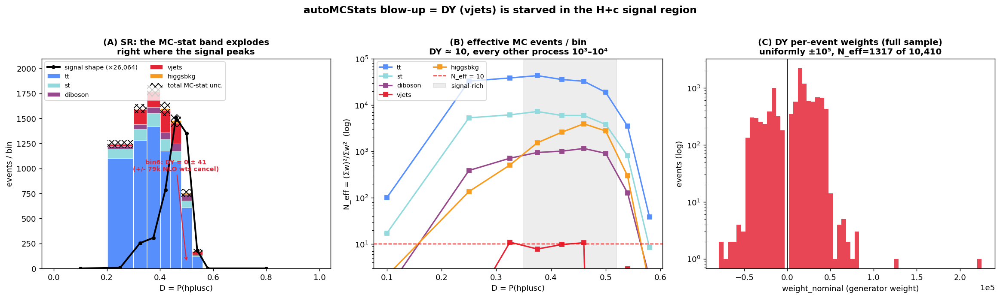
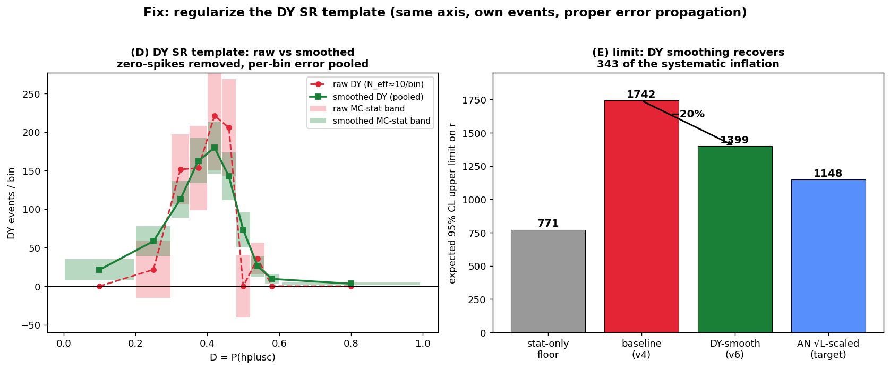

<!-- _paginate: false -->

# autoMCStats blow-up in the H+c → WW limit

### Root cause = DY / W+jets SR undersampling — and the smoothing fix

H+c (H→WW) · 2022postEE · 26.67 fb⁻¹ · blind Asimov median r₉₅

Chirayu Gupta — 2026-06-24

<!--
Follow-up to the limit-issue investigation. Two questions: why does autoMCStats blow up, and what fixes it.
-->

---

# The symptom

The expected 95% CL limit is dominated by **MC-statistical** uncertainty:

| config                                                 | r₉₅      |
| ------------------------------------------------------ | -------- |
| baseline full                                          | **1742** |
| freeze **SR** autoMCStats only (`prop_binSR_hplusc.*`) | 1069     |
| freeze ALL autoMCStats (`prop_bin.*`)                  | 1032     |
| stat-only (all constrained)                            | 771      |

- The **SR channel's autoMCStats alone** is ~the entire systematic inflation (1742 → 1069).
- The other 5 channels' MC-stat barely matter (1069 → 1032).
- MC-stat is **~81%** of the total systematic 

---

# The cause: only vjets is starved in the SR

Per-bin SR total-MC error, `N_eff = (Σw)² / Σw²`:

| SR bin | total  | N_eff(tot) | **vjets** | **vjets N_eff** | vjets share of bin err |
| ------ | ------ | ---------- | --------- | --------------- | ---------------------- |
| 4      | 1597.6 | 507        | 221.3     | **9.8**         | **99.5%**              |
| 5      | 1477.7 | 548        | 205.6     | **10.7**        | **99.5%**              |
| 6      | 752.3  | 332        | 0.0       | **0.0**         | **99.2%**              |

- tt N_eff ≈ 30k–43k, st ≈ 6k, diboson ≈ 1k — all well-sampled.
- **Only vjets** carries ~150–220 events on ~10 effective MC events.
- Bin 6 is pathological: **0 ± 41** — huge ± amc@NLO weights cancel in yield, not in variance.

---

# The issue, visualized

**(A)** SR MC-stat band explodes right under the signal peak · **(B)** vjets N_eff ≈ 10 vs other processes 10³–10⁴ · **(C)** vjets per-event amc@NLO weights uniformly ±10⁵

---

# Only 198 vjets MC events exist in the signal bins

Counting *every* vjets event by P(hplusc), **regardless of channel** (no argmax cut):

| D = P(hplusc)         | raw vjets events (anywhere) | N_eff                             |
| --------------------- | --------------------------- | --------------------------------- |
| 0.40–0.44             | 90                          | 9.8                               |
| 0.44–0.48             | 70                          | 10.7                              |
| 0.48–0.52             | 38                          | **0.1** (yield −14, cancellation) |
| **signal bins total** | **198**                     | ~10                               |

- **All 198 are already in the SR** (argmax==hplusc); every other channel has **exactly zero**.
- No reservoir of high-P(hplusc) vjets events anywhere → **reshuffling existing events cannot win.**

---

# What does NOT work (all tested, all ruled out)

| approach                   | result            | Comments                                                                                                           |
| -------------------------- | ----------------- | ------------------------------------------------------------------------------------------------------------------ |
| vjets **rateParam**        | 1742 → **1791** ⬆ | floats norm only; can't change a bin's Σw²                                                                         |
| orthogonal CR, same axis   | empty             | Basically used argmax-orthogonal vjets CR region with same variable as SR. This has **zero events in signal bins** |
| **rebinning** (merge bins) | ≥ 1742            | merging adds DY errors in quadrature, dilutes signal                                                               |
| process-merge into st      | 1756              | Merge vjets into st but autoMCStats already pools processes per bin                                                |
| floor-the-error "hack"     | 1158              | **dishonest** — asserts bkg=0 exactly known in best S/√B bin                                                       |

---

# The fix that works: smooth the DY SR template

**5-tap binomial kernel** on the SR DY template (own axis, own events), proper error propagation `Σw²ᵢ' = Σⱼ kᵢⱼ² Σw²ⱼ`, yield-preserving (shape-only).

---

# Why the fix is legitimate

| config                    | full r₉₅        | freeze SR autoMCStats |
| ------------------------- | --------------- | --------------------- |
| v4 baseline               | 1742            | 1069                  |
| **v6 DY-smooth**          | **1399 (−20%)** | 1173                  |
| (all 6 channels smoothed) | **1361**        | —                     |

- Removes the unphysical zero-spikes (bin 6: 0 ± 41 from ±79k NLO cancellation).
- Pools DY's ~36 effective SR events across a smooth shape → per-bin rel error 32% → ~20%.
- Collapses the full − freeze-SR gap **673 → 226** — most autoMCStats gone.

---

# AN-23-102 §6.1 confirms this exactly

> **AN-23-102, §6.1 "Background model of W+jets"** — p. 54–55, ¶ L515–525; template fluctuation = **Fig. 44**:
> *"W+jets is not negligible in the signal region, especially signal-enriched bins… selected events come mainly from the low W-pT and low HT region, where the statistics are not sufficient and events are generated with **large weights** → **large fluctuations of the W+jets template**."*

Our vjets = DY + **W+jets** (`WtoLNu_2Jets`): **518 events, N_eff 68, one event of weight 470k = 17 expected events** — *precisely* the AN's low-pT / low-HT large-weight case.

---

# AN §6.1 mitigation — and what we've done

The AN's 3-part fix (§6.1):

1. **Stitch** jet / W-pT / HT-binned samples (NLO+LO) to maximize stats — *we have only the inclusive sample; the binned ones are MISSING from the config.*
2. **Average** the W+jets shape across eras (2016/17/18), then **smooth**.
3. **Bin-by-bin errors** from the averaged/smoothed template, scaled to per-period lumi.

> We implement **only step 3's smoothing** (now AN-validated) → the **−20%** is the cheap, legitimate, in-hand win. Steps 1–2 (binned samples + cross-era averaging) are the documented path to the AN's 1148 target.

---

# THE proper fix — kill negative weights at source

The `0 ± 41` bins come from DY / W+jets **+79k / −79k generator-weight cancellation** — smoothing only *masks* it.

> **arXiv:2109.07851** — Andersen & Maier, *"Unbiased Elimination of Negative Weights in Monte Carlo Samples"* (**cell resampling**).

- Removes negative MC weights **at the source**, **preserving all physical observables** — process-independent, improves with sample size.
- **Validated in the paper on W+2-jet @ NLO — literally our `WtoLNu_2Jets` sample.**
- No cancellation → real per-bin MC stats; **strictly better** than smoothing (masks the symptom).
- **Apply upstream:** resample the W+jets / DY parquets *before* combine.

