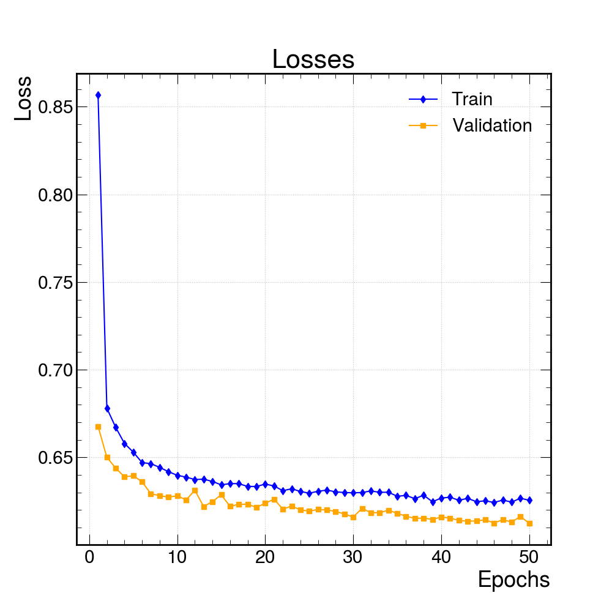
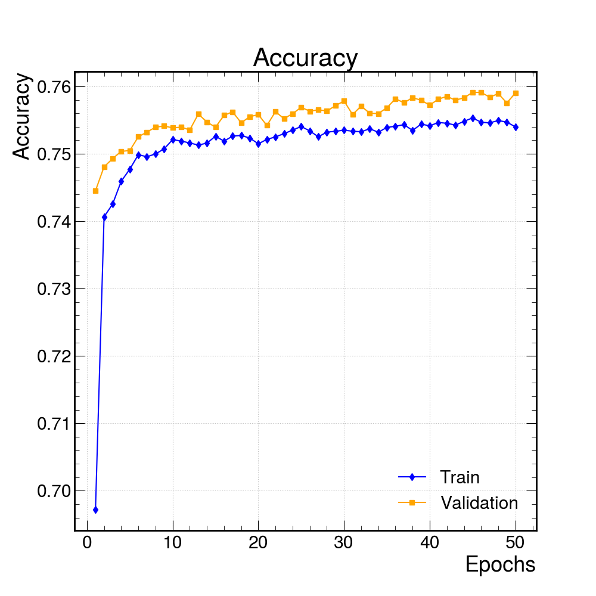
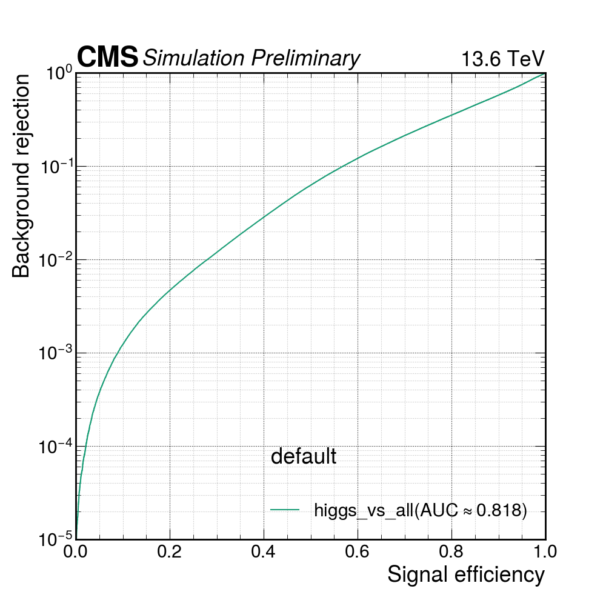
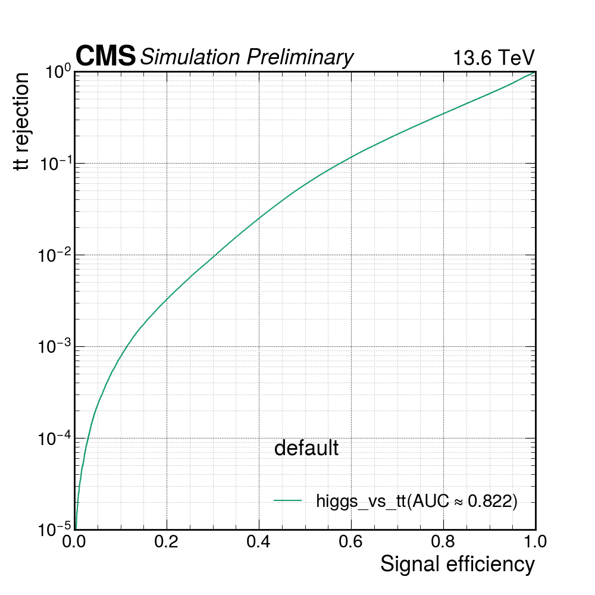
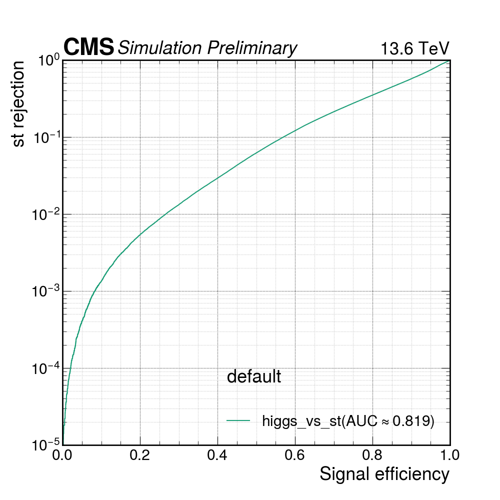
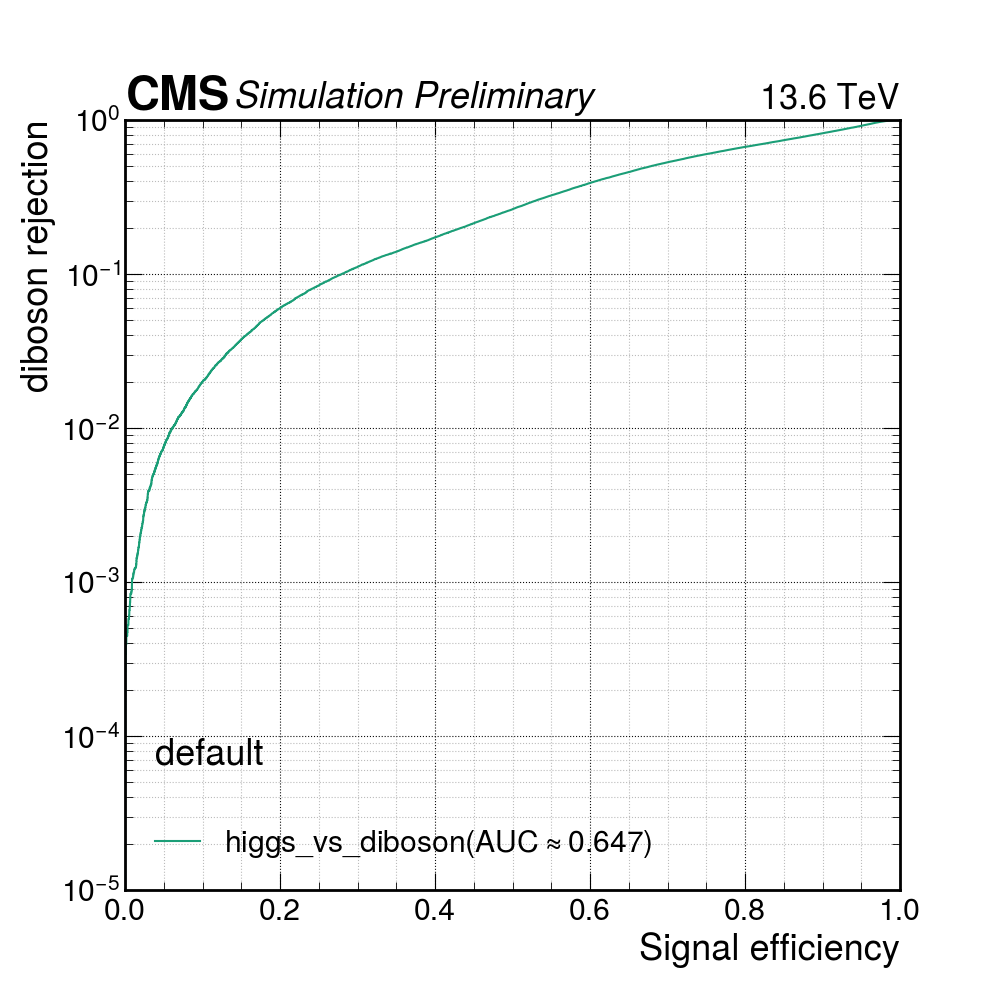
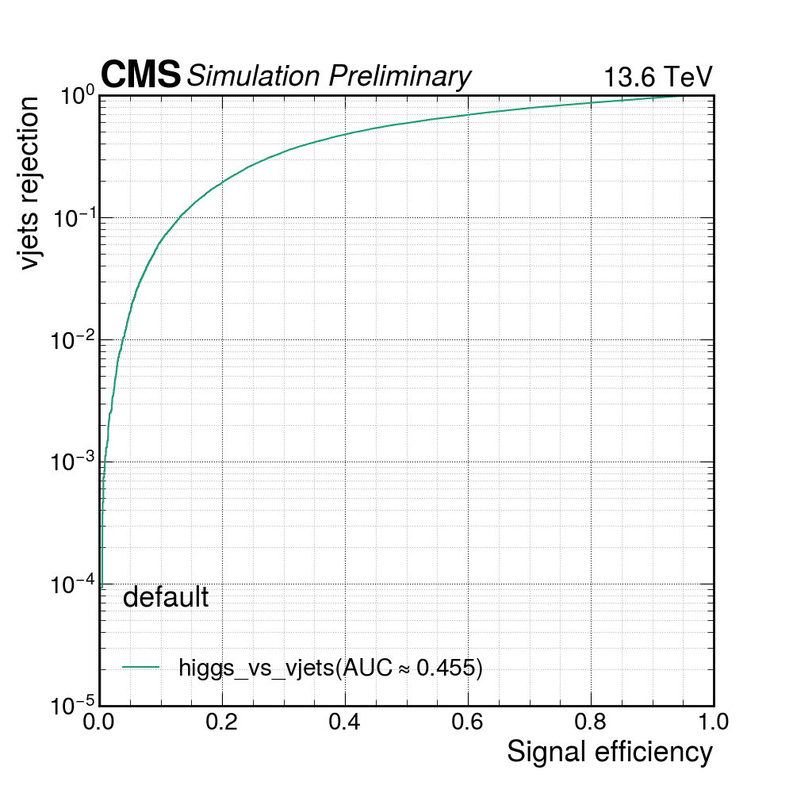

# H+c -> HWW Multi-class MVA Training (v5)

---

## Event Selection (hww_MVA workflow)

### Object Selection
- **Muons**: pT > 10 GeV, |eta| < 2.4, tight ISO, tight ID
- **Electrons**: pT > 10 GeV, |eta| < 2.5, wp80iso ID, dR(e, mu) > 0.4
- **Leptons**: HWW lepton selection (e-mu pair)
- **Dilepton pair**:
  - Leading lepton pT > 20 GeV, subleading pT > 10 GeV
  - pT(ll) > 30 GeV
  - Opposite sign, m(ll) > 12 GeV
- **Jets**: pT > 30 GeV, |eta| < 2.4, tightLepVeto ID, dR(jet, lepton) > 0.4
- **c-jets**: pT > 20 GeV, |eta| < 2.4, tightLepVeto ID, PNet c-tag medium WP, dR(jet, lepton) > 0.4
- **b-jets**: pT > 20 GeV, |eta| < 2.4, tightLepVeto ID, PNet b-tag medium WP, dR(jet, lepton) > 0.4

### Event-level Selections (base category)
- At least one good vertex
- Luminosity mask
- MET filters
- Trigger (MuEle, SingleMu, SingleEle)
- MET > 45 GeV
- Exactly one dilepton pair
- e-mu channel (one muon + one electron)

**Note**: No c-jet requirement or mT cuts applied at preselection level (loose base category for MVA training). The c-jet selection was removed from event selection for parquet production to keep all events; c-jet variables (cjet_cand_pt, cjet_cand_cvsl_pnet, cjet_cand_cvsb_pnet) are still used as MVA input features.

---

## Training Configuration

### Multi-class Classification
- **Signal**: higgs (H+c -> HWW)
- **Backgrounds**: tt, single top (st), diboson, V+jets

### Truth Labels
- `is_higgs`, `is_tt`, `is_st`, `is_diboson`, `is_vjets`

### Input Features (17 variables)
| Category | Variables |
|----------|-----------|
| Kinematic | dilepton_pt, lepton1_pt, lepton2_pt, cjet_cand_pt, met_pt |
| Transverse mass | mtl1, mtl2, dilepton_mass |
| Delta R | delta_R_ll_l1, delta_R_ll_l2, delta_R_ll_c |
| Delta phi | delta_phi_l1PlusMET_c, delta_phi_l1_MET, delta_phi_l2_MET |
| Charm tagging | cjet_cand_cvsl_pnet (PNet CvsL), cjet_cand_cvsb_pnet (PNet CvsB) |
| Secondary vertices | nSV |

### Reweighting
- 2D histogram reweighting in (pT(ll), m(ll)) bins
- Reference class: higgs (signal)
- Accept-reject weighted sampling during training

---

## Model Architecture

- **Model**: SimpleMLP_MultiClass
- 3-layer MLP: 128 -> 64 -> 32 -> 5 (output)
- BatchNorm + ReLU + Dropout(0.2) per layer
- Input: global features only (no particle-flow candidates)

### Training Hyperparameters
- Epochs: 50
- Batch size: 1024
- Learning rate: 1e-3
- Loss: CrossEntropyLoss
- Mixed precision training

---

## Datasets

| Process | Category |
|---------|----------|
| ggH->WW, VBF H->WW, WH->WW, ZH, ggZH, ttH(nonbb), ttH(bb), H+c, H+b | higgs |
| tt | tt |
| Single top | st |
| WW, WZ, ZZ | diboson |
| DY(NLO), W+jets, V+jets, Electroweak | vjets |

---

## Results

### Training Loss & Accuracy

### ROC Curves

---

## Corrections Applied
- **Object**: JEC, muon scale/smearing, electron scale/smearing
- **Event weights**: genWeight, pileupWeight, partonshowerWeight, lhepdfWeight, lhescaleWeight, nnlopsWeight
- **Lepton SFs**: muon ID(tight) + ISO(tight), electron ID(wp80iso) + reco
